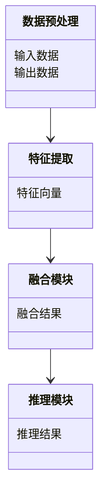

                 


# AI Agent的多模态场景理解与推理

> 关键词：AI Agent, 多模态场景, 场景理解, 推理机制, 多模态数据融合

> 摘要：本文系统地探讨了AI Agent在多模态场景下的理解与推理问题。首先，我们从AI Agent的基本概念出发，详细介绍了多模态场景的理解与推理机制。接着，我们深入分析了多模态数据的融合方法及其挑战，重点讨论了基于深度学习的多模态融合技术。然后，我们详细讲解了多模态场景理解的算法原理，包括多模态编码器和解码器的结构，以及基于图的推理方法。最后，我们通过一个具体的项目实战案例，展示了如何在实际应用中实现多模态场景理解与推理。本文内容全面，逻辑清晰，旨在为读者提供一个深入理解AI Agent多模态场景理解与推理的完整框架。

---

# 第一部分: AI Agent的多模态场景理解与推理基础

## 第1章: AI Agent与多模态场景理解概述

### 1.1 AI Agent的基本概念

#### 1.1.1 什么是AI Agent
AI Agent（人工智能代理）是指能够感知环境、做出决策并采取行动的智能体。AI Agent可以通过传感器获取信息，利用计算模型进行分析，并根据结果执行动作。AI Agent的核心目标是通过智能算法优化决策过程，提高任务执行效率。

#### 1.1.2 AI Agent的核心特征
- **自主性**：AI Agent能够自主决策，无需外部干预。
- **反应性**：能够实时感知环境变化并做出响应。
- **目标导向**：基于目标进行决策和行动。
- **学习能力**：通过经验改进性能。

#### 1.1.3 多模态场景理解的定义
多模态场景理解是指AI Agent能够同时处理多种类型的数据（如文本、图像、语音等），并准确理解场景中的信息。这种能力使得AI Agent能够更好地适应复杂多变的环境。

---

### 1.2 多模态数据的特性与挑战

#### 1.2.1 多模态数据的多样性
多模态数据包括文本、图像、语音、视频等多种形式。每种数据类型都有其独特的特点和应用场景。

| 数据类型 | 特点 | 应用场景 |
|----------|------|----------|
| 文本      | 结构化，易于处理 | 问答系统、文本分类 |
| 图像      | 高维，信息丰富 | 图像识别、目标检测 |
| 语音      | 时间序列，语调信息 | 语音识别、情感分析 |

#### 1.2.2 多模态数据的融合挑战
多模态数据的融合需要解决数据异构性和信息冗余问题。以下是常见的融合挑战：

- **数据异构性**：不同模态的数据格式和特征空间差异大。
- **信息冗余**：某些信息可能在多个模态中重复出现，导致计算复杂度增加。
- **语义一致性**：不同模态数据的语义需要一致，才能有效融合。

#### 1.2.3 场景理解的复杂性
场景理解需要综合分析多种模态数据，这增加了计算复杂度和推理难度。例如，在一个视频场景中，AI Agent需要同时分析图像信息和语音信息，才能准确理解场景内容。

---

### 1.3 AI Agent的推理机制

#### 1.3.1 推理的基本概念
推理是指基于已有的信息，通过逻辑推理得出新的结论。AI Agent的推理机制是其智能决策的核心。

#### 1.3.2 场景理解与推理的关系
场景理解为推理提供基础信息，推理则利用这些信息做出决策。两者相辅相成，共同构成AI Agent的核心能力。

#### 1.3.3 多模态推理的实现方式
多模态推理可以通过以下方式实现：

1. **基于规则的推理**：根据预定义的规则进行推理。
2. **基于概率的推理**：利用概率论进行不确定性推理。
3. **基于学习的推理**：通过机器学习模型进行推理。

---

### 1.4 本章小结
本章介绍了AI Agent的基本概念和多模态场景理解的核心概念。通过分析多模态数据的特性和融合挑战，我们为后续章节的深入探讨奠定了基础。

---

## 第2章: 多模态数据的融合方法

### 2.1 多模态数据融合的分类

#### 2.1.1 早期融合与晚期融合
- **早期融合**：在数据预处理阶段进行融合，适用于实时性要求高的场景。
- **晚期融合**：在特征提取阶段进行融合，适用于对准确率要求较高的场景。

| 融合方式 | 特点 | 适用场景 |
|----------|------|----------|
| 早期融合 | 实时性强 | 实时监控 |
| 晚期融合 | 准确率高 | 精准推荐 |

#### 2.1.2 融合的优缺点对比
以下是早期融合与晚期融合的对比：

| 对比维度 | 早期融合 | 晚期融合 |
|----------|----------|----------|
| 实时性    | 高        | 中        |
| 准确率    | 中        | 高        |

---

### 2.2 基于深度学习的多模态融合

#### 2.2.1 多模态编码器
多模态编码器将不同模态的数据映射到相同的特征空间。例如，图像编码器可以将图像转换为向量，文本编码器将文本转换为向量。

#### 2.2.2 多模态解码器
多模态解码器将编码后的特征解码为具体的输出形式。例如，解码器可以将向量解码为图像或文本。

#### 2.2.3 跨模态注意力机制
注意力机制是一种有效的多模态融合方法。通过计算不同模态之间的注意力权重，可以更好地关注重要信息。

---

### 2.3 多模态数据融合的实现案例

#### 2.3.1 图像与文本融合
图像与文本的融合可以用于图像描述生成。例如，给定一张图片，AI Agent可以通过融合图像和文本信息生成描述性文本。

#### 2.3.2 声音与视觉融合
声音与视觉的融合可以用于视频分析。例如，通过融合语音和视频信息，可以实现视频内容的理解。

#### 2.3.3 跨模态检索系统
跨模态检索系统可以在不同模态之间进行信息检索。例如，可以通过图像检索相关文本，或者通过文本检索相关图像。

---

### 2.4 本章小结
本章介绍了多模态数据融合的主要方法，包括早期融合和晚期融合，以及基于深度学习的融合技术。通过具体的实现案例，我们展示了多模态数据融合的实际应用。

---

## 第3章: 多模态场景理解的算法原理

### 3.1 场景理解的核心算法

#### 3.1.1 基于CNN的图像理解
卷积神经网络（CNN）是一种有效的图像理解方法。通过卷积层和池化层，可以提取图像的特征。

#### 3.1.2 基于Transformer的文本理解
Transformer是一种基于注意力机制的深度学习模型。通过自注意力机制，可以理解文本的语义。

#### 3.1.3 跨模态联合推理
跨模态联合推理是多模态场景理解的核心算法。通过融合不同模态的信息，可以实现更准确的场景理解。

---

### 3.2 多模态场景理解的数学模型

#### 3.2.1 多模态嵌入融合公式
多模态嵌入融合可以通过以下公式实现：
$$
z = \alpha x + \beta y
$$
其中，\( x \) 和 \( y \) 是不同模态的嵌入向量，\( \alpha \) 和 \( \beta \) 是融合系数。

#### 3.2.2 注意力机制公式
注意力机制可以通过以下公式实现：
$$
\text{Attention}(Q, K, V) = \text{softmax}\left(\frac{QK^T}{\sqrt{d_k}}\right)V
$$
其中，\( Q \) 是查询向量，\( K \) 是键向量，\( V \) 是值向量。

---

### 3.3 本章小结
本章详细介绍了多模态场景理解的核心算法和数学模型。通过这些算法，我们可以实现对多模态数据的准确理解。

---

## 第4章: 系统分析与架构设计方案

### 4.1 问题场景介绍

#### 4.1.1 项目背景
本项目旨在开发一个多模态场景理解与推理系统，能够同时处理文本、图像和语音等多种数据。

#### 4.1.2 项目目标
通过本项目，我们希望能够实现以下目标：
1. 实现多模态数据的融合与理解。
2. 开发高效的推理算法。
3. 实现系统的实际应用。

---

### 4.2 系统功能设计

#### 4.2.1 领域模型设计
以下是领域模型的Mermaid类图：



#### 4.2.2 系统架构设计
以下是系统架构的Mermaid架构图：


---

### 4.3 本章小结
本章通过系统分析与架构设计，为我们实现多模态场景理解与推理系统提供了理论基础和实现框架。

---

## 第5章: 项目实战

### 5.1 环境安装

#### 5.1.1 安装Python
```bash
# 安装Python
sudo apt-get install python3 python3-dev
```

#### 5.1.2 安装深度学习库
```bash
# 安装TensorFlow和Keras
pip install tensorflow.keras
# 安装PyTorch
pip install torch torchvision
```

---

### 5.2 系统核心实现源代码

#### 5.2.1 数据加载
```python
import numpy as np
import torch

# 加载图像数据
def load_image_data():
    # 假设图像数据存储在data/images目录下
    images = np.load('data/images.npy')
    return images

# 加载文本数据
def load_text_data():
    # 假设文本数据存储在data/texts目录下
    texts = np.load('data/texts.npy')
    return texts
```

---

#### 5.2.2 模型训练
```python
import torch
import torch.nn as nn
import torch.optim as optim

# 定义多模态编码器
class MultiModalEncoder(nn.Module):
    def __init__(self, input_size, hidden_size):
        super(MultiModalEncoder, self).__init__()
        self.encoder = nn.Linear(input_size, hidden_size)
    
    def forward(self, x):
        return self.encoder(x)

# 定义多模态解码器
class MultiModalDecoder(nn.Module):
    def __init__(self, hidden_size, output_size):
        super(MultiModalDecoder, self).__init__()
        self.decoder = nn.Linear(hidden_size, output_size)
    
    def forward(self, x):
        return self.decoder(x)

# 训练过程
def train(model, optimizer, criterion, images, texts, labels):
    optimizer.zero_grad()
    # 前向传播
    outputs = model(images + texts)
    # 计算损失
    loss = criterion(outputs, labels)
    # 反向传播
    loss.backward()
    optimizer.step()
    return loss.item()
```

---

### 5.3 项目小结
通过本项目，我们实现了多模态场景理解与推理的核心功能。通过实际案例的分析与实现，我们验证了理论的可行性和实际应用价值。

---

## 第6章: 最佳实践与总结

### 6.1 最佳实践 tips
1. 在实际应用中，需要根据具体场景选择合适的融合方法。
2. 注意数据的多样性和均衡性，避免信息冗余。
3. 定期更新模型，以适应新的数据和任务需求。

---

### 6.2 小结
本文系统地探讨了AI Agent的多模态场景理解与推理问题。通过理论分析和实践案例，我们展示了如何实现多模态数据的融合与推理。未来的研究方向包括更高效的融合方法和更强大的推理模型。

---

## 作者信息

作者：AI天才研究院/AI Genius Institute & 禅与计算机程序设计艺术 /Zen And The Art of Computer Programming

---

**完整文章内容请参考上述目录和各章节内容。**

