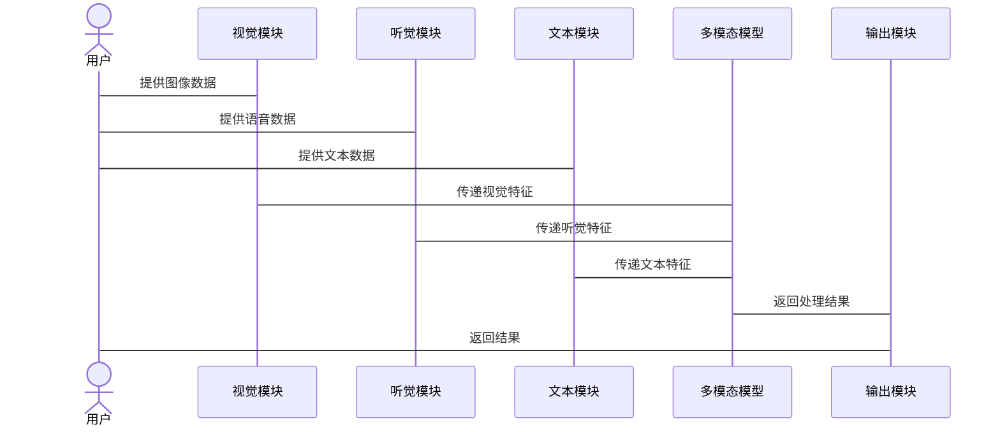

                 


# AI Agent的多模态学习：整合视觉、听觉和文本信息

**关键词**：多模态学习，AI Agent，视觉，听觉，文本信息，深度学习，模态融合

**摘要**：  
随着人工智能技术的快速发展，AI Agent（智能体）在多模态学习领域的应用越来越广泛。多模态学习通过整合视觉、听觉和文本等多种信息源，能够提升AI Agent的理解能力和决策能力。本文将从多模态学习的背景、核心概念、算法原理、系统架构到实际应用，全面探讨AI Agent如何通过整合多模态信息实现更强大的智能能力。我们还将通过具体案例分析，展示多模态学习在实际场景中的应用价值。

---

## 第一部分：多模态学习的背景与概念

### 第1章：多模态学习的背景与意义

#### 1.1 多模态学习的背景
- **数据的多样性**：现代AI系统需要处理的数据不仅限于单一模态（如文本或图像），而是多种模态数据的结合。
- **人类感知的启发**：人类通过视觉、听觉、触觉等多种感官获取信息，AI Agent需要模拟这种能力。
- **应用场景的扩展**：在智能助手、机器人、自动驾驶等领域，多模态学习能够提供更丰富、更精准的信息处理能力。

#### 1.2 AI Agent的基本概念
- **AI Agent的定义**：AI Agent是一种能够感知环境、执行任务并做出决策的智能实体。
- **AI Agent的核心特征**：自主性、反应性、主动性、社交能力。
- **AI Agent与传统AI的区别**：AI Agent更注重与环境的动态交互，而非仅仅是静态的计算或推理。

#### 1.3 多模态学习与AI Agent的结合
- **整合多种信息源**：AI Agent通过整合视觉、听觉和文本信息，能够更全面地理解环境。
- **提升决策能力**：多模态数据的融合能够帮助AI Agent做出更准确的判断。
- **增强用户体验**：通过多模态交互，用户与AI Agent之间的交流更加自然和高效。

---

### 第2章：多模态学习的核心概念

#### 2.1 多模态数据的特征分析
- **视觉模态**：图像、视频等视觉信息的特征提取。
- **听觉模态**：语音、音乐等音频信息的特征提取。
- **文本模态**：文本数据的语义理解和语法分析。

#### 2.2 多模态数据的整合方法
- **特征融合**：将不同模态的特征向量进行线性或非线性组合。
- **注意力机制**：通过注意力权重分配，突出重要模态的信息。
- **生成模型**：利用生成对抗网络（GAN）或变体自动编码器（VAE）生成多模态数据。

#### 2.3 多模态学习的挑战与解决方案
- **数据异构性问题**：不同模态的数据格式和特征维度差异较大。
- **模态不平衡问题**：某些模态的数据量远小于其他模态。
- **模态间关联性问题**：如何建模模态之间的关联性。

---

### 第3章：多模态学习的算法原理

#### 3.1 多模态数据的预处理
- **数据清洗**：去除噪声和冗余信息。
- **数据增强**：通过旋转、翻转等操作增加数据多样性。
- **数据对齐**：将不同模态的数据对齐到同一时间或空间维度。

#### 3.2 多模态模型的构建
- **多模态编码器**：将不同模态的数据映射到统一的特征空间。
- **多模态解码器**：从统一特征空间生成目标输出。
- **多模态生成模型**：结合生成模型（如Transformer、BERT）进行多模态生成。

#### 3.3 多模态模型的训练与优化
- **多任务学习**：同时优化多个相关任务，如图像识别和语音识别。
- **对抗训练**：通过生成对抗网络（GAN）提升模型的多模态生成能力。
- **知识蒸馏**：通过教师模型指导学生模型进行多模态学习。

---

### 第4章：多模态学习的数学模型与公式

#### 4.1 多模态数据的表示方法
- **视觉模态表示**：通过卷积神经网络（CNN）提取图像特征，表示为向量。
- **听觉模态表示**：通过循环神经网络（RNN）提取语音特征，表示为向量。
- **文本模态表示**：通过词嵌入（如Word2Vec、BERT）生成文本向量。

#### 4.2 多模态融合的数学模型
- **线性融合模型**：  
  $$ f(x) = \alpha x_{\text{vision}} + \beta x_{\text{audio}} + \gamma x_{\text{text}} $$  
  其中，$\alpha + \beta + \gamma = 1$。
- **注意力机制模型**：  
  $$ \text{Attention}(x) = \text{softmax}(Wx + b) $$  
  其中，$W$是注意力权重矩阵，$b$是偏置向量。

#### 4.3 模态间关联性的建模
- **跨模态关联矩阵**：  
  $$ M = \text{softmax}(U x + V y + W) $$  
  其中，$U$、$V$、$W$是参数矩阵，$x$和$y$是不同模态的特征向量。

---

## 第二部分：系统分析与架构设计

### 第5章：多模态学习的系统架构

#### 5.1 应用场景介绍
- **智能助手**：通过语音和视觉交互提供服务。
- **自动驾驶**：整合视觉、听觉和文本信息进行环境感知和决策。
- **智能客服**：通过语音和文本进行客户支持。

#### 5.2 系统功能设计
- **功能模块**：  
  - 数据采集模块：获取视觉、听觉和文本数据。
  - 数据处理模块：对数据进行预处理和特征提取。
  - 模型训练模块：训练多模态模型。
  - 应用模块：根据模型输出进行决策和执行。

#### 5.3 系统架构设计
- **微服务架构**：将系统划分为多个独立的服务模块。
- **模块交互**：通过API进行模块间的通信。

#### 5.4 系统接口设计
- **API接口**：  
  - 输入接口：接收视觉、听觉和文本数据。
  - 输出接口：返回处理结果。

#### 5.5 系统交互流程图


---

## 第三部分：项目实战与最佳实践

### 第6章：项目实战

#### 6.1 环境搭建
- **Python版本**：推荐使用Python 3.8以上。
- **深度学习框架**：TensorFlow或PyTorch。
- **依赖库安装**：安装必要的库，如`numpy`、`pandas`、`matplotlib`等。

#### 6.2 系统核心实现
- **代码示例**：以下是一个简单的多模态融合模型实现：
  ```python
  import tensorflow as tf
  from tensorflow.keras.layers import Input, Dense, Concatenate, Activation
  from tensorflow.keras.models import Model

  # 定义输入层
  input_vision = Input(shape=(128,))
  input_audio = Input(shape=(64,))
  input_text = Input(shape=(32,))

  # 定义融合层
  merged = Concatenate()([input_vision, input_audio, input_text])
  dense_layer = Dense(64, activation='relu')(merged)
  output_layer = Dense(1, activation='sigmoid')(dense_layer)

  # 构建模型
  model = Model(inputs=[input_vision, input_audio, input_text], outputs=output_layer)
  model.compile(optimizer='adam', loss='binary_crossentropy', metrics=['accuracy'])
  ```

#### 6.3 代码解读与分析
- **输入层**：定义视觉、听觉和文本输入的形状。
- **融合层**：将不同模态的输入进行拼接。
- **_dense_layer**：通过全连接层进行特征提取和非线性变换。
- **输出层**：生成最终的预测结果。

#### 6.4 实际案例分析
- **案例1**：智能助手的语音和视觉交互。
- **案例2**：自动驾驶中的多模态环境感知。

#### 6.5 项目小结
- **项目总结**：通过实际项目，验证了多模态学习在AI Agent中的应用价值。
- **经验分享**：数据预处理和模型调参是关键。

---

## 第四部分：最佳实践与总结

### 第7章：最佳实践与注意事项

#### 7.1 小结
- **多模态学习的重要性**：整合多种模态信息能够显著提升AI Agent的能力。
- **算法与架构的选择**：根据具体场景选择合适的算法和架构。

#### 7.2 注意事项
- **数据质量**：确保多模态数据的准确性和完整性。
- **模型调优**：通过交叉验证和超参数优化提升模型性能。
- **隐私保护**：在处理多模态数据时，要注意隐私和数据安全。

#### 7.3 拓展阅读
- **推荐书籍**：《Deep Learning》、《Pattern Recognition and Machine Learning》。
- **推荐论文**：关注最新的多模态学习研究，如CVPR、ICML等顶会论文。

---

**作者：AI天才研究院/AI Genius Institute & 禅与计算机程序设计艺术 /Zen And The Art of Computer Programming**

---

这篇文章从理论到实践，全面探讨了AI Agent的多模态学习，通过丰富的案例和详细的代码示例，帮助读者深入理解多模态学习的核心概念和应用方法。希望对您在AI Agent和多模态学习领域的研究和实践有所帮助！

