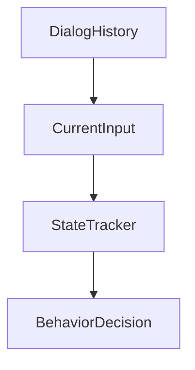
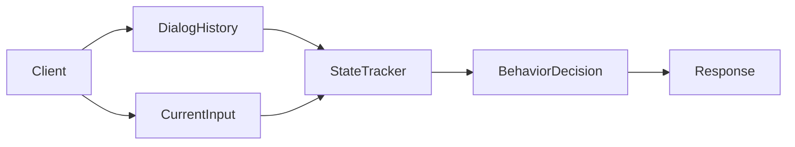

                 


# AI Agent的多模态对话状态跟踪

## 关键词：多模态对话，对话状态跟踪，AI Agent，自然语言处理，多模态数据融合

## 摘要：  
在人机交互领域，对话状态跟踪是实现高效、智能AI Agent的核心技术之一。传统的对话状态跟踪主要依赖文本信息，但随着多模态数据（如语音、图像、视频等）的应用，对话状态跟踪的准确性、实时性和丰富性得到了显著提升。本文将深入探讨AI Agent在多模态对话中的状态跟踪技术，涵盖核心概念、算法原理、系统架构设计、项目实战等内容，帮助读者全面理解并掌握这一前沿技术。

---

## 第1章: 多模态对话状态跟踪的背景与概念

### 1.1 问题背景  
对话状态跟踪是自然语言处理中的一个关键任务，旨在通过分析对话历史和当前输入，推断出对话的当前状态。传统的对话状态跟踪主要依赖文本信息，但在实际应用中，用户可能通过多种模态（如语音、图像、手势等）进行交流。因此，如何有效地融合多模态信息，提升对话状态跟踪的准确性和丰富性，成为当前研究的热点。

### 1.2 问题描述  
多模态对话状态跟踪的核心问题是：如何从多模态输入中提取有效的特征，并结合对话历史，准确推断出对话的当前状态。这不仅需要处理文本信息，还需要整合其他模态的数据，如语音的情感特征、图像的视觉特征等。

### 1.3 解决方法  
为了实现多模态对话状态跟踪，可以采用以下方法：  
1. **多模态特征提取**：分别对文本、语音、图像等模态进行特征提取，并进行融合。  
2. **联合建模**：将多模态信息联合建模，利用深度学习模型（如Transformer、图神经网络等）进行状态推断。  
3. **动态更新机制**：根据对话的实时进展，动态更新对话状态。

### 1.4 概念结构  
多模态对话状态跟踪的系统通常包括以下几个核心模块：  
- **对话历史存储**：存储对话的完整历史记录。  
- **多模态输入处理**：对当前输入的多模态数据进行预处理和特征提取。  
- **状态推断模块**：基于对话历史和当前输入，推断出对话的当前状态。  
- **行为决策模块**：根据推断出的状态，生成下一步的响应或行为。

---

## 第2章: 多模态对话状态跟踪的核心概念与联系  

### 2.1 核心概念原理  
多模态对话状态跟踪的核心在于如何有效地融合多种模态信息，并利用这些信息推断对话的状态。以下是几种常见的融合方法：  
1. **早期融合**：在特征提取阶段，将不同模态的特征进行融合。  
2. **晚期融合**：在特征提取后，分别处理每种模态的信息，最后进行融合。  
3. **混合融合**：结合早期和晚期融合的优点，分阶段进行融合。

### 2.2 核心概念属性对比表  
以下是多模态对话状态跟踪中几种常见方法的对比：  

| 属性         | 对话历史依赖 | 当前输入依赖 | 状态更新机制 |  
|--------------|--------------|--------------|--------------|  
| 方法1        | 高           | 中           | 基于LSTM     |  
| 方法2        | 中           | 高           | 基于Transformer|  
| 方法3        | 低           | 高           | 基于注意力机制|  

### 2.3 实体关系图  
以下是一个简单的实体关系图：  



---

## 第3章: 多模态对话状态跟踪的算法原理  

### 3.1 算法流程  
多模态对话状态跟踪的算法流程如下：  

1. **输入多模态数据**：包括文本、语音、图像等多种模态的数据。  
2. **特征提取**：对每种模态的数据进行特征提取，生成特征向量。  
3. **状态更新**：基于对话历史和当前输入，更新对话状态。  
4. **输出当前状态**：返回推断出的对话状态。  

### 3.2 算法实现  

以下是一个简单的Python代码示例：  

```python
def multi_modal_feature_extraction(text, audio, image):
    # 文本特征提取
    text_features = text_encoder(text)
    # 语音特征提取
    audio_features = audio_encoder(audio)
    # 图像特征提取
    image_features = image_encoder(image)
    # 特征融合
    fused_features = concatenate([text_features, audio_features, image_features])
    return fused_features

def state_update(features, previous_state):
    # 使用LSTM进行状态更新
    with tf.variable_scope('state_tracker'):
        cell = LSTMCell(64)
        state = dynamic_rnn(cell, features, initial_state=previous_state)
    return state
```

### 3.3 数学模型  

多模态对话状态跟踪的数学模型可以表示为：  

$$ P = \sum_{i=1}^{n} p_i x_i $$  

其中，$P$ 是状态概率向量，$p_i$ 是第 $i$ 种状态的概率，$x_i$ 是输入特征向量。

---

## 第4章: 系统分析与架构设计方案  

### 4.1 应用场景  
多模态对话状态跟踪可以应用于以下场景：  
1. **智能客服**：通过整合文本、语音和情感分析，提供更智能的客户服务。  
2. **智能助手**：如Siri、Alexa等，通过多模态输入提升对话的准确性。  
3. **虚拟现实对话**：在VR场景中，结合语音、图像和手势进行对话状态跟踪。  

### 4.2 系统功能设计  
系统功能设计包括：  
1. **对话历史存储**：存储对话的完整记录。  
2. **多模态输入处理**：支持文本、语音、图像等多种输入形式。  
3. **状态推断**：基于多模态输入和对话历史，推断对话状态。  
4. **行为决策**：根据推断出的状态，生成下一步的行为或响应。  

### 4.3 系统架构图  
以下是系统架构图：  



---

## 第5章: 项目实战  

### 5.1 环境安装  
需要安装以下环境：  
- Python 3.7+  
- TensorFlow或PyTorch  
- 其他依赖库（如 librosa、OpenCV等）  

### 5.2 核心实现代码  

```python
import tensorflow as tf
from tensorflow.keras.layers import LSTMCell, dynamic_rnn

def multi_modal_feature_extractor(text, audio, image):
    # 文本特征提取
    text_features = tf.keras.layers.Dense(32)(text)
    # 语音特征提取
    audio_features = tf.keras.layers.Dense(32)(audio)
    # 图像特征提取
    image_features = tf.keras.layers.Dense(32)(image)
    # 特征融合
    fused_features = tf.keras.layers.concatenate([text_features, audio_features, image_features])
    return fused_features

def state_tracker(fused_features, initial_state):
    cell = LSTMCell(64)
    with tf.variable_scope('state_tracker'):
        states = dynamic_rnn(cell, fused_features, initial_state=initial_state)
    return states
```

### 5.3 实际案例分析  
以下是一个简单的实际案例：  
- 对话历史：用户说“我想听一首歌”。  
- 当前输入：用户说“播放周杰伦的晴天”。  
- 状态更新：系统推断出当前状态为“播放音乐”。  

---

## 第6章: 最佳实践与小结  

### 6.1 最佳实践  
1. **数据多样性**：确保训练数据涵盖多种模态和场景。  
2. **模型优化**：通过调整模型参数和结构，提升状态跟踪的准确率。  
3. **实时性优化**：优化算法的运行效率，确保实时对话的流畅性。  

### 6.2 小结  
多模态对话状态跟踪是实现智能AI Agent的关键技术之一。通过融合多种模态信息，可以显著提升对话的准确性和丰富性。本文详细介绍了多模态对话状态跟踪的核心概念、算法原理、系统架构设计以及项目实战，为读者提供了全面的技术指导。

---

## 第7章: 注意事项与拓展阅读  

### 7.1 注意事项  
1. **数据隐私**：在处理多模态数据时，需注意用户隐私保护。  
2. **模型泛化能力**：确保模型在不同场景下的泛化能力。  
3. **性能优化**：优化算法的运行效率，确保实时性。  

### 7.2 拓展阅读  
1. **多模态学习**：推荐阅读《Multimodal Machine Learning》。  
2. **对话系统**：推荐阅读《Dialogue Systems: A Tutorial Review》。  
3. **深度学习**：推荐阅读《Deep Learning》。  

---

## 作者：AI天才研究院 & 禅与计算机程序设计艺术  

---

通过以上内容，您可以系统地了解AI Agent的多模态对话状态跟踪的核心技术与实现方法。

