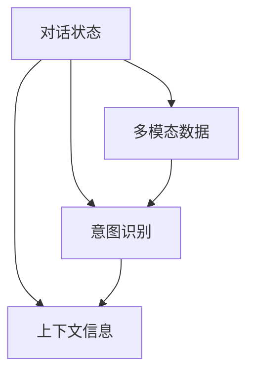
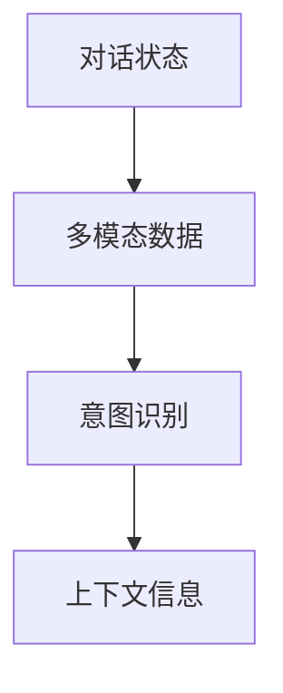
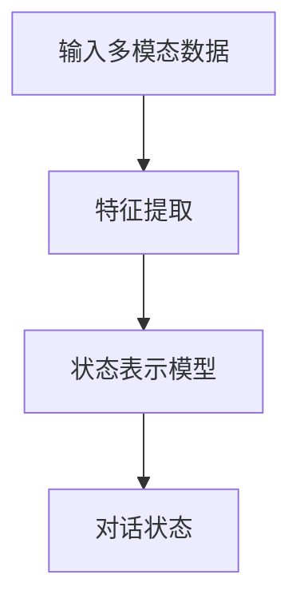
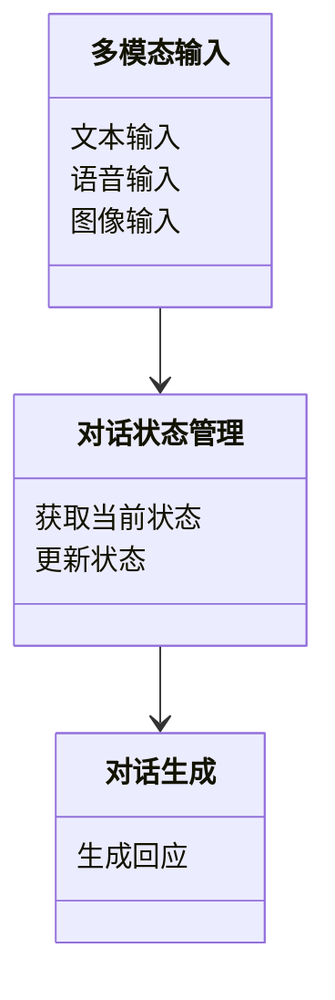
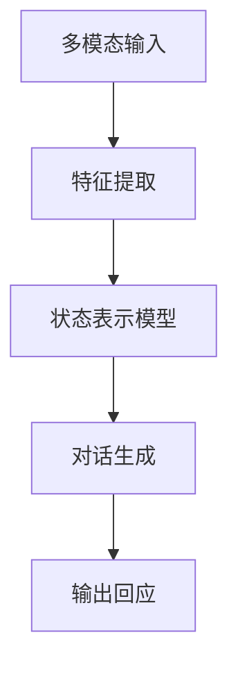
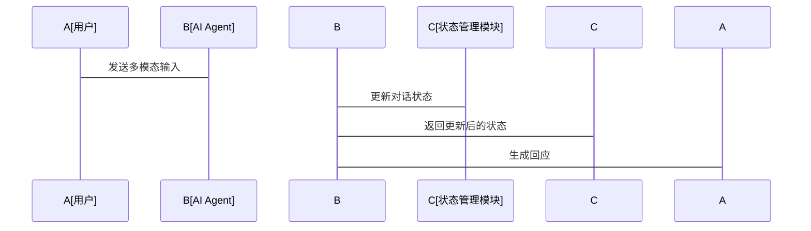

                 


# AI Agent的多模态对话状态追踪与管理

> 关键词：AI Agent, 多模态对话, 状态追踪, 对话系统, 系统架构

> 摘要：本文深入探讨了AI Agent在多模态对话中的状态追踪与管理问题。首先介绍了问题背景与核心概念，然后详细讲解了多模态对话状态追踪的算法原理，接着分析了系统的架构设计，最后通过项目实战展示了如何实现这一技术。文章结合理论与实践，为读者提供了全面的技术指导。

---

# 第一部分: 背景与基础

## 第1章: AI Agent与多模态对话状态管理概述

### 1.1 问题背景与核心概念

#### 1.1.1 多模态对话的定义与特点
多模态对话是指在对话过程中，除了文本之外，还结合了语音、图像、视频等多种模态的信息。这种对话方式更贴近人类的自然交流方式，能够提高对话的准确性和用户体验。

#### 1.1.2 AI Agent在对话系统中的角色
AI Agent（智能体）作为对话系统的核心，负责接收多模态输入、理解和生成多模态输出。其主要任务包括理解用户意图、管理对话状态、生成适当的回应等。

#### 1.1.3 状态追踪与管理的重要性
状态追踪是对话系统的关键任务，它通过记录对话历史、用户意图和上下文信息，帮助系统理解当前对话的状态，从而生成合适的回应。

### 1.2 问题描述与解决思路

#### 1.2.1 多模态对话中的挑战
多模态数据的多样性和复杂性带来了数据融合的挑战，同时，如何在不同模态之间建立有效的关联也是难点。

#### 1.2.2 状态追踪的核心问题
如何准确地表示和更新对话状态，如何在多模态数据中提取有用的信息，如何处理不确定性等。

#### 1.2.3 解决方案的初步思路
结合多模态数据的特点，设计一种多模态融合的模型，利用深度学习技术进行状态表示和更新。

### 1.3 界限与外延

#### 1.3.1 多模态对话的边界
多模态对话的边界包括输入数据的模态类型、对话场景的限制以及系统的功能范围。

#### 1.3.2 状态管理的范围
状态管理的范围包括对话历史、用户意图、上下文信息等。

#### 1.3.3 相关领域的区别与联系
与传统的文本对话相比，多模态对话更注重信息的多样性和交互的自然性。

### 1.4 核心要素与概念结构

#### 1.4.1 核心要素分析
对话状态、多模态数据、意图识别、上下文信息等。

#### 1.4.2 概念结构图


#### 1.4.3 核心要素的关联性
对话状态通过多模态数据进行更新，意图识别和上下文信息相互关联。

---

## 第2章: 多模态对话状态追踪的核心概念

### 2.1 核心概念与原理

#### 2.1.1 对话状态的定义
对话状态是指当前对话的进展情况，包括用户意图、对话历史和上下文信息。

#### 2.1.2 多模态数据的融合
多模态数据的融合是将不同模态的信息（如文本、语音、图像）进行整合，以提高对话系统的理解能力。

#### 2.1.3 状态追踪的机制
状态追踪通过分析多模态数据，更新对话状态，以支持后续的对话生成。

### 2.2 核心概念的属性特征对比

#### 2.2.1 对比表格展示
| 对比维度 | 对话状态 | 多模态数据 | 意图识别 |
|----------|----------|-----------|----------|
| 定义     | 当前对话的进展情况 | 不同模态的信息 | 用户的目标或需求 |
| 输入     | 多模态数据 | 多模态数据 | 多模态数据 |
| 输出     | 更新后的对话状态 | 融合后的数据 | 用户意图 |

### 2.3 实体关系图



---

## 第3章: 多模态对话状态追踪的算法原理

### 3.1 算法原理概述

#### 3.1.1 算法的基本思路
通过多模态数据进行特征提取，构建状态表示模型，利用深度学习技术进行状态更新。

#### 3.1.2 算法的输入输出
输入：多模态数据（文本、语音、图像等）；输出：对话状态表示。

#### 3.1.3 算法的流程图


### 3.2 算法实现细节

#### 3.2.1 多模态数据的预处理
对文本、语音、图像等数据进行清洗、格式转换和特征提取。

#### 3.2.2 状态追踪模型的构建
基于深度学习模型（如Transformer）构建状态表示模型。

#### 3.2.3 模型的训练与优化
使用标注数据进行监督训练，通过损失函数优化模型参数。

### 3.3 算法的数学模型与公式

#### 3.3.1 状态表示的数学模型
$$
s_t = f(s_{t-1}, x_t)
$$
其中，$s_t$ 表示时间 $t$ 的对话状态，$x_t$ 是输入数据。

#### 3.3.2 转换函数的数学公式
$$
f(x) = \text{softmax}(Wx + b)
$$
其中，$W$ 是权重矩阵，$b$ 是偏置向量。

#### 3.3.3 损失函数的计算公式
$$
L = -\sum_{i=1}^{n} \log p(y_i)
$$
其中，$y_i$ 是预测结果，$p(y_i)$ 是概率。

---

## 第4章: 系统分析与架构设计

### 4.1 系统功能设计

#### 4.1.1 领域模型


### 4.2 系统架构设计

#### 4.2.1 架构图


### 4.3 接口设计

#### 4.3.1 输入接口
- 多模态数据输入接口：支持文本、语音、图像等多种格式。

#### 4.3.2 输出接口
- 对话状态输出接口：返回当前对话状态。

### 4.4 交互流程图



---

## 第5章: 项目实战

### 5.1 环境安装

#### 5.1.1 Python环境
安装Python 3.8及以上版本。

#### 5.1.2 依赖库安装
使用pip安装必要的库：
```bash
pip install numpy
pip install tensorflow
pip install pydub
pip install PIL
```

### 5.2 核心代码实现

#### 5.2.1 特征提取
```python
import numpy as np
from tensorflow.keras.models import Model
from tensorflow.keras.layers import Input, Dense

# 输入模态
input_text = Input(shape=(None,))  # 文本输入
input_audio = Input(shape=(None,))  # 语音输入
input_image = Input(shape=(None,))  # 图像输入

# 特征提取
text_features = Dense(128, activation='relu')(input_text)
audio_features = Dense(128, activation='relu')(input_audio)
image_features = Dense(128, activation='relu')(input_image)

# 融合特征
features = Add()([text_features, audio_features, image_features])
```

#### 5.2.2 状态表示模型
```python
# 状态表示模型
state_representation = Dense(64, activation='relu')(features)
output = Dense(1, activation='sigmoid')(state_representation)
model = Model(inputs=[input_text, input_audio, input_image], outputs=output)
model.compile(loss='binary_crossentropy', optimizer='adam', metrics=['accuracy'])
```

### 5.3 案例分析

#### 5.3.1 实际案例
假设用户发送了一条带有图像和语音的多模态输入，系统会提取特征并更新对话状态。

#### 5.3.2 详细解读
通过代码实现特征提取和状态更新，展示如何在实际场景中应用。

---

## 第6章: 总结与展望

### 6.1 最佳实践 Tips

#### 6.1.1 系统设计
- 确保系统的模块化设计，便于扩展和维护。
- 使用高效的算法和数据结构，提高系统性能。

#### 6.1.2 开发建议
- 在开发过程中，注重代码的可读性和可维护性。
- 定期进行性能测试和优化。

### 6.2 小结
本文详细介绍了AI Agent在多模态对话中的状态追踪与管理问题，通过理论与实践相结合的方式，为读者提供了全面的技术指导。

### 6.3 注意事项
- 在实际应用中，需要考虑多模态数据的多样性和复杂性。
- 确保系统的安全性和隐私保护。

### 6.4 拓展阅读
- 深度学习在对话系统中的应用。
- 多模态数据融合的最新研究进展。

---

# 作者：AI天才研究院 & 禅与计算机程序设计艺术

---

本文通过系统的分析和详细的讲解，全面探讨了AI Agent在多模态对话中的状态追踪与管理问题。从理论到实践，为读者提供了一套完整的解决方案，帮助读者更好地理解和应用这一技术。

