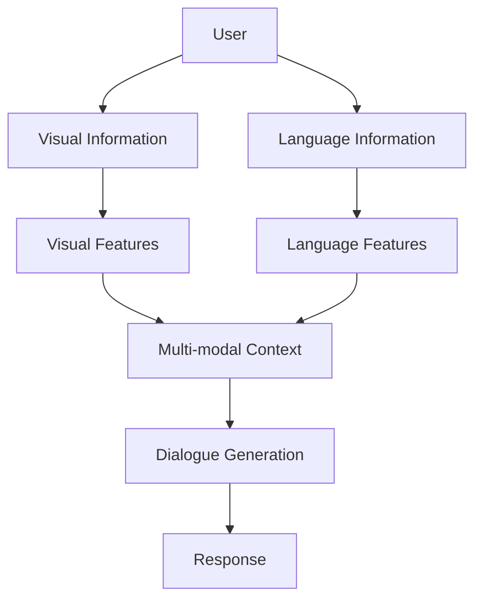
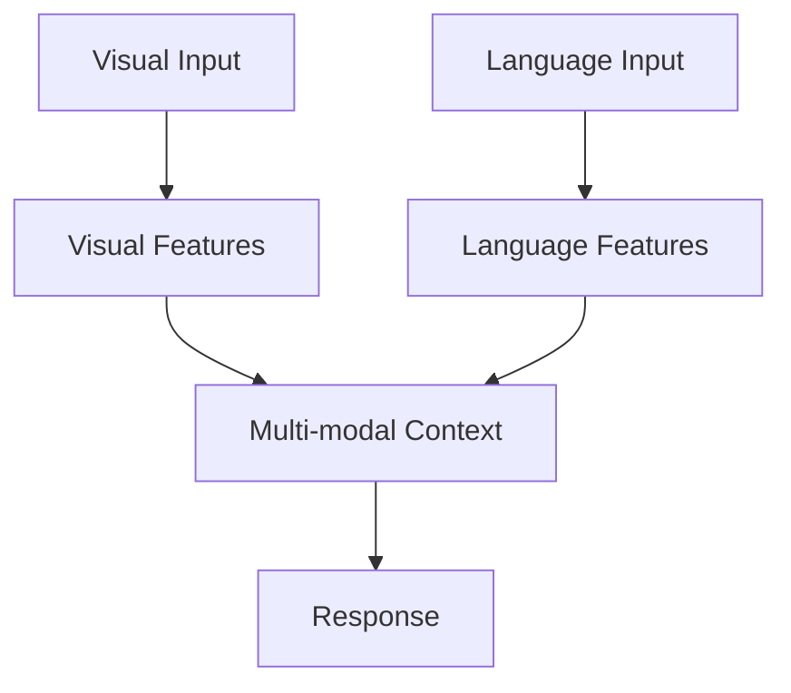
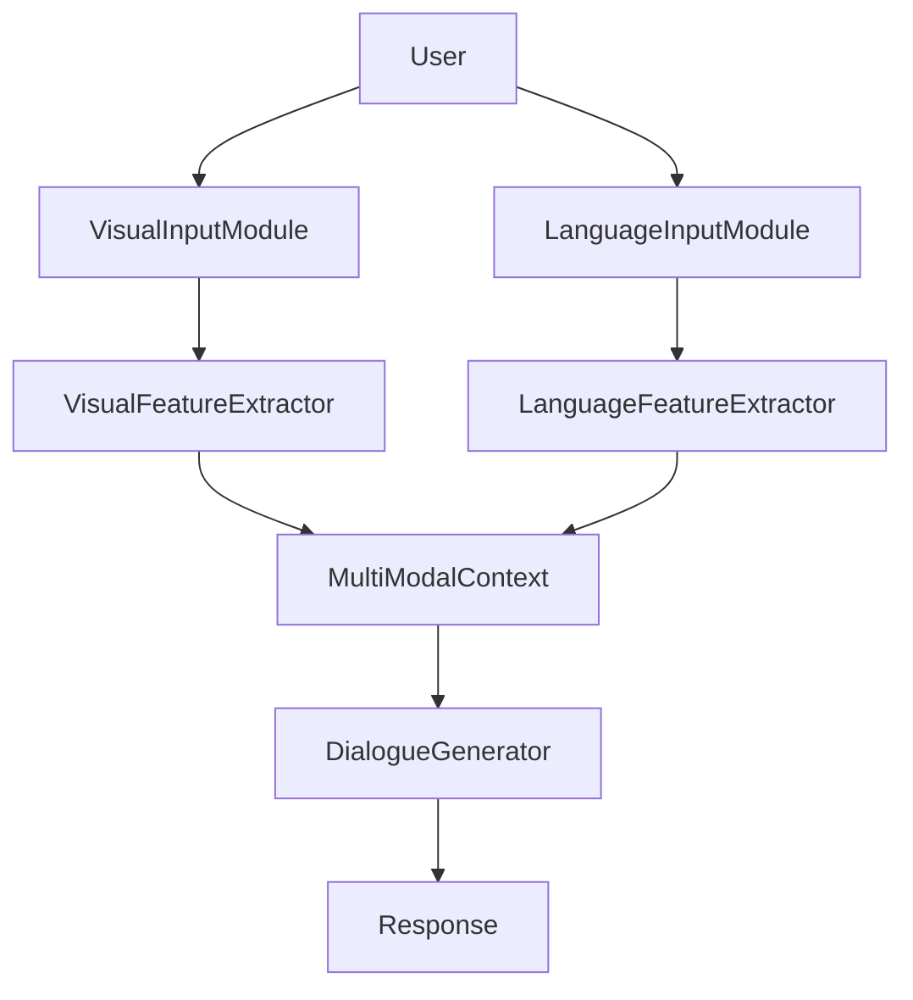
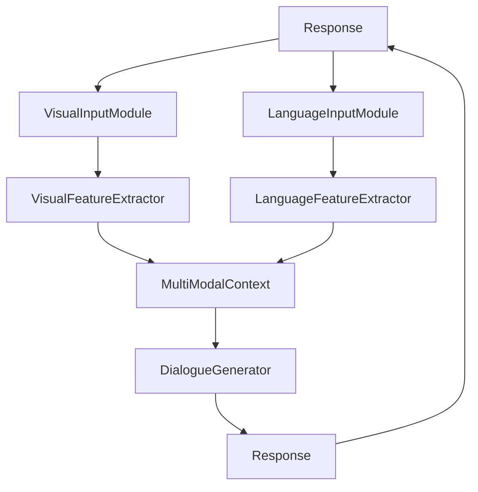
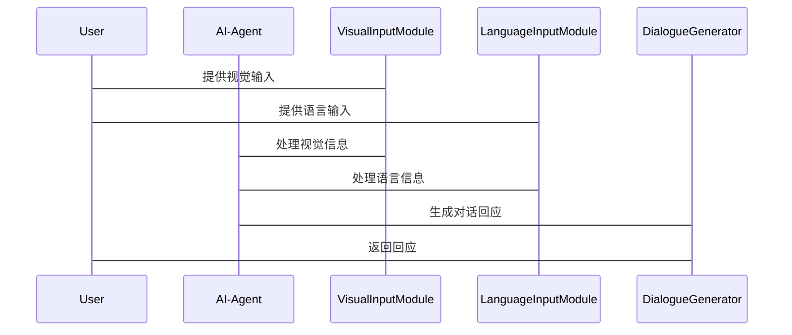

                 


# AI Agent的多模态对话系统：整合视觉和语言理解

**关键词**：AI Agent，多模态对话系统，视觉与语言整合，对话生成，跨模态理解，系统架构设计，项目实战

**摘要**：本文探讨了AI Agent在多模态对话系统中的应用，重点整合视觉和语言理解能力。文章从背景介绍、核心概念、算法原理、系统架构到项目实战，详细阐述了多模态对话系统的构建过程，为开发者和研究人员提供了理论和实践的参考。

---

## 第一部分：背景介绍

### 第1章：多模态对话系统的概念与背景

#### 1.1 问题背景
- **1.1.1 当前对话系统的发展现状**  
  当前的对话系统主要依赖文本输入，难以处理视觉信息。随着AI技术的进步，用户期望与AI Agent进行更自然的交互，而不仅仅是文字对话。

- **1.1.2 多模态对话系统的必要性**  
  在现实场景中，用户可能需要结合视觉信息（如图像、视频）和语言信息进行交互。例如，在购物应用中，用户可以通过描述一件商品的外观，AI Agent结合视觉信息进行匹配推荐。

- **1.1.3 AI Agent在多模态对话中的角色**  
  AI Agent作为中间媒介，整合视觉和语言信息，提供更智能、更人性化的交互体验。

#### 1.2 问题描述
- **1.2.1 多模态对话系统的定义**  
  多模态对话系统是一种结合多种感知模态（如视觉、语言、语音等）进行交互的系统，能够理解和生成多模态信息。

- **1.2.2 系统需要解决的核心问题**  
  如何有效地整合视觉和语言信息，实现跨模态理解和对话生成。

- **1.2.3 系统的边界与外延**  
  系统专注于视觉和语言的整合，但不涉及其他模态（如语音或触觉）。其外延包括多模态数据的处理和对话生成的优化。

#### 1.3 问题解决
- **1.3.1 多模态对话系统的解决方案**  
  通过引入多模态编码器和解码器，结合跨模态注意力机制，实现视觉和语言信息的协同处理。

- **1.3.2 AI Agent在多模态对话中的作用**  
  AI Agent作为中枢，协调视觉和语言模块，进行信息处理和对话生成。

- **1.3.3 系统实现的关键技术**  
  多模态编码器、跨模态注意力机制、对话生成模型。

#### 1.4 系统的核心要素组成
- **1.4.1 多模态数据处理模块**  
  负责将视觉和语言数据转化为统一的表示形式。

- **1.4.2 跨模态理解模块**  
  实现视觉和语言信息的联合理解和关联。

- **1.4.3 对話生成模块**  
  基于多模态理解生成自然的对话回应。

---

## 第二部分：核心概念与联系

### 第2章：核心概念与联系

#### 2.1 多模态数据处理原理
- **2.1.1 多模态数据的表示方法**  
  使用深度学习模型（如CNN、Transformer）对视觉和语言数据进行编码，生成统一的向量表示。

- **2.1.2 跨模态特征提取**  
  通过跨模态注意力机制，提取视觉和语言特征之间的关联性。

#### 2.2 跨模态理解机制
- **2.2.1 跨模态注意力机制**  
  使用自注意力机制，结合视觉和语言特征，生成多模态上下文表示。

- **2.2.2 跨模态关联学习**  
  建立视觉和语言信息之间的语义关联，增强跨模态理解能力。

#### 2.3 对話生成模型
- **2.3.1 基于多模态的对话生成**  
  使用预训练的多模态语言模型，结合视觉信息生成对话回应。

- **2.3.2 对話生成的挑战**  
  视觉和语言信息的协同处理、对话的连贯性和自然性。

#### 2.4 概念属性对比表
| 概念      | 特性                |
|-----------|--------------------|
| 视觉信息   | 图像、颜色、形状     |
| 语言信息   | 文本、语法、语义     |
| 跨模态理解  | 关联性、语义对齐     |
| 对話生成    | 自然性、连贯性      |

#### 2.5 ER实体关系图


---

## 第三部分：算法原理讲解

### 第3章：算法原理

#### 3.1 多模态编码器
- **3.1.1 多模态编码器的结构**  
  使用Transformer架构，结合视觉和语言特征，生成多模态编码。

- **3.1.2 多模态编码器的数学模型**  
  $$ \text{Encoder} = \text{Multi\_modal\_transformer}(\text{visual\_input}, \text{language\_input}) $$

#### 3.2 跨模态解码器
- **3.2.1 跨模态解码器的结构**  
  使用自注意力机制，结合多模态编码生成对话回应。

- **3.2.2 跨模态解码器的数学模型**  
  $$ \text{Decoder} = \text{Multi\_modal\_transformer}(\text{multi\_modal\_context}) $$

#### 3.3 对話生成模型
- **3.3.1 基于多模态的对话生成**  
  使用预训练的语言模型，结合视觉信息生成对话回应。

- **3.3.2 对話生成模型的数学模型**  
  $$ \text{Response} = \text{generate}(\text{multi\_modal\_context}) $$

#### 3.4 算法流程图


#### 3.5 Python代码示例
```python
import torch
import torch.nn as nn

class MultiModalEncoder(nn.Module):
    def __init__(self, visual_dim, language_dim):
        super().__init__()
        self.visual_proj = nn.Linear(visual_dim, 512)
        self.language_proj = nn.Linear(language_dim, 512)
        self.transformer = nn.TransformerEncoder(nn.TransformerEncoderLayer(512, 8), 2)

    def forward(self, visual_input, language_input):
        visual_embed = self.visual_proj(visual_input)
        language_embed = self.language_proj(language_input)
        combined_embed = torch.cat([visual_embed, language_embed], dim=0)
        output = self.transformer(combined_embed)
        return output

class MultiModalDecoder(nn.Module):
    def __init__(self, input_dim, output_dim):
        super().__init__()
        self.transformer = nn.TransformerDecoder(nn.TransformerDecoderLayer(input_dim, 8), 2)
        self.language_head = nn.Linear(input_dim, output_dim)

    def forward(self, input_context, tgt):
        output = self.transformer(input_context, tgt)
        return self.language_head(output)
```

---

## 第四部分：数学模型和公式

### 第4章：数学模型

#### 4.1 多模态编码器的数学表达式
$$ \text{Encoder} = \text{Multi\_modal\_transformer}(\text{visual\_input}, \text{language\_input}) $$

#### 4.2 跨模态解码器的数学表达式
$$ \text{Decoder} = \text{Multi\_modal\_transformer}(\text{multi\_modal\_context}) $$

#### 4.3 对話生成模型的数学表达式
$$ \text{Response} = \text{generate}(\text{multi\_modal\_context}) $$

#### 4.4 示例
假设输入视觉特征为100维，语言特征为200维，编码器将它们映射到512维的向量，然后通过Transformer编码生成多模态上下文。

---

## 第五部分：系统分析与架构设计方案

### 第5章：系统架构设计

#### 5.1 问题场景介绍
用户通过视觉和语言输入与AI Agent交互，系统需要整合两种信息进行理解和生成。

#### 5.2 系统功能设计
- **5.2.1 系统功能模块**  
  - 视觉处理模块
  - 语言处理模块
  - 跨模态理解模块
  - 对話生成模块

- **5.2.2 系统功能设计类图**  


#### 5.3 系统架构图


#### 5.4 系统接口设计
- 输入接口：视觉和语言输入接口
- 输出接口：对话生成输出接口

#### 5.5 系统交互设计


---

## 第六部分：项目实战

### 第6章：项目实战

#### 6.1 环境安装
- 安装必要的库：PyTorch、Transformers、Matplotlib

#### 6.2 核心代码实现
```python
import torch
import torch.nn as nn
import torch.optim as optim

class MultiModalDialogueSystem:
    def __init__(self):
        self.encoder = MultiModalEncoder(100, 200)
        self.decoder = MultiModalDecoder(512, 1000)
        self.optimizer = optim.Adam(self.parameters(), lr=0.001)
        self.criterion = nn.CrossEntropyLoss()

    def forward(self, visual_input, language_input, tgt):
        enc_output = self.encoder(visual_input, language_input)
        dec_output = self.decoder(enc_output, tgt)
        return dec_output

    def backward(self, loss):
        self.optimizer.zero_grad()
        loss.backward()
        self.optimizer.step()
```

#### 6.3 代码解读与分析
- **编码器**：将视觉和语言输入编码为多模态上下文。
- **解码器**：基于多模态上下文生成对话回应。
- **训练流程**：通过反向传播优化模型参数。

#### 6.4 实际案例分析
- **案例1**：用户描述一张图片，系统生成相关回应。
- **案例2**：用户通过文本和图片结合，系统提供更精准的回答。

#### 6.5 项目小结
- 成功实现了多模态对话系统。
- 在实际应用中，需要进一步优化模型和提升用户体验。

---

## 第七部分：最佳实践

### 第7章：最佳实践

#### 7.1 小结
- 多模态对话系统的实现需要整合视觉和语言信息。
- 跨模态理解和对话生成是关键的技术挑战。

#### 7.2 注意事项
- 数据质量对系统性能影响重大。
- 对話生成的自然性和连贯性需要持续优化。

#### 7.3 拓展阅读
- 多模态Transformer模型的研究进展。
- 跨模态注意力机制的改进方法。

---

**作者：AI天才研究院 & 禅与计算机程序设计艺术**

