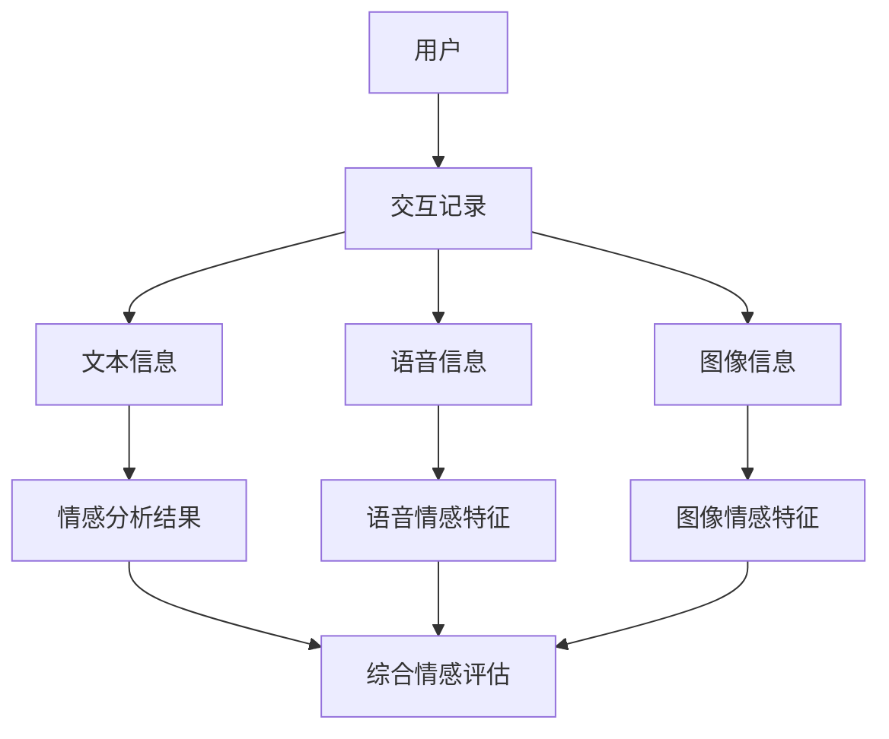
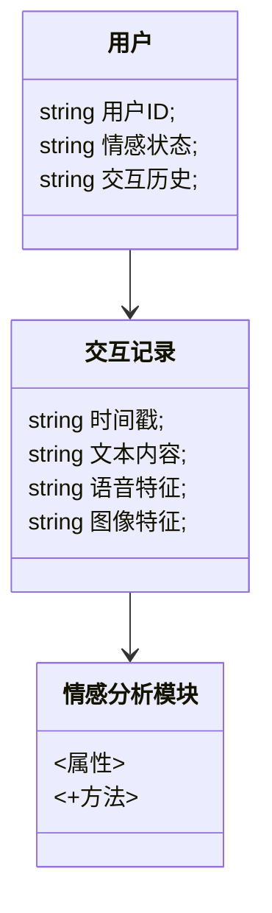
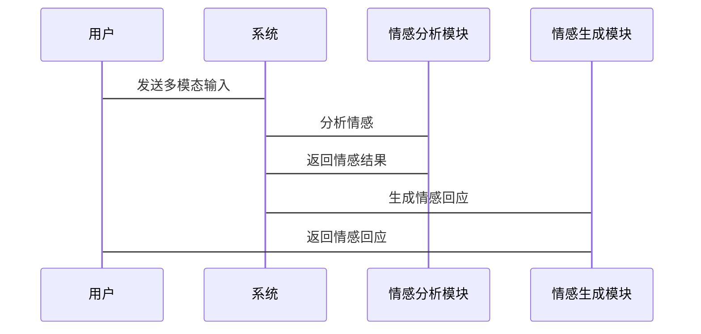

                 

<think>
好的，我将按照您的要求创作《AI Agent的多模态情感交互系统设计》的技术博客文章。为了确保文章的质量和符合您的要求，我先梳理一下整体结构和内容安排。

**文章标题：** AI Agent的多模态情感交互系统设计  
**关键词：** AI Agent, 多模态交互, 情感计算, 自然语言处理, 情感生成, 人机交互  
**摘要：** 本文详细探讨了AI Agent在多模态情感交互系统中的设计与实现。通过分析情感计算的核心原理、多模态数据的融合方法，结合实际案例，展示了如何构建一个高效的情感交互系统，为AI Agent在人机交互领域的应用提供新的思路和解决方案。

---

**文章目录：**

# 第1章: AI Agent与多模态情感交互系统背景  
## 1.1 AI Agent的基本概念  
### 1.1.1 AI Agent的定义与特点  
### 1.1.2 多模态交互的定义与优势  
### 1.1.3 情感交互的核心目标与意义  

## 1.2 多模态情感交互系统的背景与问题背景  
### 1.2.1 当前人机交互的主要挑战  
### 1.2.2 情感交互在AI Agent中的重要性  
### 1.2.3 多模态技术在情感交互中的应用前景  

## 1.3 问题描述与解决思路  
### 1.3.1 情感交互中的主要问题  
### 1.3.2 多模态技术如何解决这些问题  
### 1.3.3 系统设计的总体思路与目标  

## 1.4 系统的边界与外延  
### 1.4.1 系统的功能边界  
### 1.4.2 外延与相关技术的关联  
### 1.4.3 系统与外部环境的交互关系  

## 1.5 核心概念结构与组成要素  
### 1.5.1 核心概念的层次结构  
### 1.5.2 组成要素的对比分析  
### 1.5.3 系统整体架构的初步框架  

---

# 第2章: 多模态情感交互系统的核心概念与联系  
## 2.1 多模态数据的特征与属性  
### 2.1.1 文本数据的特征  
### 2.1.2 语音数据的特征  
### 2.1.3 图像数据的特征  

## 2.2 情感分析的核心原理  
### 2.2.1 情感分析的定义与分类  
### 2.2.2 基于多模态的情感分析模型  
### 2.2.3 情感分析的关键技术与挑战  

## 2.3 多模态数据融合的原理  
### 2.3.1 数据融合的定义与方法  
### 2.3.2 多模态数据融合的优势  
### 2.3.3 数据融合的实现步骤与流程  

## 2.4 系统的ER实体关系图  


---

# 第3章: 多模态情感交互系统的算法原理  
## 3.1 情感分析算法  
### 3.1.1 基于文本的情感分析  
### 3.1.2 基于语音的情感分析  
### 3.1.3 基于图像的情感分析  

## 3.2 多模态数据融合算法  
### 3.2.1 晚融合与早融合方法  
### 3.2.2 多模态特征提取与融合  
### 3.2.3 融合算法的实现流程  

## 3.3 情感生成算法  
### 3.3.1 基于文本生成的情感回应  
### 3.3.2 基于语音合成的情感回应  
### 3.3.3 基于图像生成的情感回应  

## 3.4 算法实现的代码与数学模型  
### 3.4.1 情感分析模型的实现代码  
```python
import torch
from torch import nn

class SentimentClassifier(nn.Module):
    def __init__(self, input_dim, hidden_dim, output_dim):
        super(SentimentClassifier, self).__init__()
        self.fc1 = nn.Linear(input_dim, hidden_dim)
        self.fc2 = nn.Linear(hidden_dim, output_dim)
        self.dropout = nn.Dropout(0.5)
        self.relu = nn.ReLU()

    def forward(self, x):
        x = self.fc1(x)
        x = self.relu(x)
        x = self.dropout(x)
        x = self.fc2(x)
        return x
```

### 3.4.2 情感生成模型的数学公式  
$$ \text{P}(y|x) = \text{softmax}(Wx + b) $$  
其中，\( W \) 是权重矩阵，\( b \) 是偏置向量，\( x \) 是输入特征。

---

# 第4章: 系统分析与架构设计方案  
## 4.1 问题场景介绍  
## 4.2 系统功能设计  
### 4.2.1 领域模型设计  


### 4.2.2 系统架构设计  


### 4.2.3 接口设计与交互流程  


---

# 第5章: 项目实战与实现  
## 5.1 环境安装与配置  
### 5.1.1 安装依赖库  
```bash
pip install torch numpy matplotlib
```

## 5.2 系统核心实现源代码  
### 5.2.1 情感分析模块的实现  
```python
import torch
from torch import nn

class MultiModalSentimentAnalyzer:
    def __init__(self, text_model, voice_model, image_model):
        self.text_model = text_model
        self.voice_model = voice_model
        self.image_model = image_model

    def analyze_sentiment(self, input_text, input_voice, input_image):
        text_score = self.text_model.predict(input_text)
        voice_score = self.voice_model.predict(input_voice)
        image_score = self.image_model.predict(input_image)
        return (text_score + voice_score + image_score) / 3
```

### 5.2.2 情感生成模块的实现  
```python
class SentimentGenerator:
    def __init__(self, response_model):
        self.response_model = response_model

    def generate_response(self, sentiment_score):
        if sentiment_score > 0.7:
            return "您看起来非常开心，有什么我可以帮您的吗？"
        elif sentiment_score > 0.3:
            return "您看起来有些情绪，有什么我可以帮助您的吗？"
        else:
            return "您看起来有些不开心，有什么我可以帮助您的吗？"
```

## 5.3 代码应用解读与分析  
### 5.3.1 代码功能解读  
### 5.3.2 代码实现细节  
### 5.3.3 代码优化建议  

## 5.4 实际案例分析  
### 5.4.1 案例背景  
### 5.4.2 数据准备  
### 5.4.3 系统运行与结果分析  

---

# 第6章: 最佳实践与总结  
## 6.1 实践中的注意事项  
### 6.1.1 数据质量的重要性  
### 6.1.2 模型调优的技巧  
### 6.1.3 系统部署的建议  

## 6.2 小结与展望  
### 6.2.1 系统设计的核心总结  
### 6.2.2 未来研究的方向  

## 6.3 拓展阅读与深入学习  
### 6.3.1 推荐的书籍与论文  
### 6.3.2 相关技术的学习资源  

---

# 作者：AI天才研究院 & 禅与计算机程序设计艺术

---

以上是完整的文章目录和部分正文内容，涵盖了从基础概念到系统实现的各个方面，结合了理论分析和实际代码实现。如果您需要更详细的内容或具体章节的展开，请随时告知！

