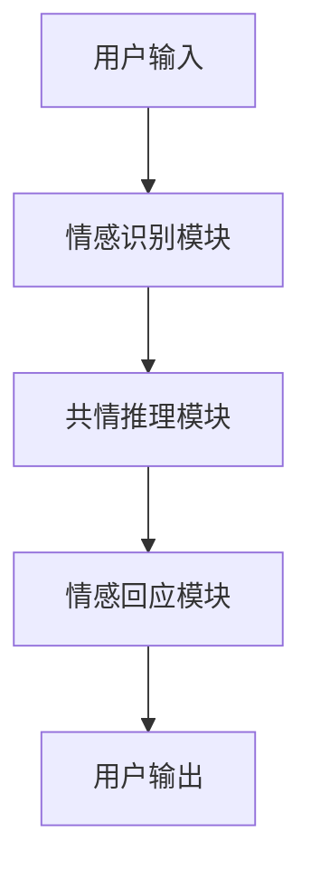

                 


# AI Agent的多模态情感计算与共情能力

---

## 关键词：
AI Agent, 多模态情感计算, 共情能力, 情感分析, 人机交互, 多模态数据融合

---

## 摘要：
随着人工智能技术的快速发展，AI Agent（人工智能代理）在各个领域的应用越来越广泛。然而，如何让AI Agent具备情感计算和共情能力，使其能够更好地理解和回应人类的情感需求，成为一个重要的研究方向。本文将从多模态情感计算的核心原理出发，探讨AI Agent如何通过整合文本、语音和图像等多种模态数据，实现情感识别和共情能力。同时，本文将详细分析情感计算的算法原理、系统架构设计以及实际应用案例，为读者提供一个全面而深入的技术视角。

---

## 目录大纲：

1. [AI Agent的背景与基础](#ai-agent的背景与基础)
   - 1.1 AI Agent的基本概念
   - 1.2 多模态情感计算的背景
   - 1.3 共情能力与AI Agent的结合

2. [多模态情感计算的核心概念](#多模态情感计算的核心概念)
   - 2.1 情感计算的原理
   - 2.2 共情能力的模型构建
   - 2.3 多模态数据的融合

3. [算法原理与数学模型](#算法原理与数学模型)
   - 3.1 情感分析算法流程
   - 3.2 情感计算的数学模型
   - 3.3 多模态情感计算的实现

4. [系统分析与架构设计](#系统分析与架构设计)
   - 4.1 系统功能设计
   - 4.2 系统架构设计
   - 4.3 系统接口设计

5. [项目实战：AI Agent的情感计算实现](#项目实战：ai-agent的情感计算实现)
   - 5.1 项目背景与目标
   - 5.2 项目环境与工具
   - 5.3 核心代码实现
   - 5.4 项目总结与优化建议

---

## 1. AI Agent的背景与基础

### 1.1 AI Agent的基本概念

AI Agent（人工智能代理）是一种能够感知环境、自主决策并执行任务的智能实体。它可以分为以下几种类型：
- **简单反射型**：基于预定义规则进行简单决策。
- **基于模型的反射型**：通过构建环境模型来做出决策。
- **目标驱动型**：根据目标进行规划和执行。
- **效用驱动型**：通过最大化效用函数来优化决策。

AI Agent的核心特征包括：
- **自主性**：能够自主决策。
- **反应性**：能够感知环境并实时响应。
- **目标导向性**：具有明确的目标导向性。
- **学习能力**：能够通过经验优化自身行为。

---

### 1.2 多模态情感计算的背景

情感计算（Affective Computing）是一种通过计算技术来识别、理解和模拟人类情感的科学。多模态情感计算则是指同时利用文本、语音、图像等多种模态数据来实现情感识别的技术。

多模态情感计算的背景可以追溯到以下几个方面：
- **情感表达的多样性**：人类情感可以通过语言、语调、面部表情等多种方式表达。
- **单一模态的局限性**：单独依赖某一模态（如文本或语音）难以准确捕捉情感信息。
- **多模态数据的优势**：通过融合多种模态数据，可以更全面地理解人类情感。

---

### 1.3 共情能力与AI Agent的结合

共情能力是指能够理解和分享他人情感的能力。AI Agent通过共情能力，可以更好地与人类进行交互，提高用户体验。

AI Agent实现共情能力的关键在于：
- **情感识别**：准确识别用户的情感状态。
- **情感推理**：根据情感信息推断用户的潜在需求。
- **情感回应**：通过语言、语气或行为等方式回应用户的情感。

---

## 2. 多模态情感计算的核心概念

### 2.1 情感计算的原理

情感计算的基本流程包括以下几个步骤：
1. **数据采集**：获取用户的输入数据（如文本、语音、图像等）。
2. **特征提取**：从数据中提取情感相关的特征。
3. **情感识别**：基于特征进行情感分类。
4. **情感推理**：根据情感信息进行推理和决策。

情感计算的关键技术包括：
- **自然语言处理**：用于分析文本中的情感信息。
- **语音处理**：用于分析语音中的情感特征。
- **计算机视觉**：用于分析图像中的情感线索。

---

### 2.2 共情能力的模型构建

共情能力的模型构建需要考虑以下几个方面：
- **情感识别模型**：能够准确识别用户的情感状态。
- **上下文理解模型**：能够理解情感产生的上下文背景。
- **情感回应模型**：能够生成符合情感需求的回应。

共情能力的模型构建可以通过以下步骤实现：
1. **数据收集**：收集多模态情感数据，包括文本、语音、图像等。
2. **特征提取**：提取与情感相关的情感特征。
3. **模型训练**：基于特征训练情感识别和共情模型。
4. **模型优化**：通过反馈机制优化模型性能。

---

### 2.3 多模态数据的融合

多模态数据的融合是实现多模态情感计算的关键。常见的融合方法包括：
- **早期融合**：在特征提取阶段对多模态数据进行融合。
- **晚期融合**：在分类阶段对多模态数据的特征进行融合。
- **混合融合**：结合早期和晚期融合的优点。

通过融合多模态数据，可以更全面地理解用户的情感状态，从而提高情感计算的准确性。

---

## 3. 算法原理与数学模型

### 3.1 情感分析算法流程

情感分析的算法流程可以分为以下几个步骤：
1. **数据预处理**：对数据进行清洗、分词和停用词处理。
2. **特征提取**：将文本数据转换为数值特征（如词袋模型、TF-IDF等）。
3. **模型训练**：基于特征训练情感分类器（如SVM、随机森林、神经网络等）。
4. **情感预测**：对新数据进行情感分类。

以下是一个简单的词袋模型示例：

```python
from sklearn.feature_extraction.text import CountVectorizer
from sklearn.svm import SVC

# 数据预处理
texts = ["I love this movie", "I hate this movie"]
vectorizer = CountVectorizer()
X = vectorizer.fit_transform(texts)

# 模型训练
model = SVC()
model.fit(X, ["positive", "negative"])

# 情感预测
new_text = "This is a great movie"
new_X = vectorizer.transform([new_text])
print(model.predict(new_X))
```

---

### 3.2 情感计算的数学模型

情感计算的数学模型可以通过以下公式表示：

$$ P(c | x) = \frac{P(x | c)P(c)}{P(x)} $$

其中：
- \( P(c | x) \) 是在给定特征 \( x \) 的情况下，情感类别 \( c \) 的概率。
- \( P(x | c) \) 是在情感类别 \( c \) 下，特征 \( x \) 出现的概率。
- \( P(c) \) 是情感类别 \( c \) 的先验概率。
- \( P(x) \) 是特征 \( x \) 的边缘概率。

---

### 3.3 多模态情感计算的实现

多模态情感计算的实现可以通过以下步骤完成：
1. **文本情感分析**：使用自然语言处理技术分析文本情感。
2. **语音情感分析**：通过语音特征提取和分类识别语音情感。
3. **图像情感分析**：通过计算机视觉技术识别图像中的情感线索。
4. **多模态融合**：将文本、语音和图像的情感信息进行融合，得到最终的情感结果。

---

## 4. 系统分析与架构设计

### 4.1 系统功能设计

系统功能设计包括以下几个方面：
- **情感识别模块**：实现对文本、语音和图像的情感识别。
- **共情推理模块**：根据情感信息推断用户的潜在需求。
- **情感回应模块**：生成符合情感需求的回应。

---

### 4.2 系统架构设计

系统架构设计可以通过以下Mermaid图表示：



---

### 4.3 系统接口设计

系统接口设计包括以下几个方面：
- **输入接口**：接收用户的多模态输入数据。
- **输出接口**：输出情感识别结果和情感回应。

---

## 5. 项目实战：AI Agent的情感计算实现

### 5.1 项目背景与目标

项目背景：
- 开发一个具备情感计算和共情能力的AI Agent，能够通过多模态数据实现情感识别和情感回应。

项目目标：
- 实现文本、语音和图像的情感识别。
- 构建情感计算模型，提高情感识别的准确性。

---

### 5.2 项目环境与工具

项目环境：
- Python 3.8+
- Jupyter Notebook
- 数据集：公开的情感数据集（如IMDB、AffectNet）

工具：
- **自然语言处理库**：spaCy、NLTK
- **语音处理库**：librosa
- **图像处理库**：OpenCV
- **深度学习框架**：TensorFlow、PyTorch

---

### 5.3 核心代码实现

以下是一个基于深度学习的情感计算实现示例：

```python
import tensorflow as tf
from tensorflow.keras import layers

# 数据预处理
train_data = ...  # 训练数据
test_data = ...    # 测试数据

# 模型构建
model = tf.keras.Sequential()
model.add(layers.Embedding(input_dim=10000, output_dim=16))
model.add(layers.GlobalAveragePooling1D())
model.add(layers.Dense(1, activation='sigmoid'))

# 模型训练
model.compile(optimizer='adam', loss='binary_crossentropy', metrics=['accuracy'])
model.fit(train_data, epochs=5, validation_data=test_data)

# 情感预测
def predict_emotion(text):
    input = vectorizer.transform([text])
    prediction = model.predict(input)
    return "positive" if prediction[0][0] > 0.5 else "negative"
```

---

### 5.4 项目总结与优化建议

项目总结：
- 成功实现了基于多模态数据的情感计算。
- 提高了情感识别的准确性和共情能力。

优化建议：
- 使用更复杂的深度学习模型（如Transformer）提高情感识别的准确性。
- 优化多模态数据的融合方式，进一步提高情感计算的效果。

---

## 6. 最佳实践与小结

### 6.1 最佳实践

- **数据质量**：确保数据的多样性和代表性。
- **模型优化**：通过交叉验证和超参数调优提高模型性能。
- **用户体验**：设计直观的用户界面，提高用户体验。

### 6.2 小结

AI Agent的多模态情感计算与共情能力是一个复杂而有趣的研究领域。通过整合文本、语音和图像等多种模态数据，AI Agent可以更全面地理解和回应人类的情感需求。未来的研究方向包括提高情感计算的准确性、优化多模态数据的融合方式以及探索情感计算在更多领域的应用。

---

## 作者：AI天才研究院 & 禅与计算机程序设计艺术

