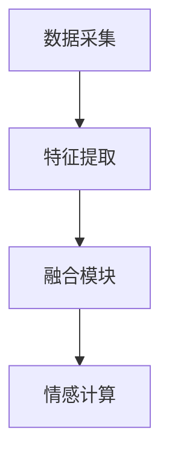
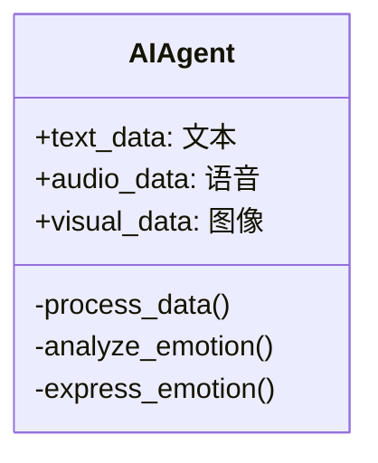
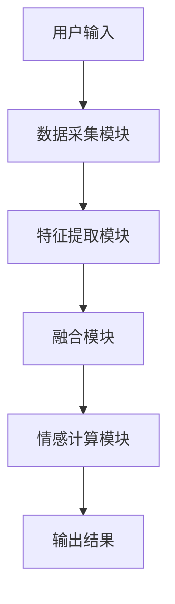

                 


# AI Agent的多模态情感计算与表达

> 关键词：AI Agent，多模态情感计算，情感分析，深度学习，人机交互

> 摘要：本文深入探讨AI Agent在多模态情感计算与表达中的应用，从基础概念到核心算法，再到系统架构设计，结合实际案例分析，全面解析如何实现高效、自然的情感交互。通过本文，读者将掌握AI Agent在多模态情感计算中的关键技术和实践方法。

---

## 第1章: AI Agent与多模态情感计算概述

### 1.1 AI Agent的基本概念

#### 1.1.1 AI Agent的定义与特点
AI Agent（人工智能代理）是指能够感知环境、自主决策并执行任务的智能实体。与传统程序不同，AI Agent具备以下特点：
- **自主性**：能够独立决策和行动。
- **反应性**：能实时感知环境并做出反应。
- **目标导向**：所有行动均以实现特定目标为导向。
- **学习能力**：通过数据和经验提升自身性能。

#### 1.1.2 多模态数据的定义与特征
多模态数据是指整合多种数据形式（如文本、语音、图像等）的信息。其主要特征包括：
- **多样性**：涵盖多种数据类型。
- **互补性**：不同模态数据相互补充，提升信息处理能力。
- **复杂性**：处理多模态数据需要复杂的算法和架构。

#### 1.1.3 情感计算的核心概念与应用领域
情感计算（Affective Computing）研究如何识别、理解、表达和模拟人类情感。其核心概念包括：
- **情感识别**：通过数据检测情感状态。
- **情感表达**：模拟情感输出，增强人机交互体验。
- **情感记忆**：记录并利用过去的情感信息。

情感计算广泛应用于教育、医疗、娱乐等领域，提升用户体验和系统智能化水平。

---

### 1.2 多模态情感计算的背景与意义

#### 1.2.1 情感计算的发展历程
情感计算经历了从简单的情绪识别到复杂的多模态处理的演变。早期研究主要集中在单模态数据（如文本或语音），近年来随着深度学习的发展，多模态情感计算成为研究热点。

#### 1.2.2 多模态数据在情感计算中的作用
多模态数据的引入显著提升了情感计算的准确性和鲁棒性。例如，结合文本和语音数据可以更准确地识别情感状态，尤其是在嘈杂或复杂场景中。

#### 1.2.3 AI Agent在人机交互中的情感表达需求
AI Agent需要具备情感表达能力，以提供更自然、流畅的交互体验。例如，在智能客服中，通过语气和表情模拟情感，增强用户信任感。

---

## 第2章: 多模态数据处理与情感分析基础

### 2.1 多模态数据的类型与特点

#### 2.1.1 文本数据
文本数据是最常见的模态之一，情感计算中常用自然语言处理技术（如词袋模型、词嵌入）进行分析。

#### 2.1.2 语音数据
语音数据包含情感信息，通过语音特征提取（如音调、语速）和声学模型（如GMM、DNN）进行情感识别。

#### 2.1.3 图像与视觉数据
图像数据通过计算机视觉技术（如CNN、注意力机制）提取情感相关特征，如面部表情、姿态。

---

### 2.2 情感分析的基本原理

#### 2.2.1 单模态情感分析
单模态情感分析仅基于单一数据类型，如文本或语音。其优势是实现简单，但容易受到数据局限性的影响。

#### 2.2.2 多模态情感分析的优势
多模态情感分析通过融合多种数据类型，显著提升情感识别的准确性和鲁棒性。例如，结合文本和语音数据可以更准确地识别复杂情感状态。

#### 2.2.3 情感计算的挑战与解决方案
主要挑战包括数据异构性、模态间关联性复杂等问题。解决方案包括数据预处理、跨模态对齐、多任务学习等技术。

---

### 2.3 多模态数据融合方法

#### 2.3.1 数据级融合
数据级融合在原始数据层面进行信息整合，如将文本和语音数据拼接成向量。

#### 2.3.2 特征级融合
特征级融合在特征提取后进行融合，如使用加权平均或注意力机制。

#### 2.3.3 决策级融合
决策级融合在最终决策阶段进行信息整合，如将多种模态的分类结果进行投票或加权融合。

---

## 第3章: 多模态情感计算的核心算法

### 3.1 情感计算的算法框架

#### 3.1.1 基于深度学习的情感计算模型
深度学习模型（如LSTM、Transformer）在情感计算中表现优异，尤其适合处理序列数据和长距离依赖关系。

#### 3.1.2 基于传统机器学习的情感计算模型
传统机器学习方法（如SVM、随机森林）在小数据集上表现良好，但深度学习在大数据场景中更具优势。

#### 3.1.3 混合模型的应用
混合模型结合深度学习和传统方法的优势，适用于复杂情感分析任务。

---

### 3.2 多模态数据融合的算法实现

#### 3.2.1 多模态特征提取与表示
使用模态特定的模型（如BERT、ResNet）提取特征，并通过融合层（如全连接层、注意力机制）进行整合。

#### 3.2.2 多任务学习框架
多任务学习通过共享特征提取层，同时优化多个相关任务（如情感分类和意图识别）。

#### 3.2.3 注意力机制在多模态融合中的应用
注意力机制可以自适应地分配不同模态数据的关注权重，提升模型性能。

---

### 3.3 情感计算的数学模型与公式

#### 3.3.1 情感评分函数
$$ f(x) = \sum_{i=1}^{n} w_i x_i $$

#### 3.3.2 多模态融合的权重分配
$$ w_i = \frac{1}{1 + e^{-k x_i}} $$

---

## 第4章: 多模态情感计算系统的架构设计

### 4.1 系统功能需求分析

#### 4.1.1 功能模块划分
- **数据采集模块**：采集多模态数据。
- **特征提取模块**：提取各模态特征。
- **融合模块**：进行多模态数据融合。
- **情感计算模块**：输出情感结果。

#### 4.1.2 功能流程图


---

### 4.2 系统架构设计

#### 4.2.1 领域模型


#### 4.2.2 系统架构图


---

## 第5章: 项目实战

### 5.1 环境安装与配置
- **Python版本**：3.8+
- **深度学习框架**：TensorFlow/PyTorch
- **自然语言处理库**：spaCy、NLTK
- **语音处理库**：librosa、pyaudio
- **图像处理库**：OpenCV、 Pillow

---

### 5.2 核心代码实现

#### 5.2.1 数据预处理
```python
import librosa
import numpy as np

def preprocess_audio(file_path):
    audio, sr = librosa.load(file_path, sr=16000)
    features = librosa.feature.mfcc(y=audio, sr=sr, n_mfcc=13)
    return features.T
```

#### 5.2.2 模型训练
```python
import tensorflow as tf
from tensorflow.keras import layers

model = tf.keras.Sequential([
    layers.Input(shape=(13,)),
    layers.Dense(128, activation='relu'),
    layers.Dropout(0.2),
    layers.Dense(2, activation='softmax')
])

model.compile(optimizer='adam', loss='sparse_categorical_crossentropy', metrics=['accuracy'])
model.fit(X_train, y_train, epochs=10, batch_size=32)
```

#### 5.2.3 接口调用
```python
def predict_emotion(audio_path, text_input):
    audio_features = preprocess_audio(audio_path)
    text_features = model_text.encode(text_input)
    # 融合特征
    combined_features = np.concatenate([audio_features, text_features], axis=1)
    prediction = model.predict(combined_features)
    return prediction
```

---

## 第6章: 优化与未来展望

### 6.1 系统优化策略
- **数据增强**：通过数据增强技术提升模型鲁棒性。
- **模型调优**：优化模型结构和超参数，提升性能。
- **实时性优化**：通过轻量化设计和边缘计算提升实时性。

### 6.2 未来发展方向
- **生成式AI的应用**：利用生成式模型（如GPT-3、Diffusion）实现更自然的情感表达。
- **多模态边缘计算**：在边缘设备上实现低延迟、高效率的情感计算。

### 6.3 最佳实践 tips
- 在实际项目中，建议先从单模态数据入手，逐步扩展到多模态。
- 注意数据质量和多样性，避免过拟合特定数据集。
- 定期监控和更新模型，以应对数据分布的变化。

---

## 作者：AI天才研究院/AI Genius Institute & 禅与计算机程序设计艺术 /Zen And The Art of Computer Programming

---

以上是《AI Agent的多模态情感计算与表达》的完整内容，涵盖了从基础概念到实战应用的各个方面，结合理论与实践，帮助读者全面掌握AI Agent在多模态情感计算中的技术与方法。

