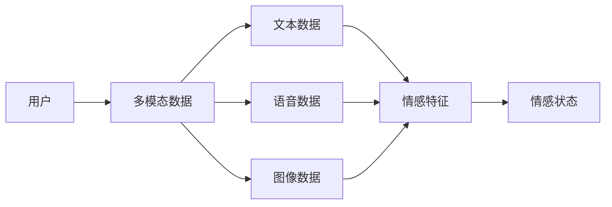
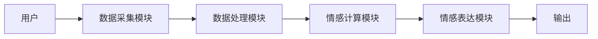

                 


# AI Agent的多模态情感计算与表达

> 关键词：多模态情感计算、AI Agent、人机交互、机器学习、自然语言处理

> 摘要：本文详细探讨了AI Agent在多模态情感计算与表达中的应用，从基础概念到高级算法，从系统设计到实际应用，全面解析了多模态情感计算的核心原理、算法实现、系统架构及未来发展方向。通过丰富的案例分析和代码实现，帮助读者深入理解AI Agent如何利用多模态数据进行情感分析与表达。

---

# 第一部分: AI Agent的多模态情感计算与表达基础

## 第1章: AI Agent与多模态情感计算概述

### 1.1 AI Agent的基本概念
#### 1.1.1 AI Agent的定义与特点
AI Agent（人工智能代理）是一种智能实体，能够感知环境、自主决策并执行任务。其特点包括：
- **自主性**：能够在没有外部干预的情况下运行。
- **反应性**：能够实时感知环境并做出响应。
- **目标导向**：以特定目标为导向执行任务。
- **学习能力**：能够通过数据和经验不断优化性能。

#### 1.1.2 多模态数据的定义与特点
多模态数据指的是来自不同感官渠道的数据，如文本、语音、图像和视频。其特点包括：
- **多样性**：涵盖多种数据类型。
- **互补性**：不同模态的数据可以相互补充，提高信息的丰富性。
- **复杂性**：多模态数据的处理需要复杂的融合方法。

#### 1.1.3 情感计算的核心概念
情感计算（Affective Computing）是研究如何通过计算机技术理解和模拟人类情感的学科。其核心概念包括：
- **情感识别**：从多模态数据中识别出情感状态。
- **情感表达**：通过文本、语音或视觉方式表达情感。
- **情感推理**：基于情感数据进行推理和决策。

### 1.2 多模态情感计算的背景与意义
#### 1.2.1 情感计算的起源与发展
情感计算起源于20世纪90年代，随着人工智能技术的发展，逐渐应用于人机交互、机器人等领域。

#### 1.2.2 多模态数据在情感计算中的作用
多模态数据能够提供更全面的情感信息，例如：
- **文本**：通过语调、语气词识别情感。
- **语音**：通过语调、语速、音调分析情感。
- **图像**：通过面部表情、肢体语言识别情感。

#### 1.2.3 AI Agent在情感计算中的应用价值
AI Agent通过多模态情感计算，能够实现更自然、更智能的人机交互，提升用户体验。

### 1.3 技术挑战与应用价值
#### 1.3.1 多模态数据融合的挑战
多模态数据的异构性和复杂性增加了融合的难度。

#### 1.3.2 情感计算的跨领域应用
情感计算已广泛应用于教育、医疗、娱乐等领域。

#### 1.3.3 AI Agent在人机交互中的潜力
AI Agent能够通过情感计算实现更自然的交互方式。

## 1.4 本章小结

---

## 第2章: 多模态情感计算的核心概念与联系

### 2.1 多模态数据的特征分析
#### 2.1.1 文本数据的情感特征
文本数据的情感特征包括词汇选择、语调、语气等。

#### 2.1.2 语音数据的情感特征
语音数据的情感特征包括语调、语速、音调等。

#### 2.1.3 图像数据的情感特征
图像数据的情感特征包括面部表情、颜色、构图等。

### 2.2 多模态数据融合的原理
#### 2.2.1 数据预处理与特征提取
数据预处理包括归一化、降维等，特征提取包括文本向量化、语音特征提取等。

#### 2.2.2 多模态特征融合方法
常用的融合方法包括：
- **特征级融合**：将不同模态的特征向量进行合并。
- **决策级融合**：将不同模态的情感分类结果进行融合。

#### 2.2.3 情感计算模型的构建
构建情感计算模型需要考虑数据来源、模型结构和评估指标。

### 2.3 多模态情感计算的实体关系图


---

## 第3章: 多模态情感计算的算法原理

### 3.1 基于规则的情感计算算法
#### 3.1.1 算法原理
基于规则的算法通过预定义的规则匹配情感特征。

#### 3.1.2 算法实现
```python
def get_emotion(text, voice, image):
    # 文本分析
    text_emotion = analyze_text(text)
    # 语音分析
    voice_emotion = analyze_voice(voice)
    # 图像分析
    image_emotion = analyze_image(image)
    # 融合情感
    return fuse_emotion(text_emotion, voice_emotion, image_emotion)
```

#### 3.1.3 算法优缺点
- **优点**：规则明确，易于解释。
- **缺点**：难以处理复杂的情感场景。

### 3.2 基于深度学习的情感计算算法
#### 3.2.1 算法原理
基于深度学习的算法通过神经网络学习情感特征。

#### 3.2.2 算法实现
```python
import tensorflow as tf
model = tf.keras.Sequential([
    tf.keras.layers.Dense(64, activation='relu'),
    tf.keras.layers.Dense(1, activation='sigmoid')
])
model.compile(optimizer='adam', loss='binary_crossentropy')
```

#### 3.2.3 算法优缺点
- **优点**：能够处理复杂的非线性关系。
- **缺点**：需要大量数据和计算资源。

### 3.3 本章小结

---

## 第4章: 多模态情感计算的系统架构设计

### 4.1 系统功能设计
- **数据采集**：从多模态数据源获取数据。
- **数据处理**：预处理和特征提取。
- **情感计算**：基于算法模型进行情感分析。
- **情感表达**：生成情感反馈。

### 4.2 系统架构图


### 4.3 接口设计
- **输入接口**：接收多模态数据。
- **输出接口**：输出情感反馈。

### 4.4 本章小结

---

## 第5章: 多模态情感计算的项目实战

### 5.1 环境安装
- **Python**：3.8+
- **TensorFlow**：2.5+
- **NLTK**：1.0+

### 5.2 核心代码实现
```python
import nltk
from tensorflow.keras import layers

# 文本情感分析
def analyze_text(text):
    tokens = nltk.word_tokenize(text)
    return nltk.sentiment.vader.polarity_scores(text)

# 语音情感分析
def analyze_voice(voice):
    # 示例代码，实际需要语音处理库
    return {'emotional_score': 0.5}

# 图像情感分析
def analyze_image(image):
    # 示例代码，实际需要计算机视觉库
    return {'emotional_score': 0.7}

# 情感融合
def fuse_emotion(text_emotion, voice_emotion, image_emotion):
    return (text_emotion['compound'] + voice_emotion['emotional_score'] + image_emotion['emotional_score']) / 3
```

### 5.3 案例分析
- **案例背景**：用户与AI Agent的对话。
- **案例实现**：通过代码实现情感计算与反馈。

### 5.4 项目总结
总结项目实现的关键点和经验教训。

---

## 第6章: 多模态情感计算的高级应用与未来展望

### 6.1 高级应用
- **智能客服**：通过多模态情感计算提升用户体验。
- **虚拟助手**：实现更自然的交互方式。

### 6.2 技术趋势与挑战
- **技术趋势**：深度学习与多模态融合。
- **技术挑战**：数据隐私、计算效率等。

### 6.3 伦理与社会影响
探讨情感计算在社会中的伦理问题。

---

## 第7章: 总结与展望

### 7.1 本章小结
总结全文的核心内容。

### 7.2 未来展望
展望多模态情感计算的未来发展。

---

## 参考文献

---

## 作者：AI天才研究院/AI Genius Institute & 禅与计算机程序设计艺术 /Zen And The Art of Computer Programming

---

以上是一个详细的目录大纲，您可以根据实际需求进行调整和补充。

