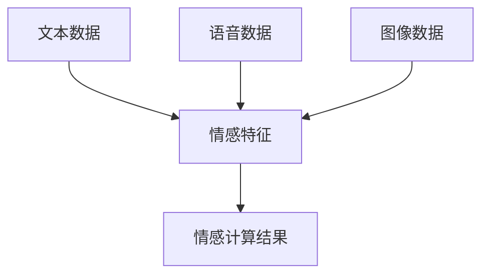

                 

# AI Agent的多模态情感计算技术

> 关键词：AI Agent, 多模态情感计算, 情感分析, 深度学习, 多模态数据

> 摘要：本文深入探讨AI Agent在多模态情感计算中的应用，分析其核心概念、算法原理、系统架构，并通过实际案例展示其在不同场景中的实现与应用。本文旨在为读者提供从理论到实践的全面指导，帮助他们理解并掌握多模态情感计算技术。

---

# 第1章: AI Agent与多模态情感计算概述

## 1.1 AI Agent的基本概念
### 1.1.1 AI Agent的定义与特点
AI Agent（人工智能代理）是一种能够感知环境、自主决策并执行任务的智能实体。其特点包括：
- **自主性**：能够自主决策。
- **反应性**：能够实时感知并响应环境变化。
- **目标导向**：具备明确的目标导向性。
- **学习能力**：能够通过经验改进性能。

### 1.1.2 多模态数据的定义与特点
多模态数据是指来自多种感官渠道的数据，例如文本、语音、图像和视频等。其特点包括：
- **多样性**：涵盖多种数据类型。
- **互补性**：不同模态的数据能够相互补充。
- **复杂性**：多模态数据的处理具有较高的复杂性。

### 1.1.3 情感计算的定义与特点
情感计算（Affective Computing）是指通过计算机技术来识别、理解和模拟人类情感的过程。其特点包括：
- **实时性**：能够实时捕捉和分析情感信息。
- **多样性**：支持多种情感维度的分析。
- **交互性**：能够与人类进行情感交互。

## 1.2 多模态情感计算的核心概念
### 1.2.1 多模态数据的整合与处理
多模态数据的整合与处理是通过将不同模态的数据进行融合，以提高情感分析的准确性和鲁棒性。例如，可以通过将文本情感特征与语音情感特征进行融合，来实现更准确的情感识别。

### 1.2.2 情感计算的分类与应用场景
情感计算可以分为基于规则的方法、统计学习方法和深度学习方法。其应用场景包括：
- **情感分析**：用于社交媒体评论分析、客户反馈分析等。
- **情感识别**：用于语音助手、智能客服等领域。
- **情感生成**：用于虚拟助手的情感表达、情感对话生成等。

### 1.2.3 AI Agent在情感计算中的作用
AI Agent在情感计算中的作用主要体现在以下几个方面：
- **情感感知**：通过多模态数据感知用户情感。
- **情感推理**：基于情感数据进行推理和决策。
- **情感交互**：通过情感数据与用户进行自然交互。

## 1.3 多模态情感计算的发展历程
### 1.3.1 情感计算的研究现状
情感计算的研究起源于20世纪90年代，近年来随着人工智能和大数据技术的发展，情感计算取得了显著进展。

### 1.3.2 多模态数据在情感计算中的应用
多模态数据在情感计算中的应用主要体现在以下几个方面：
- **提高情感识别的准确性**：通过多模态数据的融合，可以提高情感识别的准确性。
- **增强情感交互的自然性**：通过多模态数据的分析，可以实现更自然的情感交互。

### 1.3.3 AI Agent技术的最新进展
近年来，AI Agent技术在多模态情感计算领域取得了显著进展，例如基于深度学习的多模态情感分析模型的提出和应用。

## 1.4 本章小结
本章介绍了AI Agent和多模态情感计算的基本概念，分析了多模态情感计算的核心概念和发展历程，为后续章节的深入探讨奠定了基础。

---

# 第2章: 多模态情感计算的核心概念与联系

## 2.1 多模态数据的整合与分析
### 2.1.1 文本、语音、图像等多模态数据的整合方法
多模态数据的整合方法包括：
- **特征级融合**：在特征提取阶段进行融合。
- **决策级融合**：在决策阶段进行融合。
- **混合式融合**：结合特征级和决策级的融合方法。

### 2.1.2 多模态数据的特征提取与融合
特征提取与融合是多模态情感计算的关键步骤，可以通过以下方法实现：
- **文本特征提取**：利用自然语言处理技术提取文本情感特征。
- **语音特征提取**：利用语音信号处理技术提取语音情感特征。
- **图像特征提取**：利用计算机视觉技术提取图像情感特征。

### 2.1.3 多模态数据的实体关系图架构
多模态数据的实体关系图架构可以通过Mermaid图表示，如下：

## 2.2 情感计算的算法原理
### 2.2.1 基于规则的情感计算方法
基于规则的情感计算方法是通过预定义的规则和关键词来识别情感信息。例如，可以通过关键词匹配的方法识别文本中的情感倾向。

### 2.2.2 基于统计学习的情感计算方法
基于统计学习的情感计算方法通过训练数据学习情感特征，例如利用支持向量机（SVM）或朴素贝叶斯（Naive Bayes）等方法进行情感分类。

### 2.2.3 基于深度学习的情感计算方法
基于深度学习的情感计算方法通过神经网络模型（如卷积神经网络CNN、循环神经网络RNN和Transformer模型）来学习和表示情感信息。

## 2.3 多模态情感计算的数学模型
### 2.3.1 情感分类的数学模型
情感分类的数学模型可以通过概率论和统计学习方法来实现，例如贝叶斯分类器的数学模型如下：

$$ P(y|x) = \frac{P(x|y)P(y)}{P(x)} $$

### 2.3.2 注意力机制的数学公式
注意力机制是深度学习中的一个重要概念，其数学公式如下：

$$ \text{Attention}(Q, K, V) = \text{softmax}\left(\frac{QK^T}{\sqrt{d_k}}\right)V $$

## 2.4 本章小结
本章详细讲解了多模态情感计算的核心概念，分析了多模态数据的整合与分析方法，并介绍了情感计算的算法原理和数学模型，为后续章节的深入探讨奠定了理论基础。

---

# 第3章: 多模态情感计算的算法原理

## 3.1 基于规则的多模态情感计算
### 3.1.1 规则的定义与设计
基于规则的多模态情感计算是通过预定义的规则和关键词来识别情感信息。例如，可以通过规则匹配的方法识别文本中的情感倾向。

### 3.1.2 规则在多模态数据中的应用
规则在多模态数据中的应用可以通过以下步骤实现：
1. **文本数据处理**：通过规则匹配识别文本中的情感关键词。
2. **语音数据处理**：通过规则匹配识别语音中的情感特征。
3. **图像数据处理**：通过规则匹配识别图像中的情感特征。

### 3.1.3 规则方法的优缺点分析
规则方法的优点是简单易懂，适用于特定场景的情感分析；缺点是缺乏灵活性，难以应对复杂的情感场景。

## 3.2 基于统计学习的多模态情感计算
### 3.2.1 统计学习的基本原理
统计学习的基本原理是通过训练数据学习情感特征，例如利用支持向量机（SVM）或朴素贝叶斯（Naive Bayes）等方法进行情感分类。

### 3.2.2 统计学习在多模态数据中的应用
统计学习在多模态数据中的应用可以通过以下步骤实现：
1. **特征提取**：从多模态数据中提取情感特征。
2. **特征融合**：将不同模态的特征进行融合。
3. **情感分类**：利用统计学习方法进行情感分类。

### 3.2.3 统计学习方法的优缺点分析
统计学习方法的优点是简单易实现，适用于中小规模数据的情感分析；缺点是性能有限，难以应对大规模数据的情感分析。

## 3.3 基于深度学习的多模态情感计算
### 3.3.1 深度学习的基本原理
深度学习的基本原理是通过神经网络模型（如卷积神经网络CNN、循环神经网络RNN和Transformer模型）来学习和表示情感信息。

### 3.3.2 深度学习在多模态数据中的应用
深度学习在多模态数据中的应用可以通过以下步骤实现：
1. **特征提取**：利用深度学习模型提取多模态数据的情感特征。
2. **特征融合**：将不同模态的特征进行融合。
3. **情感分类**：利用深度学习模型进行情感分类。

### 3.3.3 深度学习方法的优缺点分析
深度学习方法的优点是性能优越，适用于大规模数据的情感分析；缺点是计算复杂度高，需要大量的计算资源。

## 3.4 本章小结
本章详细讲解了多模态情感计算的算法原理，分析了基于规则、统计学习和深度学习的多模态情感计算方法，并讨论了它们的优缺点，为后续章节的深入探讨奠定了技术基础。

---

# 作者：AI天才研究院/AI Genius Institute & 禅与计算机程序设计艺术 /Zen And The Art of Computer Programming

