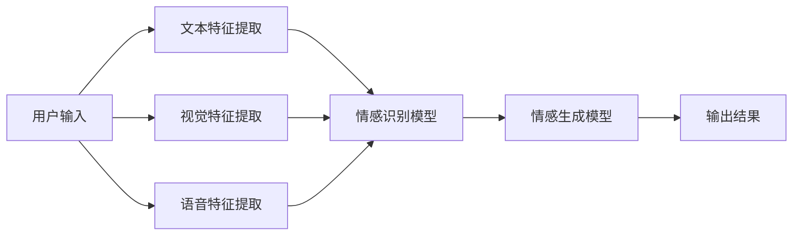
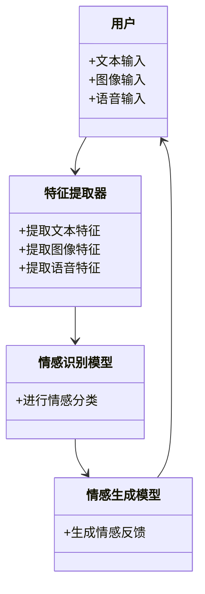
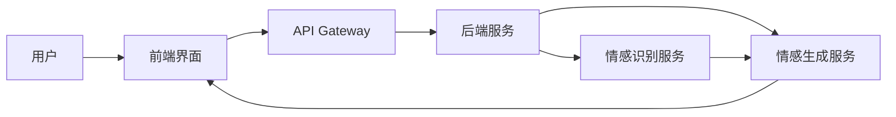
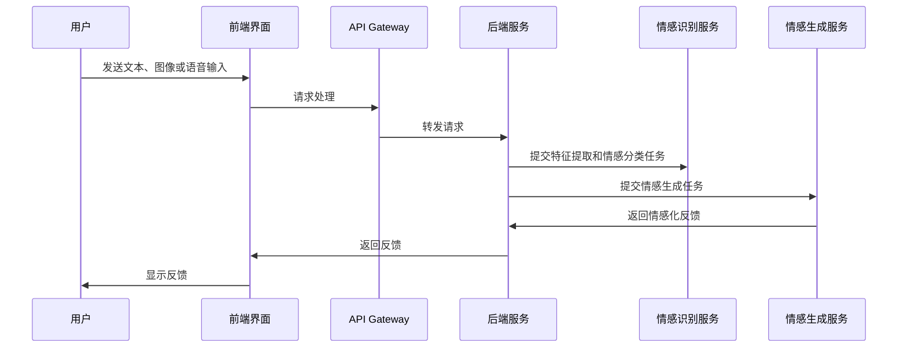

                 


# AI Agent的多模态情感识别与生成

> 关键词：AI Agent，多模态情感识别，生成对抗网络，自然语言处理，计算机视觉

> 摘要：本文深入探讨了AI Agent在多模态情感识别与生成领域的应用，从技术背景、核心概念到算法原理、系统架构，再到项目实战和最佳实践，全面解析了如何利用多模态数据提升情感交互的准确性和自然性。

---

# 第1章: AI Agent与多模态情感识别概述

## 1.1 AI Agent的基本概念

### 1.1.1 AI Agent的定义与特点
AI Agent（人工智能代理）是指能够感知环境并采取行动以实现目标的智能实体。AI Agent的特点包括自主性、反应性、目标导向性和社会性。这些特点使其能够与人类进行自然交互，理解并生成情感信息。

### 1.1.2 多模态数据的定义与类型
多模态数据指的是融合了多种感官数据（如文本、图像、语音等）的信息。常见的多模态数据类型包括：
- 文本数据：如对话内容、社交媒体帖子
- 图像数据：如面部表情、手势
- 语音数据：如语调、音量

### 1.1.3 情感识别与生成的背景与意义
情感识别与生成是人机交互中的重要环节。通过识别用户的情感，AI Agent可以更好地理解用户需求；通过生成情感化反馈，AI Agent能够提升用户体验，使其更加自然和人性化。

---

## 1.2 多模态情感识别的核心问题

### 1.2.1 情感识别的定义与目标
情感识别是指通过分析多模态数据来推断用户的情感状态（如快乐、悲伤、愤怒等）。目标是实现高精度的情感分类，以便AI Agent能够做出相应的反应。

### 1.2.2 多模态数据的融合挑战
多模态数据的融合是情感识别的关键。不同模态的数据可能包含互补信息，但如何有效融合这些信息以提高识别准确率是一个技术难点。

### 1.2.3 情感生成的任务与应用场景
情感生成是指根据输入的情感信息生成相应的文本、语音或图像反馈。应用场景包括智能客服、虚拟助手、情感陪护机器人等。

---

## 1.3 本章小结
本章介绍了AI Agent的基本概念、多模态数据的类型，以及情感识别与生成的重要性和挑战。为后续内容奠定了基础。

---

# 第2章: 多模态情感识别与生成的技术背景

## 2.1 情感计算的发展历程

### 2.1.1 情感计算的起源与演变
情感计算起源于20世纪90年代，最初主要关注基于文本的情感分析。随着技术进步，研究逐渐扩展到多模态情感计算。

### 2.1.2 多模态情感计算的研究现状
当前，多模态情感计算的研究主要集中在深度学习和多模态数据融合技术上。主流方法包括基于卷积神经网络（CNN）的图像处理和基于循环神经网络（RNN）的文本处理。

### 2.1.3 当前技术的瓶颈与挑战
当前技术的主要挑战包括跨模态数据的异构性、数据标注的困难以及模型的泛化能力不足。

---

## 2.2 多模态数据处理的技术基础

### 2.2.1 自然语言处理（NLP）在情感识别中的应用
NLP技术如词袋模型、词嵌入（Word2Vec）和 transformers（如BERT）在情感分析中被广泛应用。

### 2.2.2 计算机视觉（CV）在表情识别中的作用
基于CV的表情识别技术包括面部特征提取（如使用PCA或CNN）和表情分类（如使用SVM或随机森林）。

### 2.2.3 声音信号处理在语音情感分析中的应用
声音信号处理技术如梅尔频率倒谱系数（MFCC）和语音特征提取在语音情感分析中起重要作用。

---

## 2.3 AI Agent在情感交互中的优势

### 2.3.1 AI Agent的实时性与交互性
AI Agent能够实时处理多模态数据，提供快速的情感反馈，增强交互体验。

### 2.3.2 多模态数据融合的准确性提升
通过融合文本、图像和语音信息，AI Agent可以更准确地识别用户情感。

### 2.3.3 情感生成的自然性与个性化
AI Agent可以根据用户情感生成个性化的反馈，使其更具人性化。

---

## 2.4 本章小结
本章介绍了情感计算的发展历程、多模态数据处理的技术基础以及AI Agent在情感交互中的优势，为后续的技术实现提供了理论支持。

---

# 第3章: 多模态情感识别的核心概念与联系

## 3.1 情感识别的核心概念

### 3.1.1 情感识别的定义与分类
情感识别是通过分析多模态数据来推断用户情感状态的过程。常见的情感分类包括二分类（如正面/负面）和多分类（如快乐、悲伤、愤怒等）。

### 3.1.2 多模态数据的特征提取
特征提取是情感识别的关键步骤，包括文本特征（如词频、TF-IDF）、图像特征（如面部表情特征）和语音特征（如音调、语速）。

### 3.1.3 情感识别的评价指标
常用评价指标包括准确率、召回率、F1分数和混淆矩阵。

---

## 3.2 情感生成的核心原理

### 3.2.1 情感生成的定义与目标
情感生成是指根据输入情感信息生成相应的文本、语音或图像反馈。

### 3.2.2 基于生成对抗网络（GAN）的情感生成
GAN由生成器和判别器组成，通过对抗训练生成逼真的情感化文本或图像。

### 3.2.3 基于 transformers 的情感生成模型
transformers（如GPT）在情感生成中表现出色，可以通过微调生成与情感相关的自然语言文本。

---

## 3.3 多模态数据融合的实体关系图



---

## 3.4 本章小结
本章详细阐述了情感识别和生成的核心概念，并通过实体关系图展示了多模态数据融合的流程。

---

# 第4章: 多模态情感识别的算法原理

## 4.1 情感识别的算法流程


---

## 4.2 情感分类模型的数学模型

### 4.2.1 基于 SVM 的情感分类
支持向量机（SVM）是一种常用的分类算法，适用于小规模数据集。

### 4.2.2 基于 CNN 的情感分类
卷积神经网络（CNN）常用于图像特征提取，也可应用于文本情感分类。

### 4.2.3 基于 transformers 的情感分类
transformers（如BERT）在情感分类任务中表现出色，能够捕捉长距离依赖关系。

---

## 4.3 情感生成模型的实现

### 4.3.1 基于 GAN 的情感生成
生成器通过对抗训练生成情感化文本或图像，判别器用于区分生成内容与真实内容。

### 4.3.2 基于 transformers 的情感生成
通过微调 transformers 模型，可以生成与输入情感一致的自然语言文本。

---

## 4.4 本章小结
本章详细讲解了情感识别和生成的算法原理，并通过流程图和数学公式展示了实现过程。

---

# 第5章: 多模态情感识别系统的分析与架构设计

## 5.1 问题场景介绍
本章以一个AI客服系统为例，介绍如何通过多模态情感识别提升用户体验。

## 5.2 系统功能设计

### 5.2.1 领域模型设计


---

## 5.3 系统架构设计

### 5.3.1 系统架构图


---

## 5.4 系统接口设计

### 5.4.1 输入接口
- 文本输入接口：接收用户输入的文本数据。
- 图像输入接口：接收用户输入的图像数据。
- 语音输入接口：接收用户输入的语音数据。

### 5.4.2 输出接口
- 文本输出接口：生成情感化文本反馈。
- 图像输出接口：生成情感化图像反馈。
- 语音输出接口：生成情感化语音反馈。

---

## 5.5 系统交互序列图



---

## 5.6 本章小结
本章通过领域模型和系统架构图展示了多模态情感识别系统的整体设计，并通过序列图详细描述了系统交互流程。

---

# 第6章: 多模态情感识别项目的实战

## 6.1 项目介绍
本项目旨在开发一个基于多模态数据的情感识别与生成系统，涵盖文本、图像和语音三种模态。

---

## 6.2 环境安装

### 6.2.1 安装Python
```bash
python --version
pip install --upgrade pip
```

### 6.2.2 安装依赖库
```bash
pip install numpy pandas scikit-learn tensorflow keras matplotlib
```

---

## 6.3 系统核心实现

### 6.3.1 特征提取器实现
```python
import numpy as np
from sklearn.feature_extraction.text import TfidfVectorizer

def extract_text_features(text):
    vectorizer = TfidfVectorizer()
    features = vectorizer.fit_transform([text])
    return features.toarray()[0]
```

### 6.3.2 情感识别模型实现
```python
from sklearn.svm import SVC
from sklearn.metrics import accuracy_score

def train_emotion_classifier(X_train, y_train):
    clf = SVC()
    clf.fit(X_train, y_train)
    return clf

def evaluate_emotion_classifier(clf, X_test, y_test):
    y_pred = clf.predict(X_test)
    return accuracy_score(y_test, y_pred)
```

### 6.3.3 情感生成模型实现
```python
from transformers import GPT2Tokenizer, GPT2LMHeadModel

def generate_emotional_response(emotion):
    tokenizer = GPT2Tokenizer.from_pretrained('gpt2')
    model = GPT2LMHeadModel.from_pretrained('gpt2')
    prompt = f"Generate a response with emotion: {emotion}."
    inputs = tokenizer.encode(prompt, return_tensors='pt')
    outputs = model.generate(inputs, max_length=50)
    return tokenizer.decode(outputs[0])
```

---

## 6.4 实际案例分析

### 6.4.1 情感识别案例
输入文本："I'm so happy to see you!"，特征提取后通过SVM模型识别出情感为“快乐”。

### 6.4.2 情感生成案例
输入情感：“悲伤”，生成文本：“I'm sorry to hear that you're feeling this way. Is there anything I can do to help?”

---

## 6.5 项目小结
本章通过实际案例展示了多模态情感识别系统的实现过程，并详细解读了核心代码的功能。

---

# 第7章: 多模态情感识别的最佳实践

## 7.1 小结
本章总结了多模态情感识别的核心技术和实际应用。

## 7.2 注意事项
- 数据标注的质量直接影响模型性能。
- 模型的泛化能力需要通过大量数据进行训练。
- 多模态数据的融合需要考虑不同模态之间的关联性。

## 7.3 拓展阅读
- 参考文献：[具体文献]
- 推荐书籍：《Deep Learning》、《Natural Language Processing with PyTorch》

---

# 作者：AI天才研究院/AI Genius Institute & 禅与计算机程序设计艺术 /Zen And The Art of Computer Programming

---

通过以上结构和内容，可以编写一篇完整的关于AI Agent多模态情感识别与生成的技术博客文章。

