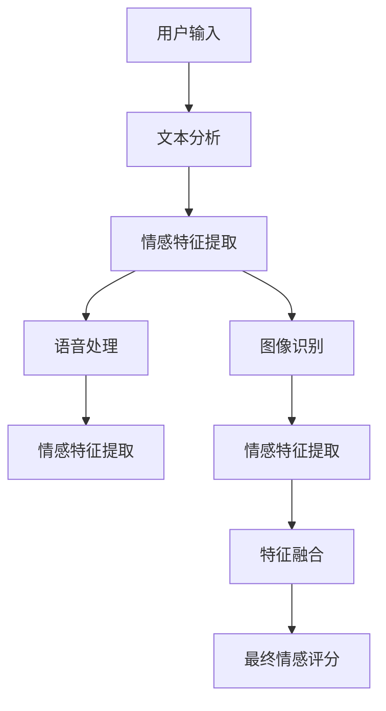
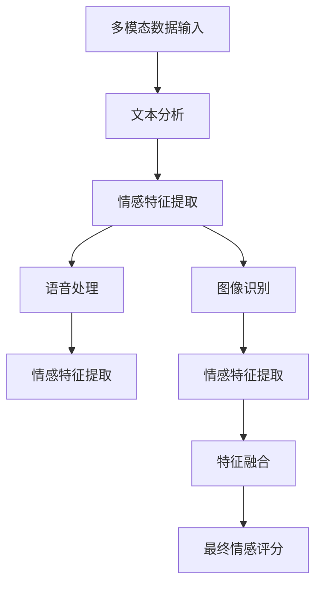
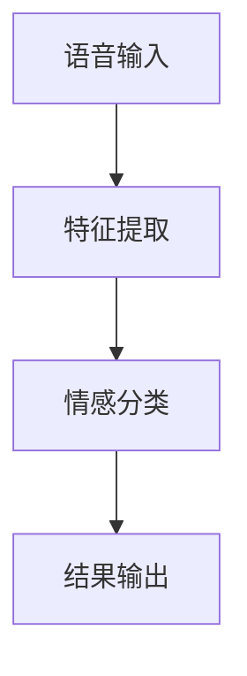
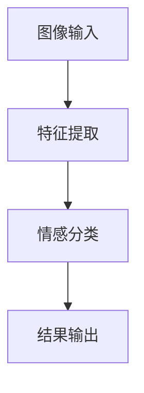
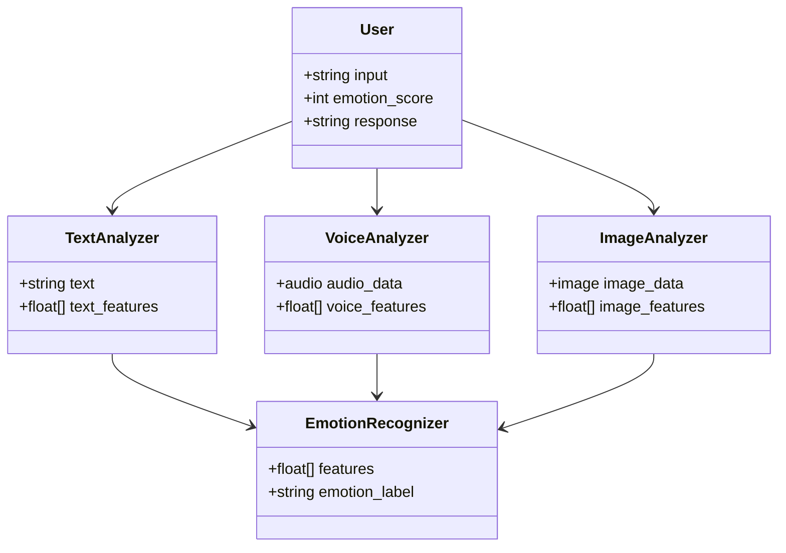
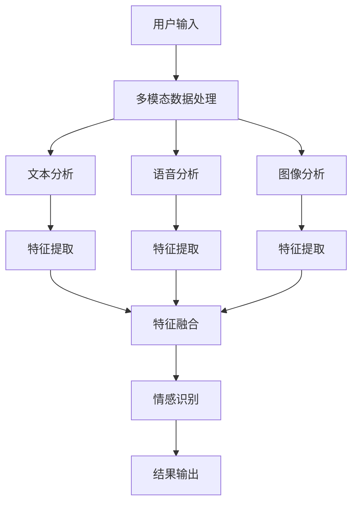
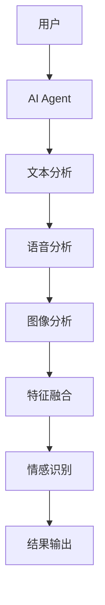

                 


# AI Agent的多模态情感识别技术

> 关键词：AI Agent，多模态情感识别，文本分析，语音处理，图像识别，深度学习，情感计算

> 摘要：本文将详细探讨AI Agent在多模态情感识别技术中的应用。从问题背景到核心概念，从算法原理到系统架构，从项目实战到最佳实践，系统性地分析多模态情感识别技术的实现方法与应用价值。本文旨在为技术从业者提供深入的技术分析与实践指导，帮助读者理解并掌握AI Agent的多模态情感识别技术。

---

## 第一部分: AI Agent的多模态情感识别技术概述

### 第1章: 多模态情感识别技术的背景与应用

#### 1.1 问题背景与问题描述
- **问题背景**：随着人机交互技术的快速发展，情感识别技术逐渐成为AI Agent的核心能力之一。传统的单一模态情感识别（如仅基于文本或仅基于语音）存在信息片面、准确性不足的问题。通过多模态数据的融合，可以显著提升情感识别的准确性和鲁棒性。
- **问题描述**：AI Agent需要能够理解并处理多种模态的数据（如文本、语音、图像等），并基于这些数据准确识别用户的情感状态。多模态情感识别的核心在于如何有效地融合不同模态的信息，并将其转化为可计算的情感特征。

#### 1.2 多模态情感识别的核心概念
- **多模态数据**：指多种类型的数据，包括文本、语音、图像、视频等，这些数据能够从不同的维度反映用户的情感状态。
- **情感识别**：通过分析多模态数据，识别出用户的情感类别（如快乐、悲伤、愤怒等）或情感强度。
- **AI Agent的角色**：作为智能化的代理，AI Agent需要能够实时感知用户的情感状态，并根据情感信息调整其交互策略。

#### 1.3 本章小结
本章从背景和应用的角度介绍了多模态情感识别技术的重要性和必要性，为后续的技术分析奠定了基础。

---

## 第2章: 多模态情感识别的核心概念与联系

### 2.1 多模态数据处理原理
- **文本模态**：通过自然语言处理技术提取文本中的情感特征，常用的方法包括词嵌入（如Word2Vec、BERT）和情感分类模型。
- **语音模态**：通过语音特征提取（如MFCC）和声学模型（如DNN、LSTM）提取语音中的情感特征。
- **图像模态**：通过计算机视觉技术提取图像中的情感特征，常用的方法包括CNN和注意力机制。

#### 2.1.1 多模态数据融合的方法与策略
- **模态权重分配**：不同模态的数据对情感识别的贡献程度不同，需要根据具体场景为每个模态分配适当的权重。
- **特征融合**：将不同模态的特征进行融合，可以采用早期融合（Early Fusion）或晚期融合（Late Fusion）的方法。

#### 2.1.2 实体关系图（ER图）的构建与分析


### 2.2 多模态情感识别的算法原理
- **情感识别的数学模型**：将多模态特征转化为情感评分，公式如下：
$$ 情感评分 = \sum_{i=1}^{n} w_i \cdot f_i $$
其中，$w_i$为模态权重，$f_i$为模态特征值。

- **特征融合的流程图**


### 2.3 本章小结
本章详细介绍了多模态情感识别的核心概念与算法原理，重点分析了多模态数据的融合方法及其对情感识别的影响。

---

## 第3章: 多模态情感识别算法的数学模型与实现

### 3.1 文本模态的情感分析
- **词嵌入与情感分类**：通过预训练语言模型（如BERT）提取文本的语义特征，并基于这些特征进行情感分类。
- **基于Transformer的文本编码**：使用Transformer架构对文本进行编码，捕捉文本中的长距离依赖关系。
- **情感分类的数学模型**
$$ P(y|x) = \frac{e^{x^T w_y}}{\sum_{k} e^{x^T w_k}} $$
其中，$x$为输入特征，$w_y$为对应类别的情感分类权重。

### 3.2 语音模态的情感分析
- **语音特征提取（MFCC）**：将语音信号转换为Mel频率倒谱系数，提取语音的音调、音量等特征。
- **语音情感分类的模型**：基于深度学习模型（如LSTM）对语音特征进行分类，识别语音中的情感状态。
- **语音情感识别的流程图**


### 3.3 图像模态的情感识别
- **图像特征提取（CNN）**：使用卷积神经网络提取图像的视觉特征，捕捉图像中的情感线索。
- **图像情感分类的模型**：基于预训练的图像分类模型（如ResNet）进行情感分类。
- **图像情感识别的流程图**


### 3.4 本章小结
本章从文本、语音和图像三个模态出发，详细分析了情感识别的数学模型与实现方法，为后续的系统设计奠定了基础。

---

## 第4章: 多模态情感识别系统的分析与架构设计

### 4.1 问题场景介绍
- **场景描述**：以智能客服系统为例，AI Agent需要通过分析用户的文本、语音和表情图像，准确识别用户的情感状态，并提供个性化的服务。

### 4.2 系统功能设计
- **领域模型（类图）**


### 4.3 系统架构设计
- **架构图**


### 4.4 系统接口设计
- **接口描述**：
  - 输入接口：接收用户的文本、语音和图像数据。
  - 输出接口：返回用户的情感评分和情感标签。

### 4.5 系统交互流程图


### 4.6 本章小结
本章通过系统分析与架构设计，详细描述了多模态情感识别系统的实现方案，为后续的项目实战提供了理论支持。

---

## 第5章: 多模态情感识别技术的项目实战

### 5.1 环境安装与配置
- **工具与库的安装**：
  - Python 3.8+
  - TensorFlow 2.5+
  - PyTorch 1.9+
  - librosa、scikit-learn、OpenCV

### 5.2 系统核心实现源代码
```python
import numpy as np
from tensorflow.keras.models import Model
from tensorflow.keras.layers import Input, Dense, concatenate

# 文本模态特征提取
text_input = Input(shape=(100,))  # 假设输入为100维的词嵌入
text_features = Dense(64, activation='relu')(text_input)

# 语音模态特征提取
voice_input = Input(shape=(20,))  # 假设输入为20维的MFCC特征
voice_features = Dense(32, activation='relu')(voice_input)

# 图像模态特征提取
image_input = Input(shape=(3, 128, 128))  # 假设输入为128x128的RGB图像
image_features = Dense(32, activation='relu')(Flatten()(image_input))

# 特征融合
merged = concatenate([text_features, voice_features, image_features])

# 情感分类
output = Dense(1, activation='sigmoid')(merged)

model = Model(inputs=[text_input, voice_input, image_input], outputs=output)
model.compile(optimizer='adam', loss='binary_crossentropy', metrics=['accuracy'])
```

### 5.3 代码应用解读与分析
- **代码功能解读**：上述代码定义了一个多模态情感识别模型，分别对文本、语音和图像模态进行特征提取，并将特征进行融合后进行情感分类。
- **模型训练与推理**：在实际应用中，需要将模型与具体的数据输入接口连接，进行训练和推理。

### 5.4 实际案例分析
- **案例描述**：假设用户输入了一段带有语音和表情图像的文本，模型需要识别用户的总体情感状态。
- **详细分析**：通过特征提取和融合，模型能够从文本、语音和图像中提取情感信息，并最终输出情感评分。

### 5.5 本章小结
本章通过项目实战，详细展示了多模态情感识别技术的实现过程，帮助读者理解技术的落地应用。

---

## 第6章: 多模态情感识别技术的最佳实践

### 6.1 小结
- **多模态情感识别技术的核心在于如何有效地融合不同模态的信息**。
- **在实际应用中，需要根据具体场景调整模态权重和融合策略**。

### 6.2 注意事项
- **数据质量**：多模态数据的采集和预处理是关键，需确保数据的准确性和完整性。
- **模型泛化能力**：需要在训练过程中防止过拟合，通过数据增强和模型优化提升泛化能力。
- **计算资源**：多模态情感识别通常需要大量的计算资源，需合理配置硬件资源。

### 6.3 拓展阅读
- 推荐阅读《Deep Learning for Multimodal Data Analysis》和《Affect Computing: A Machine Learning Perspective》。

### 6.4 本章小结
本章总结了多模态情感识别技术的关键点，并提供了实际应用中的注意事项和拓展阅读建议。

---

## 作者信息

作者：AI天才研究院/AI Genius Institute & 禅与计算机程序设计艺术 /Zen And The Art of Computer Programming

---

**注**：以上内容仅为文章的目录大纲和部分章节内容，实际文章需要根据具体要求进一步扩展和完善。

