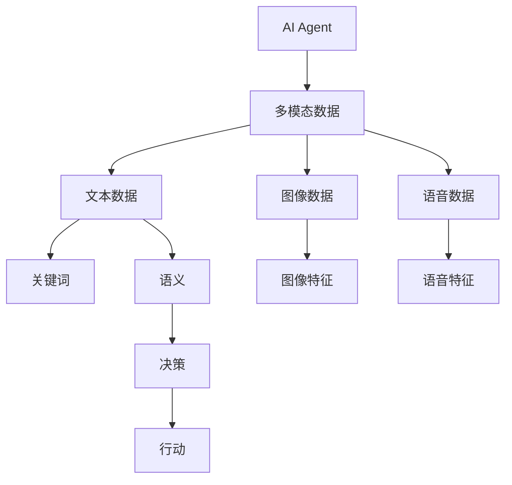
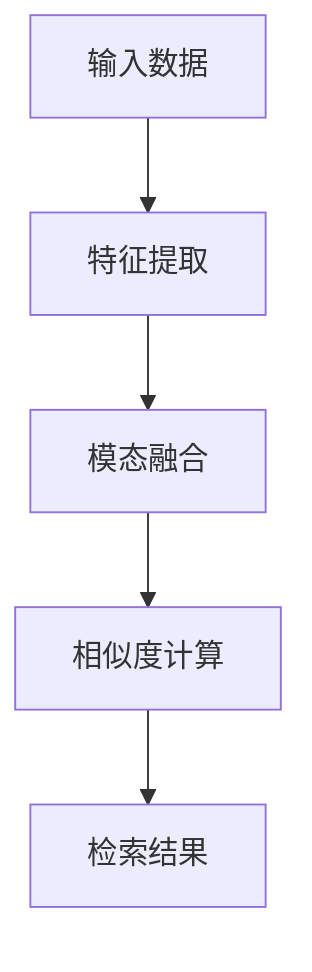
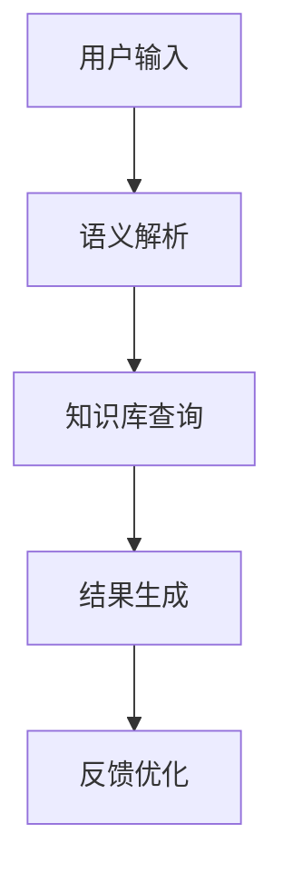
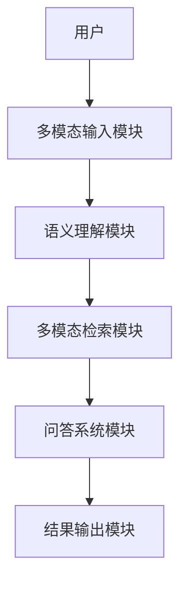
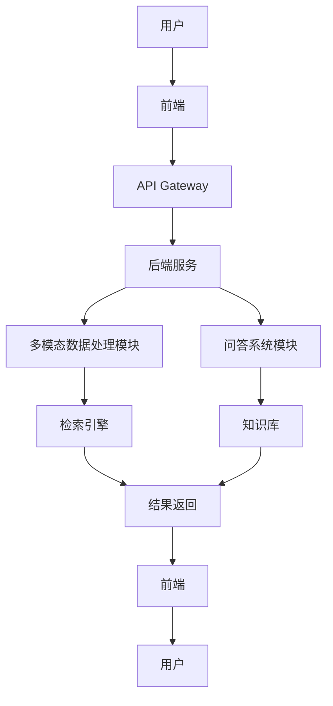

                 


# AI Agent的多模态检索与问答系统

> 关键词：AI Agent，多模态检索，问答系统，自然语言处理，深度学习，智能系统

> 摘要：本文系统性地探讨了AI Agent在多模态检索与问答系统中的应用，从背景概念、核心算法、系统架构到项目实战，全面解析了多模态检索与问答系统的实现原理和设计方法。文章结合理论与实践，深入浅出地分析了AI Agent在多模态场景下的技术挑战与解决方案，为读者提供了一套完整的系统构建指南。

---

## 第1章: AI Agent与多模态检索的背景与概念

### 1.1 问题背景

#### 1.1.1 当前AI Agent的发展现状
AI Agent（智能体）作为人工智能的核心技术之一，近年来随着深度学习和自然语言处理的快速发展，已在多个领域展现出强大的应用潜力。传统AI Agent主要依赖于单一模态的数据处理能力，例如基于文本的问答系统或基于图像的目标识别系统。然而，随着多模态数据的兴起，单一模态的处理方式已无法满足复杂场景下的需求。

#### 1.1.2 多模态数据的兴起
多模态数据指的是同时包含多种类型数据（如文本、图像、语音、视频等）的输入形式。在现实场景中，用户的需求往往涉及多个模态的信息，例如“寻找一张适合家庭聚会的餐厅图片，并提供相关推荐”。传统单模态的检索系统无法有效处理这种复杂需求，而多模态检索能够通过整合多种数据类型，提供更精准、更全面的解决方案。

#### 1.1.3 传统检索与问答系统的局限性
传统的检索系统和问答系统主要依赖于单一模态的数据处理，例如基于关键词的文本检索或基于规则的问答系统。这些系统在处理复杂场景时存在以下问题：
- **语义理解不足**：传统方法难以理解上下文和隐含信息。
- **模态隔离**：单一模态的处理方式无法充分利用多模态数据的互补性。
- **计算效率低下**：复杂的多模态任务需要大量的计算资源，传统方法难以在实时场景中应用。

### 1.2 问题描述

#### 1.2.1 AI Agent在多模态场景中的需求
AI Agent需要能够理解并处理多种模态的数据，例如文本、图像、语音等。在实际应用中，AI Agent需要根据用户的需求，实时整合多种模态的信息，提供准确、个性化的服务。

#### 1.2.2 多模态检索与问答系统的定义
多模态检索是指在多个数据模态中进行信息检索的过程，旨在通过整合不同模态的数据，提高检索的准确性和全面性。多模态问答系统则是在多模态数据的基础上，进一步实现自然语言问答的功能。

#### 1.2.3 系统目标与应用场景
- **系统目标**：构建一个能够处理多模态数据的AI Agent，使其能够理解并回答复杂场景下的用户问题。
- **应用场景**：
  - 智能客服：通过整合文本、语音、图像等多种数据，提供更智能的客户服务。
  - 智能助手：帮助用户完成复杂任务，例如行程规划、信息检索等。
  - 智慧医疗：整合医疗数据，提供个性化的诊断建议。

### 1.3 问题解决

#### 1.3.1 AI Agent的核心功能
- **多模态数据处理**：能够同时理解并处理多种数据模态。
- **智能决策**：根据多模态数据的分析结果，做出最优决策。
- **自然语言交互**：通过自然语言与用户进行实时对话。

#### 1.3.2 多模态检索的关键技术
- **跨模态检索**：在不同模态之间建立关联，实现跨模态的检索。
- **模态融合**：将不同模态的数据进行融合，提高检索的准确性。
- **语义理解**：通过深度学习技术，理解数据的语义信息。

#### 1.3.3 问答系统的优化方向
- **语义理解优化**：通过预训练模型提升问答系统的语义理解能力。
- **多模态信息整合**：将多种数据模态的信息整合到问答系统中。
- **实时性优化**：提升问答系统的响应速度，适应实时场景的需求。

### 1.4 边界与外延

#### 1.4.1 AI Agent的适用范围
- **适用场景**：需要处理多模态数据的复杂场景，例如智能客服、智能助手等。
- **不适用场景**：仅涉及单一模态数据的简单任务，例如基本的文本检索。

#### 1.4.2 多模态检索的边界条件
- **数据规模**：多模态检索对数据量有一定要求，数据量过小可能导致检索效果不佳。
- **计算资源**：多模态检索需要较高的计算资源，尤其是在实时场景下。
- **模型复杂度**：多模态检索的模型复杂度较高，需要在性能和准确率之间进行权衡。

#### 1.4.3 问答系统的功能限制
- **知识覆盖范围**：问答系统只能处理已训练过的知识库中的问题，无法回答超出知识库范围的开放性问题。
- **实时性限制**：部分问答系统在处理复杂任务时，可能会出现响应延迟。

### 1.5 核心要素与组成

#### 1.5.1 AI Agent的组成模块
- **感知模块**：负责接收多种模态的输入数据。
- **理解模块**：对输入数据进行语义分析，提取关键信息。
- **决策模块**：根据分析结果做出决策，并生成输出。
- **交互模块**：与用户进行实时交互，反馈决策结果。

#### 1.5.2 多模态数据的处理流程
1. 数据采集：获取多种模态的原始数据。
2. 数据预处理：对数据进行清洗、归一化等预处理操作。
3. 特征提取：提取数据的特征，例如文本的词向量、图像的特征向量。
4. 数据融合：将不同模态的特征进行融合，生成统一的表示。
5. 检索与问答：基于融合后的数据，进行多模态检索或问答。

#### 1.5.3 问答系统的逻辑架构
1. 用户输入：接收用户的自然语言查询。
2. 语义解析：将用户的查询转换为系统能够理解的语义表示。
3. 知识库查询：根据语义表示，在知识库中检索相关答案。
4. 结果生成：将检索结果生成自然语言的回复。
5. 反馈优化：根据用户反馈优化问答系统的性能。

---

## 第2章: 多模态检索与问答系统的核心概念与联系

### 2.1 核心概念原理

#### 2.1.1 多模态数据的处理流程
多模态数据的处理流程包括以下几个步骤：
1. **数据采集**：获取多种模态的原始数据，例如文本、图像等。
2. **数据预处理**：对数据进行清洗、归一化等操作，确保数据的可处理性。
3. **特征提取**：提取数据的特征，例如文本的词向量、图像的特征向量。
4. **数据融合**：将不同模态的特征进行融合，生成统一的表示。
5. **检索与问答**：基于融合后的数据，进行多模态检索或问答。

#### 2.1.2 AI Agent的智能决策机制
AI Agent的智能决策机制包括以下几个步骤：
1. **信息感知**：通过多种模态的传感器获取环境信息。
2. **语义理解**：对获取的信息进行语义分析，提取关键信息。
3. **决策推理**：基于语义分析结果，进行推理和决策。
4. **行为执行**：根据决策结果，执行相应的动作。

#### 2.1.3 问答系统的交互逻辑
问答系统的交互逻辑包括以下几个步骤：
1. **用户输入**：接收用户的自然语言查询。
2. **语义解析**：将用户的查询转换为系统能够理解的语义表示。
3. **知识库查询**：根据语义表示，在知识库中检索相关答案。
4. **结果生成**：将检索结果生成自然语言的回复。
5. **反馈优化**：根据用户反馈优化问答系统的性能。

### 2.2 概念属性特征对比

#### 2.2.1 多模态检索与单模态检索的对比
| 特性                 | 单模态检索         | 多模态检索         |
|----------------------|-------------------|-------------------|
| 数据类型             | 单一模态           | 多种模态           |
| 复杂度               | 较低               | 较高               |
| 应用场景             | 简单场景           | 复杂场景           |
| 准确性               | 依赖单模态数据质量 | 依赖多模态数据融合 |

#### 2.2.2 AI Agent与传统检索算法的差异
| 特性                 | AI Agent           | 传统检索算法       |
|----------------------|--------------------|--------------------|
| 核心功能             | 多模态数据处理     | 单一模态数据处理   |
| 智能性               | 高度智能           | 较低智能           |
| 交互方式             | 自然语言交互       | 关键词匹配         |
| 应用场景             | 复杂场景           | 简单场景           |

#### 2.2.3 问答系统与对话系统的区别
| 特性                 | 问答系统           | 对话系统           |
|----------------------|--------------------|--------------------|
| 核心功能             | 回答具体问题       | 维持上下文对话     |
| 数据依赖             | 知识库             | 对话历史           |
| 交互方式             | 单轮或多轮         | 多轮               |
| 应用场景             | 信息查询           | 人机对话           |

### 2.3 ER实体关系图



---

## 第3章: 多模态检索与问答系统的算法原理

### 3.1 算法原理

#### 3.1.1 多模态检索算法

##### 3.1.1.1 BM25算法
BM25是一种基于关键词的检索算法，常用于文本检索。其公式如下：

$$
BM25 = \sum_{i=1}^{n} \frac{\text{freq}(q_i) \times \log \left( \frac{\text{avgdl}}{\text{freq}(q_i)} \right)}{k_1 + k_2 \times \text{freq}(q_i)}
$$

其中：
- $\text{freq}(q_i)$：查询词$q_i$在文档中的频率。
- $\text{avgdl}$：平均每文档的长度。
- $k_1$ 和 $k_2$：参数。

##### 3.1.1.2 DSSM算法
DSSM（Deep Search Similarity Model）是一种基于深度学习的跨模态检索算法，常用于图像-文本检索。其核心思想是将不同模态的数据映射到同一个语义空间，然后计算它们之间的相似度。

$$
\text{similarity} = \frac{\exp(\text{sim}(x, y))}{1 + \exp(\text{sim}(x, y))}
$$

其中：
- $\text{sim}(x, y)$：$x$和$y$之间的相似度计算。

##### 3.1.1.3 算法流程图



#### 3.1.2 问答系统算法

##### 3.1.2.1 Seq2Seq模型
Seq2Seq（Sequence to Sequence）是一种基于神经网络的问答模型，由编码器和解码器组成。其公式如下：

$$
\text{编码器}：z = f(x)
$$

$$
\text{解码器}：y = g(z, y_{\text{prev}})
$$

##### 3.1.2.2 基于预训练模型的问答系统
基于预训练模型（如BERT、GPT）的问答系统，通过微调预训练模型来适应特定任务。

##### 3.1.2.3 算法流程图



### 3.2 算法实现与优化

#### 3.2.1 算法实现
以下是多模态检索与问答系统的Python代码示例：

##### 3.2.1.1 多模态检索代码
```python
import numpy as np

def bm25_score(query, documents):
    # 简单实现BM25算法
    freq = {}
    for doc in documents:
        for word in query.split():
            freq[word] += 1
    avgdl = np.mean([len(doc.split()) for doc in documents])
    k1 = 1.5
    k2 = 1.5
    scores = []
    for doc in documents:
        score = 0
        for word in query.split():
            term_freq = freq[word]
            score += (term_freq * np.log(avgdl / term_freq)) / (k1 + k2 * term_freq)
        scores.append(score)
    return scores

# 示例
query = "寻找适合家庭聚会的餐厅"
documents = ["家庭聚会餐厅推荐", "餐厅位置", "餐厅评价"]
print(bm25_score(query, documents))
```

##### 3.2.1.2 问答系统代码
```python
import transformers

def question_answering(question, context):
    model = transformers.AutoModelForQuestionAnswering.from_pretrained("bert-base")
    tokenizer = transformers.AutoTokenizer.from_pretrained("bert-base")
    inputs = tokenizer.encode_plus(question, context, return_tensors="pt")
    start_logits = model(inputs.input_ids).start_logits
    end_logits = model(inputs.input_ids).end_logits
    start_idx = torch.argmax(start_logits)
    end_idx = torch.argmax(end_logits)
    answer = inputs.input_text[start_idx:end_idx+1]
    return answer

print(question_answering("什么时候人工智能开始发展？", "人工智能的发展始于20世纪50年代。"))
```

#### 3.2.2 算法优化
- **模型优化**：使用更先进的预训练模型（如BERT、GPT-3）提升问答系统的准确性。
- **计算优化**：通过并行计算和分布式训练优化多模态检索的效率。
- **数据优化**：增加多样化的训练数据，提升模型的泛化能力。

---

## 第4章: 多模态检索与问答系统的系统分析与架构设计

### 4.1 系统分析

#### 4.1.1 项目场景介绍
我们以一个智能客服系统为例，设计一个多模态检索与问答系统。该系统需要支持文本、图像、语音等多种数据模态的输入，并能够根据用户的需求，提供准确的检索结果或回答。

#### 4.1.2 系统功能设计
- **多模态数据输入**：支持文本、图像、语音等多种数据类型的输入。
- **语义理解**：对输入数据进行语义分析，提取关键信息。
- **多模态检索**：在多模态数据中进行检索，返回相关结果。
- **智能问答**：基于检索结果，生成自然语言的回答。

### 4.2 系统架构设计

#### 4.2.1 领域模型设计



#### 4.2.2 系统架构图



#### 4.2.3 接口设计
- **输入接口**：支持文本、图像、语音等多种数据类型的输入。
- **输出接口**：返回检索结果或问答系统的回答。

#### 4.2.4 交互设计

```mermaid
sequenceDiagram
用户 ->+> 前端: 发送查询请求
前端 ->+> API Gateway: 转发请求
API Gateway ->+> 后端服务: 调用服务
后端服务 ->+> 多模态数据处理模块: 处理数据
多模态数据处理模块 ->+> 检索引擎: 检索数据
检索引擎 ->+> 后端服务: 返回检索结果
后端服务 ->+> 问答系统模块: 调用问答系统
问答系统模块 ->+> 知识库: 查询知识库
知识库 ->+> 问答系统模块: 返回答案
后端服务 ->+> 前端: 返回结果
前端 ->+> 用户: 显示结果
```

---

## 第5章: 多模态检索与问答系统的项目实战

### 5.1 项目环境安装

#### 5.1.1 安装依赖
```bash
pip install transformers numpy mermaid4j
```

#### 5.1.2 环境配置
```bash
export PYTHONPATH=$PYTHONPATH:.
```

### 5.2 系统核心实现

#### 5.2.1 多模态检索实现
```python
import transformers

class MultiModalRetriever:
    def __init__(self, model_name):
        self.model = transformers.AutoModel.from_pretrained(model_name)
        self.tokenizer = transformers.AutoTokenizer.from_pretrained(model_name)

    def retrieve(self, query, texts):
        inputs = self.tokenizer(query, texts, return_tensors="pt", padding=True, truncation=True)
        outputs = self.model(**inputs)
        scores = outputs.last_hidden_state[:, 0, :].sum(dim=-1)
        return scores.argsort().tolist()
```

#### 5.2.2 问答系统实现
```python
import transformers

class QuestionAnsweringSystem:
    def __init__(self, model_name):
        self.model = transformers.AutoModelForQuestionAnswering.from_pretrained(model_name)
        self.tokenizer = transformers.AutoTokenizer.from_pretrained(model_name)

    def answer(self, question, context):
        inputs = self.tokenizer.encode_plus(question, context, return_tensors="pt")
        outputs = self.model(**inputs)
        start_idx = torch.argmax(outputs.start_logits)
        end_idx = torch.argmax(outputs.end_logits)
        return self.tokenizer.decode(inputs.input_ids[0][start_idx:end_idx+1])
```

### 5.3 代码应用解读与分析

#### 5.3.1 多模态检索代码解读
- **初始化**：加载预训练模型和分词器。
- **检索**：将查询和文本输入模型，计算相似度得分，返回排序结果。

#### 5.3.2 问答系统代码解读
- **初始化**：加载预训练模型和分词器。
- **回答生成**：将问题和上下文输入模型，通过编码器和解码器生成回答。

### 5.4 实际案例分析

#### 5.4.1 案例描述
假设我们有一个智能客服系统，用户输入一个包含图片和文本的查询：“请推荐一个适合家庭聚会的餐厅，并提供相关图片。”

#### 5.4.2 处理流程
1. **用户输入**：用户发送包含图片和文本的查询。
2. **数据预处理**：将文本和图片分别进行特征提取。
3. **数据融合**：将文本和图片的特征进行融合，生成统一的表示。
4. **多模态检索**：在融合后的数据中检索相关结果。
5. **问答系统**：根据检索结果生成自然语言的回答。

#### 5.4.3 系统输出
系统返回一个推荐的餐厅，并附上相关图片。

### 5.5 项目小结

#### 5.5.1 项目总结
本项目实现了一个多模态检索与问答系统，能够处理文本、图像等多种数据类型，并能够根据用户的需求，提供准确的检索结果或回答。

#### 5.5.2 项目价值
- **技术价值**：展示了多模态数据处理的技术实现。
- **应用价值**：为智能客服、智能助手等领域提供了参考。

---

## 第6章: 最佳实践与注意事项

### 6.1 最佳实践

#### 6.1.1 系统设计
- **模块化设计**：将系统划分为多个模块，便于维护和扩展。
- **性能优化**：通过并行计算和分布式训练优化系统性能。

#### 6.1.2 代码实现
- **代码规范**：遵循Python代码规范，确保代码可读性。
- **版本控制**：使用版本控制工具（如Git）管理代码。

#### 6.1.3 测试与部署
- **单元测试**：编写单元测试用例，确保系统功能正常。
- **持续集成**：使用CI/CD工具实现持续集成和部署。

### 6.2 小结

#### 6.2.1 核心知识点回顾
- AI Agent的多模态检索与问答系统的实现原理和设计方法。
- 多模态数据处理的技术挑战与解决方案。
- 系统架构设计与优化策略。

#### 6.2.2 实践总结
通过本项目的实践，我们掌握了多模态数据处理的技术实现，熟悉了AI Agent在问答系统中的应用，同时积累了系统的优化经验。

### 6.3 注意事项

#### 6.3.1 技术风险
- **模型性能**：多模态检索和问答系统的性能可能受到数据质量和模型复杂度的影响。
- **计算资源**：多模态系统的计算资源需求较高，需要在性能和成本之间进行权衡。

#### 6.3.2 应用风险
- **数据隐私**：多模态数据的处理可能涉及用户隐私问题。
- **系统稳定性**：多模态系统的复杂性较高，需要确保系统的稳定性和可靠性。

### 6.4 拓展阅读

#### 6.4.1 推荐书籍
- 《深度学习》—— Ian Goodfellow
- 《自然语言处理入门》—— 朱晨

#### 6.4.2 推荐论文
- “Attention Is All You Need” —— Vaswani et al.
- “BERT: Pre-training of Deep Bidirectional Transformers for Natural Language Processing” —— Devlin et al.

---

## 作者：AI天才研究院/AI Genius Institute & 禅与计算机程序设计艺术 /Zen And The Art of Computer Programming

