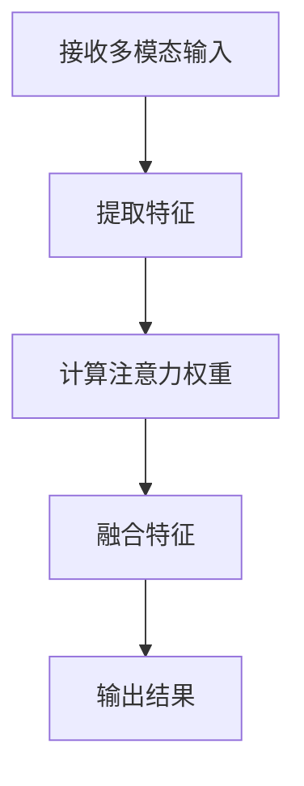
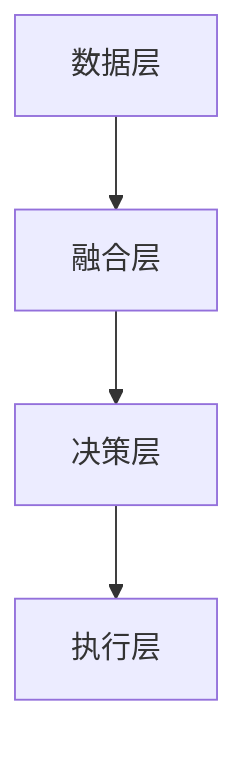

                 


# AI Agent的多模态理解：整合LLM与传感器数据

> 关键词：AI Agent, 多模态理解, LLM, 传感器数据, 数据融合, 人工智能, 多模态模型

> 摘要：本文探讨了AI Agent在多模态理解中的应用，重点分析了如何整合大型语言模型（LLM）与传感器数据，通过多模态数据融合算法提升AI Agent的感知与决策能力。文章从背景、核心概念、算法原理、系统架构到项目实战，全面解析了AI Agent多模态理解的实现过程，并提供了丰富的案例与代码示例。

---

## 第一部分：背景与概念

### 第1章：AI Agent与多模态理解概述

#### 1.1 AI Agent的基本概念
AI Agent（人工智能代理）是一种能够感知环境、执行任务并做出决策的智能系统。它通过接收输入数据、处理信息、执行操作来实现目标。AI Agent广泛应用于智能助手、自动驾驶、机器人、推荐系统等领域。

#### 1.2 多模态理解的重要性
多模态理解是指AI Agent能够同时处理和理解多种类型的数据，如文本、图像、语音、传感器数据等。多模态数据的整合能够提升AI Agent的感知能力，使其能够更好地理解复杂环境并做出准确决策。

#### 1.3 LLM与传感器数据的整合背景
近年来，大型语言模型（LLM）如GPT-3、GPT-4在自然语言处理领域取得了显著进展。然而，LLM主要依赖文本数据，缺乏对物理环境的感知能力。通过整合传感器数据，AI Agent能够将LLM的语义理解能力与传感器数据的物理感知能力结合，实现更强大的多模态理解。

---

### 第2章：AI Agent、LLM与传感器数据的关系

#### 2.1 核心概念原理
AI Agent通过整合LLM和传感器数据，能够实现对复杂环境的多模态理解。LLM负责处理文本信息，传感器数据提供环境中的物理信息，两者结合使AI Agent能够更好地理解上下文并做出决策。

#### 2.2 概念属性特征对比表
| 概念 | 定义 | 特征 | 作用 |
|------|------|------|------|
| AI Agent | 智能系统，能够感知环境、执行任务 | 多模态输入、自主决策、动态响应 | 实现复杂任务的自动化与智能化 |
| LLM | 大型语言模型，处理文本信息 | 高精度语义理解、生成能力、上下文依赖 | 提供语义理解与文本生成能力 |
| 传感器数据 | 来自环境的物理信号 | 实时性、多样性、连续性 | 提供环境中的物理信息 |

#### 2.3 ER实体关系图
```mermaid
er
actor(AI Agent) -[接收输入]-> sensor_data(传感器数据)
actor(LLM) -[处理文本]-> text_output(文本输出)
actor(AI Agent) -[整合输入]-> multi_modal_input(多模态输入)
actor(AI Agent) -[做出决策]-> action(执行操作)
```

---

## 第二部分：算法原理与数学模型

### 第3章：多模态数据融合算法

#### 3.1 多模态数据融合方法
多模态数据融合算法的核心目标是将来自不同模态的数据进行有效整合，以提升AI Agent的感知与理解能力。常用的方法包括特征提取与注意力机制。

#### 3.2 算法mermaid流程图


#### 3.3 数学模型与公式
注意力机制是多模态数据融合的重要方法。假设我们有多个模态的特征表示，注意力机制通过计算每个模态的权重来实现特征的加权融合。

公式3.1：注意力权重计算
$$
\alpha_i = \frac{\exp(e_i)}{\sum_{j} \exp(e_j)}
$$

公式3.2：融合后的结果计算
$$
y = \sum_{i=1}^{n} \alpha_i x_i
$$

其中，$e_i$是第$i$个模态的特征向量，$x_i$是对应的原始特征，$\alpha_i$是注意力权重，$y$是融合后的结果。

#### 3.4 举例说明
假设我们有一个AI Agent需要同时处理图像和文本数据。图像特征$x_1$和文本特征$x_2$通过注意力机制进行融合：
$$
\alpha_1 = \frac{\exp(e_1)}{\exp(e_1) + \exp(e_2)}, \quad \alpha_2 = \frac{\exp(e_2)}{\exp(e_1) + \exp(e_2)}
$$
融合后的结果为：
$$
y = \alpha_1 x_1 + \alpha_2 x_2
$$

---

## 第三部分：系统分析与架构设计

### 第4章：AI Agent的系统架构

#### 4.1 系统功能设计
AI Agent的系统功能模块包括：
1. 数据采集模块：接收来自传感器的物理数据和LLM的文本数据。
2. 数据融合模块：对多模态数据进行特征提取和注意力权重计算，生成融合结果。
3. 决策与执行模块：基于融合结果做出决策，并执行相应操作。

#### 4.2 系统架构设计
AI Agent的系统架构采用分层设计，包括数据层、融合层和决策层。

图4.1：系统架构图


#### 4.3 接口与交互设计
系统接口设计包括传感器数据接口、LLM接口和决策模块接口。

图4.2：系统交互序列图
```mermaid
sequenceDiagram
actor(AI Agent) ->+> sensor: 获取传感器数据
sensor -->+> AI Agent: 返回传感器数据
AI Agent ->+> LLM: 获取文本数据
LLM -->+> AI Agent: 返回文本数据
AI Agent ->+> 决策模块: 进行数据融合与决策
决策模块 -->+> AI Agent: 返回执行指令
AI Agent ->+> 执行模块: 执行操作
```

---

## 第四部分：项目实战

### 第5章：AI Agent的实现与应用

#### 5.1 环境安装
1. 安装Python和相关库：
   ```bash
   pip install numpy tensorflow pandas
   ```
2. 安装LLM框架（以Hugging Face为例）：
   ```bash
   pip install transformers
   ```

#### 5.2 核心代码实现
代码5.1：数据融合模块的实现
```python
import numpy as np
from transformers import AutoTokenizer, AutoModel

# 加载预训练模型
tokenizer = AutoTokenizer.from_pretrained("bert-base-uncased")
model = AutoModel.from_pretrained("bert-base-uncased")

# 示例传感器数据
sensor_data = np.array([1.0, 2.0, 3.0])

# 示例文本数据
text = "The temperature is high."

# 获取文本特征
inputs = tokenizer(text, return_tensors="np")
outputs = model(**inputs)
text_features = outputs.last_hidden_state.numpy()

# 注意力机制计算
attention_weights = np.exp(text_features[:, 0, :]) / np.sum(np.exp(text_features[:, 0, :]), axis=1, keepdims=True)

# 数据融合
fused_features = np.concatenate((sensor_data.reshape(1, -1), attention_weights), axis=1)
```

#### 5.3 实际案例分析
案例5.1：智能机器人多模态理解的应用
假设一个智能机器人需要同时处理温度传感器数据和用户指令。传感器数据为当前环境温度，用户指令为“请调整室温”。机器人通过融合温度数据和用户指令，做出调整室温的决策。

---

## 第五部分：最佳实践与拓展

### 第6章：AI Agent的

---

**作者：AI天才研究院 & 禅与计算机程序设计艺术**

