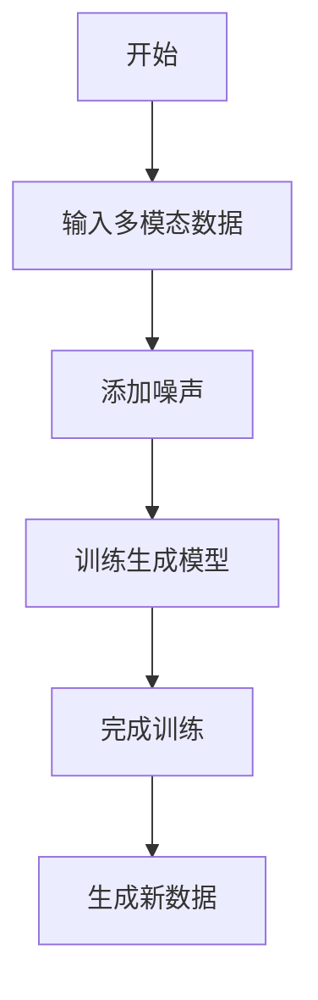
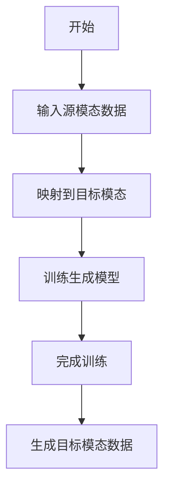
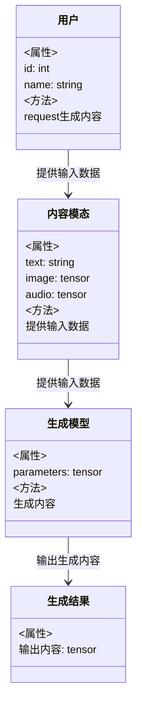
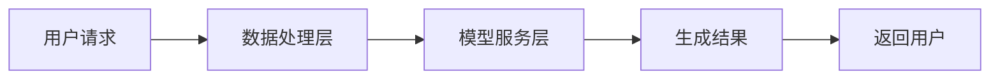
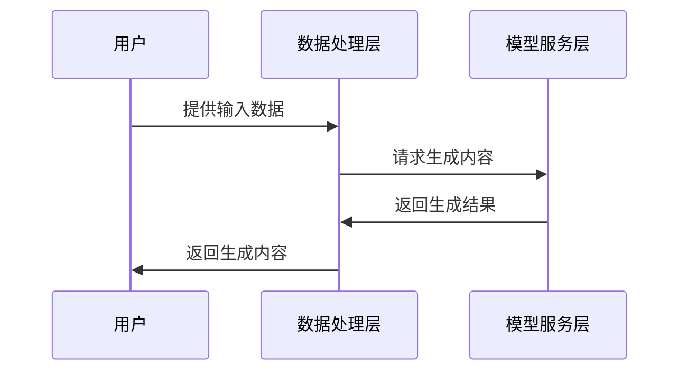

                 


# AI Agent的多模态生成：创造跨媒体内容

## 关键词：AI Agent，多模态生成，跨媒体内容，扩散模型，生成模型，系统架构

## 摘要

AI Agent的多模态生成技术是实现跨媒体内容创作的核心，本文将深入探讨多模态生成的基本概念、算法原理、系统架构以及实际项目案例。通过详细讲解扩散模型和转换模型，分析系统设计，并提供代码示例和案例解读，帮助读者全面理解AI Agent在跨媒体内容生成中的应用。

---

# 第一部分: AI Agent的多模态生成基础

## 第1章: AI Agent与多模态生成概述

### 1.1 AI Agent的基本概念

#### 1.1.1 AI Agent的定义与分类
AI Agent（智能体）是指能够感知环境并采取行动以实现目标的智能系统。根据功能和应用的不同，AI Agent可以分为简单反射型、基于模型的反射型、目标驱动型和实用驱动型。

#### 1.1.2 多模态生成的定义与特点
多模态生成指的是AI Agent能够同时处理和生成多种数据模态（如文本、图像、音频、视频）的能力。其特点包括跨模态关联性、生成多样性以及内容一致性。

#### 1.1.3 跨媒体内容的定义与应用场景
跨媒体内容是指整合多种数据模态的信息，提供更丰富用户体验的内容形式。应用场景包括智能客服、虚拟助手、内容创作工具等。

### 1.2 多模态生成的必要性

#### 1.2.1 多模态数据的特点与优势
多模态数据通过结合多种信息源，能够提供更全面的上下文，增强生成内容的准确性和丰富性。

#### 1.2.2 跨媒体内容生成的意义
跨媒体内容生成能够提升用户体验，增强信息传递效果，并在多个领域中具有广泛的应用潜力。

#### 1.2.3 AI Agent在多模态生成中的角色
AI Agent作为多模态生成的核心，负责协调和管理不同模态的数据生成过程，实现无缝的内容创作。

### 1.3 跨媒体内容生成的核心要素

#### 1.3.1 数据模态的多样性
多模态数据包括文本、图像、音频、视频等，每种模态都有其独特的特征和优势。

#### 1.3.2 生成模型的跨模态能力
生成模型需要具备处理和融合多种数据模态的能力，以实现跨媒体内容的生成。

#### 1.3.3 跨媒体内容的应用场景
跨媒体内容广泛应用于智能客服、虚拟助手、内容创作工具等领域，提供多样化的信息呈现方式。

## 第2章: 多模态生成的核心概念与联系

### 2.1 多模态生成的核心概念

#### 2.1.1 多模态数据的结构化表示
多模态数据可以通过结构化的数据表示方法，如图结构或向量表示，以便于生成模型的处理。

#### 2.1.2 跨媒体内容生成的流程
跨媒体内容生成通常包括数据输入、特征提取、多模态融合、内容生成和结果输出几个步骤。

#### 2.1.3 AI Agent的生成机制
AI Agent通过多模态数据的输入，利用生成模型生成跨媒体内容，并通过反馈机制优化生成效果。

### 2.2 多模态生成的属性特征对比

| 特性       | 文本模态       | 图像模态       | 音频模态       |
|------------|---------------|---------------|---------------|
| 表示方式   | 文本字符串     | 图像像素矩阵   | 音频信号波形   |
| 生成难度   | 中等           | 较高           | 中等           |
| 应用场景   | 文本生成、对话 | 图像生成、风格迁移 | 语音合成、语音识别 |

#### 2.2.3 多模态生成的ER实体关系图
```mermaid
er
    图表标题: 多模态生成的ER实体关系图
    entity 用户
    entity 内容模态
    entity 生成模型
    entity 生成结果
    relation 用户 -> 内容模态: 提供输入数据
    relation 用户 -> 生成模型: 发出生成请求
    relation 内容模态 -> 生成模型: 提供输入数据
    relation 生成模型 -> 生成结果: 输出生成内容
```

---

# 第二部分: 多模态生成的算法原理

## 第3章: 多模态生成模型的算法原理

### 3.1 多模态扩散模型

#### 3.1.1 扩散模型的基本原理
扩散模型通过逐步添加噪声并逐步去噪的过程来生成数据。其核心思想是通过正向过程和逆向过程来实现数据的生成。

#### 3.1.2 多模态扩散模型的改进
为了实现多模态生成，扩散模型需要结合多种数据模态的特征，通过联合分布或条件分布的方式进行建模。

#### 3.1.3 多模态扩散模型的训练流



#### 3.1.4 多模态扩散模型的数学模型
多模态扩散模型的目标是通过最大化数据在去噪过程中的条件概率来训练模型。数学表达式如下：
$$
\mathcal{L} = \mathbb{E}_{t,x,y}[\log p_\theta(x_t|y,x_{t-1})]
$$

### 3.2 多模态转换模型

#### 3.2.1 转换模型的基本原理
转换模型通过将源模态的数据映射到目标模态，实现跨模态的内容生成。例如，将文本描述生成图像。

#### 3.2.2 多模态转换模型的改进
为了提高转换效果，可以引入跨模态特征融合、对抗训练等方法，增强模型的表达能力。

#### 3.2.3 多模态转换模型的训练流



#### 3.2.4 多模态转换模型的数学模型
多模态转换模型的目标是最小化源模态和目标模态之间的重建误差。数学表达式如下：
$$
\mathcal{L} = \mathbb{E}_{x,y}[\|f(x) - y\|^2]
$$

### 3.3 多模态生成模型的代码实现

```python
import torch
import torch.nn as nn

class DiffusionModel(nn.Module):
    def __init__(self, hidden_dim=128):
        super(DiffusionModel, self).__init__()
        self.linear = nn.Linear(hidden_dim, hidden_dim)
    
    def forward(self, x, t):
        t = t.unsqueeze(-1).repeat(1, x.size(-1))
        x_t = torch.cat([x, t], dim=1)
        return self.linear(x_t)
```

---

# 第三部分: 多模态生成的系统架构设计

## 第4章: 多模态生成系统的架构与实现

### 4.1 系统功能设计

#### 4.1.1 系统功能概述
多模态生成系统需要具备数据输入、特征提取、多模态融合、内容生成和结果输出等功能。

#### 4.1.2 系统功能的ER类图



### 4.2 系统架构设计

#### 4.2.1 系统架构概述
多模态生成系统通常采用微服务架构，包括数据处理层、模型服务层和应用层。

#### 4.2.2 系统架构的Mermaid图



### 4.3 系统接口设计

#### 4.3.1 接口设计概述
系统需要提供API接口，用于接收输入数据、触发生成过程并返回生成结果。

#### 4.3.2 系统接口的序列图



---

# 第四部分: 项目实战

## 第5章: 多模态生成项目实施

### 5.1 项目环境安装

```bash
pip install torch torchvision
```

### 5.2 项目核心实现

```python
import torch
import torch.nn as nn

class MultiModalGenerator(nn.Module):
    def __init__(self, input_dim, hidden_dim):
        super(MultiModalGenerator, self).__init__()
        self.embedding = nn.Embedding(input_dim, hidden_dim)
        self.linear = nn.Linear(hidden_dim, hidden_dim)
    
    def forward(self, x):
        x_embed = self.embedding(x)
        x_out = self.linear(x_embed)
        return x_out
```

### 5.3 项目案例分析

#### 5.3.1 案例背景
假设我们有一个生成图像的项目，输入是文本描述，输出是对应的图像。

#### 5.3.2 案例实现

```python
generator = MultiModalGenerator(input_dim=100, hidden_dim=128)
criterion = nn.MSELoss()
optimizer = torch.optim.Adam(generator.parameters(), lr=0.001)

for epoch in range(num_epochs):
    for batch in data_loader:
        text_input, image_target = batch
        output = generator(text_input)
        loss = criterion(output, image_target)
        loss.backward()
        optimizer.step()
```

#### 5.3.3 案例分析
通过训练模型，我们可以实现从文本到图像的生成。训练过程中，损失函数逐渐减小，模型生成效果逐渐提升。

### 5.4 项目小结
通过实际项目，我们可以看到多模态生成技术的强大能力。同时，也需要注意模型的训练效率和生成质量的优化。

---

# 第五部分: 扩展与展望

## 第6章: 多模态生成的扩展与展望

### 6.1 研究热点
当前多模态生成的研究热点包括模型的实时性、生成内容的真实性、跨模态的关联性等方面。

### 6.2 未来发展方向
未来，多模态生成技术将更加智能化和个性化，应用场景也将更加广泛。

### 6.3 对AI Agent应用的展望
AI Agent在多模态生成中的应用将推动智能化服务的发展，为用户提供更高效、更个性化的体验。

### 6.4 最佳实践 tips
- 数据处理要充分考虑多模态数据的多样性和复杂性
- 模型优化需要结合实际应用场景进行针对性设计
- 生成内容需要进行严格的质量控制和安全性评估

---

# 作者

作者：AI天才研究院/AI Genius Institute & 禅与计算机程序设计艺术 /Zen And The Art of Computer Programming

