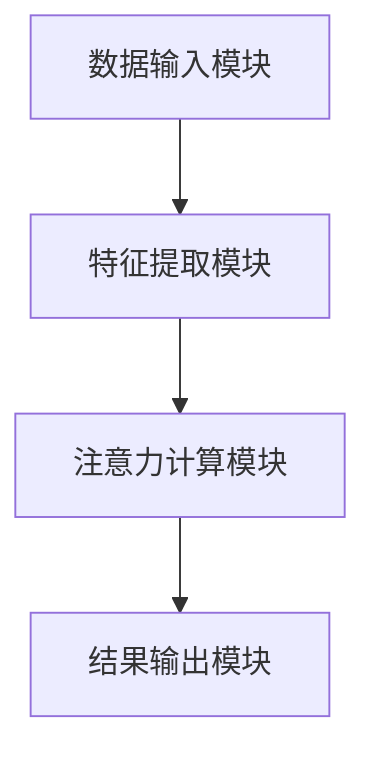
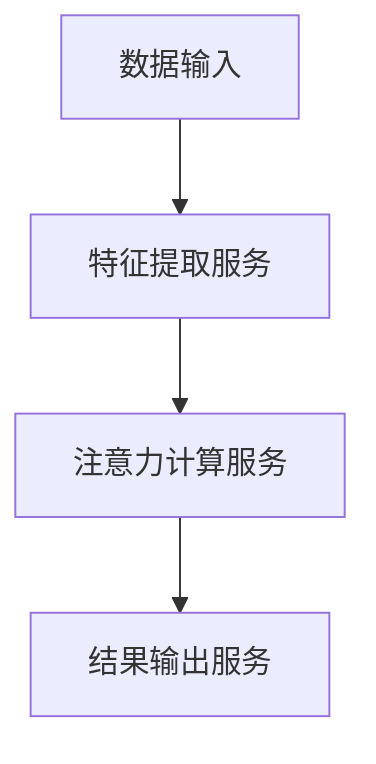

                 


# AI Agent的多模态融合与交叉注意力机制

> 关键词：AI Agent，多模态融合，交叉注意力机制，注意力模型，系统架构

> 摘要：本文详细探讨了AI Agent在多模态数据融合中的应用，重点分析了交叉注意力机制的原理、算法实现及其在多模态数据处理中的优势。通过系统架构设计和项目实战，展示了如何将交叉注意力机制应用于实际场景，并总结了相关的最佳实践和注意事项。

---

## 第一章: AI Agent与多模态融合概述

### 1.1 AI Agent的基本概念

#### 1.1.1 AI Agent的定义与特点
AI Agent（人工智能代理）是指能够感知环境、执行任务并做出决策的智能体。AI Agent的核心特点包括：
- **自主性**：能够在没有外部干预的情况下自主执行任务。
- **反应性**：能够实时感知环境并做出反应。
- **目标导向性**：通过目标驱动行为，优化决策过程。
- **学习能力**：通过数据和经验不断优化自身的性能。

#### 1.1.2 多模态数据的定义与特点
多模态数据指的是来自不同感官或数据源的数据形式，例如文本、图像、语音、视频等。多模态数据的特点包括：
- **多样性**：数据来源多样，能够提供更全面的信息。
- **互补性**：不同模态的数据可以互补，提高信息的理解能力。
- **复杂性**：多模态数据的处理需要复杂的融合方法。

#### 1.1.3 多模态融合的意义与应用场景
多模态融合的意义在于通过整合不同模态的数据，提升AI Agent的感知和决策能力。应用场景包括：
- **计算机视觉**：图像与文本的联合分析。
- **自然语言处理**：多语言或多模态的文本理解。
- **机器人技术**：结合视觉、听觉和触觉信息进行决策。

### 1.2 交叉注意力机制的基本概念

#### 1.2.1 注意力机制的起源与发展
注意力机制起源于神经语言模型的研究，最初用于处理长序列数据中的依赖关系。交叉注意力机制是一种扩展形式，用于跨模态数据的交互与融合。

#### 1.2.2 交叉注意力机制的定义与特点
交叉注意力机制是指在不同的数据模态之间建立交互关系，通过注意力权重来捕获模态间的关联性。其特点包括：
- **跨模态交互**：能够同时处理多种数据模态。
- **灵活性**：适用于多种不同的数据组合。
- **可解释性**：通过注意力权重可以理解模型的决策过程。

#### 1.2.3 交叉注意力机制在多模态融合中的作用
交叉注意力机制能够通过权重分配的方式，突出重要的信息特征，从而提升多模态数据的融合效果。它在以下方面起重要作用：
- **信息提取**：通过注意力机制提取关键信息。
- **特征融合**：将不同模态的特征进行有效融合。
- **任务优化**：通过优化注意力权重提升任务性能。

### 1.3 本章小结
本章介绍了AI Agent的基本概念、多模态数据的定义与特点，以及交叉注意力机制的核心思想。通过这些内容，读者可以理解多模态融合与交叉注意力机制在AI Agent中的重要性。

---

## 第二章: 多模态数据的表示与融合方法

### 2.1 多模态数据的表示方法

#### 2.1.1 文本数据的表示方法
文本数据通常采用词嵌入（如Word2Vec、BERT）或序列模型（如LSTM、Transformer）进行表示。

#### 2.1.2 图像数据的表示方法
图像数据通常采用卷积神经网络（CNN）提取特征，或者使用预训练模型（如ResNet、ViT）进行表示。

#### 2.1.3 其他模态数据的表示方法
其他模态数据（如语音、视频）可以通过特定的模型（如CRNN、3D CNN）进行表示。

### 2.2 多模态融合的常见方法

#### 2.2.1 基于特征融合的方法
特征融合是指将不同模态的特征向量进行线性组合或非线性变换，例如：
$$
f(x) = \sigma(W_x x + b)
$$
其中，$x$ 是输入特征，$W_x$ 是权重矩阵，$b$ 是偏置项。

#### 2.2.2 基于变换融合的方法
变换融合是指通过将不同模态的特征映射到同一个空间，例如：
$$
y = \text{transform}(x_1, x_2)
$$
其中，$x_1$ 和 $x_2$ 是不同模态的特征，$y$ 是融合后的特征。

#### 2.2.3 基于注意力机制的融合方法
注意力机制通过计算不同模态之间的相关性，动态分配权重：
$$
\alpha_i = \frac{\exp(s_i)}{\sum_j \exp(s_j)}
$$
其中，$\alpha_i$ 是注意力权重，$s_i$ 是相关性得分。

### 2.3 交叉注意力机制的原理与优势

#### 2.3.1 交叉注意力机制的基本原理
交叉注意力机制通过计算两个模态之间的相关性，生成注意力权重，并将其应用于特征融合。

#### 2.3.2 交叉注意力机制的优势与特点
- **灵活性**：适用于多种模态组合。
- **可解释性**：通过注意力权重可以理解模型的决策过程。
- **高效性**：通过并行计算优化性能。

#### 2.3.3 交叉注意力机制与其他注意力机制的对比
交叉注意力机制与自注意力机制的主要区别在于，交叉注意力机制适用于跨模态数据，而自注意力机制适用于单模态数据。

### 2.4 本章小结
本章详细介绍了多模态数据的表示方法和融合策略，重点分析了交叉注意力机制的原理与优势。

---

## 第三章: 交叉注意力机制的数学模型与公式

### 3.1 注意力机制的数学模型

#### 3.1.1 基于自注意力机制的公式推导
自注意力机制的计算公式为：
$$
\text{Attention}(Q, K, V) = \text{softmax}\left(\frac{QK^T}{\sqrt{d_k}}\right)V
$$
其中，$Q$ 是查询向量，$K$ 是键向量，$V$ 是值向量，$d_k$ 是维度。

#### 3.1.2 多头注意力机制的公式推导
多头注意力机制的计算公式为：
$$
\text{Multi-Head}(Q, K, V) = \text{concat}(\text{Head}_1, \text{Head}_2, \dots, \text{Head}_n)
$$
其中，每个 $\text{Head}_i$ 是一个独立的注意力头。

#### 3.1.3 交叉注意力机制的公式推导
交叉注意力机制的计算公式为：
$$
\alpha_i = \text{softmax}\left(\frac{Q_i K_j^T}{\sqrt{d_k}}\right)
$$
其中，$\alpha_i$ 是注意力权重，$Q_i$ 和 $K_j$ 是不同模态的特征向量。

### 3.2 交叉注意力机制的实现步骤

#### 3.2.1 输入数据的预处理
对输入数据进行标准化、归一化等预处理操作。

#### 3.2.2 查询、键、值的计算
通过线性变换生成查询、键、值向量：
$$
Q = W_q x, \quad K = W_k y, \quad V = W_v y
$$
其中，$W_q$、$W_k$、$W_v$ 是参数矩阵，$x$ 和 $y$ 是输入特征。

#### 3.2.3 注意力权重的计算与应用
计算注意力权重并应用于值向量：
$$
\alpha = \text{softmax}(Q K^T), \quad \text{Output} = \alpha V
$$

### 3.3 交叉注意力机制的优化方法

#### 3.3.1 参数初始化方法
使用Xavier初始化或Kaiming初始化进行参数初始化。

#### 3.3.2 梯度下降优化方法
采用Adam优化器进行模型训练：
$$
\theta_{t+1} = \theta_t - \eta \nabla L
$$
其中，$\theta$ 是模型参数，$\eta$ 是学习率，$\nabla L$ 是损失函数的梯度。

#### 3.3.3 模型训练与调优技巧
通过调整学习率、批量大小、正则化系数等参数，优化模型性能。

### 3.4 本章小结
本章通过数学公式详细推导了交叉注意力机制的原理，并介绍了其实现步骤和优化方法。

---

## 第四章: 系统架构与项目实战

### 4.1 项目背景与目标

#### 4.1.1 项目背景介绍
本项目旨在设计一个支持多模态数据融合的AI Agent系统，提升其在复杂场景下的感知和决策能力。

#### 4.1.2 项目目标与范围
项目目标包括：
- 设计多模态数据融合的系统架构。
- 实现交叉注意力机制的算法。
- 通过实际案例验证系统的性能。

#### 4.1.3 项目应用场景与用户需求
应用场景包括图像与文本联合分析、语音与视觉信息融合等。

### 4.2 系统功能设计

#### 4.2.1 系统功能模块划分
系统功能模块包括：
- 数据输入模块
- 特征提取模块
- 注意力计算模块
- 结果输出模块

#### 4.2.2 各功能模块的交互关系
模块之间的交互关系可以用以下流程图表示：



#### 4.2.3 系统功能的实现流程
实现流程包括：
1. 输入多模态数据。
2. 提取各模态的特征。
3. 计算交叉注意力权重。
4. 融合特征并输出结果。

### 4.3 系统架构设计

#### 4.3.1 系统架构的选择与设计
系统架构采用微服务架构，各模块独立运行并通过API进行交互。

#### 4.3.2 系统组件的交互关系
系统组件的交互关系可以用以下架构图表示：



#### 4.3.3 系统架构的优缺点分析
优点：
- 高度模块化，易于扩展。
- 各模块独立，便于维护。
缺点：
- 跨模块通信可能引入额外的延迟。
- 需要设计高效的API接口。

### 4.4 系统接口设计

#### 4.4.1 系统内部接口设计
内部接口包括：
- 特征提取接口
- 注意力计算接口
- 结果输出接口

#### 4.4.2 系统外部接口设计
外部接口包括：
- 用户输入接口
- 数据输出接口

#### 4.4.3 接口数据格式与协议设计
数据格式采用JSON格式，通信协议采用HTTP协议。

### 4.5 本章小结
本章详细设计了系统的架构方案，并通过实际案例展示了系统的实现流程。

---

## 第五章: 项目实战与代码实现

### 5.1 环境搭建与依赖安装

#### 5.1.1 开发环境的选择与搭建
推荐使用Python 3.8及以上版本，安装必要的开发工具（如Jupyter Notebook、PyCharm）。

#### 5.1.2 依赖库的安装与配置
安装以下依赖库：
- `numpy`
- `pandas`
- `tensorflow`
- `pytorch`

#### 5.1.3 开发工具的安装与使用
安装并配置Jupyter Notebook或VS Code用于代码开发。

### 5.2 系统核心实现源代码

#### 5.2.1 特征提取模块代码
```python
import torch

def extract_features(x, model):
    return model(x)
```

#### 5.2.2 注意力计算模块代码
```python
def compute_attention(Q, K, V):
    attention_weights = torch.softmax((Q @ K.T) / torch.sqrt(torch.mean(K.T @ K.T)), dim=-1)
    return attention_weights @ V
```

#### 5.2.3 结果输出模块代码
```python
def output_result(features, attention_weights):
    return features * attention_weights.sum(dim=-1)
```

### 5.3 代码应用解读与分析

#### 5.3.1 代码实现的流程
1. 提取各模态的特征。
2. 计算注意力权重。
3. 融合特征并输出结果。

#### 5.3.2 代码实现的优缺点
优点：
- 代码简洁，易于理解。
- 通过向量化操作优化性能。
缺点：
- 需要手动管理各模块的输入输出接口。
- 可能需要额外的调试工作。

### 5.4 实际案例分析和详细讲解剖析

#### 5.4.1 案例背景与数据准备
假设我们有一个图像与文本联合分析的案例，数据包括图像特征和文本特征。

#### 5.4.2 案例实现步骤
1. 加载数据并提取特征。
2. 计算交叉注意力权重。
3. 融合特征并输出结果。

#### 5.4.3 案例分析与结果解读
通过分析注意力权重，可以理解模型对不同模态数据的关注程度。

### 5.5 项目小结
本章通过实际案例展示了交叉注意力机制的实现过程，并分析了其在多模态数据处理中的应用效果。

---

## 第六章: 总结与展望

### 6.1 总结
本文详细探讨了AI Agent的多模态融合与交叉注意力机制，通过理论分析与实际案例展示了其在复杂场景下的应用潜力。

### 6.2 展望
未来的研究方向包括：
- 更高效的注意力机制设计。
- 多模态数据的实时处理技术。
- 更广泛的应用场景探索。

### 6.3 最佳实践 tips
- 在实际应用中，建议结合具体场景优化模型参数。
- 注意力权重的可视化有助于理解模型的行为。
- 通过数据增强技术提升模型的鲁棒性。

### 6.4 小结
本文通过系统化的分析与实践，为AI Agent的多模态融合与交叉注意力机制的研究提供了新的思路和方法。

---

## 作者信息

作者：AI天才研究院/AI Genius Institute & 禅与计算机程序设计艺术 /Zen And The Art of Computer Programming

