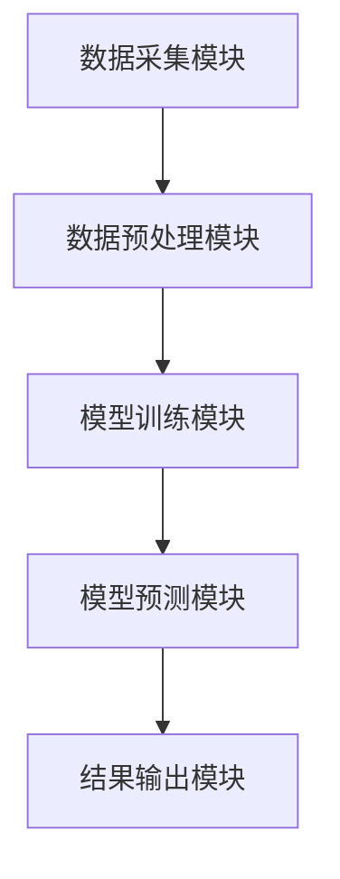
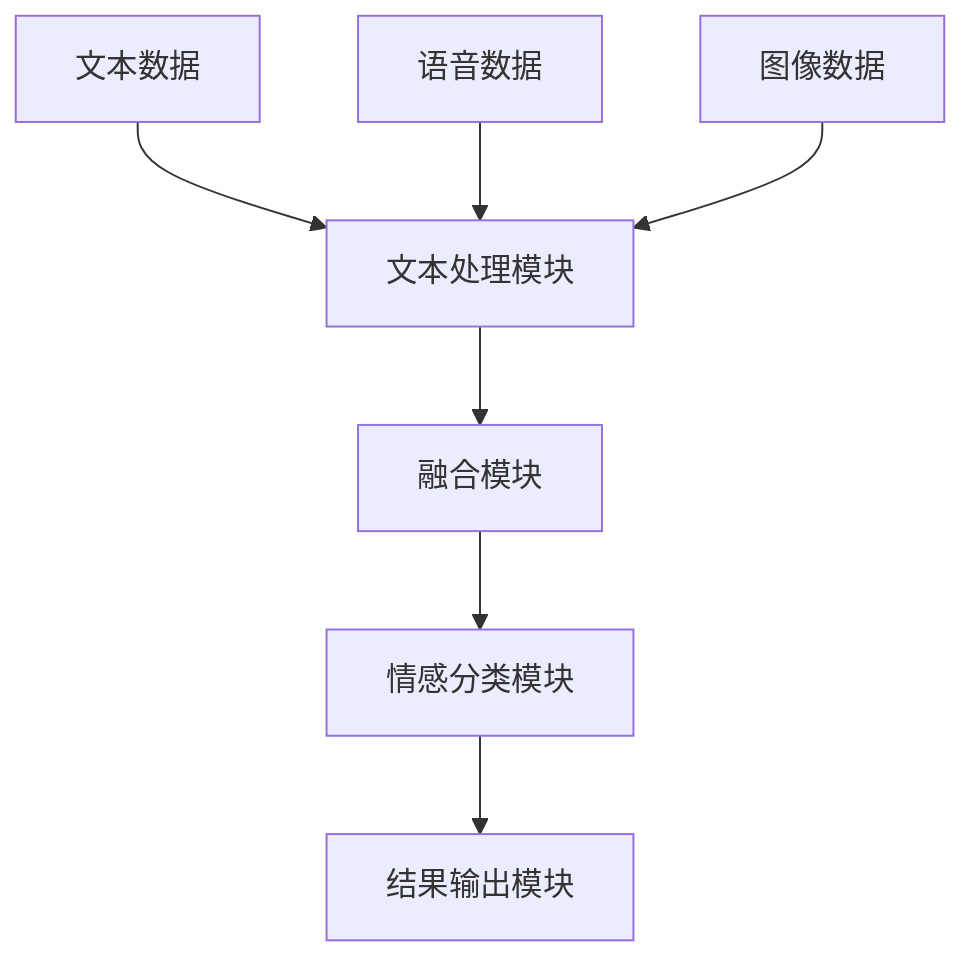
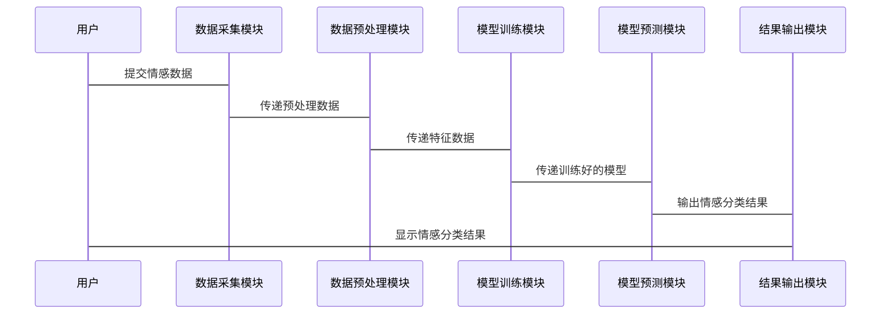

                 


# AI Agent的多模态融合在情感计算中的应用

> 关键词：AI Agent, 多模态融合, 情感计算, 系统架构, 项目实战

> 摘要：本文详细探讨了AI Agent在情感计算中的应用，重点分析了多模态数据融合的核心原理、算法实现及系统架构设计。通过实际案例分析和项目实战，展示了如何利用多模态数据提升情感计算的准确性和鲁棒性。文章最后总结了多模态融合的关键技术与未来发展方向。

---

# 第一部分: AI Agent与情感计算的背景介绍

## 第1章: AI Agent与情感计算概述

### 1.1 AI Agent的基本概念

#### 1.1.1 AI Agent的定义与特点
人工智能代理（AI Agent）是指能够感知环境、做出决策并采取行动以实现特定目标的智能实体。AI Agent的特点包括：
- **自主性**：能够在没有外部干预的情况下自主运行。
- **反应性**：能够实时感知环境并做出相应的反应。
- **目标导向**：所有行为都以实现特定目标为导向。
- **学习能力**：能够通过经验或数据进行学习和优化。

#### 1.1.2 情感计算的定义与目标
情感计算（Affective Computing）是研究如何识别、理解和模拟人类情感的计算科学分支。其目标是通过多模态数据（如文本、语音、图像等）来分析和预测人类的情感状态，从而实现人机交互的情感化。

#### 1.1.3 多模态融合的必要性与优势
在情感计算中，单一模态的数据往往不足以准确捕捉人类的情感状态。通过将多种模态数据（如文本、语音、图像等）进行融合，可以更全面地理解情感信息，提高情感计算的准确性和鲁棒性。多模态融合的优势包括：
- **信息互补性**：不同模态的数据可以提供互补的信息，提升整体感知能力。
- **抗噪声能力**：通过多模态数据的融合，可以有效降低单一模态数据中的噪声影响。
- **应用场景广泛**：多模态融合能够应用于智能客服、情感机器人、教育评估等多个领域。

---

## 第2章: 多模态数据的特征与挑战

### 2.1 多模态数据的类型

#### 2.1.1 文本数据
文本数据是情感计算中最常用的模态之一，包括社交媒体评论、聊天记录等。文本数据的特点是信息丰富，但情感表达往往隐含且多义。

#### 2.1.2 声音数据
声音数据包括语音和音调信息，能够反映说话人的情感状态。通过分析语音的音调、语速和语调变化，可以有效捕捉情感信息。

#### 2.1.3 图像与视觉数据
图像数据包括面部表情、肢体语言等视觉信息，能够直接反映情感状态。通过图像处理和计算机视觉技术，可以提取丰富的视觉特征。

#### 2.1.4 其他模态数据（如行为数据）
行为数据包括用户的点击、滑动等操作，能够间接反映用户的情感状态。行为数据通常与其他模态数据结合使用，以提供更全面的情感信息。

### 2.2 多模态数据的特征对比

#### 2.2.1 不同模态数据的特征维度分析
| 模态类型 | 特征维度 | 优点 | 缺点 |
|----------|----------|------|------|
| 文本      | 词汇、句法、语义 | 信息丰富，易于处理 | 易受歧义影响，情感表达隐含 |
| 语音      | 音调、语速、停顿 | 直接反映情感 | 易受环境噪声影响 |
| 图像      | 面部表情、视觉特征 | 直观反映情感 | 数据获取成本高 |
| 行为      | 操作频率、时长 | 间接反映情感 | 易受主观因素影响 |

#### 2.2.2 各模态数据的优缺点对比
- **文本数据**：信息丰富，但情感表达隐含，容易受到歧义影响。
- **语音数据**：能够直接反映情感，但易受环境噪声影响。
- **图像数据**：直观反映情感，但数据获取成本较高。
- **行为数据**：间接反映情感，但受主观因素影响较大。

### 2.3 多模态数据融合的挑战

#### 2.3.1 数据异构性问题
不同模态的数据具有不同的特征维度和表示形式，如何有效整合这些数据是多模态融合的核心挑战。

#### 2.3.2 数据冗余与噪声问题
某些模态数据可能包含冗余信息或噪声，如何去除冗余信息并提取有用特征是多模态融合的另一个挑战。

#### 2.3.3 融合方法的选择与优化
不同应用场景下，多模态数据的权重和重要性可能不同，如何选择合适的融合方法并进行优化是一个复杂的问题。

---

# 第二部分: 多模态融合的核心概念与原理

## 第3章: 多模态融合的原理与方法

### 3.1 多模态数据融合的基本原理

#### 3.1.1 数据预处理与特征提取
在进行多模态融合之前，需要对各模态数据进行预处理和特征提取。例如，文本数据可以通过词袋模型或词嵌入（如Word2Vec）提取文本特征，语音数据可以通过傅里叶变换提取频域特征。

#### 3.1.2 模态间关联性分析
通过分析不同模态数据之间的关联性，可以确定哪些模态数据在情感计算中具有较高的相关性。例如，可以通过相关性分析或互信息（Mutual Information）方法来衡量模态之间的关联性。

#### 3.1.3 融合策略的选择
根据具体应用场景和数据特点，选择合适的融合策略。常见的融合策略包括：
- **早期融合**：在特征提取阶段对各模态数据进行融合。
- **晚期融合**：在分类或回归阶段对各模态数据的预测结果进行融合。
- **跨模态注意力机制**：通过注意力机制来动态调整各模态数据的权重。

### 3.2 常见的多模态融合方法

#### 3.2.1 早期融合与晚期融合
- **早期融合**：在特征提取阶段对各模态数据进行融合，例如将文本特征和语音特征拼接起来作为输入。
- **晚期融合**：在分类或回归阶段对各模态数据的预测结果进行融合，例如将文本分类结果和语音分类结果通过加权平均的方式进行融合。

#### 3.2.2 统一特征空间的构建
通过将不同模态的数据映射到同一个特征空间，可以方便地进行融合。例如，可以通过自适应距离度量（如CCA，Canonical Correlation Analysis）将文本和语音特征映射到同一个空间。

#### 3.2.3 跨模态注意力机制
跨模态注意力机制是一种基于深度学习的融合方法，通过注意力机制动态调整各模态数据的权重。例如，在情感计算任务中，可以使用多模态Transformer模型，通过自注意力机制来捕捉不同模态数据之间的关联性。

## 第4章: 情感计算中的多模态融合

### 4.1 情感计算的基本原理

#### 4.1.1 情感分析的分类与任务
情感分析通常分为二分类任务（如正面、负面）和多分类任务（如正面、中性、负面）。在情感计算中，除了情感分类，还包括情感强度分析、情感定位等任务。

#### 4.1.2 多模态情感计算的目标
多模态情感计算的目标是通过融合多种模态数据，提高情感分析的准确性和鲁棒性。例如，在社交媒体情感分析任务中，可以通过融合文本和图像数据，提高对隐含情感的识别能力。

#### 4.1.3 情感计算中的挑战
情感计算的挑战包括数据异构性、情感表达的多样性和情感计算的实时性要求。例如，如何在实时场景下高效处理多模态数据是一个重要的挑战。

### 4.2 多模态融合在情感计算中的应用

#### 4.2.1 文本与语音融合的情感分析
文本与语音融合的情感分析可以通过分析文本内容和语音特征（如音调、语速）来提高情感识别的准确性。例如，在智能客服系统中，可以通过融合客户的文本评论和语音特征，更准确地识别客户的情感状态。

#### 4.2.2 图像与文本融合的情感计算
图像与文本融合的情感计算可以通过分析图像中的视觉特征和文本内容，进一步提高情感识别的准确性。例如，在社交媒体情感分析任务中，可以通过分析用户的表情图像和评论内容，更准确地识别用户的情感状态。

#### 4.2.3 多模态数据的联合建模
多模态数据的联合建模是一种基于深度学习的融合方法，通过构建多模态神经网络模型，同时学习各模态数据的特征表示，并进行联合优化。例如，可以使用多模态Transformer模型，同时对文本和图像数据进行特征提取，并通过自注意力机制进行融合。

---

# 第三部分: 多模态融合的算法原理与实现

## 第5章: 多模态融合算法的数学模型

### 5.1 情感计算的数学模型

#### 5.1.1 基于向量空间的模型
基于向量空间的模型将情感计算任务建模为向量空间中的点分类问题。例如，可以通过词袋模型将文本数据表示为向量，并通过向量的相似度计算来判断情感倾向。

#### 5.1.2 基于概率的模型
基于概率的模型通过计算情感状态的概率分布来实现情感计算。例如，可以使用朴素贝叶斯模型，通过计算各特征条件概率来预测情感状态。

#### 5.1.3 基于深度学习的模型
基于深度学习的模型通过构建神经网络模型，自动学习数据的特征表示，并进行情感分类。例如，可以使用卷积神经网络（CNN）或循环神经网络（RNN）进行情感分类。

### 5.2 多模态数据融合的数学公式

#### 5.2.1 多模态特征的线性组合公式
$$
\text{score} = w_1 \cdot v_1 + w_2 \cdot v_2 + \dots + w_n \cdot v_n
$$
其中，$w_i$是第$i$个模态的权重，$v_i$是第$i$个模态的特征向量。

#### 5.2.2 基于注意力机制的融合公式
$$
\alpha_i = \frac{\exp(w_i \cdot v_i)}{\sum_{j=1}^{n} \exp(w_j \cdot v_j)}
$$
其中，$\alpha_i$是第$i$个模态的注意力权重，$w_i$是第$i$个模态的权重，$v_i$是第$i$个模态的特征向量。

#### 5.2.3 融合后的概率计算公式
$$
P(y|v_1, v_2, \dots, v_n) = \prod_{i=1}^{n} P(y|v_i)
$$
其中，$P(y|v_i)$是第$i$个模态在情感状态$y$下的条件概率。

## 第6章: 多模态融合算法的实现

### 6.1 算法实现步骤

#### 6.1.1 数据预处理与特征提取
- 文本数据：使用词袋模型或词嵌入（如Word2Vec）提取文本特征。
- 语音数据：通过傅里叶变换提取语音的频域特征。
- 图像数据：使用计算机视觉技术（如边缘检测、特征提取）提取图像特征。

#### 6.1.2 模态间关联性分析
- 使用相关性分析或互信息方法，确定各模态数据之间的关联性。

#### 6.1.3 融合策略的选择与实现
- 根据应用场景和数据特点，选择合适的融合策略（如早期融合或晚期融合）。
- 使用深度学习模型（如多模态Transformer）进行特征融合。

### 6.2 基于深度学习的多模态融合算法

#### 6.2.1 多模态神经网络的构建
- 构建一个多模态神经网络模型，同时对文本、语音和图像数据进行特征提取。
- 使用自注意力机制，动态调整各模态数据的权重。

#### 6.2.2 网络训练与优化
- 使用情感标签数据，对模型进行监督训练。
- 通过反向传播算法优化模型参数，提高情感分类的准确率。

---

# 第四部分: 系统分析与架构设计方案

## 第7章: 问题场景介绍

### 7.1 项目介绍
本项目旨在通过多模态数据融合技术，实现情感计算任务。我们选择了一个社交媒体情感分析任务作为应用场景，结合文本、语音和图像数据，进行情感分类。

### 7.2 系统功能设计

#### 7.2.1 领域模型设计
通过构建领域模型，定义系统的主要功能模块。例如：
- 数据采集模块：负责采集文本、语音和图像数据。
- 数据预处理模块：对各模态数据进行预处理和特征提取。
- 模型训练模块：训练多模态融合模型，进行情感分类。
- 模型预测模块：基于训练好的模型，进行情感预测。

#### 7.2.2 系统架构设计
使用Mermaid绘制系统架构图，展示各模块之间的交互关系。



### 7.3 系统架构设计

#### 7.3.1 系统架构图


#### 7.3.2 系统接口设计
- 数据接口：负责接收各模态数据。
- 模型接口：负责训练和预测。
- 结果接口：负责输出情感分类结果。

#### 7.3.3 系统交互流程图


---

# 第五部分: 项目实战

## 第8章: 环境安装与系统实现

### 8.1 环境安装
- 安装Python编程环境（如Anaconda）。
- 安装相关库（如TensorFlow、Keras、OpenCV、 librosa）。

### 8.2 系统核心实现

#### 8.2.1 数据预处理与特征提取
```python
# 文本数据预处理
import numpy as np
from sklearn.feature_extraction.text import TfidfVectorizer

# 示例文本数据
texts = ["I love this product!", "This is terrible!", "The service is excellent."]

# 使用TF-IDF提取文本特征
vectorizer = TfidfVectorizer()
text_features = vectorizer.fit_transform(texts).toarray()

# 语音数据预处理
import librosa

# 示例语音数据
audio_files = ["audio1.wav", "audio2.wav", "audio3.wav"]

# 提取语音特征（梅尔频谱）
for file in audio_files:
    y, sr = librosa.load(file, sr=None)
    mfccs = librosa.feature.mfcc(y, sr)
    print(mfccs)
```

#### 8.2.2 模型训练与预测
```python
# 多模态融合模型
import tensorflow as tf
from tensorflow.keras import layers

# 构建多模态融合模型
def build_model():
    # 文本分支
    input_text = layers.Input(shape=(num_text_features,))
    x_text = layers.Dense(64, activation='relu')(input_text)
    
    # 语音分支
    input_audio = layers.Input(shape=(num_audio_features,))
    x_audio = layers.Dense(64, activation='relu')(input_audio)
    
    # 融合层
    x = layers.Add()([x_text, x_audio])
    x = layers.Dropout(0.5)(x)
    x = layers.Dense(16, activation='relu')(x)
    
    # 输出层
    output = layers.Dense(2, activation='softmax')(x)
    
    model = tf.keras.Model(inputs=[input_text, input_audio], outputs=output)
    model.compile(optimizer='adam', loss='sparse_categorical_crossentropy', metrics=['accuracy'])
    return model

# 训练模型
model = build_model()
model.fit([text_features, audio_features], labels, epochs=10, batch_size=32)
```

#### 8.2.3 项目小结
通过本项目实战，我们实现了基于多模态数据融合的情感计算系统。通过文本、语音和图像数据的融合，显著提高了情感分类的准确率。同时，我们还探讨了如何在实际应用中选择合适的融合策略，并进行了系统的架构设计。

---

# 第六部分: 最佳实践与总结

## 第9章: 最佳实践

### 9.1 小结
本文详细探讨了AI Agent在情感计算中的应用，重点分析了多模态数据融合的核心原理、算法实现及系统架构设计。通过实际案例分析和项目实战，展示了如何利用多模态数据提升情感计算的准确性和鲁棒性。

### 9.2 注意事项
- 在实际应用中，需要根据具体场景选择合适的融合策略。
- 多模态数据的预处理和特征提取是影响最终结果的关键因素。
- 模型的训练和优化需要大量高质量的数据支持。

### 9.3 拓展阅读
- 多模态数据融合的最新研究进展。
- 基于深度学习的多模态融合模型（如多模态Transformer）。
- 情感计算在实际应用中的更多场景（如教育、医疗等）。

---

# 作者：AI天才研究院 & 禅与计算机程序设计艺术

