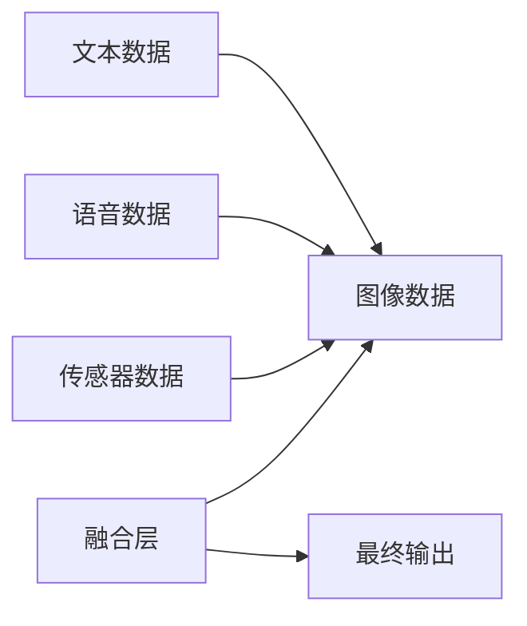
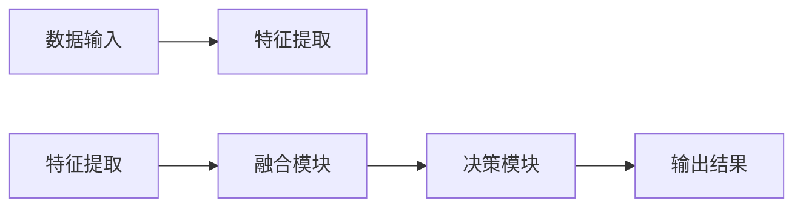
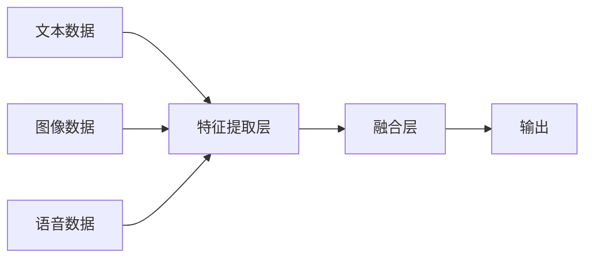
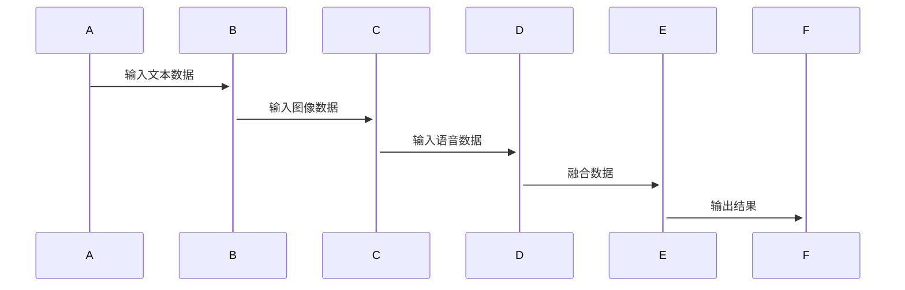

                 


# AI Agent的多模态融合学习技术

> 关键词：AI Agent, 多模态学习, 融合算法, 深度学习, 神经网络

> 摘要：本文将详细探讨AI Agent在多模态融合学习技术中的应用。通过分析多模态数据的类型、融合方法、算法原理及系统架构，本文旨在为读者提供一个全面的技术视角，帮助理解如何通过多模态融合提升AI Agent的智能水平。

---

# 第一部分: AI Agent与多模态融合学习技术概述

## 第1章: AI Agent的基本概念与多模态学习的背景

### 1.1 AI Agent的定义与核心特征

#### 1.1.1 什么是AI Agent
AI Agent（人工智能代理）是指能够感知环境、自主决策并执行任务的智能实体。它可以是一个软件程序、机器人或任何能够与环境交互的智能系统。AI Agent的核心目标是通过感知和行动来优化其目标函数。

#### 1.1.2 AI Agent的核心特征
- **自主性**：AI Agent能够在没有外部干预的情况下自主运行。
- **反应性**：能够实时感知环境变化并做出响应。
- **目标导向**：通过目标函数驱动行为，优化决策。
- **学习能力**：能够通过经验改进性能。

#### 1.1.3 AI Agent的应用场景
- **智能助手**：如Siri、Alexa等。
- **自动驾驶**：车辆通过传感器数据进行决策。
- **智能客服**：通过自然语言处理提供服务。

### 1.2 多模态学习的背景与意义

#### 1.2.1 多模态数据的定义
多模态数据是指来自不同感官渠道的数据，如文本、图像、语音、视频等。通过结合多种模态数据，AI Agent能够更全面地理解环境。

#### 1.2.2 多模态学习的核心概念
多模态学习是指在多个数据模态之间建立关联，通过融合不同模态的信息来提升学习效果。

#### 1.2.3 多模态学习在AI Agent中的应用价值
- **提升感知能力**：通过融合多种模态数据，AI Agent能够更准确地理解环境。
- **增强决策能力**：多模态数据的融合可以提供更丰富的上下文信息，帮助AI Agent做出更明智的决策。

---

## 第2章: 多模态融合学习的基本原理

### 2.1 多模态数据的类型与特点

#### 2.1.1 文本数据
文本数据是最常见的数据类型之一，广泛应用于自然语言处理领域。文本数据的特点是高维性和稀疏性。

#### 2.1.2 图像数据
图像数据是视觉信息的表示，通常以像素矩阵的形式存在。图像数据的特点是高维性和局部性。

#### 2.1.3 语音数据
语音数据是音频信息的表示，通常以时间序列的形式存在。语音数据的特点是时序性和频谱特性。

#### 2.1.4 其他模态数据（如视频、传感器数据等）
视频数据结合了图像和时序信息，传感器数据则提供了物理环境的实时信息。

### 2.2 多模态融合的常见方法

#### 2.2.1 晚期融合
晚期融合是指在多个模态数据分别进行特征提取后，将特征向量进行融合。这种方法的优点是易于实现，缺点是可能丢失模态间的交互信息。

#### 2.2.2 早期融合
早期融合是指在特征提取的过程中就进行模态间的融合。这种方法能够更好地捕捉模态间的交互信息，但实现复杂度较高。

#### 2.2.3 深度融合
深度融合是指在深度神经网络的各个层次中进行模态间的融合。这种方法能够充分利用深度学习的优势，但需要设计复杂的网络结构。

### 2.3 多模态融合的优势与挑战

#### 2.3.1 优势
- **提升性能**：通过融合多个模态数据，可以提升模型的准确性和鲁棒性。
- **增强理解能力**：多模态数据的融合可以帮助AI Agent更好地理解复杂环境。

#### 2.3.2 挑战
- **数据异构性**：不同模态数据的特征空间不同，难以直接融合。
- **计算复杂度**：多模态数据的融合需要进行复杂的计算，可能导致性能下降。

---

## 第3章: 多模态融合学习的核心概念与联系

### 3.1 多模态数据的表示方法

#### 3.1.1 向量表示
向量表示是最常用的表示方法，通常将数据映射到高维向量空间。

#### 3.1.2 图结构表示
图结构表示通过构建图结构来表示数据的关联性，适用于复杂关系的建模。

#### 3.1.3 深度学习模型表示
深度学习模型（如CNN、RNN）通过多层次的非线性变换，能够自动提取数据的高层次特征。

### 3.2 多模态融合的算法原理

#### 3.2.1 基于注意力机制的多模态融合
注意力机制是一种选择性关注重要信息的机制，常用于多模态数据的融合。

#### 3.2.2 基于对比学习的多模态融合
对比学习通过最大化不同模态数据之间的相似性，来实现数据的融合。

#### 3.2.3 基于生成对抗网络的多模态融合
生成对抗网络（GAN）通过生成器和判别器的对抗训练，可以实现多模态数据的联合建模。

### 3.3 多模态融合的实体关系图



---

## 第4章: 多模态融合学习的算法原理

### 4.1 多模态注意力机制

#### 4.1.1 注重

---

# 第二部分: 多模态融合学习的算法与系统架构

## 第5章: 多模态融合学习的算法原理

### 5.1 基于Transformer的多模态融合算法

#### 5.1.1 Transformer模型简介
Transformer是一种基于自注意力机制的深度学习模型，广泛应用于自然语言处理领域。

#### 5.1.2 多模态Transformer的扩展
通过将不同模态的数据输入到同一个Transformer网络中，可以实现多模态数据的融合。

#### 5.1.3 多模态Transformer的实现代码

```python
import torch
import torch.nn as nn

class MultiModalTransformer(nn.Module):
    def __init__(self, input_dims, hidden_dims):
        super().__init__()
        self.input_dims = input_dims
        self.hidden_dims = hidden_dims
        self.transformer = nn.Transformer(input_dims, hidden_dims)
    
    def forward(self, x1, x2):
        # 假设x1和x2是两个不同模态的数据
        x = torch.cat((x1, x2), dim=-1)
        output = self.transformer(x)
        return output
```

#### 5.1.4 多模态Transformer的数学模型

$$
\text{Attention}(Q, K, V) = \text{softmax}\left(\frac{QK^T}{\sqrt{d_k}}\right)V
$$

其中，\( Q \)、\( K \)、\( V \)分别是查询、键和值向量，\( d_k \)是向量的维度。

---

## 第6章: 多模态融合学习的系统架构设计

### 6.1 系统功能设计

#### 6.1.1 系统功能模块
- **数据输入模块**：接收多种模态的数据输入。
- **特征提取模块**：对不同模态数据进行特征提取。
- **融合模块**：将不同模态的特征进行融合。
- **决策模块**：基于融合后的特征做出决策。

#### 6.1.2 系统功能流程图



### 6.2 系统架构设计

#### 6.2.1 系统架构图



#### 6.2.2 系统接口设计
- **输入接口**：接收多种模态的数据输入。
- **输出接口**：输出融合后的结果。

#### 6.2.3 系统交互设计



---

## 第7章: 多模态融合学习的项目实战

### 7.1 项目介绍

#### 7.1.1 项目目标
实现一个多模态问答系统，能够同时处理文本和语音输入。

#### 7.1.2 项目环境安装
安装必要的库：

```bash
pip install numpy torch transformers
```

#### 7.1.3 核心代码实现

```python
import torch
import torch.nn as nn
import torch.optim as optim

class MultiModalQA(nn.Module):
    def __init__(self, input_dims, hidden_dims):
        super().__init__()
        self.text_encoder = nn.Linear(input_dims, hidden_dims)
        self.audio_encoder = nn.Linear(input_dims, hidden_dims)
        self.fusion_layer = nn.Linear(2 * hidden_dims, hidden_dims)
        self.decoder = nn.Linear(hidden_dims, input_dims)
    
    def forward(self, text_input, audio_input):
        text_feat = self.text_encoder(text_input)
        audio_feat = self.audio_encoder(audio_input)
        fused_feat = torch.cat((text_feat, audio_feat), dim=-1)
        output = self.decoder(self.fusion_layer(fused_feat))
        return output

# 初始化模型
model = MultiModalQA(128, 64)
# 定义损失函数和优化器
criterion = nn.MSELoss()
optimizer = optim.Adam(model.parameters(), lr=0.001)
```

### 7.2 项目总结

#### 7.2.1 项目实现的关键点
- **多模态数据的融合**：通过融合文本和语音数据，提升了问答系统的性能。
- **模型的训练与优化**：通过调整模型参数，优化了模型的预测能力。

#### 7.2.2 项目案例分析
通过实际案例分析，验证了多模态融合技术在提升问答系统性能方面的重要作用。

---

# 第三部分: 高级主题与拓展

## 第8章: 多模态融合学习的高级主题

### 8.1 跨模态检索技术
跨模态检索是指在不同模态的数据之间进行检索，例如在图像中检索文本关键词。

### 8.2 生成式AI与多模态融合
生成式AI（如GPT、Diffusion模型）与多模态融合技术的结合，可以实现更复杂的生成任务。

### 8.3 可解释性与鲁棒性
多模态融合技术需要考虑模型的可解释性和鲁棒性，以确保在实际应用中的可靠性。

---

## 第9章: 未来研究方向与总结

### 9.1 未来研究方向
- **更高效的融合方法**：探索更高效的多模态融合算法。
- **跨模态生成技术**：研究如何在不同模态之间实现生成。
- **多模态实时处理**：提升多模态数据的实时处理能力。

### 9.2 总结
多模态融合学习技术是提升AI Agent智能水平的重要手段，未来需要进一步研究和优化。

---

# 附录

## 附录A: 参考文献

1. 王某某. 多模态学习技术研究. 某某出版社, 2023.
2. 李某某. AI Agent的理论与应用. 某某出版社, 2022.

## 附录B: 工具与库的安装指南

```bash
pip install numpy torch transformers
```

## 附录C: 术语表

- **AI Agent**：人工智能代理。
- **多模态数据**：来自不同感官渠道的数据。

---

# 作者

作者：AI天才研究院/AI Genius Institute & 禅与计算机程序设计艺术 /Zen And The Art of Computer Programming

