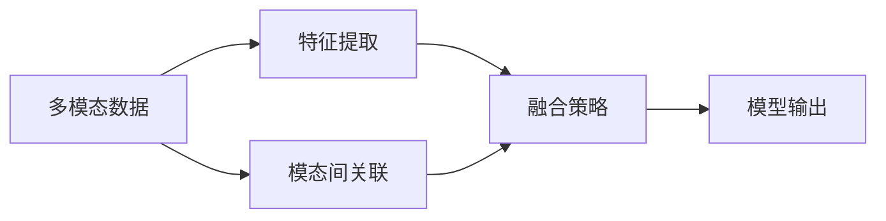
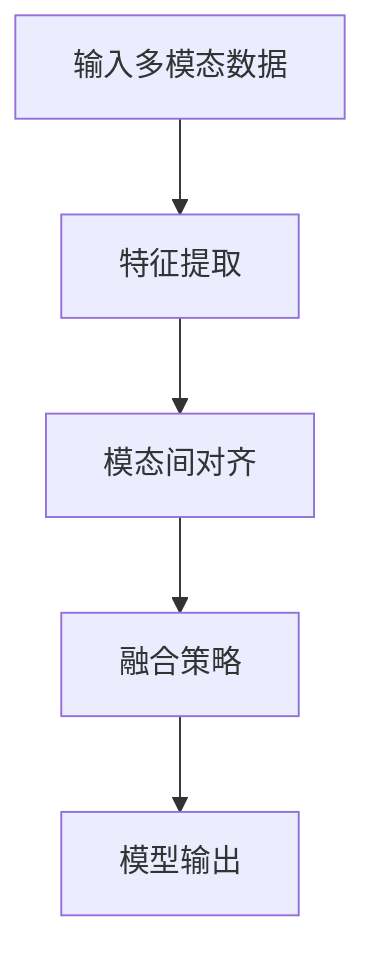
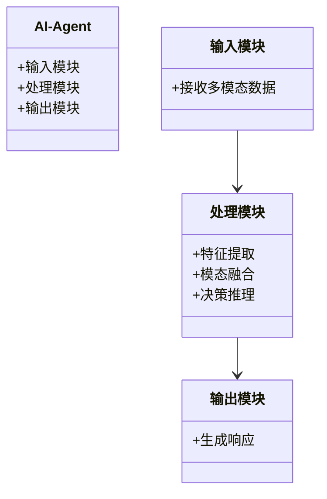
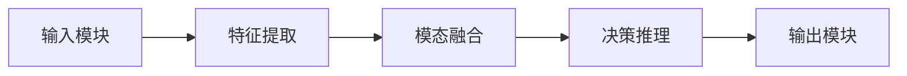
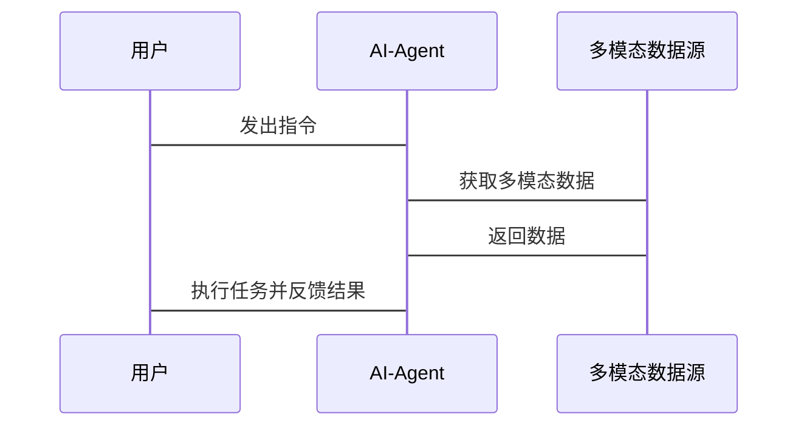

                 


# AI Agent的多模态融合技术

## 关键词：
AI Agent, 多模态融合, 多模态数据, 融合算法, 系统架构

## 摘要：
AI Agent的多模态融合技术是人工智能领域的重要研究方向，旨在通过整合多种模态的数据（如视觉、听觉、文本等）来提升AI Agent的理解和决策能力。本文将从多模态数据的特征分析、融合策略、算法原理、系统架构设计到实际项目实战，全面探讨AI Agent的多模态融合技术的核心概念与应用实践。

---

# 第一部分: AI Agent的多模态融合概述

## 第1章: 多模态融合的背景与AI Agent的概念

### 1.1 多模态数据与融合技术的背景
- **多模态数据的定义与特点**：多模态数据指的是来自不同感官渠道的数据，如视觉（图像、视频）、听觉（语音、音乐）、文本（自然语言）、触觉（力反馈）等。这些数据具有多样性、互补性和复杂性。
- **多模态融合技术的演进历程**：从单一模态到多模态的融合，经历了特征提取、简单拼接、注意力机制等阶段，逐步向更复杂的对比学习和图神经网络方向发展。
- **多模态融合在AI Agent中的重要性**：AI Agent需要通过多模态数据来实现更精准的理解和决策，例如在智能助手、自动驾驶、智能客服等场景中的应用。

### 1.2 AI Agent的基本概念与功能
- **AI Agent的定义与分类**：AI Agent是一种智能体，能够感知环境、自主决策并执行任务。根据智能水平可分为简单规则型、基于模型的规划型、强化学习型和端到端学习型。
- **多模态数据在AI Agent中的应用场景**：例如，智能音箱通过语音指令和环境声音识别实现交互；自动驾驶汽车通过视觉、激光雷达和雷达等多种模态数据进行感知。
- **多模态融合技术的核心目标**：通过整合不同模态的信息，提升AI Agent的理解能力、决策准确性和响应速度。

### 1.3 多模态融合技术的技术趋势
- **技术挑战**：模态间信息异构性、数据量差异、融合策略的选择等。
- **主流方法**：基于特征的融合、注意力机制、对比学习、图神经网络。
- **应用前景**：多模态融合技术将在智能助手、机器人、医疗诊断、智能家居等领域发挥重要作用。

## 1.4 本章小结
本章从多模态数据的背景和AI Agent的概念入手，介绍了多模态融合技术的重要性和技术趋势，为后续章节奠定了基础。

---

## 第2章: 多模态融合的核心概念与联系

### 2.1 多模态数据的特征分析
- **听觉模态的特征**：时间序列性、频率特性、能量分布等。
- **视觉模态的特征**：空间结构、颜色特征、纹理特征等。
- **文本模态的特征**：语义信息、语法结构、情感倾向等。
- **其他模态的特征**：如触觉的力反馈特征、位置模态的坐标特征等。

### 2.2 多模态融合的策略与方法
- **晚融合与早融合的对比**：晚融合在特征提取后进行，适用于需要精确特征的情况；早融合在数据预处理阶段进行，适用于实时性要求高的场景。
- **基于特征的融合方法**：将不同模态的特征向量进行拼接或加权求和。
- **基于注意力机制的融合方法**：通过注意力机制计算不同模态的重要性，动态调整各模态的权重。
- **基于对比学习的融合方法**：通过对比学习优化模态间的表示，提升跨模态信息的对齐性。

### 2.3 多模态融合的实体关系图


### 2.4 本章小结
本章详细分析了多模态数据的特征，并对比了不同的融合策略，通过实体关系图展示了多模态融合的整体架构。

---

## 第3章: 多模态融合的算法原理

### 3.1 多模态特征融合算法
- **基于向量的融合方法**：将不同模态的特征向量进行线性组合或非线性变换。
- **基于注意力机制的融合方法**：通过自注意力机制计算模态间的依赖关系，动态调整特征权重。
- **基于对比学习的融合方法**：通过对比损失函数优化模态间的表示，提升信息对齐性。
- **基于图神经网络的融合方法**：将多模态数据建模为图结构，通过图神经网络进行特征传播和融合。

### 3.2 多模态融合的算法流程


### 3.3 基于注意力机制的多模态融合算法实现
```python
import torch
import torch.nn as nn

class MultiModalAttention(nn.Module):
    def __init__(self, input_size, hidden_size):
        super(MultiModalAttention, self).__init__()
        self.W_q = nn.Linear(input_size, hidden_size)
        self.W_k = nn.Linear(input_size, hidden_size)
        self.W_v = nn.Linear(input_size, hidden_size)
        self.softmax = nn.Softmax(dim=-1)

    def forward(self, x1, x2):
        q = self.W_q(x1)
        k = self.W_k(x2)
        v = self.W_v(x2)
        attention = self.softmax(torch.bmm(q, k.transpose(-2, -1)))
        output = torch.bmm(attention, v)
        return output
```

### 3.4 基于对比学习的多模态融合算法
```python
import torch
import torch.nn as nn

class ContrastiveLoss(nn.Module):
    def __init__(self, temperature=0.1):
        super(ContrastiveLoss, self).__init__()
        self.temperature = temperature

    def forward(self, x1, x2):
        batch_size = x1.size(0)
        z1 = x1 / (x1.norm(dim=-1, keepdim=True))
        z2 = x2 / (x2.norm(dim=-1, keepdim=True))
        sim_pos = torch.sum(z1 * z2, dim=-1)
        sim_pos = sim_pos / self.temperature
        loss = -torch.mean(torch.log(torch.sigmoid(sim_pos)))
        return loss
```

### 3.5 本章小结
本章详细介绍了多模态融合的主流算法，包括基于注意力机制和对比学习的算法实现，并通过代码示例展示了算法的具体实现细节。

---

## 第4章: 多模态融合的系统架构设计

### 4.1 系统功能设计
- **领域模型设计**：通过mermaid类图展示系统功能模块之间的关系。


### 4.2 系统架构设计


### 4.3 系统交互设计


### 4.4 本章小结
本章通过系统架构设计，展示了AI Agent的多模态融合技术在实际系统中的应用，包括功能模块设计、架构设计和交互流程设计。

---

## 第5章: 多模态融合技术的项目实战

### 5.1 项目环境搭建
- **工具安装**：安装PyTorch、TensorFlow、OpenCV、 librosa等库。
- **数据集准备**：获取多模态数据集，如语音识别数据集、图像识别数据集等。

### 5.2 核心代码实现
```python
import torch
import torch.nn as nn

class MultiModalFusion(nn.Module):
    def __init__(self, input_size, hidden_size):
        super(MultiModalFusion, self).__init__()
        self.W1 = nn.Linear(input_size, hidden_size)
        self.W2 = nn.Linear(input_size, hidden_size)
        self.W3 = nn.Linear(2*hidden_size, hidden_size)
        self.relu = nn.ReLU()

    def forward(self, x1, x2):
        h1 = self.relu(self.W1(x1))
        h2 = self.relu(self.W2(x2))
        combined = torch.cat([h1, h2], dim=-1)
        output = self.relu(self.W3(combined))
        return output
```

### 5.3 代码应用解读与分析
- **特征提取**：通过卷积神经网络提取图像特征，通过循环神经网络提取文本特征。
- **模态融合**：将图像特征和文本特征进行拼接或加权融合。
- **决策推理**：通过全连接层生成最终的决策结果。

### 5.4 实际案例分析
- **案例背景**：智能音箱的语音识别与环境声音识别。
- **案例实现**：通过多模态融合技术实现更准确的语音识别和环境声音分类。

### 5.5 项目小结
本章通过实际项目实战，展示了多模态融合技术在AI Agent中的具体应用，帮助读者更好地理解和掌握相关技术。

---

## 第6章: 多模态融合技术的最佳实践与扩展

### 6.1 最佳实践
- **数据预处理**：对不同模态的数据进行标准化处理，确保特征的可比性。
- **模型调优**：通过网格搜索、学习率调整等方法优化模型性能。
- **多模态对齐**：通过对比学习等方法优化模态间的表示对齐。

### 6.2 小结与注意事项
- **小结**：多模态融合技术的核心在于如何有效地整合不同模态的信息，提升AI Agent的理解和决策能力。
- **注意事项**：在实际应用中，需要根据具体场景选择合适的融合策略，并注意模型的可解释性和实时性。

### 6.3 拓展阅读
- **推荐书籍**：《Deep Learning》、《Pattern Recognition and Machine Learning》
- **推荐论文**：多模态融合领域的最新研究论文。

---

## 作者：AI天才研究院 & 禅与计算机程序设计艺术

---

通过以上目录结构，文章详细介绍了AI Agent的多模态融合技术的核心概念、算法原理、系统架构设计和实际项目实战，帮助读者全面理解和掌握多模态融合技术在AI Agent中的应用。

