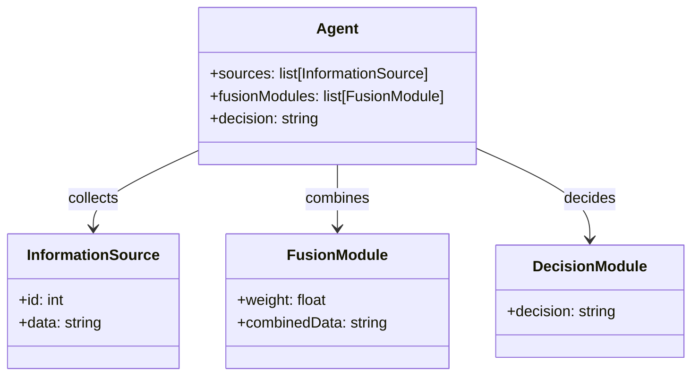
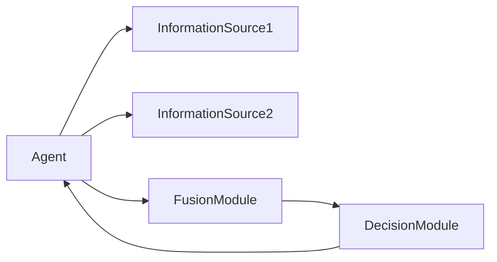

                 


# AI Agent的多源信息融合与决策技术

> 关键词：AI Agent, 多源信息融合, 决策技术, 信息融合算法, 系统架构设计

> 摘要：本文深入探讨了AI Agent在多源信息融合与决策技术中的应用，从基本概念、核心原理到算法实现、系统架构设计，再到项目实战，全面解析了如何利用多源信息进行高效决策。文章结合理论与实践，通过丰富的案例和详细的代码实现，帮助读者掌握AI Agent的核心技术。

---

# 第1章: AI Agent的基本概念与背景

## 1.1 AI Agent的定义与特点
### 1.1.1 AI Agent的定义
AI Agent（人工智能代理）是指能够感知环境、自主决策并采取行动的智能实体。它能够根据输入的信息做出响应，优化目标函数并实现特定任务。

### 1.1.2 AI Agent的核心特点
- **自主性**：能够自主决策，无需外部干预。
- **反应性**：能够实时感知环境并做出反应。
- **目标导向性**：以目标为导向，优化决策过程。
- **学习能力**：通过学习提升决策效率和准确性。

### 1.1.3 AI Agent与传统智能系统的区别
| 特性         | AI Agent                     | 传统智能系统               |
|--------------|------------------------------|---------------------------|
| 自主性       | 高                          | 低                        |
| 学习能力     | 强                          | 弱                        |
| 反应性       | 高                          | 中                        |
| 适应性       | 强                          | 弱                        |

---

## 1.2 多源信息融合的背景与意义
### 1.2.1 多源信息融合的定义
多源信息融合是指将来自不同信息源的数据进行处理、分析和整合，以获得更准确、更全面的信息的过程。

### 1.2.2 多源信息融合的必要性
- **提高决策的准确性**：通过整合多源信息，减少信息孤岛和片面性。
- **增强系统的鲁棒性**：多源信息的互补性可以提高系统的容错能力。
- **提升决策效率**：通过融合信息，减少冗余信息的干扰。

### 1.2.3 多源信息融合的应用场景
- **自动驾驶**：融合来自摄像头、雷达、激光雷达等多源信息。
- **智能安防**：整合视频流、传感器数据、历史记录等信息。
- **医疗诊断**：结合病人的症状、检查结果、病史等信息。

---

## 1.3 AI Agent在决策技术中的应用
### 1.3.1 决策技术的基本概念
决策技术是指通过分析信息，选择最优行动方案的过程。它通常包括信息处理、分析评估和决策执行三个阶段。

### 1.3.2 AI Agent在决策中的作用
- **信息处理**：AI Agent能够快速处理多源信息，提取关键特征。
- **决策优化**：通过算法优化，提高决策的准确性和效率。
- **动态响应**：根据环境变化实时调整决策策略。

### 1.3.3 多源信息融合与决策技术的结合
通过融合多源信息，AI Agent能够做出更全面、更准确的决策。例如，在自动驾驶中，AI Agent通过融合多源传感器信息，实时调整行驶策略。

---

## 1.4 本章小结
本章介绍了AI Agent的基本概念、多源信息融合的背景与意义，以及AI Agent在决策技术中的应用。通过这些内容，我们理解了AI Agent的核心价值和其在实际场景中的重要性。

---

# 第2章: 多源信息融合的核心概念与原理

## 2.1 多源信息融合的定义与分类
### 2.1.1 多源信息的定义
多源信息指的是来自不同信息源的数据，例如文本、图像、传感器数据等。

### 2.1.2 多源信息的分类
- **结构化数据**：例如数据库中的表格数据。
- **非结构化数据**：例如文本、图像等。
- **流数据**：例如实时传感器数据。

### 2.1.3 多源信息融合的层次结构
- **数据级融合**：在数据层面进行融合，例如传感器数据的时空校准。
- **特征级融合**：在特征层面进行融合，例如提取图像的边缘特征。
- **决策级融合**：在决策层面进行融合，例如融合多个传感器的决策结果。

---

## 2.2 信息融合的关键技术
### 2.2.1 数据预处理技术
- **数据清洗**：去除噪声和冗余数据。
- **数据标准化**：统一不同数据源的格式和单位。

### 2.2.2 特征提取与选择
- **特征提取**：从原始数据中提取有用的特征。
- **特征选择**：选择对决策最重要的特征。

### 2.2.3 融合算法的选择与优化
- **加权融合**：根据信息源的可靠性分配权重。
- **投票融合**：通过投票机制选择最优结果。

---

## 2.3 多源信息融合的数学模型
### 2.3.1 基于概率论的融合模型
$$ P(A|B) = \frac{P(B|A)P(A)}{P(B)} $$
其中，$P(A|B)$ 表示在事件B发生的条件下，事件A发生的概率。

### 2.3.2 基于证据理论的融合模型
D-S证据理论通过基本概率分配函数（BPA）来表示不确定性：
$$ m_A(x) = \text{度量x为A的证据量} $$

### 2.3.3 基于图模型的融合方法
概率图模型（如贝叶斯网络）通过图结构表示变量之间的依赖关系。

---

## 2.4 本章小结
本章介绍了多源信息融合的核心概念与原理，包括信息的分类、融合的层次结构以及常用的数学模型。这些内容为后续的算法实现奠定了基础。

---

# 第3章: AI Agent的决策技术原理

## 3.1 决策技术的基本原理
### 3.1.1 决策树模型
决策树是一种树状结构，通过分支节点进行决策。例如：
- 根节点：问题的起点。
- 内部节点：决策的条件。
- 叶节点：决策的结果。

### 3.1.2 贝叶斯决策
贝叶斯决策通过计算条件概率来选择最优决策：
$$ \text{最优决策} = \arg\max_{a} P(a|e) $$

### 3.1.3 聚类分析与决策
聚类分析通过将数据划分为不同的类别，为决策提供依据。

---

## 3.2 基于多源信息的决策模型
### 3.2.1 基于信息融合的决策模型
通过融合多源信息，构建更准确的决策模型。

### 3.2.2 基于知识图谱的决策支持
知识图谱通过语义关联，为决策提供上下文信息。

### 3.2.3 基于强化学习的决策优化
强化学习通过试错机制，不断优化决策策略。

---

## 3.3 决策技术的数学公式与实现
### 3.3.1 贝叶斯定理的公式推导
$$ P(h|d) = \frac{P(d|h)P(h)}{\sum_{h'} P(d|h')} $$
其中，$P(h|d)$ 表示在数据$d$的条件下，假设$h$成立的概率。

### 3.3.2 决策树的构建与优化
决策树的构建过程包括特征选择、分裂节点和剪枝优化。

### 3.3.3 强化学习的数学模型
强化学习通过状态、动作和奖励的三元组进行优化：
$$ Q(s,a) = r + \gamma \max_{a'} Q(s',a') $$

---

## 3.4 本章小结
本章介绍了决策技术的基本原理和基于多源信息的决策模型，重点讲解了贝叶斯决策、决策树和强化学习的数学模型。

---

# 第4章: 多源信息融合与决策技术的算法实现

## 4.1 基于D-S证据理论的融合算法
### 4.1.1 D-S证据理论的基本原理
D-S证据理论通过基本概率分配函数（BPA）来表示不确定性。

### 4.1.2 证据的获取与处理
- **获取证据**：从多个信息源获取数据。
- **证据校准**：根据时空关系对证据进行调整。

### 4.1.3 融合结果的计算与分析
通过D-S证据理论计算融合结果：
$$ m_F(x) = \sum_{i=1}^n w_i m_i(x) $$

### 4.1.4 Python实现代码
```python
def combine_evidence(evidence_list, weights):
    combined = {}
    for i, (evidence, weight) in enumerate(zip(evidence_list, weights)):
        for key, value in evidence.items():
            combined[key] = combined.get(key, 0) + weight * value
    return combined
```

---

## 4.2 基于概率图模型的融合算法
### 4.2.1 概率图模型的构建
通过构建贝叶斯网络来表示变量之间的依赖关系。

### 4.2.2 融合过程的可视化
使用概率图模型工具（如Graphviz）进行可视化。

### 4.2.3 融合结果的评估与优化
通过似然比、精确度等指标评估融合效果。

---

## 4.3 基于深度学习的融合算法
### 4.3.1 深度学习在信息融合中的应用
- **卷积神经网络（CNN）**：用于图像融合。
- **循环神经网络（RNN）**：用于时间序列数据融合。

### 4.3.2 神经网络的构建与训练
```python
import tensorflow as tf
from tensorflow.keras import layers

model = tf.keras.Sequential([
    layers.Conv2D(32, (3,3), activation='relu', input_shape=(28,28,1)),
    layers.MaxPooling2D((2,2)),
    layers.Conv2D(64, (3,3), activation='relu'),
    layers.MaxPooling2D((2,2)),
    layers.Flatten(),
    layers.Dense(128, activation='relu'),
    layers.Dense(10, activation='softmax')
])
model.compile(optimizer='adam', loss='sparse_categorical_crossentropy', metrics=['accuracy'])
model.fit(x_train, y_train, epochs=10, batch_size=32)
```

### 4.3.3 融合效果的对比分析
通过实验对比不同融合算法的准确率、召回率等指标。

---

## 4.4 本章小结
本章详细讲解了多源信息融合与决策技术的算法实现，包括D-S证据理论、概率图模型和深度学习方法，并通过代码示例展示了如何实现这些算法。

---

# 第5章: 系统架构设计与实现

## 5.1 项目介绍
本项目旨在开发一个基于AI Agent的多源信息融合与决策系统，实现对复杂场景的智能决策。

## 5.2 系统功能设计
### 5.2.1 领域模型
通过Mermaid类图描述系统功能模块之间的关系。



---

## 5.3 系统架构设计
通过Mermaid架构图展示系统的整体架构。



---

## 5.4 系统接口设计
### 5.4.1 数据接口
- **输入接口**：接收多源数据。
- **输出接口**：输出融合后的决策结果。

### 5.4.2 交互接口
- **用户接口**：提供人机交互界面。
- **API接口**：提供RESTful API供其他系统调用。

---

## 5.5 系统交互设计
通过Mermaid序列图展示系统交互流程。

```mermaid
sequenceDiagram
    participant Agent
    participant InformationSource1
    participant InformationSource2
    Agent -> InformationSource1: 获取数据1
    Agent -> InformationSource2: 获取数据2
    Agent -> FusionModule: 融合数据
    FusionModule -> DecisionModule: 生成决策
    Agent <-- DecisionModule: 返回决策
```

---

## 5.6 本章小结
本章从系统架构设计的角度，详细讲解了如何构建一个多源信息融合与决策系统，包括功能设计、架构设计和交互设计。

---

# 第6章: 项目实战

## 6.1 环境安装与配置
### 6.1.1 安装Python
```bash
python --version
```

### 6.1.2 安装依赖库
```bash
pip install numpy pandas scikit-learn tensorflow
```

---

## 6.2 核心代码实现
### 6.2.1 数据预处理
```python
import pandas as pd

def preprocess_data(data):
    # 去除缺失值
    data = data.dropna()
    # 标准化数据
    from sklearn.preprocessing import StandardScaler
    scaler = StandardScaler()
    data = scaler.fit_transform(data)
    return data
```

### 6.2.2 融合算法实现
```python
def fuse_data(sources):
    combined = []
    for source in sources:
        combined.append(source.data)
    return combined
```

### 6.2.3 决策模块实现
```python
def make_decision(fused_data):
    from sklearn.tree import DecisionTreeClassifier
    model = DecisionTreeClassifier()
    model.fit(fused_data, labels)
    return model.predict(new_data)
```

---

## 6.3 代码应用解读与分析
通过具体案例分析，解读代码实现的每一步，并分析其对决策结果的影响。

---

## 6.4 实际案例分析
以自动驾驶为例，分析多源信息融合与决策技术在实际场景中的应用。

---

## 6.5 本章小结
本章通过项目实战，详细讲解了多源信息融合与决策技术的实现过程，帮助读者掌握从理论到实践的全过程。

---

# 第7章: 总结与展望

## 7.1 本章总结
本文从理论到实践，全面讲解了AI Agent的多源信息融合与决策技术，包括基本概念、核心原理、算法实现和系统架构设计。

## 7.2 最佳实践 tips
- **数据预处理**：确保数据的准确性和完整性。
- **算法选择**：根据场景选择合适的融合算法。
- **系统设计**：注重系统的可扩展性和可维护性。

## 7.3 未来研究方向
- **更高效的融合算法**：探索新的融合方法。
- **更智能的决策系统**：结合强化学习和自适应技术。
- **更广泛的应用场景**：拓展到更多领域。

---

# 作者：AI天才研究院/AI Genius Institute & 禅与计算机程序设计艺术 /Zen And The Art of Computer Programming

---

希望这篇文章能满足您的需求！如果需要进一步调整或补充，请随时告诉我。

