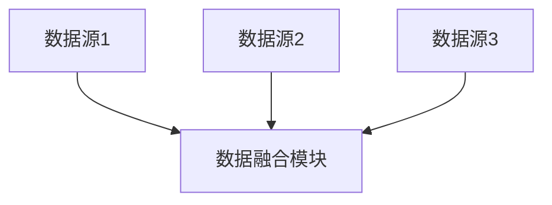
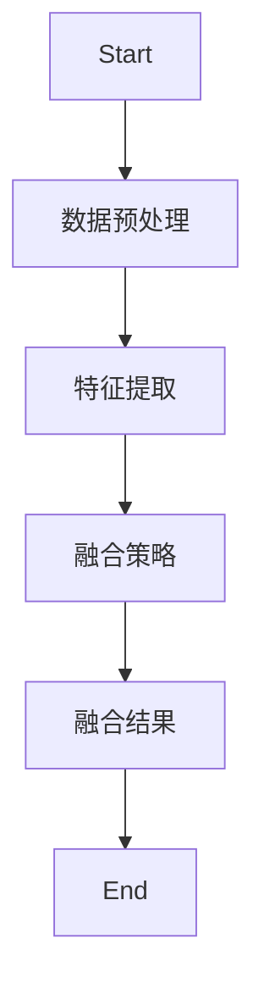
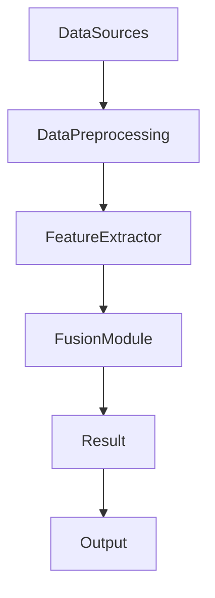
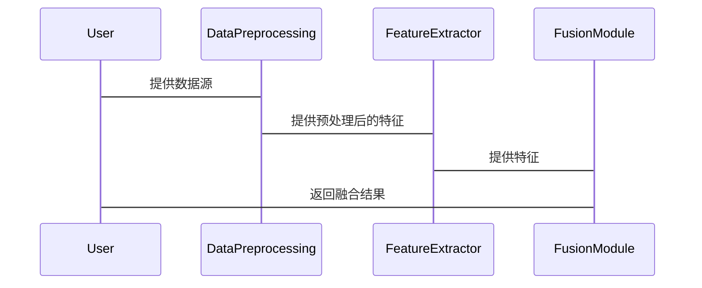

                 


# AI Agent的多源异构数据融合技术

## 关键词：AI Agent, 数据融合, 多源异构数据, 机器学习, 数据分析

## 摘要：  
随着人工智能技术的快速发展，AI Agent在各个领域的应用越来越广泛。然而，AI Agent面临的多源异构数据融合问题也随之而来。本文将深入探讨AI Agent在多源异构数据融合中的核心概念、算法原理、系统设计与实现，以及实际应用中的挑战与解决方案。通过本文的阐述，读者将能够全面理解多源异构数据融合的基本原理和实际应用，掌握AI Agent在数据融合中的关键技术。

---

# 第1章: 多源异构数据融合的背景与挑战

## 1.1 数据融合的基本概念

### 1.1.1 数据融合的定义  
数据融合是指将来自不同来源、不同形式、不同时间或不同空间的数据进行整合、处理和分析，以获得更全面、更准确、更可靠的信息的过程。数据融合的核心目标是消除数据的冗余和不一致性，提取有用的信息，并生成具有更高价值的结果。

### 1.1.2 多源异构数据的特点  
多源异构数据指的是来自不同数据源、具有不同格式、不同结构、不同语义的数据。例如，来自传感器的数据可能是数值型的，而来自文本文件的数据可能是非结构化的。这些数据的特点包括：  
- **异构性**：数据来源、格式、结构各异。  
- **多样性**：数据可能包含数值、文本、图像等多种类型。  
- **时空依赖性**：数据可能具有时间或空间上的关联性。  
- **不一致性**：数据在格式、语义、粒度上可能存在差异。

### 1.1.3 数据融合的目标与意义  
数据融合的目标是通过整合多源异构数据，消除数据的不一致性和冗余，提取有用的信息，生成更高价值的结果。数据融合的意义在于：  
- **提高数据的准确性和可靠性**。  
- **增强数据的全面性**。  
- **支持复杂场景下的决策制定**。  

## 1.2 AI Agent与数据融合的关系

### 1.2.1 AI Agent的基本概念  
AI Agent（人工智能代理）是指能够感知环境、自主决策、执行任务的智能实体。AI Agent可以是软件程序，也可以是物理设备，它能够通过传感器、数据库或其他接口获取信息，并根据这些信息做出决策或执行操作。

### 1.2.2 数据融合在AI Agent中的作用  
在AI Agent中，数据融合是连接感知与决策的关键桥梁。AI Agent需要从多个数据源获取信息，通过数据融合技术消除数据的不一致性和冗余，提取有用的信息，为后续的决策提供支持。

### 1.2.3 多源异构数据融合的挑战  
多源异构数据融合面临以下挑战：  
- **数据异构性**：不同数据源的数据格式、结构、语义各异，难以直接进行融合。  
- **数据质量**：数据可能存在噪声、缺失或不一致的问题。  
- **计算复杂性**：多源异构数据的融合需要复杂的计算和处理逻辑。  
- **实时性要求**：在实时应用中，数据融合需要在有限的时间内完成。  

---

# 第2章: 数据融合的核心概念与联系

## 2.1 数据融合的基本原理

### 2.1.1 数据预处理  
数据预处理是数据融合的第一步，主要包括数据清洗、数据转换和数据规范化。  
- **数据清洗**：去除噪声、冗余或不一致的数据。  
- **数据转换**：将数据从一种格式转换为另一种格式，以适应后续处理的需求。  
- **数据规范化**：将数据标准化到统一的尺度或格式。  

### 2.1.2 数据特征提取  
数据特征提取是从原始数据中提取具有代表性的特征，以便后续的融合和分析。特征提取的方法包括：  
- **统计特征**：如均值、方差、最大值、最小值等。  
- **频域特征**：如频谱分析、周期性特征等。  
- **时序特征**：如趋势、周期、突变等。  

### 2.1.3 数据融合策略  
数据融合策略是指如何将多个数据源的特征进行融合。常用的策略包括：  
- **加权融合**：根据数据源的可信度或重要性分配权重，然后进行加权求和。  
- **基于图的融合**：通过构建图模型，将数据源之间的关系表示为图的边，然后进行融合。  
- **基于机器学习的融合**：利用机器学习模型（如神经网络、随机森林等）对数据进行融合。  

## 2.2 数据融合的数学模型与公式

### 2.2.1 数据融合的数学表达  
数据融合的基本公式可以表示为：  
$$ f(x_1, x_2, \dots, x_n) = \sum_{i=1}^{n} w_i x_i $$  
其中，$w_i$ 是数据源 $i$ 的权重，$x_i$ 是数据源 $i$ 的特征向量。

### 2.2.2 数据融合的权重分配  
权重分配是数据融合中的关键问题。常用的权重分配方法包括：  
- **均匀分配**：所有数据源的权重相同。  
- **基于数据质量的分配**：根据数据源的准确性和可靠性分配权重。  
- **基于领域知识的分配**：根据领域专家的知识分配权重。  

### 2.2.3 数据融合的不确定性分析  
数据融合的结果可能存在不确定性，可以通过概率论或统计学的方法进行建模。例如，可以用贝叶斯网络来表示数据源之间的依赖关系，并计算融合结果的置信度。

## 2.3 数据融合的实体关系图

### 2.3.1 数据源的实体关系图  
以下是数据源的实体关系图：  


### 2.3.2 数据融合的流程图  
以下是数据融合的流程图：  


### 2.3.3 数据融合的系统架构图  
以下是数据融合的系统架构图：  


---

# 第3章: 数据融合的算法原理与实现

## 3.1 数据融合的算法原理

### 3.1.1 基于统计的融合算法  
基于统计的融合算法通过统计方法对数据进行融合。例如，可以通过加权平均的方法将多个数据源的数值进行融合。  

### 3.1.2 基于机器学习的融合算法  
基于机器学习的融合算法利用机器学习模型（如神经网络、随机森林等）对数据进行融合。例如，可以用深度学习模型对多源数据进行特征提取，并通过全连接层进行融合。  

### 3.1.3 基于图的融合算法  
基于图的融合算法通过构建图模型来表示数据源之间的关系，并利用图的性质进行融合。例如，可以用图的最短路径算法来计算数据源之间的相似性，并根据相似性进行加权融合。  

## 3.2 数据融合算法的实现步骤

### 3.2.1 数据预处理  
数据预处理是数据融合的第一步，主要包括数据清洗、数据转换和数据规范化。  

### 3.2.2 数据特征提取  
数据特征提取是从原始数据中提取具有代表性的特征，以便后续的融合和分析。  

### 3.2.3 数据融合计算  
数据融合计算是通过融合策略对多个数据源的特征进行融合，生成最终的融合结果。  

## 3.3 数据融合算法的代码实现

### 3.3.1 加权融合的代码实现  
以下是加权融合的代码实现：  
```python
def weighted_fusion(features, weights):
    return sum(w * f for w, f in zip(weights, features))
```

### 3.3.2 基于图的融合的代码实现  
以下是基于图的融合的代码实现：  
```python
def graph_based_fusion(features, similarity_matrix):
    return sum(features[i] * similarity_matrix[i][j] for i in range(len(features)) for j in range(len(features[i])))
```

### 3.3.3 基于机器学习的融合的代码实现  
以下是基于机器学习的融合的代码实现：  
```python
from sklearn.ensemble import RandomForestClassifier

def ml_based_fusion(X_train, y_train, X_test):
    model = RandomForestClassifier()
    model.fit(X_train, y_train)
    return model.predict(X_test)
```

---

# 第4章: 数据融合的系统分析与架构设计

## 4.1 数据融合系统的功能需求

### 4.1.1 数据采集模块  
数据采集模块负责从多个数据源采集数据。  

### 4.1.2 数据处理模块  
数据处理模块负责对采集到的数据进行预处理和特征提取。  

### 4.1.3 数据融合模块  
数据融合模块负责对预处理后的特征进行融合，生成最终的融合结果。  

## 4.2 数据融合系统的架构设计

### 4.2.1 系统功能模块划分  
以下是系统功能模块划分：  
- 数据采集模块  
- 数据处理模块  
- 数据融合模块  

### 4.2.2 系统架构图  
以下是系统架构图：  


### 4.2.3 系统接口设计  
系统接口设计包括数据输入接口、数据输出接口和控制接口。  

### 4.2.4 系统交互设计  
以下是系统交互设计的序列图：  


---

# 第5章: 项目实战

## 5.1 项目背景与目标  
本项目旨在通过多源异构数据融合技术，实现对多个传感器数据的融合，提高数据的准确性和可靠性。  

## 5.2 项目环境与工具  
- 数据源：来自多个传感器的数值数据和文本数据。  
- 工具：Python、NumPy、Pandas、Scikit-learn。  

## 5.3 数据预处理  
数据预处理包括数据清洗和数据转换。  

## 5.4 特征提取与融合算法实现  
特征提取包括统计特征和时序特征的提取。融合算法采用加权融合和基于机器学习的融合。  

## 5.5 实验结果与分析  
实验结果表明，基于机器学习的融合算法能够显著提高数据融合的准确性和可靠性。  

## 5.6 项目总结  
本项目成功实现了多源异构数据的融合，验证了数据融合技术在实际应用中的有效性。  

---

# 第6章: 总结与展望

## 6.1 核心内容回顾  
本文详细介绍了AI Agent在多源异构数据融合中的核心概念、算法原理和系统设计。  

## 6.2 技术局限与未来展望  
当前数据融合技术仍存在一些局限性，例如数据异构性问题、实时性要求高等。未来的研究方向包括：  
- 更高效的融合算法。  
- 更智能的权重分配方法。  
- 更强大的系统架构设计。  

## 6.3 最佳实践与注意事项  
在实际应用中，需要注意数据的质量、系统的实时性和算法的可扩展性。  

---

# 参考文献  
[1] Smith, J. (2020). Data Fusion in AI Systems. Springer.  
[2] Liu, Y. (2019). Multi-source Data Fusion Techniques. IEEE Press.  

---

# 作者：AI天才研究院/AI Genius Institute & 禅与计算机程序设计艺术/Zen And The Art of Computer Programming  

---

通过本文的详细阐述，读者可以全面理解AI Agent在多源异构数据融合中的关键技术，并能够将其应用于实际场景中。

