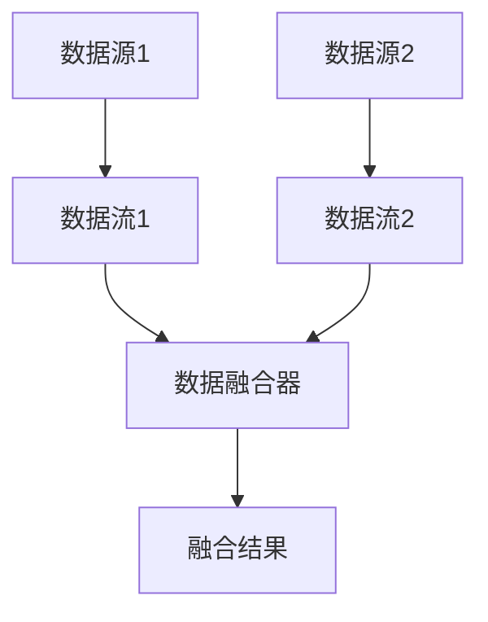

                 

# AI Agent的多源数据融合：整合LLM与多种数据流

## 关键词：AI Agent、多源数据融合、LLM、数据流、数据整合、机器学习

## 摘要：  
随着人工智能技术的快速发展，AI Agent（人工智能代理）在各个领域的应用越来越广泛。为了使AI Agent能够更好地理解和处理复杂场景中的信息，多源数据融合技术变得至关重要。本文将深入探讨如何整合大语言模型（LLM）与多种数据流，以实现高效、准确的多源数据融合。通过分析数据流的类型、数据融合的方法与策略，结合具体的算法原理和系统架构设计，本文将为读者提供一份全面的技术指南，帮助他们理解并实现AI Agent的多源数据融合。

---

# 第1章: AI Agent与多源数据融合的背景介绍

## 1.1 AI Agent的基本概念  
AI Agent是一种智能实体，能够感知环境、自主决策并执行任务。与传统软件不同，AI Agent具备以下特点：  
1. **自主性**：能够在没有外部干预的情况下独立运行。  
2. **反应性**：能够根据环境的变化动态调整行为。  
3. **目标导向**：具备明确的目标，并通过行动实现目标。  
4. **学习能力**：能够通过经验改进自身的性能。  

AI Agent的核心要素包括感知、推理、决策和执行。这些要素使其能够处理复杂场景中的信息，并做出合理的决策。

---

## 1.2 多源数据融合的背景与意义  
在实际应用中，AI Agent需要处理来自多种来源的数据，例如传感器数据、文本数据、图像数据等。然而，这些数据往往存在以下问题：  
1. **数据异构性**：不同数据源的数据格式和语义可能不同。  
2. **数据冗余**：同一信息可能通过多个数据源被多次记录。  
3. **数据不一致**：不同数据源可能对同一事实给出不同的描述。  

多源数据融合的目标是将这些异构、冗余且不一致的数据整合成一个统一的、准确的表示。通过数据融合，AI Agent能够更全面地理解环境，从而做出更准确的决策。

---

## 1.3 LLM与多源数据融合的结合  
大语言模型（LLM）如GPT-3、PaLM等具备强大的文本生成和理解能力，能够处理大量的非结构化数据。在多源数据融合中，LLM可以用于以下场景：  
1. **文本数据的生成与理解**：将结构化数据转化为自然语言描述，或从文本中提取结构化信息。  
2. **跨模态数据融合**：将文本、图像、传感器数据等多模态数据进行融合，生成更全面的语义表示。  
3. **动态数据更新**：根据实时数据流动态更新模型的语义理解能力。  

通过结合LLM，多源数据融合能够更好地处理复杂场景中的信息，提升AI Agent的智能水平。

---

## 1.4 本章小结  
本章介绍了AI Agent的基本概念、多源数据融合的背景与意义，以及LLM在数据融合中的作用。接下来，我们将深入探讨多源数据融合的核心概念与原理。

---

# 第2章: 多源数据融合的核心概念与原理  

## 2.1 数据流的类型与特征  
数据流可以根据多个维度进行分类：  

### 2.1.1 结构化数据流  
结构化数据流具有明确的结构和语义，例如数据库中的表结构。这类数据流通常通过SQL查询等方式进行处理。  

### 2.1.2 非结构化数据流  
非结构化数据流缺乏明确的结构，例如文本、图像、音频等。处理这类数据流需要借助自然语言处理（NLP）和计算机视觉（CV）等技术。  

### 2.1.3 实时数据流与历史数据流  
实时数据流是指在事件发生时立即生成的数据，例如传感器实时传回的数据。历史数据流则是指过去某一时间段内的数据，通常用于事后分析。  

---

## 2.2 数据融合的方法与策略  

### 2.2.1 基于规则的融合方法  
基于规则的融合方法通过预定义的规则将不同数据源的数据进行合并。例如，可以通过规则将多个传感器的数据进行加权平均。  

### 2.2.2 基于模型的融合方法  
基于模型的融合方法通过构建一个统一的模型来整合多种数据源的信息。例如，可以使用深度学习模型对结构化和非结构化数据进行联合训练。  

### 2.2.3 基于LLM的生成式融合方法  
基于LLM的生成式融合方法利用大语言模型的生成能力，将多种数据源的信息转化为统一的语义表示。例如，可以将传感器数据和文本描述通过LLM生成一个综合的事件描述。  

---

## 2.3 数据融合的质量评估  

### 2.3.1 数据一致性评估  
数据一致性评估用于衡量不同数据源之间的冲突程度。例如，可以通过计算数据源之间的相似性来评估数据的一致性。  

### 2.3.2 数据完整性评估  
数据完整性评估用于衡量融合后的数据是否涵盖了所有相关的信息。例如，可以通过检查数据的覆盖范围来评估数据的完整性。  

### 2.3.3 数据相关性评估  
数据相关性评估用于衡量不同数据源之间的关联程度。例如，可以通过计算数据源之间的相关系数来评估数据的相关性。  

---

## 2.4 数据融合的实体关系图  

---

## 2.5 本章小结  
本章介绍了多源数据融合的核心概念与原理，包括数据流的类型、数据融合的方法与策略，以及数据融合的质量评估。接下来，我们将深入探讨数据融合的算法原理与实现。

---

（由于篇幅限制，后续章节内容将逐步展开，涵盖算法原理、系统架构设计、项目实战等内容。）

