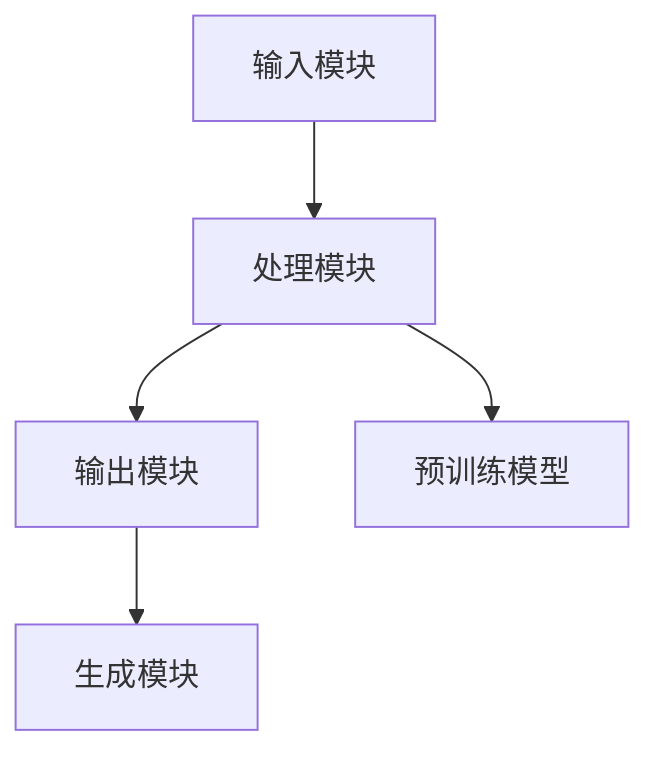

                 


# AI Agent的多语言支持：跨语言理解与生成

> 关键词：AI Agent，多语言支持，跨语言理解，跨语言生成，NLP，深度学习

> 摘要：本文深入探讨了AI Agent在多语言环境下的支持能力，重点分析了跨语言理解与生成的核心原理、算法实现、系统架构设计以及实际应用案例。通过详细的技术分析和实践指导，本文为读者提供了从理论到实践的全面视角，帮助理解如何构建和优化具备多语言能力的AI Agent。

---

## 第一部分: AI Agent的多语言支持概述

### 第1章: AI Agent与多语言支持概述

#### 1.1 AI Agent的基本概念
- **1.1.1 AI Agent的定义与特点**
  - AI Agent是一种智能体，能够感知环境、自主决策并执行任务。
  - 具有自主性、反应性、目标导向和学习能力等特点。

- **1.1.2 多语言支持的重要性**
  - 在全球化背景下，AI Agent需要能够理解并生成多种语言，以满足跨语言交互的需求。
  - 多语言支持提升了AI Agent的通用性和用户体验。

- **1.1.3 跨语言理解与生成的背景与意义**
  - 随着NLP技术的进步，跨语言处理成为可能。
  - 跨语言理解与生成是实现真正智能化AI Agent的核心能力。

#### 1.2 多语言NLP的核心挑战
- **1.2.1 语言间的语义差异**
  - 同一概念在不同语言中的表达可能不同。
  - 语义理解需要跨越语言障碍。

- **1.2.2 跨语言模型的训练难点**
  - 数据稀缺性：某些语言的标注数据不足。
  - 训练效率：跨语言模型需要处理多语言数据，计算资源需求高。

- **1.2.3 跨语言任务的多样性**
  - 翻译、问答、文本生成等任务各有特点。
  - 需要设计通用或特定任务的模型结构。

#### 1.3 跨语言理解与生成的应用场景
- **1.3.1 跨语言对话系统**
  - 支持多语言用户进行实时对话。
  - 例如：跨国客服系统、多语言智能助手。

- **1.3.2 跨语言文本生成**
  - 将一种语言的文本生成为目标语言的文本。
  - 应用于内容生成、新闻翻译等领域。

- **1.3.3 跨语言信息检索**
  - 在多语言环境中检索相关信息。
  - 例如：跨语言搜索引擎、多语言知识库查询。

#### 1.4 本章小结
- 本章介绍了AI Agent的基本概念，强调了多语言支持的重要性。
- 分析了跨语言NLP的核心挑战，并列举了典型应用场景。

---

## 第二部分: 跨语言理解与生成的核心概念

### 第2章: 跨语言理解与生成的核心概念

#### 2.1 跨语言理解的原理
- **2.1.1 跨语言词嵌入**
  - 通过词嵌入模型（如Word2Vec、BERT）将词语映射到低维向量空间。
  - 跨语言对齐：通过对比学习等方法对齐不同语言的词向量。

- **2.1.2 跨语言句法分析**
  - 基于依存句法分析或 constituency parsing 进行句法结构分析。
  - 跨语言句法树的构建与对齐。

- **2.1.3 跨语言语义理解**
  - 基于预训练模型（如BERT、GPT）进行跨语言语义理解。
  - 使用跨语言对比学习提升语义对齐精度。

#### 2.2 跨语言生成的机制
- **2.2.1 跨语言翻译模型**
  - 神经机器翻译模型（NMT）：基于编码器-解码器架构。
  - 注意力机制：捕捉源语言与目标语言之间的关联。

- **2.2.2 跨语言文本生成模型**
  - 基于GPT等模型的跨语言微调。
  - 多语言生成模型：如mBART、XLM。

- **2.2.3 跨语言对话生成**
  - 基于预训练对话模型（如DIALOGUE-BERT）进行跨语言对话生成。
  - 对话历史与上下文的跨语言对齐。

#### 2.3 跨语言模型的评估指标
- **2.3.1 语言理解准确率**
  - 使用跨语言问答任务（如MUC、PAWS-X）评估模型理解能力。

- **2.3.2 语言生成质量**
  - 使用BLEU、ROUGE等指标评估生成文本的质量。

- **2.3.3 跨语言一致性**
  - 检查生成文本与输入文本的语义一致性。

#### 2.4 本章小结
- 本章深入探讨了跨语言理解与生成的核心概念。
- 分析了跨语言词嵌入、句法分析、语义理解以及生成模型的实现机制。

---

## 第三部分: 跨语言NLP的算法原理

### 第3章: 跨语言NLP的算法原理

#### 3.1 跨语言编码器-解码器模型
- **3.1.1 编码器结构**
  - 使用Transformer编码器将源语言文本映射到向量空间。
  - 跨语言对齐：通过对比学习增强编码器的跨语言表示能力。

- **3.1.2 解码器结构**
  - 解码器基于目标语言的词表生成输出。
  - 注意力机制用于捕捉源语言与目标语言之间的关联。

- **3.1.3 跨语言注意力机制**
  - 使用多模态注意力机制同时关注源语言和目标语言的特征。
  - 可视化注意力权重以理解模型的决策过程。

#### 3.2 跨语言模型的训练策略
- **3.2.1 多任务学习**
  - 在同一框架下同时学习多种跨语言任务（如翻译、问答）。
  - 使用任务权重分配策略平衡不同任务的影响。

- **3.2.2 跨语言预训练**
  - 基于大规模多语言数据进行自监督预训练。
  - 如MUlti-lingual BERT（mBERT）的预训练方法。

- **3.2.3 跨语言微调**
  - 在特定任务上使用小规模标注数据进行微调。
  - 如针对翻译任务的微调策略。

#### 3.3 跨语言模型的优化方法
- **3.3.1 参数共享**
  - 在多语言模型中共享部分参数以减少计算量。
  - 使用层-wise 或 token-wise 参数共享策略。

- **3.3.2 跨语言数据增强**
  - 使用人工生成的跨语言数据增强训练数据。
  - 如使用机器翻译生成伪平行数据。

- **3.3.3 跨语言模型压缩**
  - 使用模型剪枝、知识蒸馏等技术压缩模型大小。
  - 降低模型计算复杂度，提升推理效率。

#### 3.4 本章小结
- 本章详细讲解了跨语言NLP的核心算法原理。
- 介绍了编码器-解码器模型、预训练与微调策略以及模型优化方法。

---

## 第四部分: 跨语言NLP的数学模型与公式

### 第4章: 跨语言NLP的数学模型与公式

#### 4.1 跨语言词嵌入模型
- **4.1.1 Word2Vec公式**
  - 词嵌入的训练目标是最小化负采样损失：
  $$
  \text{损失函数} = -\log p(w_i | w_c) - \sum_{j=1}^k \log p(w_j | w_c)
  $$

- **4.1.2 跨语言词嵌入的对齐方法**
  - 使用对比学习对齐不同语言的词向量：
  $$
  \text{损失} = -\log \frac{e^{s(w_i, w'_j)}}{\sum_{k} e^{s(w_i, w'_k)}}}
  $$
  其中$s(w_i, w'_j)$是词对的相似度分数。

#### 4.2 跨语言翻译模型
- **4.2.1 神经机器翻译模型**
  - 编码器输出的向量表示：
  $$
  h = \text{Encoder}(x)
  $$
  - 解码器基于$h$生成目标语言序列：
  $$
  y_i = \text{Decoder}(h, y_{<i})
  $$

- **4.2.2 跨语言翻译的注意力机制**
  - 注意力权重计算：
  $$
  \alpha_{i,j} = \frac{\exp(e_{i,j})}{\sum_{k} \exp(e_{i,k})}
  $$
  其中$e_{i,j}$是查询和键的相似度。

#### 4.3 跨语言生成模型
- **4.3.1 GPT模型的跨语言扩展**
  - 使用多语言词表进行生成：
  $$
  P(y|x) = \prod_{i=1}^n P(y_i | y_{<i}, x)
  $$

- **4.3.2 跨语言生成的损失函数**
  - 使用交叉熵损失：
  $$
  \text{损失} = -\sum_{i=1}^n \log P(y_i | y_{<i}, x)
  $$

#### 4.4 本章小结
- 本章通过数学公式深入分析了跨语言NLP的核心模型。
- 包括词嵌入、翻译模型和生成模型的数学推导。

---

## 第五部分: 跨语言NLP的系统架构设计

### 第5章: 跨语言NLP的系统架构设计

#### 5.1 跨语言NLP系统的组成
- **5.1.1 数据输入模块**
  - 接收多语言输入文本。
  - 支持多种语言的文本解析。

- **5.1.2 跨语言处理模块**
  - 包括词嵌入、句法分析、语义理解等子模块。
  - 使用预训练模型进行跨语言特征提取。

- **5.1.3 输出生成模块**
  - 根据处理结果生成目标语言文本。
  - 支持多种生成模式（如翻译、问答）。

#### 5.2 跨语言NLP系统的功能设计
- **5.2.1 跨语言理解功能**
  - 通过预训练模型进行多语言语义理解。
  - 支持多种语言的文本分析。

- **5.2.2 跨语言生成功能**
  - 使用生成模型输出目标语言文本。
  - 支持生成多种语言的文本内容。

- **5.2.3 跨语言交互功能**
  - 实现多语言对话系统。
  - 支持实时跨语言交互。

#### 5.3 跨语言NLP系统的架构图


#### 5.4 跨语言NLP系统的接口设计
- **5.4.1 输入接口**
  - 支持多种语言的文本输入。
  - 提供API接口供其他系统调用。

- **5.4.2 输出接口**
  - 提供生成文本的输出接口。
  - 支持多种格式（如JSON、文本）。

#### 5.5 跨语言NLP系统的交互设计
- **5.5.1 跨语言对话交互**
  - 用户输入多语言查询。
  - 系统实时生成目标语言回复。

- **5.5.2 跨语言信息检索**
  - 用户输入多语言关键词。
  - 系统检索并返回多语言结果。

#### 5.6 本章小结
- 本章分析了跨语言NLP系统的组成与功能。
- 通过架构图和交互图展示了系统的整体设计。

---

## 第六部分: 跨语言NLP的项目实战

### 第6章: 跨语言NLP的项目实战

#### 6.1 项目环境配置
- **6.1.1 环境搭建**
  - 安装Python、PyTorch、Hugging Face库等依赖。
  - 配置多语言数据集（如WMT数据集）。

- **6.1.2 工具安装**
  - 使用Hugging Face的Transformers库进行模型加载。
  - 安装NVIDIA GPU驱动和CUDA工具（如需要GPU加速）。

#### 6.2 核心代码实现
- **6.2.1 跨语言翻译模型实现**
  ```python
  from transformers import AutoModelWithLMHead, AutoTokenizer

  model = AutoModelWithLMHead.from_pretrained('facebook/mBART')
  tokenizer = AutoTokenizer.from_pretrained('facebook/mBART')
  ```

- **6.2.2 跨语言生成模型实现**
  ```python
  def generate_summary(text, target_lang):
      inputs = tokenizer(text, return_tensors='pt')
      outputs = model.generate(**inputs, max_length=100, forced_bos_token_id=tokenizer.get_tokenizer().lang_to_id[target_lang])
      return tokenizer.decode(outputs[0], skip_special_tokens=True)
  ```

- **6.2.3 跨语言对话生成实现**
  ```python
  def chat_with_agent(user_input, target_lang):
      inputs = tokenizer(user_input, return_tensors='pt')
      outputs = model.generate(**inputs, max_length=50, forced_bos_token_id=tokenizer.get_tokenizer().lang_to_id[target_lang])
      return tokenizer.decode(outputs[0], skip_special_tokens=True)
  ```

#### 6.3 案例分析与代码解读
- **6.3.1 跨语言翻译案例**
  - 输入：中文句子“你好，今天天气很好。”
  - 输出：英文句子“Hello, the weather is very good today.”

- **6.3.2 跨语言生成案例**
  - 输入：英文标题“AI in Healthcare”
  - 输出：中文标题“人工智能在医疗领域中的应用”

#### 6.4 项目总结
- 本章通过实际项目展示了跨语言NLP的实现过程。
- 包括环境配置、模型选择、代码实现以及案例分析。

---

## 第七部分: 跨语言NLP的最佳实践与总结

### 第7章: 跨语言NLP的最佳实践

#### 7.1 最佳实践
- **7.1.1 数据预处理**
  - 确保数据清洗和标注的准确性。
  - 使用数据增强提升模型鲁棒性。

- **7.1.2 模型选择**
  - 根据任务需求选择合适的预训练模型。
  - 如翻译任务选择mBART，生成任务选择GPT。

- **7.1.3 跨语言对齐**
  - 使用对比学习优化词向量对齐。
  - 提升模型的跨语言一致性。

#### 7.2 小结
- 本文系统地介绍了AI Agent的多语言支持能力。
- 从理论到实践，详细讲解了跨语言理解与生成的核心技术。

#### 7.3 注意事项
- 数据质量和多样性对模型性能至关重要。
- 跨语言模型的计算资源需求较高，需优化部署策略。

#### 7.4 拓展阅读
- 建议读者深入学习多语言NLP的经典论文（如“BERT: Pre-training of Deep Bidirectional Transformers”）。
- 关注最新的多语言NLP研究进展。

---

## 作者

作者：AI天才研究院/AI Genius Institute & 禅与计算机程序设计艺术 /Zen And The Art of Computer Programming

---

通过以上内容，读者可以系统地了解AI Agent的多语言支持能力，从理论到实践，逐步掌握跨语言理解与生成的核心技术。本文结合了技术分析和实际案例，为读者提供了全面的视角和实用的指导。

