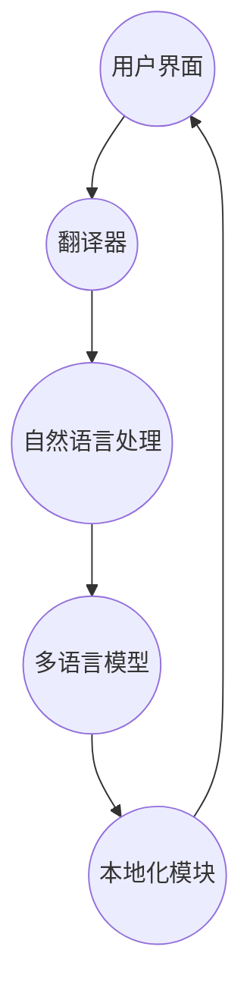
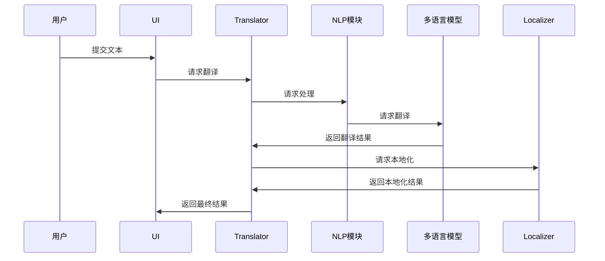

                 


# AI Agent的多语言翻译与本地化

## 关键词：AI Agent、多语言翻译、本地化、自然语言处理、机器学习

## 摘要：本文深入探讨AI Agent在多语言翻译和本地化中的应用，分析其核心原理、技术挑战及解决方案。通过系统架构设计和项目实战，展示如何构建高效的AI Agent，满足全球化需求。

---

## 第一部分: AI Agent的多语言翻译与本地化背景

### 第1章: AI Agent与多语言翻译概述

#### 1.1 AI Agent的基本概念
##### 1.1.1 AI Agent的定义与核心特征
AI Agent是一种智能代理，具备感知环境、推理决策和自主行动的能力。其核心特征包括自主性、反应性、目标导向和社交能力。

##### 1.1.2 多语言翻译的背景与重要性
多语言翻译在跨国交流中至关重要，AI Agent通过自然语言处理技术实现高效翻译，打破语言障碍。

##### 1.1.3 AI Agent在多语言翻译中的应用现状
AI Agent广泛应用于实时翻译、跨语言对话和内容生成，提升用户体验。

#### 1.2 多语言翻译的背景与挑战
##### 1.2.1 多语言翻译的基本概念
多语言翻译涉及多种语言间的转换，需考虑语法、词汇和文化差异。

##### 1.2.2 多语言翻译的主要挑战
挑战包括文化差异、术语一致性、语境理解和性能优化。

##### 1.2.3 AI技术在多语言翻译中的作用
AI技术如神经机器翻译和预训练模型提升翻译质量，降低人工成本。

#### 1.3 本地化的概念与重要性
##### 1.3.1 本地化的定义
本地化是将产品或内容适应特定地区的语言和文化的过程。

##### 1.3.2 本地化与国际化的区别
国际化是为多语言支持做准备，本地化是具体实施。

##### 1.3.3 本地化在多语言翻译中的意义
本地化确保内容在不同地区适用，提升用户体验。

---

### 第2章: AI Agent的核心原理

#### 2.1 AI Agent的结构与工作流程
##### 2.1.1 AI Agent的基本结构
AI Agent通常由感知层、推理层和行动层组成，各层协同工作。

##### 2.1.2 AI Agent的工作流程
感知环境信息，进行推理和决策，执行行动，形成闭环。

##### 2.1.3 AI Agent的核心算法
包括自然语言处理、强化学习和图神经网络等算法。

#### 2.2 自然语言处理基础
##### 2.2.1 NLP的基本概念
NLP处理人类语言，实现文本理解与生成。

##### 2.2.2 Transformer模型的原理
Transformer模型通过自注意力机制，捕捉长距离依赖关系。

##### 2.2.3 多语言模型的训练方法
采用多语言数据联合训练，共享语言表示，提升跨语言理解能力。

#### 2.3 跨语言理解与生成机制
##### 2.3.1 跨语言表示学习
通过共享嵌入层，学习跨语言的共同表示。

##### 2.3.2 多语言翻译的神经网络模型
构建跨语言注意力机制，处理多语言输入输出。

##### 2.3.3 跨语言迁移学习
利用源语言数据，迁移学习至低资源语言，提升翻译效果。

---

### 第3章: 多语言翻译技术详解

#### 3.1 多语言翻译模型的构建
##### 3.1.1 多语言模型的训练策略
采用多任务学习，共享参数，提升模型泛化能力。

##### 3.1.2 跨语言注意力机制
注意力权重根据输入语言动态调整，优化翻译效果。

##### 3.1.3 多语言词表的设计
统一词表管理，减少词汇冲突，提升翻译准确性。

#### 3.2 翻译质量评估方法
##### 3.2.1 基于BLEU的评估方法
BLEU指标结合精确匹配和n-gram重合度，评估翻译质量。

##### 3.2.2 基于ROUGE的评估方法
ROUGE指标侧重于召回率，适用于摘要和翻译评估。

##### 3.2.3 人工评估与自动化评估的结合
结合人工评估，克服自动化指标的局限性，全面评估翻译质量。

#### 3.3 多语言翻译中的文化适应性
##### 3.3.1 文化差异对翻译的影响
文化差异导致直译不可行，需调整表达方式。

##### 3.3.2 如何在翻译中融入文化适应性
引入文化语境特征，优化翻译模型，生成更自然的译文。

##### 3.3.3 多语言翻译中的文化敏感性处理
建立文化特征库，调整翻译策略，确保文化适应性。

---

## 第4章: 本地化挑战与解决方案

#### 4.1 本地化的核心挑战
##### 4.1.1 文化差异带来的本地化问题
文化差异导致语言表达差异，影响翻译准确性。

##### 4.1.2 技术实现中的本地化挑战
系统需支持多语言切换，处理本地化数据。

##### 4.1.3 法律与合规性问题
遵守当地法律法规，确保内容合法合规。

#### 4.2 本地化解决方案
##### 4.2.1 文化适应性策略
根据目标文化调整内容，确保本地化效果。

##### 4.2.2 技术实现方案
采用模块化设计，支持多语言动态切换。

##### 4.2.3 法律合规性措施
了解当地法规，确保内容符合法律要求。

---

## 第5章: 系统架构设计与实现

#### 5.1 问题场景介绍
AI Agent需支持多语言翻译和本地化，满足全球化需求。

#### 5.2 项目介绍
构建一个多语言翻译与本地化系统，支持多种语言实时翻译和文化适应。

#### 5.3 系统功能设计
##### 5.3.1 领域模型
- 用户输入：多语言文本
- 系统输出：翻译结果和本地化建议

##### 5.3.2 系统架构设计
采用微服务架构，各模块协同工作，支持高并发和扩展性。

#### 5.4 系统架构设计
##### 5.4.1 系统架构图


#### 5.5 系统接口设计
##### 5.5.1 翻译接口
- 输入：源语言文本
- 输出：目标语言文本

##### 5.5.2 本地化接口
- 输入：翻译结果和目标文化特征
- 输出：本地化文本

#### 5.6 系统交互
##### 5.6.1 序列图


---

## 第6章: 项目实战

#### 6.1 环境安装
安装Python、TensorFlow和相关库，搭建开发环境。

#### 6.2 核心实现代码
##### 6.2.1 翻译器实现
```python
class Translator:
    def __init__(self, model):
        self.model = model

    def translate(self, text, src_lang, tgt_lang):
        return self.model.translate(text, src_lang, tgt_lang)
```

##### 6.2.2 本地化模块实现
```python
class Localizer:
    def __init__(self, culture_rules):
        self.culture_rules = culture_rules

    def localize(self, text):
        for rule in self.culture_rules:
            text = rule.apply(text)
        return text
```

#### 6.3 代码解读
解释代码结构，展示各模块协作实现翻译与本地化的流程。

#### 6.4 实际案例分析
以中英文翻译为例，展示本地化处理过程，强调文化适应性的重要性。

---

## 第7章: 总结与展望

### 7.1 总结
AI Agent在多语言翻译和本地化中的应用显著提升跨语言交流效率，文化适应性优化用户体验。

### 7.2 注意事项
在实际应用中，需处理文化差异、技术实现和法律合规性问题。

### 7.3 未来展望
结合生成式AI和增强学习，进一步提升翻译质量，优化本地化流程。

---

## 作者：AI天才研究院 & 禅与计算机程序设计艺术

---

通过以上结构，文章详细探讨了AI Agent在多语言翻译和本地化中的应用，结合理论与实践，为读者提供了全面的视角和深入的技术分析。

