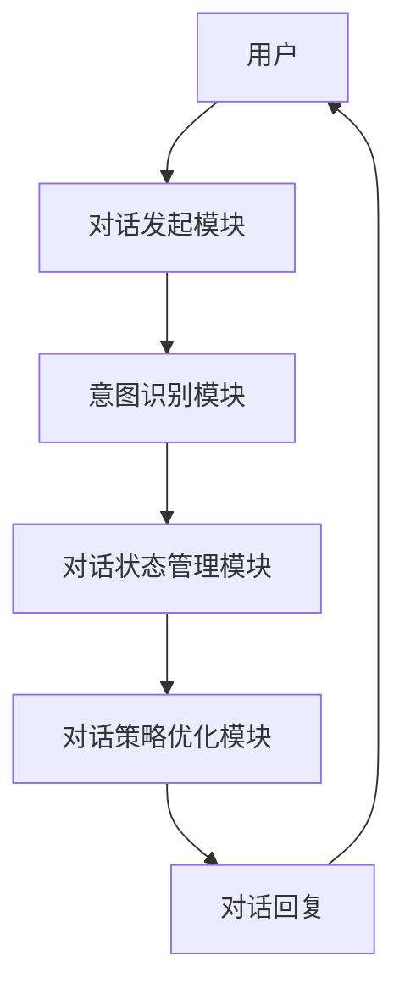
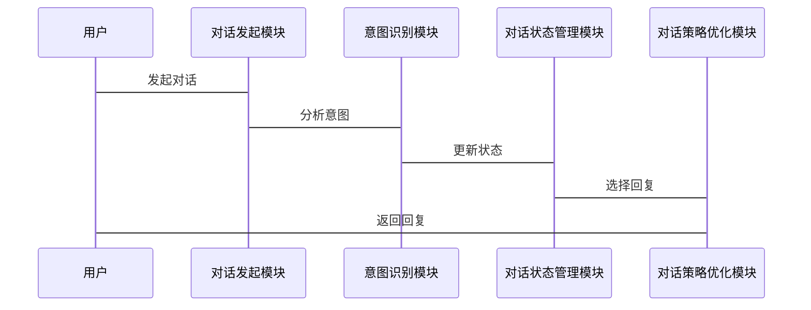

                 


# AI Agent的多轮对话管理系统设计

## 关键词：AI Agent, 多轮对话, 对话管理, 系统设计, 自然语言处理

## 摘要：  
AI Agent作为一种智能体，能够在复杂环境中自主决策和交互。多轮对话管理是AI Agent实现复杂任务的核心能力之一。本文从AI Agent的基本概念出发，深入探讨多轮对话管理的核心原理、算法实现、系统架构设计以及实际应用案例。通过分析对话上下文、意图识别、对话状态管理等关键要素，结合具体的算法和系统设计，帮助读者全面理解AI Agent多轮对话管理的实现细节，并提供实际的项目开发指导。

---

# 第一部分: AI Agent的多轮对话管理概述

## 第1章: AI Agent与多轮对话管理概述

### 1.1 AI Agent的基本概念

#### 1.1.1 AI Agent的定义  
AI Agent（人工智能代理）是指能够感知环境、自主决策并执行任务的智能实体。AI Agent可以是软件程序，也可以是硬件设备，其核心目标是通过与环境的交互，完成特定任务或提供服务。

#### 1.1.2 AI Agent的核心特征  
- **自主性**：AI Agent能够在没有外部干预的情况下独立运行。  
- **反应性**：能够实时感知环境并做出响应。  
- **目标导向**：具备明确的目标，所有行为都围绕目标展开。  
- **学习能力**：能够通过数据和经验优化自身行为。  

#### 1.1.3 多轮对话的定义与特点  
多轮对话是指用户与AI Agent之间进行的多次交互，对话内容前后连贯，逐步推进。其特点包括：  
- **上下文依赖性**：每一轮对话都依赖于之前的对话历史。  
- **复杂性**：需要处理歧义、情感和意图的多样变化。  
- **动态性**：对话内容和目标可能随着交互而变化。  

---

### 1.2 多轮对话管理的背景与挑战

#### 1.2.1 当前对话系统的发展现状  
当前，对话系统已广泛应用于客服、智能助手、教育等领域。然而，大多数系统仍存在对话不连贯、上下文理解不足等问题。  

#### 1.2.2 多轮对话管理的核心问题  
- **意图识别**：准确理解用户的意图。  
- **对话状态管理**：跟踪对话进展并维护上下文。  
- **对话策略优化**：选择合适的回复以引导对话走向目标。  

#### 1.2.3 多轮对话的典型应用场景  
- **智能客服**：解决用户问题，提供高效服务。  
- **虚拟助手**：如Siri、Alexa等，提供日常帮助。  
- **教育辅助**：为学生提供个性化的学习支持。  

---

### 1.3 本章小结  
本章介绍了AI Agent的基本概念和多轮对话管理的核心要素，明确了多轮对话管理的目标和挑战，并通过实际应用场景展示了其重要性。

---

# 第二部分: AI Agent的多轮对话管理核心概念与联系

## 第2章: AI Agent的核心概念与原理

### 2.1 AI Agent的类型与分类

#### 2.1.1 基于规则的AI Agent  
- **定义**：通过预定义的规则和条件来执行任务。  
- **优点**：简单易懂，适用于规则明确的场景。  
- **缺点**：难以处理复杂和动态变化的环境。  

#### 2.1.2 基于模型的AI Agent  
- **定义**：依赖于数学模型和概率推理进行决策。  
- **优点**：能够处理复杂问题，适应性强。  
- **缺点**：实现复杂，需要大量数据支持。  

#### 2.1.3 基于强化学习的AI Agent  
- **定义**：通过与环境交互，基于奖励机制优化行为策略。  
- **优点**：能够在动态环境中自适应优化。  
- **缺点**：需要大量训练数据和计算资源。  

---

### 2.2 多轮对话的核心要素

#### 2.2.1 对话上下文  
- **定义**：对话中的当前语境和背景信息。  
- **作用**：帮助AI Agent理解用户的意图和情感。  

#### 2.2.2 对话历史  
- **定义**：过去所有对话内容的记录。  
- **作用**：用于保持对话的连贯性和一致性。  

#### 2.2.3 对话目标  
- **定义**：对话的最终目的或期望结果。  
- **作用**：指导AI Agent的行为选择。  

---

### 2.3 AI Agent与多轮对话的关系

#### 2.3.1 AI Agent在多轮对话中的角色  
- **倾听者**：接收用户输入并理解意图。  
- **思考者**：分析对话内容并生成回复。  
- **执行者**：根据对话目标采取相应行动。  

#### 2.3.2 多轮对话对AI Agent的要求  
- **上下文理解能力**：准确捕捉对话中的关键信息。  
- **灵活应对能力**：根据对话进展调整策略。  
- **记忆能力**：维护对话历史和状态。  

#### 2.3.3 AI Agent如何提升对话体验  
- **个性化服务**：根据用户历史行为提供定制化回复。  
- **情感共鸣**：通过情感分析增强用户体验。  
- **高效问题解决**：快速定位用户需求并提供解决方案。  

---

### 2.4 本章小结  
本章分析了AI Agent的类型及其在多轮对话中的角色，明确了多轮对话的核心要素，并探讨了AI Agent如何提升对话体验。

---

# 第三部分: AI Agent多轮对话管理的算法原理

## 第3章: 多轮对话管理的算法原理

### 3.1 意图识别算法

#### 3.1.1 基于规则的意图识别  
- **实现方式**：通过预定义的关键词和规则匹配用户的意图。  
- **示例**：当用户输入“我要买苹果”，系统识别出“购买”意图。  

#### 3.1.2 基于机器学习的意图识别  
- **算法选择**：使用朴素贝叶斯或支持向量机（SVM）进行分类。  
- **步骤**：  
  1. 数据预处理：提取文本特征。  
  2. 模型训练：构建分类器。  
  3. 意图预测：输入文本，输出意图。  

#### 3.1.3 基于深度学习的意图识别  
- **算法选择**：使用循环神经网络（RNN）或Transformer模型。  
- **优势**：能够捕捉文本的上下文信息，提升准确率。  

---

### 3.2 对话状态管理算法

#### 3.2.1 基于马尔可夫链的状态管理  
- **原理**：通过状态转移概率矩阵，预测下一个状态。  
- **公式**：  
  $$ P(s_{t+1}|s_t) = \text{转移概率矩阵} $$  

#### 3.2.2 基于神经网络的状态管理  
- **算法选择**：使用长短时记忆网络（LSTM）或Transformer。  
- **优势**：能够处理长序列数据，保持上下文一致性。  

#### 3.2.3 基于知识图谱的状态管理  
- **原理**：通过构建领域知识图谱，推理对话状态。  
- **步骤**：  
  1. 构建领域知识图谱。  
  2. 通过推理引擎，更新对话状态。  

---

### 3.3 对话策略优化算法

#### 3.3.1 基于Q-learning的策略优化  
- **原理**：通过状态-动作-奖励机制，优化策略。  
- **公式**：  
  $$ Q(s, a) = r + \gamma \max Q(s', a') $$  

#### 3.3.2 基于深度强化学习的策略优化  
- **算法选择**：使用深度Q网络（DQN）或策略梯度方法。  
- **优势**：能够在复杂环境中实现端到端优化。  

#### 3.3.3 基于贝叶斯网络的策略优化  
- **原理**：通过贝叶斯网络建模，计算最优策略的概率。  
- **步骤**：  
  1. 构建贝叶斯网络。  
  2. 计算各策略的后验概率，选择最优策略。  

---

### 3.4 本章小结  
本章详细介绍了多轮对话管理中的核心算法，包括意图识别、对话状态管理和策略优化，并通过具体实现和公式推导，帮助读者理解其工作原理。

---

# 第四部分: AI Agent多轮对话管理的系统架构设计

## 第4章: 系统分析与架构设计方案

### 4.1 项目背景与目标

#### 4.1.1 项目背景  
本项目旨在设计一个基于AI Agent的多轮对话管理系统，应用于智能客服领域。  

#### 4.1.2 项目目标  
- 实现用户与AI Agent之间的多轮对话交互。  
- 提供高效的意图识别和对话状态管理能力。  

#### 4.1.3 项目范围  
- 支持文本输入和输出。  
- 实现意图识别、对话状态管理和策略优化功能。  

---

### 4.2 系统功能设计

#### 4.2.1 对话发起模块  
- **功能**：接收用户输入并启动对话流程。  

#### 4.2.2 意图识别模块  
- **功能**：分析用户输入，识别意图。  

#### 4.2.3 对话状态管理模块  
- **功能**：维护对话上下文和历史记录。  

#### 4.2.4 对话策略优化模块  
- **功能**：根据当前状态，选择最优回复策略。  

---

### 4.3 系统架构设计

#### 4.3.1 系统架构图  



---

### 4.4 系统接口设计

#### 4.4.1 接口描述  
- **输入接口**：用户输入文本。  
- **输出接口**：系统回复文本。  

#### 4.4.2 接口交互流程  



---

### 4.5 本章小结  
本章从项目背景出发，详细设计了系统的功能模块和架构，并通过Mermaid图展示了系统的交互流程。

---

# 第五部分: 项目实战与案例分析

## 第5章: 项目实战

### 5.1 环境安装与配置

#### 5.1.1 安装Python  
- **命令**：`python --version`  
- **要求**：Python 3.8以上版本。  

#### 5.1.2 安装依赖库  
- **命令**：`pip install numpy scikit-learn transformers`  

---

### 5.2 系统核心实现

#### 5.2.1 意图识别实现  

```python
from sklearn.feature_extraction.text import TfidfVectorizer
from sklearn.naive_bayes import MultinomialNB

# 数据预处理
def preprocess(text):
    return text.lower().strip()

# 模型训练
def train_intent_model(X, y):
    vectorizer = TfidfVectorizer()
    X_vec = vectorizer.fit_transform(X)
    model = MultinomialNB()
    model.fit(X_vec, y)
    return model, vectorizer

# 意图预测
def predict_intent(model, vectorizer, text):
    text_vec = vectorizer.transform([preprocess(text)])
    return model.predict(text_vec)[0]
```

#### 5.2.2 对话状态管理实现  

```python
class DialogState:
    def __init__(self):
        self.history = []
        self.current_intent = None

    def update_state(self, intent, response):
        self.history.append((intent, response))
        self.current_intent = intent
```

---

### 5.3 代码应用解读与分析

#### 5.3.1 意图识别代码解读  
- **preprocess函数**：将输入文本转换为小写并去除前后空格。  
- **train_intent_model函数**：使用TF-IDF向量化和朴素贝叶斯模型训练意图分类器。  
- **predict_intent函数**：对输入文本进行向量化，并预测意图。  

#### 5.3.2 对话状态管理代码解读  
- **DialogState类**：维护对话历史和当前意图。  
- **update_state方法**：更新对话状态，记录历史和当前意图。  

---

### 5.4 实际案例分析

#### 5.4.1 案例场景  
用户与AI Agent的多轮对话：  
1. 用户：我要买手机。  
2. AI Agent：请问您是想了解哪个品牌？  
3. 用户：苹果。  
4. AI Agent：苹果手机有哪些型号？  

---

### 5.5 项目小结  
本章通过实际项目案例，详细展示了AI Agent多轮对话管理系统的实现过程，包括环境配置、核心代码实现和案例分析。

---

# 第六部分: 最佳实践与总结

## 第6章: 最佳实践与总结

### 6.1 最佳实践 tips

#### 6.1.1 数据质量  
- 确保训练数据的多样性和代表性。  

#### 6.1.2 算法选择  
- 根据具体场景选择合适的算法，避免“一刀切”。  

#### 6.1.3 系统优化  
- 定期更新模型和优化系统架构，提升性能和用户体验。  

---

### 6.2 小结

通过本文的系统阐述和实战分析，读者可以全面掌握AI Agent多轮对话管理系统的实现方法。从核心概念到算法实现，再到系统设计和项目实战，每个环节都进行了深入探讨，为实际应用提供了宝贵的指导。

---

## 结语

AI Agent的多轮对话管理系统设计是一项复杂而富有挑战性的任务，但通过合理的系统架构和算法优化，我们可以构建出高效、智能的对话系统。未来，随着技术的不断发展，AI Agent在多轮对话管理中的应用将更加广泛，为人类带来更便捷的交互体验。

---

## 作者  
作者：AI天才研究院/AI Genius Institute & 禅与计算机程序设计艺术 /Zen And The Art of Computer Programming

