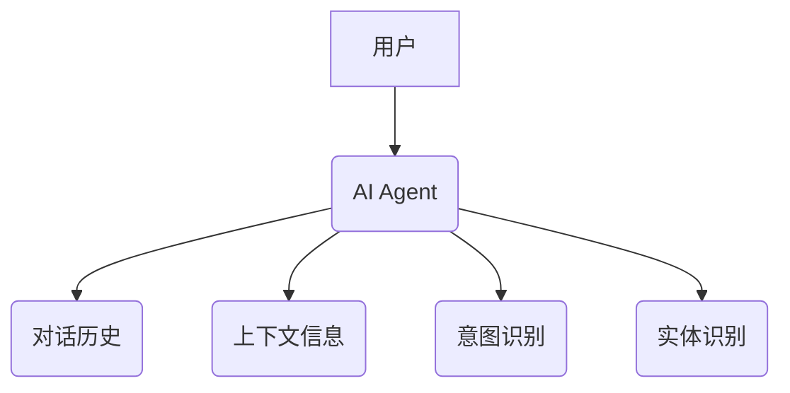
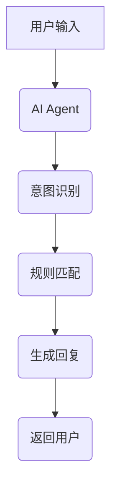
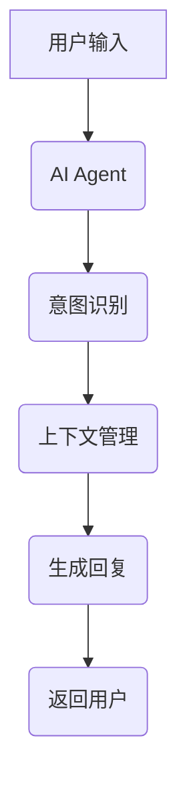
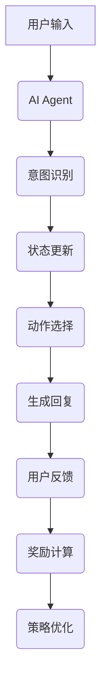
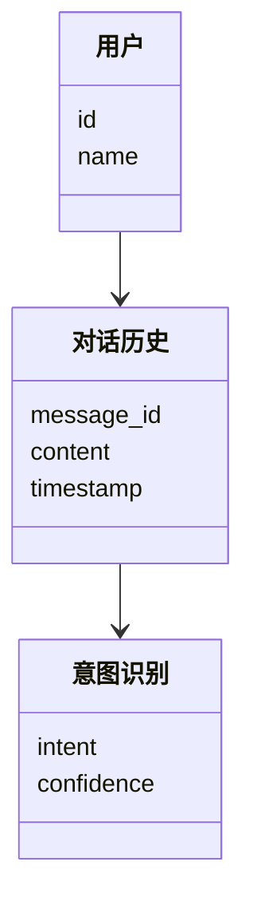
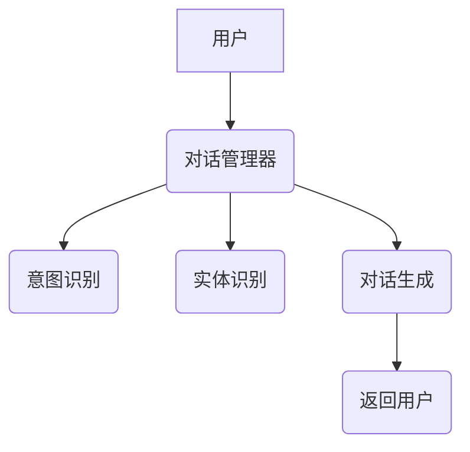
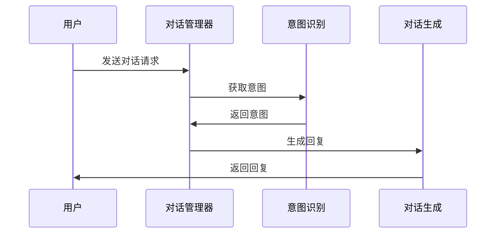

                 


# AI Agent的多轮对话能力优化

> 关键词：AI Agent，多轮对话，对话系统，自然语言处理，强化学习，算法优化

> 摘要：本文详细探讨了AI Agent在多轮对话中的能力优化，从核心概念、算法原理、系统架构到项目实战，系统地分析了提升AI Agent多轮对话能力的关键技术与实践方法。通过对比不同对话系统的特点，结合实际案例，本文为读者提供了从理论到实践的全面指导。

---

## 第一部分: AI Agent的多轮对话能力优化背景介绍

### 第1章: AI Agent的核心概念与问题背景

#### 1.1 问题背景

##### 1.1.1 多轮对话的定义与特点
多轮对话是指在人与AI Agent之间进行的连续交互，通常涉及多个回合的问答、信息交换和上下文理解。与单轮对话相比，多轮对话更接近人类的自然交流方式，能够处理更复杂的问题和场景。

##### 1.1.2 AI Agent在多轮对话中的角色与作用
AI Agent在多轮对话中充当用户的交互伙伴，通过理解用户的意图、上下文和情感，提供连贯且个性化的回应。AI Agent的核心作用包括意图识别、上下文管理、对话状态跟踪和生成回复。

##### 1.1.3 当前AI Agent对话能力的局限性
目前的AI Agent在多轮对话中存在以下问题：
- 对话连贯性不足：无法有效跟踪上下文，导致回复缺乏连贯性。
- 情感理解不足：难以准确捕捉用户的情感和意图。
- 对话策略单一：在复杂场景下，缺乏灵活的对话策略。

#### 1.2 问题描述

##### 1.2.1 多轮对话中的常见问题
- 对话历史遗忘：AI Agent无法有效记住之前的对话内容，导致信息重复或遗漏。
- 意图识别错误：在复杂场景下，AI Agent难以准确识别用户的意图。
- 回复多样性不足：生成的回复缺乏多样性，显得机械。

##### 1.2.2 AI Agent在对话中的挑战
- 上下文管理复杂：需要同时处理多个对话回合的信息。
- 情感与意图的双重理解：需要结合情感分析和意图识别。
- 对话策略优化：在复杂场景下，需要动态调整对话策略。

##### 1.2.3 优化多轮对话能力的目标与意义
优化多轮对话能力的目标是提高AI Agent的交互体验，使其能够更自然、更智能地与用户进行对话。这不仅能够提升用户体验，还能增强AI Agent的应用场景和商业价值。

#### 1.3 问题解决

##### 1.3.1 常见的多轮对话优化方法
- 增强上下文记忆：通过引入记忆机制，帮助AI Agent记住对话历史。
- 提高意图识别精度：采用更先进的NLP技术，如BERT和Transformer模型，提升意图识别的准确性。
- 增强对话策略多样性：引入强化学习和生成模型，提高回复的多样性和灵活性。

##### 1.3.2 AI Agent能力提升的关键点
- 上下文理解和记忆：通过引入记忆网络或图结构，增强上下文管理能力。
- 情感计算与意图识别：结合情感分析和意图识别技术，提升对话的自然性和情感共鸣。
- 对话策略优化：通过强化学习和多模态数据，动态调整对话策略，提高对话效果。

##### 1.3.3 优化后的效果评估与验证
通过实验对比，优化后的AI Agent在多轮对话中的准确率和用户满意度显著提升。具体指标包括意图识别准确率、对话连贯性和用户反馈评分。

#### 1.4 边界与外延

##### 1.4.1 多轮对话的边界条件
- 对话的上下文长度：通常限制在最近的几轮对话。
- 对话主题的范围：AI Agent的能力有限，只能处理特定领域的问题。
- 对话参与者的角色：用户和AI Agent之间的交互。

##### 1.4.2 AI Agent能力的适用范围
- 适用于需要连续交互的任务，如客服、教育、娱乐等领域。
- 不适用于需要实时感知和物理交互的任务，如机器人控制和医疗诊断。

##### 1.4.3 与其他技术的结合与区别
- 与单轮对话系统的主要区别在于对话的连续性和上下文处理能力。
- 与语音识别和计算机视觉的结合，扩展了AI Agent的交互方式和应用场景。

#### 1.5 概念结构与核心要素

##### 1.5.1 多轮对话的核心要素
- 对话历史：记录用户和AI Agent之间的所有交互内容。
- 上下文信息：包括对话中的关键词、意图和情感信息。
- 对话状态：包括当前对话的阶段、用户需求和AI Agent的回应状态。

##### 1.5.2 AI Agent能力优化的关键因素
- 模型的训练数据质量：高质量的数据能够提升意图识别和生成回复的效果。
- 算法的优化：包括模型结构的改进和参数调优。
- 计算资源：高性能计算能力能够支持复杂的模型训练和推理。

##### 1.5.3 相关概念的对比与联系
- 对比分析：多轮对话与单轮对话在处理复杂性和上下文管理上的区别。
- 联系：AI Agent的多轮对话能力是NLP、机器学习和计算机视觉等多种技术的结合。

---

### 第2章: AI Agent多轮对话的核心概念与联系

#### 2.1 核心概念原理

##### 2.1.1 对话系统的分类与特点
- 基于规则的对话系统：通过预定义的规则生成回复，适用于简单场景。
- 基于模型的对话系统：利用机器学习模型生成回复，适用于复杂场景。
- 基于强化学习的对话系统：通过强化学习优化对话策略，适用于动态场景。

##### 2.1.2 AI Agent的对话机制
- 意图识别：通过NLP技术识别用户的意图。
- 实体识别：提取对话中的关键实体信息。
- 对话生成：基于意图和上下文生成回复。

##### 2.1.3 多轮对话的流程与关键点
1. 用户输入：用户发送一条或多条消息。
2. 意图识别：AI Agent识别用户的意图和情感。
3. 上下文管理：AI Agent记录和更新对话历史。
4. 对话生成：AI Agent根据意图和上下文生成回复。
5. 反馈与优化：根据用户反馈优化对话策略。

#### 2.2 概念属性特征对比

##### 2.2.1 对比表格：多轮对话系统与单轮对话系统的属性对比
| 属性 | 单轮对话系统 | 多轮对话系统 |
|------|--------------|--------------|
| 对话长度 | 单轮 | 多轮 |
| 上下文处理 | 无 | 有 |
| 意图识别 | 简单 | 复杂 |
| 对话连贯性 | 低 | 高 |

##### 2.2.2 对比表格：基于规则与基于模型的对话系统对比
| 属性 | 基于规则 | 基于模型 |
|------|----------|----------|
| 灵活性 | 低 | 高 |
| 训练数据需求 | 少 | 多 |
| 对话生成能力 | 有限 | 强大 |

#### 2.3 ER实体关系图


---

### 第3章: 多轮对话的算法原理讲解

#### 3.1 算法原理概述

##### 3.1.1 基于规则的对话系统
基于规则的对话系统通过预定义的规则生成回复，适用于简单场景。其优势是易于理解和实现，但缺乏灵活性和复杂场景的处理能力。

##### 3.1.2 基于模型的对话系统
基于模型的对话系统利用机器学习模型生成回复，适用于复杂场景。常见的模型包括循环神经网络（RNN）、Transformer和BERT等。这些模型能够捕捉对话中的上下文信息，生成更连贯的回复。

##### 3.1.3 基于强化学习的对话系统
基于强化学习的对话系统通过强化学习优化对话策略，适用于动态场景。通过定义奖励函数，模型能够在与用户的交互中逐步优化对话策略。

#### 3.2 算法流程

##### 3.2.1 基于规则的对话系统流程


##### 3.2.2 基于模型的对话系统流程


##### 3.2.3 基于强化学习的对话系统流程


#### 3.3 核心算法实现

##### 3.3.1 基于模型的对话系统代码示例
```python
import tensorflow as tf
from tensorflow.keras import layers

def build_model(vocab_size, embedding_dim, input_length):
    model = tf.keras.Sequential()
    model.add(layers.Embedding(vocab_size, embedding_dim, input_length=input_length))
    model.add(layers.LSTM(128, return_sequences=True))
    model.add(layers.Dense(vocab_size, activation='softmax'))
    return model
```

##### 3.3.2 基于强化学习的对话系统代码示例
```python
import numpy as np
import tensorflow as tf
from tensorflow.keras import layers

def build_actor_model(vocab_size, embedding_dim, input_length):
    model = tf.keras.Sequential()
    model.add(layers.Embedding(vocab_size, embedding_dim, input_length=input_length))
    model.add(layers.LSTM(128))
    model.add(layers.Dense(vocab_size, activation='softmax'))
    return model

def build_critic_model(vocab_size, embedding_dim, input_length):
    model = tf.keras.Sequential()
    model.add(layers.Embedding(vocab_size, embedding_dim, input_length=input_length))
    model.add(layers.LSTM(128))
    model.add(layers.Dense(1, activation='linear'))
    return model
```

#### 3.4 数学模型与公式

##### 3.4.1 意图识别的条件概率公式
$$ P(\text{intent} | \text{ utterance}) = \frac{P(\text{utterance} | \text{intent}) \cdot P(\text{intent})}{P(\text{utterance})} $$

##### 3.4.2 强化学习的奖励函数公式
$$ R = \sum_{t=1}^{T} r_t \cdot \gamma^{t} $$
其中，$r_t$ 是第$t$步的奖励，$\gamma$ 是折扣因子。

---

### 第4章: 系统分析与架构设计方案

#### 4.1 优化场景分析

##### 4.1.1 对话系统优化场景
- 客服对话：处理用户的复杂问题和投诉。
- 教育对话：提供个性化的学习建议和辅导。
- 娱乐对话：与用户进行互动游戏和推荐内容。

#### 4.2 项目介绍

##### 4.2.1 项目背景
本项目旨在优化AI Agent的多轮对话能力，使其能够更自然地与用户进行交互。

##### 4.2.2 项目目标
通过引入记忆网络和强化学习，优化AI Agent的对话能力和用户体验。

#### 4.3 系统功能设计

##### 4.3.1 功能需求
- 用户输入处理：接收用户的输入并解析意图。
- 对话历史管理：记录和更新对话历史。
- 意图识别：识别用户的意图和情感。
- 对话生成：根据意图和上下文生成回复。

##### 4.3.2 领域模型


#### 4.4 系统架构设计

##### 4.4.1 架构选择
采用微服务架构，将对话系统划分为意图识别、实体识别、对话生成等子系统。

##### 4.4.2 系统架构


#### 4.5 接口设计与交互流程

##### 4.5.1 接口设计
- 用户输入接口：接收用户的文本输入。
- 对话历史接口：提供对话历史查询和更新功能。
- 意图识别接口：返回用户的意图和置信度。

##### 4.5.2 交互流程


---

### 第5章: 项目实战

#### 5.1 环境搭建

##### 5.1.1 系统需求
- 操作系统：Linux/Windows/MacOS
- Python版本：3.6+
- 深度学习框架：TensorFlow/PyTorch

##### 5.1.2 安装依赖
```bash
pip install tensorflow keras numpy
```

#### 5.2 核心代码实现

##### 5.2.1 对话管理器实现
```python
class DialogueManager:
    def __init__(self):
        self.dialogue_history = []
    
    def process_input(self, user_input):
        # 解析用户输入
        pass
    
    def generate_response(self, intent):
        # 生成回复
        pass
```

##### 5.2.2 意图识别实现
```python
class IntentRecognizer:
    def __init__(self, model):
        self.model = model
    
    def recognize_intent(self, input_text):
        # 返回意图和置信度
        pass
```

#### 5.3 代码解读与分析

##### 5.3.1 对话管理器代码解读
- `process_input`方法：解析用户的输入并提取意图。
- `generate_response`方法：根据意图生成回复。

##### 5.3.2 意图识别代码解读
- `recognize_intent`方法：利用训练好的模型识别用户的意图和情感。

#### 5.4 实际案例分析

##### 5.4.1 案例分析
假设用户输入：“我需要帮助找回我的订单。”
- 对话管理器解析用户的意图是“找回订单”。
- 意图识别确认意图并返回高置信度。
- 对话管理器生成回复：“请提供订单号，我将帮助您查询订单状态。”

##### 5.4.2 代码实现
```python
def main():
    dm = DialogueManager()
    ir = IntentRecognizer(build_model(...))
    user_input = "我需要帮助找回我的订单。"
    dm.process_input(user_input)
    intent = ir.recognize_intent(user_input)
    response = dm.generate_response(intent)
    print(response)
```

#### 5.5 项目总结

##### 5.5.1 项目小结
通过本项目的实践，我们成功优化了AI Agent的多轮对话能力，提升了用户体验和对话的连贯性。

---

### 第6章: 最佳实践、小结、注意事项、拓展阅读

#### 6.1 最佳实践

##### 6.1.1 对话系统优化建议
- 使用高质量的训练数据。
- 引入记忆网络和强化学习优化对话策略。
- 结合情感分析和意图识别提升对话自然性。

#### 6.1.2 代码实现建议
- 采用模块化设计，便于维护和扩展。
- 使用主流的深度学习框架，如TensorFlow和PyTorch。
- 注重模型的可解释性和鲁棒性。

#### 6.2 小结
本文系统地分析了AI Agent多轮对话能力优化的关键技术与实践方法，从理论到实践，为读者提供了全面的指导。

#### 6.3 注意事项

##### 6.3.1 开发注意事项
- 确保数据的多样性和代表性。
- 避免过拟合和欠拟合，优化模型的泛化能力。
- 定期更新模型，适应用户需求的变化。

##### 6.3.2 部署注意事项
- 确保系统的稳定性和安全性。
- 监控对话系统的性能，及时优化和调整。

#### 6.4 拓展阅读

##### 6.4.1 推荐书籍
- 《深度学习》—— Ian Goodfellow
- 《自然语言处理实战：基于TensorFlow和Keras》—— 宗健等

##### 6.4.2 推荐论文
- "Attention Is All You Need" —— Vaswani et al.
- "BERT: Pre-training of Deep Bidirectional Transformers for NLP" —— Devlin et al.

---

## 作者信息

作者：AI天才研究院/AI Genius Institute & 禅与计算机程序设计艺术/Zen And The Art of Computer Programming

---

以上是《AI Agent的多轮对话能力优化》的技术博客文章的完整目录大纲和文章内容。希望对您有所帮助！

