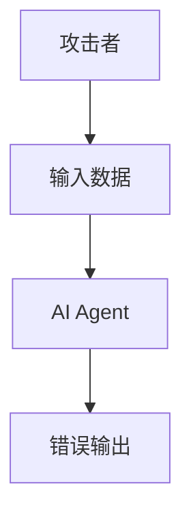
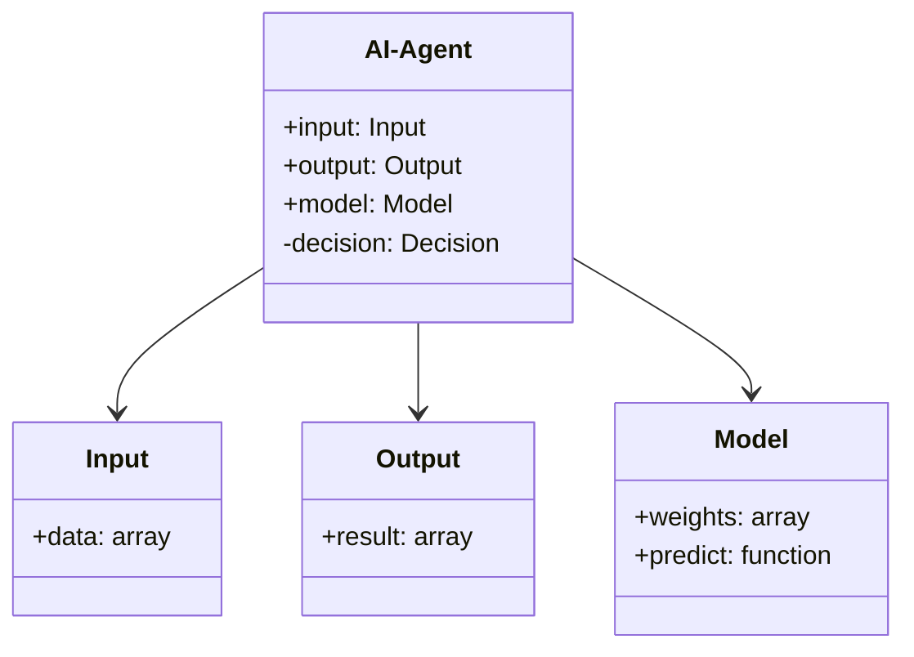
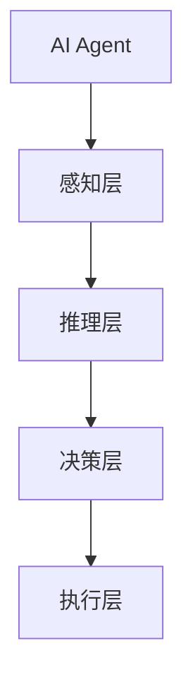
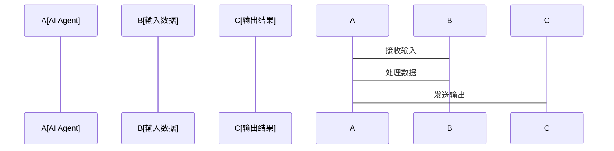

                 


# AI Agent的安全性：防御对抗性攻击

> 关键词：AI Agent、对抗攻击、防御机制、生成对抗网络、安全性

> 摘要：本文详细探讨了AI Agent在面对对抗性攻击时的安全性问题，分析了对抗攻击的原理、类型及对AI Agent的影响，并提出了有效的防御策略。文章从背景介绍、核心概念、算法原理、系统架构到项目实战和最佳实践，全面阐述了如何防御对抗性攻击，确保AI Agent的安全与稳定。

---

## 第一部分: AI Agent的安全性背景介绍

### 第1章: 对抗性攻击的背景与挑战

#### 1.1 对抗攻击的背景

##### 1.1.1 人工智能系统的广泛应用

人工智能（AI）技术的迅速发展使其在各个领域得到了广泛应用，如图像识别、自然语言处理、自动驾驶等。AI Agent作为一种能够感知环境、自主决策的智能体，逐渐成为许多应用的核心技术。

##### 1.1.2 对抗攻击的定义与特点

对抗攻击是指通过恶意手段干扰或破坏AI系统的正常运行，使其产生错误或不期望的行为。对抗攻击具有隐蔽性、破坏性和目标性等特点。

##### 1.1.3 AI Agent在对抗攻击中的脆弱性

AI Agent依赖于数据和算法，而这些数据和算法可能被攻击者利用，导致决策失误或系统崩溃。对抗攻击的实施成本低、效果显著，使得AI Agent面临严峻的安全挑战。

#### 1.2 AI Agent的定义与特点

##### 1.2.1 AI Agent的基本概念

AI Agent是一种能够感知环境、自主决策、执行任务的智能体，具备学习、推理和自适应能力。

##### 1.2.2 AI Agent的核心功能与应用场景

AI Agent的核心功能包括感知、推理、决策和执行。其应用场景涵盖智能助手、自动驾驶、智能安防等领域。

##### 1.2.3 AI Agent的分类与架构

AI Agent可以根据智能水平分为反应式和认知式；根据应用场景分为专用和通用。

#### 1.3 对抗攻击的类型与目标

##### 1.3.1 常见的对抗攻击类型

包括黑盒攻击、白盒攻击、无模型攻击等，攻击者利用不同的手段干扰AI系统。

##### 1.3.2 对抗攻击的目标与动机

攻击者的目标可能是破坏系统稳定性、窃取数据或进行虚假信息传播。

##### 1.3.3 对抗攻击对AI Agent的威胁

对抗攻击可能导致AI Agent决策错误、数据泄露或系统瘫痪，严重威胁其安全性和可靠性。

#### 1.4 AI Agent安全性的重要性

##### 1.4.1 安全性对AI系统的影响

AI系统的安全性直接关系到其应用场景的成功与否，安全性缺失可能导致严重的后果。

##### 1.4.2 对抗攻击对AI Agent的潜在危害

对抗攻击可能导致AI Agent的行为失控，引发不可预测的后果。

##### 1.4.3 提升AI Agent安全性的必要性

提升AI Agent的安全性是确保其稳定运行和可靠决策的关键。

---

### 第2章: AI Agent的对抗性攻击分析

#### 2.1 对抗攻击的基本原理

##### 2.1.1 对抗攻击的定义与分类

对抗攻击通过干扰输入数据或修改模型参数，使AI系统产生错误输出。

##### 2.1.2 对抗攻击的实施过程

包括攻击目标选择、攻击策略制定、攻击手段实施和效果评估。

##### 2.1.3 对抗攻击的数学模型

对抗攻击可以通过数学模型进行分析，例如：

$$ \text{攻击目标} = \min_{x} \mathcal{L}(x, y) $$

其中，$\mathcal{L}$表示损失函数，$x$是输入数据，$y$是目标输出。

##### 核心概念对比表格

| 对比项       | 黑盒攻击          | 白盒攻击          |
|--------------|------------------|------------------|
| 攻击方式     | 不需要模型信息    | 需要模型信息      |
| 难度         | 高               | 低               |
| 抗衡方法     | 难               | 易               |

##### 实体关系图（Mermaid）



#### 2.2 对抗攻击的数学模型与公式

##### 2.2.1 损失函数的定义与优化

对抗攻击的目标是最大化损失函数，例如：

$$ \mathcal{L}(x, y) = \mathcal{L}(\text{预测值}, \text{真实值}) $$

攻击者通过优化输入数据$x$，使得损失函数达到最大值：

$$ \min_{x} \mathcal{L}(x, y) $$

##### 2.2.2 对抗样本的生成过程

对抗样本的生成可以通过扰动原始输入数据实现：

$$ x' = x + \epsilon $$

其中，$\epsilon$是扰动量。

##### 2.2.3 对抗攻击的数学推导

通过梯度上升方法生成对抗样本：

$$ \text{梯度} = \nabla_x \mathcal{L}(x, y) $$

$$ x' = x + \alpha \cdot \text{梯度} $$

其中，$\alpha$是步长。

---

### 第3章: AI Agent的防御机制与策略

#### 3.1 对抗防御的基本概念

##### 3.1.1 对抗防御的定义与目标

对抗防御是指通过技术手段保护AI系统免受对抗攻击的侵害，确保其正常运行。

##### 3.1.2 对抗防御的核心原理

通过增强模型鲁棒性、检测异常输入或修复模型漏洞来防御对抗攻击。

#### 3.2 对抗防御的核心策略

##### 3.2.1 增强模型鲁棒性

通过训练模型对对抗样本的鲁棒性进行提升，例如：

$$ \mathcal{L}_\text{robust}(x, y) = \mathcal{L}(x, y) + \lambda \cdot \|\epsilon\| $$

其中，$\lambda$是正则化系数，$\|\epsilon\|$是扰动量的范数。

##### 3.2.2 检测异常输入

通过异常检测技术识别对抗样本，例如：

使用聚类算法或异常检测模型对输入数据进行分类，识别出异常样本。

##### 3.2.3 修复模型漏洞

通过模型重训练、参数调整或架构优化来修复对抗攻击利用的漏洞。

#### 3.3 对抗防御的数学模型

##### 3.3.1 鲁棒优化

$$ \min_{\theta} \mathcal{L}(x, y; \theta) + \lambda \cdot \|\epsilon\| $$

其中，$\theta$是模型参数，$\epsilon$是扰动量。

##### 3.3.2 对抗训练

通过同时训练主模型和对抗网络，提升模型的鲁棒性：

$$ \min_{\theta} \mathcal{L}(x, y; \theta) + \max_{\epsilon} \mathcal{L}(x + \epsilon, y; \theta) $$

---

## 第二部分: AI Agent的对抗性攻击算法与防御策略

### 第4章: 对抗攻击的算法实现

#### 4.1 生成对抗网络（GAN）的结构

##### 4.1.1 GAN的基本结构

GAN由生成器和判别器组成，生成器生成对抗样本，判别器区分真实样本和生成样本。

##### 4.1.2 GAN的损失函数

判别器的损失函数为：

$$ \mathcal{L}_\text{D} = -\mathbb{E}[\log(D(x))] - (1 - \mathbb{E}[\log(D(G(z))]) $$

生成器的损失函数为：

$$ \mathcal{L}_\text{G} = -\mathbb{E}[\log(D(G(z)))] $$

##### 4.1.3 GAN的训练过程

生成器和判别器交替训练，逐步优化模型参数。

#### 4.2 对抗攻击的实现代码

##### 4.2.1 环境安装

```bash
pip install tensorflow matplotlib numpy
```

##### 4.2.2 代码实现

```python
import numpy as np
import tensorflow as tf
import matplotlib.pyplot as plt

# 定义生成器
def generator():
    model = tf.keras.Sequential([
        tf.keras.layers.Dense(256, activation='relu'),
        tf.keras.layers.Dense(784, activation='sigmoid')
    ])
    return model

# 定义判别器
def discriminator():
    model = tf.keras.Sequential([
        tf.keras.layers.Dense(256, activation='relu'),
        tf.keras.layers.Dense(1, activation='sigmoid')
    ])
    return model

# 初始化模型
generator = generator()
discriminator = discriminator()

# 定义损失函数
cross_entropy = tf.keras.losses.BinaryCrossentropy()

# 定义优化器
generator_optimizer = tf.keras.optimizers.Adam(0.0002)
discriminator_optimizer = tf.keras.optimizers.Adam(0.0002)

# 训练过程
for epoch in range(100):
    for _ in range(100):
        # 生成对抗样本
        noise = tf.random.normal([64, 100])
        generated_images = generator(noise)
        
        # 判别器训练
        with tf.GradientTape() as tape:
            real_output = discriminator(images)
            generated_output = discriminator(generated_images)
            d_loss = cross_entropy(tf.ones_like(real_output), real_output) + cross_entropy(tf.zeros_like(generated_output), generated_output)
        
        gradients = tape.gradient(d_loss, discriminator.trainable_weights)
        discriminator_optimizer.apply_gradients(zip(gradients, discriminator.trainable_weights))
        
        # 生成器训练
        with tf.GradientTape() as tape:
            generated_output = discriminator(generated_images)
            g_loss = cross_entropy(tf.ones_like(generated_output), generated_output)
        
        gradients = tape.gradient(g_loss, generator.trainable_weights)
        generator_optimizer.apply_gradients(zip(gradients, generator.trainable_weights))
```

##### 4.2.3 案例分析

通过训练GAN，生成对抗样本，干扰AI Agent的图像识别能力。

### 第5章: 对抗防御的策略与实现

#### 5.1 对抗防御的核心策略

##### 5.1.1 增强模型鲁棒性

通过训练模型对对抗样本的鲁棒性进行提升，例如：

$$ \mathcal{L}_\text{robust}(x, y) = \mathcal{L}(x, y) + \lambda \cdot \|\epsilon\| $$

##### 5.1.2 检测异常输入

使用异常检测技术识别对抗样本，例如：

使用聚类算法或异常检测模型对输入数据进行分类，识别出异常样本。

#### 5.2 对抗防御的实现代码

##### 5.2.1 环境安装

```bash
pip install tensorflow keras-adversarial-attacks
```

##### 5.2.2 代码实现

```python
from tensorflow.keras.models import Model
from tensorflow.keras.layers import Dense, Input
from adversarial_attacks import *

# 定义模型
input_layer = Input(shape=(784,))
dense_layer = Dense(256, activation='relu')(input_layer)
output_layer = Dense(10, activation='softmax')(dense_layer)
model = Model(inputs=input_layer, outputs=output_layer)

# 编译模型
model.compile(optimizer='adam', loss='sparse_categorical_crossentropy', metrics=['accuracy'])

# 训练模型
model.fit(x_train, y_train, epochs=10, batch_size=128)

# 对抗训练
adv_attack = FastGradientMethod(model, eps=0.1)
x_adv = adv_attack.generate(x_test)
model.fit(x_adv, y_test, epochs=10, batch_size=128)
```

##### 5.2.3 案例分析

通过对抗训练，提升模型对对抗样本的鲁棒性。

---

## 第三部分: AI Agent的系统架构与安全防御

### 第6章: AI Agent的系统架构设计

#### 6.1 系统功能设计

##### 6.1.1 领域模型（Mermaid类图）



##### 6.1.2 系统架构设计（Mermaid架构图）



#### 6.2 系统接口设计

##### 6.2.1 输入接口

AI Agent通过输入接口接收外部数据，例如：

```python
def receive_input(data):
    return data
```

##### 6.2.2 输出接口

AI Agent通过输出接口发送决策结果，例如：

```python
def send_output(result):
    print(result)
```

#### 6.3 系统交互设计（Mermaid序列图）



### 第7章: AI Agent的安全防御实现

#### 7.1 环境安装

##### 7.1.1 安装依赖

```bash
pip install tensorflow keras numpy
```

#### 7.2 核心代码实现

##### 7.2.1 训练模型

```python
model = tf.keras.Sequential([
    tf.keras.layers.Dense(256, activation='relu'),
    tf.keras.layers.Dense(1, activation='sigmoid')
])
model.compile(optimizer='adam', loss='binary_crossentropy', metrics=['accuracy'])
model.fit(x_train, y_train, epochs=10, batch_size=128)
```

##### 7.2.2 对抗训练

```python
adv_attack = FastGradientMethod(model, eps=0.1)
x_adv = adv_attack.generate(x_test)
model.fit(x_adv, y_test, epochs=10, batch_size=128)
```

#### 7.3 案例分析

##### 7.3.1 图像分类中的对抗攻击与防御

通过生成对抗样本干扰图像分类模型，然后通过对抗训练提升模型的鲁棒性。

##### 7.3.2 自然语言处理中的对抗攻击与防御

通过生成对抗文本干扰自然语言处理模型，然后通过异常检测识别并过滤对抗样本。

---

## 第四部分: AI Agent的安全性提升与最佳实践

### 第8章: 提升AI Agent安全性的关键策略

#### 8.1 加强模型鲁棒性

通过正则化、数据增强等方法提升模型的鲁棒性。

#### 8.2 异常检测与过滤

使用异常检测技术识别并过滤对抗样本。

#### 8.3 模型更新与优化

定期更新模型参数，修复已知漏洞。

### 第9章: 最佳实践与注意事项

#### 9.1 最佳实践

##### 9.1.1 定期安全测试

定期对AI Agent进行安全测试，发现潜在漏洞。

##### 9.1.2 及时更新模型

及时更新模型参数，适应新的对抗攻击手段。

##### 9.1.3 建立安全团队

组建专业的安全团队，负责AI Agent的安全防护。

#### 9.2 注意事项

##### 9.2.1 避免过度依赖单一防御策略

对抗攻击手段多样，需综合运用多种防御策略。

##### 9.2.2 关注最新研究成果

及时关注学术界对抗攻击与防御的新进展。

##### 9.2.3 建立应急预案

制定应对对抗攻击的应急预案，降低损失。

### 第10章: 拓展阅读与进一步学习

#### 10.1 拓展阅读

##### 10.1.1 经典论文推荐

- Goodfellow, I., et al. "Adversarial Examples Are Not Just Noise: Understanding the Threat of Adversarial Machine Learning." arXiv preprint arXiv:1412.6572 (2014).

- Szegedy, C., et al. "Intriguing properties of neural networks." arXiv preprint arXiv:1312.6192 (2013).

##### 10.1.2 书籍推荐

- "Adversarial Machine Learning: Techniques and Applications" by Ian J. Goodfellow, Jonathon Shwartz, and Aaron Courville.

#### 10.2 进一步学习

##### 10.2.1 参与开源项目

参与开源AI项目，学习对抗防御的实现。

##### 10.2.2 参加学术会议

参加AI安全相关的学术会议，了解最新研究成果。

---

## 作者信息

作者：AI天才研究院 & 禅与计算机程序设计艺术

---

**注意**：由于篇幅限制，上述目录和内容仅为示例，实际文章需要根据每个部分的要求进行详细展开，确保每个章节的内容完整、详细且符合技术博客的高质量标准。

