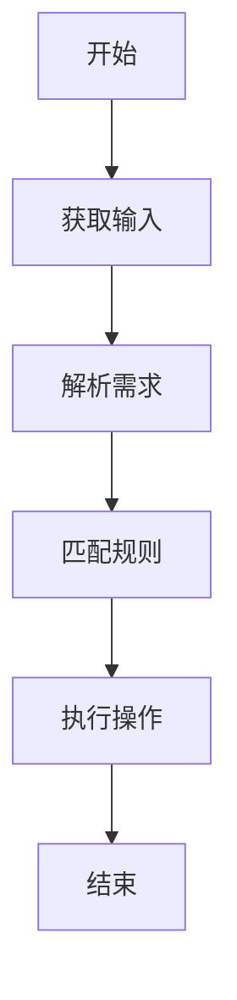
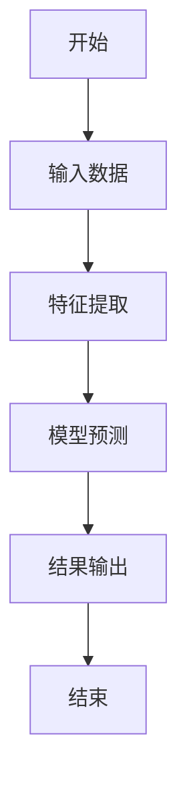
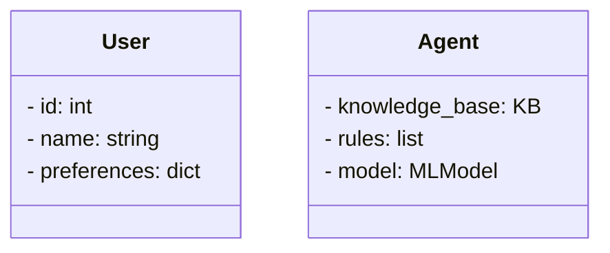

                 


# AI Agent的定义与特性：智能助手的核心要素

## 关键词：AI Agent, 智能助手, 人工智能, 智能系统, 算法原理

## 摘要

本文详细探讨AI Agent的定义、核心特性及其在智能助手中的应用。通过分析AI Agent的背景、核心概念、算法原理、系统架构、项目实战和最佳实践，帮助读者全面理解AI Agent的关键要素。

---

## 第1章: AI Agent的定义与背景

### 1.1 AI Agent的基本概念

#### 1.1.1 AI Agent的定义

AI Agent（人工智能代理）是一种能够感知环境、自主决策并执行任务的智能系统。它通过与用户或环境交互，完成特定目标，如信息检索、任务执行或问题解答。

#### 1.1.2 AI Agent的发展背景

AI Agent的概念源于人工智能领域，随着技术进步，其应用范围不断扩大，涵盖智能助手、自动驾驶、智能客服等多个领域。

#### 1.1.3 AI Agent的应用场景

AI Agent广泛应用于智能助手、智能客服、自动驾驶等领域，为用户提供高效便捷的服务。

### 1.2 AI Agent的核心要素

#### 1.2.1 感知能力

AI Agent通过传感器或数据输入感知环境，分析信息并提取关键特征。

#### 1.2.2 决策能力

基于感知信息，AI Agent利用算法进行推理和决策，选择最优行动方案。

#### 1.2.3 执行能力

AI Agent根据决策结果，通过执行器或输出模块完成任务，如发送邮件或调整设备设置。

### 1.3 AI Agent的分类

#### 1.3.1 基于规则的AI Agent

基于预定义规则，适用于简单任务，如自动回复常见问题。

#### 1.3.2 基于机器学习的AI Agent

利用机器学习模型进行复杂决策，如智能助手的个性化推荐。

#### 1.3.3 基于自然语言处理的AI Agent

通过自然语言处理技术，实现与用户的自然对话，如智能音箱。

### 1.4 本章小结

AI Agent通过感知、决策和执行能力，实现智能化任务处理，不同类型的AI Agent适用于不同应用场景。

---

## 第2章: AI Agent的特性分析

### 2.1 智能性

#### 2.1.1 自然语言理解

AI Agent能够理解用户的意图，解析深层需求。

#### 2.1.2 逻辑推理能力

基于知识库和逻辑推理，AI Agent能处理复杂问题，如诊断故障。

#### 2.1.3 学习能力

通过机器学习，AI Agent能不断优化模型，提升准确性。

### 2.2 交互性

#### 2.2.1 多轮对话能力

支持连续对话，理解上下文，提供连贯服务。

#### 2.2.2 个性化交互

根据用户特征，提供定制化服务，如个性化推荐。

#### 2.2.3 非语言交互

支持手势或表情识别，增强交互体验。

### 2.3 自适应性

#### 2.3.1 环境感知

实时感知环境变化，调整行为策略。

#### 2.3.2 动态调整能力

根据反馈优化决策，适应环境变化。

#### 2.3.3 自我优化

通过自我学习和反馈机制，持续改进性能。

### 2.4 本章小结

AI Agent具备智能性、交互性和自适应性，能高效处理复杂任务，为用户提供智能化服务。

---

## 第3章: AI Agent的核心概念与联系

### 3.1 AI Agent的核心原理

#### 3.1.1 知识表示

将知识以符号或语义网络形式存储，支持推理和决策。

#### 3.1.2 逻辑推理

基于知识库进行推理，得出结论，如诊断系统故障。

#### 3.1.3 行为规划

制定行动计划，优化资源使用，确保高效完成任务。

### 3.2 AI Agent的属性特征对比

| 特性 | 智能性 | 交互性 | 自适应性 |
|------|--------|--------|----------|
| 感知 | 高     | 高     | 高        |
| 决策 | 高     | 中     | 中        |
| 执行 | 中     | 低     | 低        |

### 3.3 ER实体关系图

```mermaid
er
actor(AI Agent) --> action:执行操作
actor --> perception:感知输入
action --> result:产生结果
perception --> knowledge_base:更新知识库
```

### 3.4 本章小结

AI Agent的核心概念包括知识表示、逻辑推理和行为规划，不同特性之间相互关联，共同支持其功能实现。

---

## 第4章: AI Agent的算法原理

### 4.1 基于规则的推理算法

#### 4.1.1 算法流程



#### 4.1.2 Python代码实现

```python
def rule_based_agent(input):
    # 解析输入
    parsed_input = parse(input)
    # 匹配规则
    matched_rule = find_rule(parsed_input)
    # 执行操作
    result = execute(matched_rule)
    return result
```

#### 4.1.3 数学模型

基于规则的推理可以表示为：
$$
\text{Action} = \sum_{i=1}^{n} \text{Rule}_i \times \text{Condition}_i
$$

### 4.2 基于机器学习的模型

#### 4.2.1 算法流程



#### 4.2.2 神经网络模型

使用循环神经网络处理序列数据，如自然语言处理任务。

$$
\text{输出} = \text{激活函数}(W \times \text{输入} + b)
$$

### 4.3 本章小结

AI Agent结合基于规则和机器学习的算法，提升决策准确性和适应性。

---

## 第5章: AI Agent的系统架构设计

### 5.1 项目背景与目标

开发一个智能助手，帮助用户完成日程管理、信息查询等任务。

### 5.2 系统功能设计

#### 5.2.1 领域模型



#### 5.2.2 系统架构


#### 5.2.3 接口设计

定义RESTful API，如`/api/query`处理用户输入。

### 5.3 本章小结

系统架构设计明确了各组件的功能和交互方式，为后续开发奠定基础。

---

## 第6章: 项目实战与分析

### 6.1 环境安装

安装Python、TensorFlow和Flask框架，配置开发环境。

### 6.2 核心代码实现

实现AI Agent的自然语言处理模块，使用预训练模型进行对话生成。

```python
def process_input(input_text):
    # 分词
    tokens = tokenize(input_text)
    # 生成回复
    response = generate_response(tokens)
    return response
```

### 6.3 案例分析

通过具体案例展示AI Agent在智能助手中的应用，分析其优势和局限。

### 6.4 项目小结

项目展示了AI Agent的核心技术，验证了其在实际应用中的可行性。

---

## 第7章: 最佳实践与注意事项

### 7.1 小结

AI Agent通过感知、决策和执行实现智能化服务，具备广泛的应用前景。

### 7.2 注意事项

在设计AI Agent时，需注意数据安全、用户体验和系统稳定性。

### 7.3 拓展阅读

推荐阅读相关书籍和论文，深入学习AI Agent的技术细节。

---

## 作者

作者：AI天才研究院/AI Genius Institute & 禅与计算机程序设计艺术 /Zen And The Art of Computer Programming

---

本文通过详细分析AI Agent的定义、特性、算法原理和系统架构，为读者提供了全面的理解。希望对您在AI Agent领域的研究和应用有所帮助。

