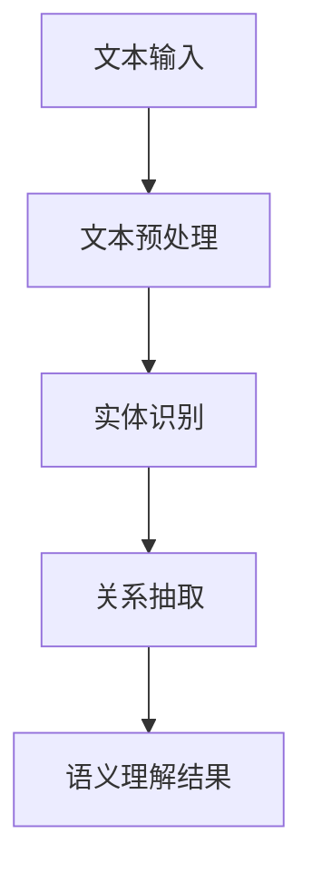

                 


# AI Agent的实体识别与关系抽取：深化语义理解

> 关键词：自然语言处理、实体识别、关系抽取、AI Agent、语义理解、深度学习

> 摘要：本文深入探讨了AI Agent在自然语言处理中的实体识别与关系抽取技术，分析了其核心原理、算法实现、系统架构，并通过实际案例展示了如何通过这些技术深化语义理解。文章从背景介绍、核心概念、算法原理、系统架构到项目实战，全面解析了实体识别与关系抽取的实现过程和应用价值。

---

## 第一部分: AI Agent的实体识别与关系抽取概述

### 第1章: 背景介绍与核心概念

#### 1.1 问题背景

- **语义理解的重要性**：在自然语言处理（NLP）中，语义理解是连接文本与智能应用的核心桥梁。实体识别（NER, Named Entity Recognition）与关系抽取（RE, Relation Extraction）是实现语义理解的两大基石。
- **实体识别的定义**：实体识别是指从文本中识别出具有特定意义的实体，如人名、地名、组织名、时间等。
- **关系抽取的定义**：关系抽取则是识别文本中实体之间的关系，如“是”、“属于”、“位于”等。
- **AI Agent的角色**：AI Agent需要通过语义理解与用户进行有效交互，实体识别与关系抽取为其提供了理解上下文的能力。

#### 1.2 核心概念与联系

- **实体识别的关键属性**：
  - 实体类型（ EntityType ）：如人名、组织名、时间等。
  - 实体标识（ Entity ID ）：唯一标识一个实体。
- **关系抽取的关键要素**：
  - 主体（Subject）：关系的主动参与者。
  - 客体（Object）：关系的被动参与者。
  - 关系类型（Relation Type）：如“属于”、“位于”、“属于”等。

#### 1.3 实体识别与关系抽取的关系

- 实体识别是关系抽取的基础，关系抽取依赖于实体识别的结果。
- 实体识别关注“是什么”，关系抽取关注“是什么关系”。
- 两者共同构建了文本的语义网络，为语义理解提供了结构化的知识表示。

---

## 第二部分: 实体识别的核心原理与实现

### 第2章: 实体识别的算法与实现

#### 2.1 实体识别的实现步骤

1. **文本预处理**：
   - 分词：将文本分割成词语。
   - 去停用词：去除无意义的停用词。
2. **特征提取**：
   - 词性标注：为每个词语标注词性。
   - 位置信息：记录实体在文本中的位置。
3. **模型训练**：
   - 使用CRF（条件随机场）或LSTM（长短期记忆网络）进行训练。
4. **实体识别**：
   - 基于训练好的模型，对文本进行实体识别。

#### 2.2 基于CRF的实体识别模型

- **CRF模型的优势**：
  - 能够利用上下文信息。
  - 适合序列标注任务。
- **CRF模型的实现**：
  ```mermaid
  graph TD
      A[文本输入] --> B[特征提取]
      B --> C[CRF模型]
      C --> D[实体识别结果]
  ```

  ```python
  import numpy as np
  from sklearn_crfsuite import CRF

  # 示例数据
  X_train = [[...]]  # 特征向量
  y_train = [...]    # 标签

  # 模型训练
  crf = CRF()
  crf.fit(X_train, y_train)
  ```

#### 2.3 实体识别的挑战

- **数据稀疏性**：训练数据不足。
- **多义词处理**：同一个词可能代表不同实体。
- **上下文依赖**：实体识别依赖于上下文信息。

---

## 第三部分: 关系抽取的核心原理与实现

### 第3章: 关系抽取的算法与实现

#### 3.1 关系抽取的实现步骤

1. **实体识别**：提取文本中的实体。
2. **关系抽取**：识别实体之间的关系。
3. **关系类型分类**：对关系进行分类。

#### 3.2 基于深度学习的关系抽取模型

- **BERT模型的应用**：
  - 使用预训练的BERT模型进行关系抽取。
  - 示例代码：
    ```python
    from transformers import BertForRelationExtraction

    model = BertForRelationExtraction.from_pretrained('bert-base-uncased')
    inputs = tokenizer.encode("文本内容", return_tensors='pt')
    outputs = model(inputs)
    # 提取关系
    ```

- **模型流程图**：
  ```mermaid
  graph TD
      A[文本输入] --> B[BERT编码]
      B --> C[关系分类]
      C --> D[关系输出]
  ```

#### 3.3 关系抽取的挑战

- **关系多样性**：关系类型众多。
- **上下文理解**：需要理解复杂的上下文信息。
- **数据标注**：需要高质量的关系标注数据。

---

## 第四部分: 系统架构与项目实战

### 第4章: 系统架构设计

#### 4.1 系统功能设计

- **文本预处理模块**：
  - 分词、去停用词、词性标注。
- **实体识别模块**：
  - 使用CRF或BERT进行实体识别。
- **关系抽取模块**：
  - 基于实体识别结果，进行关系抽取。

#### 4.2 系统架构图



#### 4.3 接口设计

- **输入接口**：
  - 文本输入：字符串。
- **输出接口**：
  - 实体识别结果：列表。
  - 关系抽取结果：列表。

---

## 第五部分: 项目实战与优化

### 第5章: 项目实战

#### 5.1 环境安装

- **Python环境**：
  - 安装 transformers、sklearn-crfsuite 等库。

#### 5.2 核心代码实现

```python
import transformers
from transformers import BertTokenizer, BertForTokenClassification

# 初始化模型
tokenizer = BertTokenizer.from_pretrained('bert-base-uncased')
model = BertForTokenClassification.from_pretrained('bert-base-uncased')

# 实体识别
def entity_extraction(text):
    inputs = tokenizer.encode(text, return_tensors='pt')
    outputs = model(inputs)
    # 提取实体
    return entities

# 关系抽取
def relation_extraction(text):
    inputs = tokenizer.encode(text, return_tensors='pt')
    outputs = model(inputs)
    # 提取关系
    return relations
```

#### 5.3 案例分析

- **输入文本**：
  - "张三在北京工作。"
- **实体识别**：
  - 实体：张三（人名）、北京（地名）。
- **关系抽取**：
  - 关系：工作于（张三，北京）。

---

## 第六部分: 总结与展望

### 第6章: 总结

- **核心内容回顾**：
  - 实体识别与关系抽取是语义理解的关键技术。
  - 深度学习模型（如BERT）在实体识别与关系抽取中表现出色。
  - 系统架构设计与项目实战是技术落地的重要环节。

### 第7章: 未来展望

- **技术优化方向**：
  - 提高关系抽取的准确性。
  - 处理多语言文本。
- **应用拓展**：
  - 实体识别与关系抽取在智能客服、信息抽取等领域的应用。

---

## 作者：AI天才研究院/AI Genius Institute & 禅与计算机程序设计艺术 /Zen And The Art of Computer Programming

