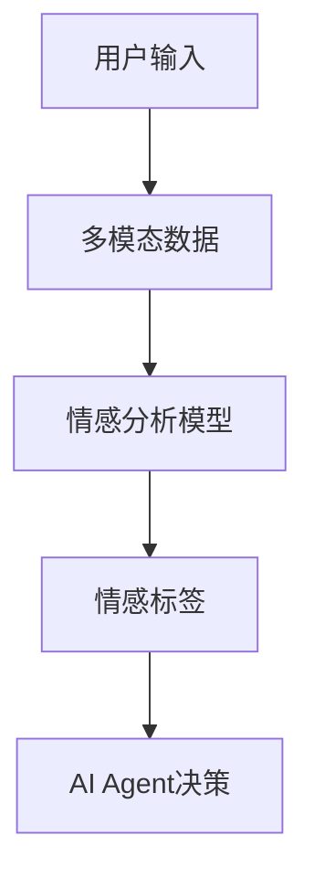
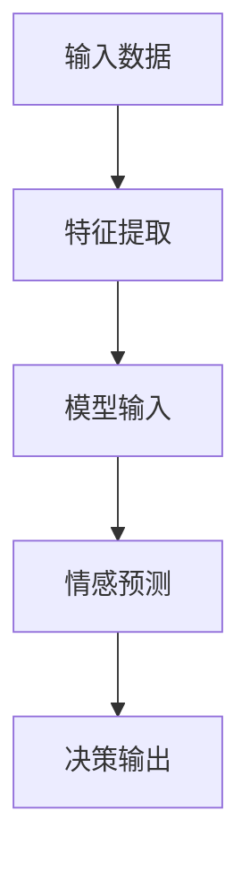
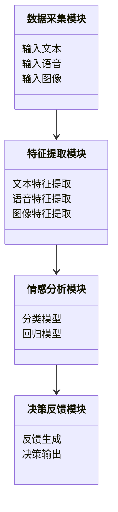
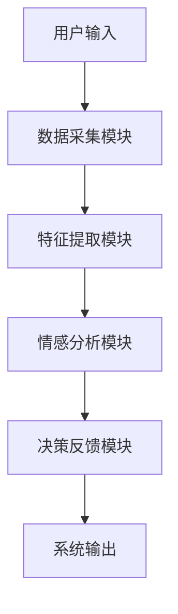
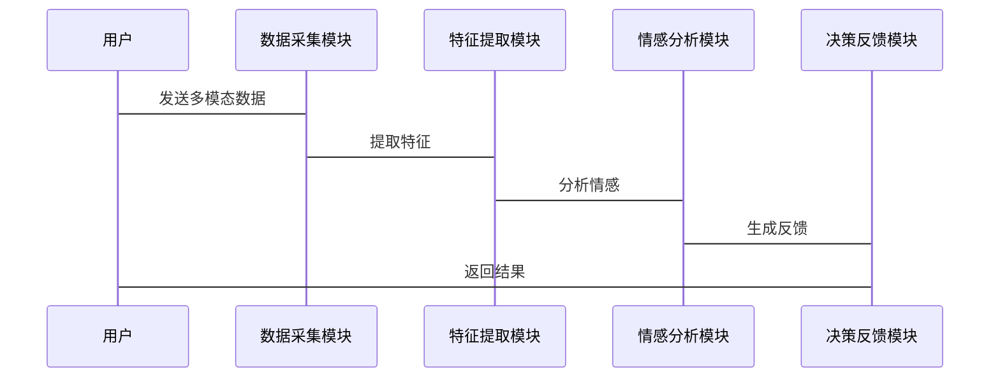

                 


# AI Agent的实时多模态情感分析

> **关键词**: AI Agent, 多模态情感分析, 实时性, 情感计算, 多模态数据融合

> **摘要**: 本文探讨了AI Agent在实时多模态情感分析中的应用，详细分析了多模态数据的特点、情感分析的核心算法以及系统架构设计。通过实际案例，展示了如何实现一个高效的实时多模态情感分析系统，并提出了优化建议和未来发展方向。

---

## 第1章 AI Agent与实时多模态情感分析背景介绍

### 1.1 问题背景与描述

#### 1.1.1 情感分析的定义与重要性
情感分析是自然语言处理（NLP）领域的重要任务，旨在识别和分类文本中蕴含的情感倾向。情感分析不仅帮助企业了解用户反馈，还能优化用户体验和服务策略。

#### 1.1.2 多模态数据的特点与挑战
多模态数据是指结合了多种数据类型（如文本、语音、图像）的数据。这些数据能够提供更全面的信息，但也带来了数据异构性和复杂性的问题。

#### 1.1.3 实时性对情感分析的要求
实时性要求情感分析系统能够在短时间内完成数据处理和结果反馈，这对系统的性能和架构提出了更高的要求。

### 1.2 问题解决与边界

#### 1.2.1 AI Agent在情感分析中的作用
AI Agent作为情感分析的执行者，负责接收多模态数据，进行分析，并根据结果做出相应的决策或反馈。

#### 1.2.2 多模态数据融合的边界与限制
多模态数据融合需要考虑数据的格式、时序性和相关性。由于不同数据类型可能存在不一致性和冗余，如何有效融合是关键挑战。

#### 1.2.3 实时性对系统性能的影响
实时性要求系统在处理多模态数据时必须在有限的时间内完成计算，这对算法效率和硬件性能提出了严格要求。

### 1.3 核心概念与结构

#### 1.3.1 情感分析的核心要素
- **数据输入**：多模态数据（文本、语音、图像）。
- **情感计算**：基于数据的特征提取和分类模型。
- **决策反馈**：根据分析结果生成相应反馈或行动。

#### 1.3.2 多模态数据的特征与关系
- **特征提取**：从不同数据类型中提取有意义的特征。
- **数据关联**：分析不同数据类型之间的关联性。
- **融合策略**：选择合适的融合方法，如早期融合和晚期融合。

#### 1.3.3 AI Agent的系统架构与功能
- **数据采集**：实时采集多模态数据。
- **特征提取**：对数据进行预处理和特征提取。
- **情感计算**：应用模型进行情感分析。
- **决策反馈**：根据分析结果生成反馈或行动。

---

## 第2章 多模态情感分析的核心概念与联系

### 2.1 核心概念原理

#### 2.1.1 多模态数据的特征提取
- **文本特征**：词袋模型、TF-IDF、词嵌入（如Word2Vec、BERT）。
- **语音特征**：声调、语速、语调。
- **图像特征**：颜色、形状、纹理。

#### 2.1.2 情感分析的分类与回归模型
- **分类模型**：支持向量机（SVM）、随机森林、神经网络。
- **回归模型**：线性回归、深度学习模型（如LSTM、Transformer）。

#### 2.1.3 AI Agent的决策机制
- **基于规则的决策**：根据预定义规则进行反馈。
- **基于模型的决策**：根据预测结果动态调整反馈策略。

### 2.2 概念属性对比表格

| 概念         | 属性               | 描述                                   |
|--------------|--------------------|----------------------------------------|
| 单模态数据    | 类型               | 文本、语音、图像等单一数据类型         |
| 多模态数据    | 综合性             | 结合多种数据类型进行分析               |
| 情感分析      | 目标               | 分析文本或语音中的情感倾向             |
| 实时分析      | 响应速度           | 系统需在短时间内完成分析与反馈         |

### 2.3 ER实体关系图



---

## 第3章 多模态情感分析的算法原理

### 3.1 算法原理概述

#### 3.1.1 多模态数据融合方法
- **早期融合**：在特征提取阶段融合不同数据类型。
- **晚期融合**：在分类阶段融合不同模型的结果。
- **联合学习**：通过多任务学习同时优化多个数据类型。

#### 3.1.2 情感分析模型的选择
- **传统模型**：SVM、随机森林。
- **深度学习模型**：LSTM、Transformer。
- **多模态模型**：MMoE（多专家模型）、ViT（视觉变换器）。

#### 3.1.3 实时性优化策略
- **轻量化模型**：减少模型参数量，提高推理速度。
- **并行计算**：利用GPU加速计算。
- **流式处理**：逐块处理数据，减少内存占用。

### 3.2 模型流程图



### 3.3 数学模型与公式

#### 3.3.1 注意力机制
$$
\text{Attention}(Q, K, V) = \text{softmax}\left(\frac{QK^T}{\sqrt{d_k}}\right)V
$$

其中，\( Q \) 是查询向量，\( K \) 是键向量，\( V \) 是值向量，\( d_k \) 是维度。

#### 3.3.2 情感分类损失函数
$$
\mathcal{L} = -\sum_{i=1}^{n} y_i \log p(y_i) + (1-y_i) \log(1-p(y_i))
$$

其中，\( y_i \) 是真实标签，\( p(y_i) \) 是预测概率。

#### 3.3.3 示例
假设输入文本为“我非常满意这个产品”，模型预测的情感为正面，概率为0.95。计算损失为：
$$
\mathcal{L} = -\log(0.95) = 0.0223
$$

---

## 第4章 系统分析与架构设计方案

### 4.1 系统功能设计

#### 4.1.1 领域模型


#### 4.1.2 系统架构设计


#### 4.1.3 接口设计
- **输入接口**：接收多模态数据流。
- **输出接口**：提供情感标签和决策反馈。
- **API接口**：提供RESTful API供其他系统调用。

#### 4.1.4 交互流程图


### 4.2 项目实战

#### 4.2.1 环境安装
```bash
pip install numpy
pip install pandas
pip install scikit-learn
pip install transformers
```

#### 4.2.2 核心代码实现
```python
from sklearn.svm import SVC
from transformers import AutoTokenizer, AutoModel
import numpy as np

# 文本特征提取
def text_feature_extract(text):
    tokenizer = AutoTokenizer.from_pretrained('bert-base-uncased')
    model = AutoModel.from_pretrained('bert-base-uncased')
    inputs = tokenizer(text, return_tensors='np')
    outputs = model(**inputs)
    return outputs.last_hidden_state.numpy().mean(axis=1)

# 情感分类模型
class SentimentClassifier:
    def __init__(self):
        self.model = SVC(C=1.0, kernel='rbm')

    def fit(self, X, y):
        self.model.fit(X, y)

    def predict(self, X):
        return self.model.predict(X)
```

#### 4.2.3 案例分析
```python
text_input = "I love this product!"
features = text_feature_extract(text_input)
label = classifier.predict(features)
print(f"情感标签: {label}")
```

---

## 第5章 最佳实践与未来展望

### 5.1 小结
本文详细探讨了AI Agent在实时多模态情感分析中的应用，涵盖了背景、核心概念、算法原理、系统架构和项目实战。

### 5.2 注意事项
- **数据隐私**：确保用户数据的隐私和安全。
- **模型鲁棒性**：提高模型对噪声和异常数据的鲁棒性。
- **性能优化**：通过轻量化和并行计算优化实时性。

### 5.3 未来趋势
- **跨模态学习**：探索更高效的多模态数据融合方法。
- **实时性提升**：研究更高效的算法和硬件加速技术。
- **应用场景扩展**：将实时多模态情感分析应用于更多领域，如教育、医疗等。

### 5.4 拓展阅读
- **论文推荐**：《Real-Time Multimodal Sentiment Analysis with AI Agents》
- **工具推荐**：Hugging Face的Transformers库，用于多模态模型的快速实现。

---

**作者：AI天才研究院/AI Genius Institute & 禅与计算机程序设计艺术 /Zen And The Art of Computer Programming**

