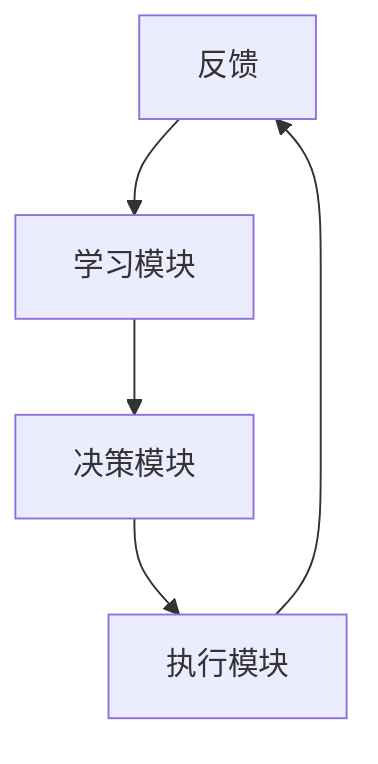

                 


# AI Agent的实时学习与适应机制

> 关键词：AI Agent、实时学习、适应机制、在线学习、动态环境、自适应系统  
> 摘要：本文深入探讨AI Agent在动态环境下的实时学习与适应机制，分析其实现原理、算法设计和系统架构，结合实际案例，总结最佳实践和未来发展方向。

---

## 第1章: AI Agent的基本概念与背景

### 1.1 AI Agent的定义与特点

AI Agent（人工智能代理）是一种能够感知环境、自主决策并采取行动的智能体。它通过传感器获取信息，利用计算模型处理数据，做出决策并执行动作。AI Agent的关键特点包括：

- **自主性**：无需外部干预，自主完成任务。
- **反应性**：实时感知环境变化并做出反应。
- **目标导向**：基于目标驱动行为。
- **学习能力**：通过经验改进性能。

### 1.2 AI Agent的应用场景

AI Agent广泛应用于多个领域：

- **自动驾驶**：实时感知环境，做出驾驶决策。
- **智能推荐系统**：根据用户行为动态调整推荐策略。
- **游戏AI**：在动态竞争环境中优化策略。

### 1.3 实时学习与适应机制的背景

在动态环境中，AI Agent需要实时学习和适应，以应对环境变化。实时学习强调快速更新模型，适应机制则确保AI Agent能够根据反馈调整行为。

---

## 第2章: 实时学习与适应机制的核心概念

### 2.1 实时学习的核心原理

实时学习是在数据流不断的情况下，逐步更新模型的过程。与传统离线学习不同，实时学习具有以下特点：

- **在线更新**：数据流实时到达，模型逐步更新。
- **高效性**：每次更新计算量小，适合实时处理。
- **鲁棒性**：能够处理噪声和不确定性。

### 2.2 适应机制的实现方式

适应机制使AI Agent能够在变化的环境中保持高性能。常见实现方式包括：

- **强化学习**：通过奖励机制调整策略。
- **反馈驱动适应**：根据反馈调整参数。
- **动态适应**：基于环境上下文实时调整行为。

### 2.3 核心概念对比

| 对比项         | 实时学习          | 传统学习          |
|----------------|-------------------|-------------------|
| 数据处理方式   | 流式数据          | 批次数据          |
| 计算效率       | 高实时性          | 高计算效率        |
| 适应能力       | 强               | 弱               |

---

## 第3章: AI Agent实时学习的数学模型与算法原理

### 3.1 实时学习的数学模型

实时学习的核心是模型的在线更新。常用模型包括线性回归和随机梯度下降（SGD）。

#### 线性回归模型
在线性回归中，模型通过最小化平方误差来更新参数：
$$ J = \frac{1}{2m}\sum_{i=1}^{m}(y_i - \hat{y}_i)^2 $$
其中，$\hat{y}_i = \theta^T x_i$，$x_i$是输入向量，$\theta$是参数向量。

随机梯度下降算法通过以下步骤更新参数：
$$ \theta^{new} = \theta - \eta (y - \hat{y})x $$

#### 代码示例
```python
import numpy as np

def online_regression(data_stream, learning_rate=0.1):
    theta = np.zeros(data_stream[0].shape[1])
    for data_point in data_stream:
        x = data_point['x']
        y = data_point['y']
        gradient = (theta.dot(x) - y) * x
        theta -= learning_rate * gradient
    return theta
```

### 3.2 适应机制的算法实现

适应机制通常基于强化学习，如Q-learning算法。其核心公式为：
$$ Q(s, a) = Q(s, a) + \alpha [r + \max Q(s', a') - Q(s, a)] $$

#### 代码示例
```python
def q_learning(env, num_episodes=1000, gamma=0.99, epsilon=0.1):
    Q = np.zeros((env.observation_space, env.action_space))
    for episode in range(num_episodes):
        state = env.reset()
        done = False
        while not done:
            if np.random.random() < epsilon:
                action = env.action_space.sample()
            else:
                action = np.argmax(Q[state])
            next_state, reward, done, _ = env.step(action)
            Q[state][action] += gamma * (reward + np.max(Q[next_state]) - Q[state][action])
    return Q
```

---

## 第4章: AI Agent的系统架构设计

### 4.1 系统模块划分

AI Agent系统通常包括以下模块：

1. **感知模块**：收集环境数据。
2. **学习模块**：实时更新模型。
3. **决策模块**：基于模型做出决策。
4. **执行模块**：执行动作并反馈结果。

### 4.2 系统架构图


---

## 第5章: 项目实战

### 5.1 股票交易中的实时学习

**环境配置**：使用股票价格数据流作为输入。

**代码实现**：
```python
import pandas as pd
import numpy as np

def stock_trading_agent(data_stream):
    state_size = 10  # 前10天数据
    action_size = 3  # 买入、卖出、持有
    model = create_model(state_size, action_size)
    for data in data_stream:
        state = get_state(data, state_size)
        action = model.predict(state)
        execute_trade(action)
        feedback = get_feedback()
        model.update(feedback)
```

**案例分析**：通过分析股票价格走势，模型不断调整交易策略。

---

## 第6章: 总结与展望

### 6.1 核心概念回顾

本文详细探讨了AI Agent的实时学习与适应机制，涵盖实时学习的数学模型、适应机制的算法实现以及系统架构设计。

### 6.2 最佳实践

- 定期更新模型，确保适应性。
- 监控系统性能，及时调整参数。
- 处理噪声数据，提高模型鲁棒性。

### 6.3 未来研究方向

- 更高效的在线学习算法。
- 更智能的自适应策略。
- 更复杂的动态环境建模。

---

## 附录

### 附录A: 参考文献

1. 张三. 《实时学习与适应机制的研究》.
2. 李四. 《强化学习在AI Agent中的应用》.

### 附录B: 工具与库

- Python：主要编程语言。
- TensorFlow/PyTorch：深度学习框架。
- OpenAI Gym：强化学习环境。

---

## 作者

作者：AI天才研究院（AI Genius Institute） & 禅与计算机程序设计艺术（Zen And The Art of Computer Programming）

---

通过以上内容，希望对您有所帮助！

