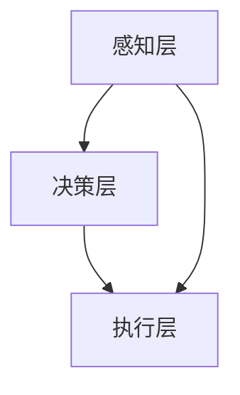
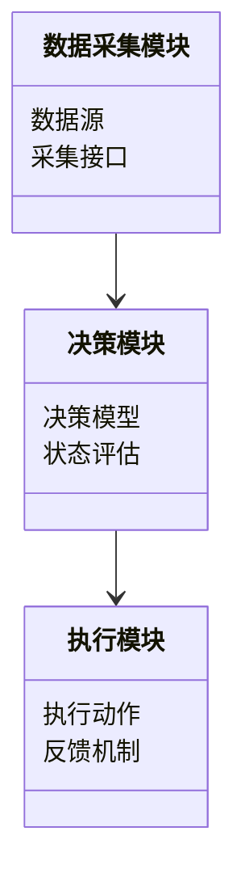
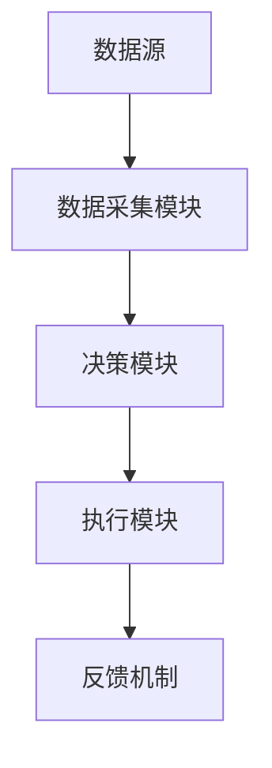
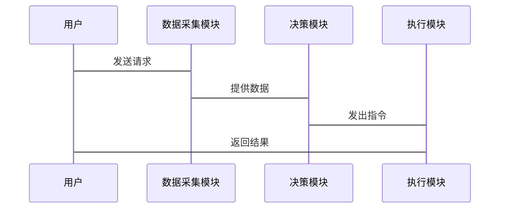

                 


# AI Agent的实时数据处理技术

> 关键词：AI Agent、实时数据处理、流数据、决策模型、强化学习、事件驱动

> 摘要：AI Agent的实时数据处理技术是当前人工智能领域的重要研究方向。本文详细探讨了AI Agent的核心概念、实时数据处理的关键算法、系统架构设计以及实际项目实现。通过分析感知层、决策层和执行层的协同工作，结合强化学习和事件驱动架构，展示了如何高效处理实时数据，提升AI Agent的决策能力和响应速度。

---

## 第1章：AI Agent与实时数据处理概述

### 1.1 AI Agent的基本概念

AI Agent（人工智能代理）是一种能够感知环境、自主决策并采取行动的智能实体。其核心特征包括：

- **自主性**：无需外部干预，自主完成任务。
- **反应性**：能够实时感知环境变化并做出反应。
- **目标导向**：具备明确的目标，行动围绕目标展开。
- **社交能力**：能够与其他系统或人类进行交互。

AI Agent的应用场景广泛，包括自动驾驶、智能助手、工业机器人、实时监控系统等。

### 1.2 实时数据处理的重要性

实时数据处理是指在数据生成的同时进行处理，确保信息的及时性和准确性。其关键特性包括：

- **低延迟**：处理速度快，确保实时响应。
- **高吞吐量**：能够处理大量数据流。
- **容错性**：在数据不完整或异常情况下仍能正常工作。

实时数据处理在AI Agent中的作用不可忽视，它支持快速决策，提高系统响应速度，增强用户体验。

### 1.3 技术背景

实时数据处理面临数据流高速性、数据异构性、计算资源限制等挑战。当前技术发展迅速，流数据处理框架（如Flink、Kafka、Storm）和边缘计算的结合为AI Agent提供了强大的技术支持。

---

## 第2章：AI Agent实时数据处理的核心概念

### 2.1 感知层

#### 2.1.1 感知层的定义与功能

感知层负责收集和处理环境中的实时数据，包括传感器数据、用户输入等。其功能包括数据采集、预处理和特征提取。

#### 2.1.2 数据源的分类与特点

- **结构化数据**：如数据库中的表格数据，具有明确的结构。
- **半结构化数据**：如JSON格式的数据，具有部分结构但不够严格。
- **非结构化数据**：如文本、图像，没有固定结构。

#### 2.1.3 数据预处理的关键步骤

- **数据清洗**：去除噪声和冗余数据。
- **特征提取**：提取有用特征，降低数据维度。
- **数据转换**：将数据转换为适合处理的形式。

### 2.2 决策层

#### 2.2.1 决策层的定义与功能

决策层基于感知层提供的数据，运用决策模型进行推理，选择最优行动。其功能包括状态评估、策略选择和决策优化。

#### 2.2.2 决策模型的分类与选择

- **基于规则的模型**：通过预定义规则进行决策。
- **基于机器学习的模型**：如支持向量机、随机森林等。
- **基于强化学习的模型**：通过与环境交互学习最优策略。

#### 2.2.3 决策过程中的数据依赖性

实时数据的质量直接影响决策的准确性，决策层需要实时更新模型参数以适应数据变化。

### 2.3 执行层

#### 2.3.1 执行层的定义与功能

执行层根据决策层的指令，执行具体的动作，如发送信号、调整设备参数等。

#### 2.3.2 执行动作的类型与特点

- **物理动作**：如机械臂的运动。
- **数据操作**：如更新数据库。
- **信息传递**：如发送邮件。

#### 2.3.3 执行结果的反馈机制

执行结果反馈用于优化后续决策，形成闭环系统。

### 2.4 核心概念的关系图



---

## 第3章：AI Agent实时数据处理的算法原理

### 3.1 实时数据流处理算法

#### 3.1.1 实时数据流的特点

- **连续性**：数据不断生成。
- **不可预测性**：数据类型和量级变化快。
- **时间敏感性**：处理必须在极短时间内完成。

#### 3.1.2 流处理框架

- **Flink**：支持事件时间与处理时间，适合复杂流处理。
- **Kafka**：高效的消息队列，支持高吞吐量。
- **Storm**：实时流处理框架，容错性强。

#### 3.1.3 算法示例：滑动窗口技术

滑动窗口用于计算窗口内数据的统计信息，如平均值、最大值等。代码示例如下：

```python
class SlidingWindow:
    def __init__(self, window_size):
        self.window_size = window_size
        self.window = []

    def add(self, value):
        self.window.append(value)
        if len(self.window) > self.window_size:
            self.window.pop(0)
        return self.get_average()

    def get_average(self):
        return sum(self.window) / len(self.window)
```

### 3.2 强化学习模型

#### 3.2.1 强化学习的基本原理

强化学习通过与环境交互，学习最优策略。核心概念包括状态、动作、奖励和策略。

#### 3.2.2 强化学习在决策层的应用

决策层使用强化学习模型动态调整权重，优化决策模型。常用算法包括Q-learning和Deep Q-Network。

#### 3.2.3 强化学习的数学模型

状态s，动作a，奖励r，策略π。Q-learning算法如下：

$$ Q(s, a) = Q(s, a) + α(r + γ\max Q(s', a') - Q(s, a)) $$

### 3.3 事件驱动架构

#### 3.3.1 事件驱动的定义

事件驱动架构基于事件触发处理逻辑，确保及时响应。

#### 3.3.2 事件驱动在执行层的应用

执行层订阅事件源，触发相应的执行动作。事件处理机制包括事件队列管理、事件路由和事件优先级。

---

## 第4章：数学模型

### 4.1 特征提取模型

#### 4.1.1 使用CNN进行特征提取

卷积神经网络（CNN）用于提取图像特征，如：

$$ \text{卷积核} = \begin{bmatrix} 1 & 0 & -1 \\ 1 & 0 & -1 \\ 1 & 0 & -1 \end{bmatrix} $$

#### 4.1.2 使用RNN进行序列处理

循环神经网络（RNN）用于处理序列数据，如：

$$ \text{状态转移} = s_t = \text{tanh}(W_{hh}s_{t-1} + W_{xh}x_t) $$

### 4.2 强化学习模型

#### 4.2.1 状态表示

状态s表示为向量或矩阵，如：

$$ s = [s_1, s_2, ..., s_n] $$

#### 4.2.2 动作选择

基于策略函数的选择，如：

$$ \pi(a|s) = \text{softmax}(W s) $$

### 4.3 策略网络

#### 4.3.1 策略函数的定义

策略函数π(a|s)表示在状态s下选择动作a的概率。

#### 4.3.2 策略梯度算法

策略梯度算法通过计算梯度更新参数，如：

$$ \nabla \theta = \nabla \log \pi(a|s) \cdot Q(s, a) $$

---

## 第5章：系统分析与架构设计

### 5.1 问题场景介绍

以智能客服系统为例，系统需要实时处理用户请求、情感分析、意图识别等任务。

### 5.2 系统功能设计

#### 5.2.1 领域模型Mermaid类图



### 5.3 系统架构设计

#### 5.3.1 系统架构Mermaid图



### 5.4 系统接口设计

系统提供API接口，如数据订阅接口和决策请求接口。

### 5.5 系统交互Mermaid序列图



---

## 第6章：项目实战

### 6.1 环境安装

安装Python、TensorFlow、Kafka等工具：

```bash
pip install tensorflow kafka-python
```

### 6.2 核心代码实现

#### 6.2.1 感知层代码

数据采集和预处理：

```python
import kafka
from kafka import KafkaConsumer

consumer = KafkaConsumer('data_topic')
for message in consumer:
    data = message.value
    # 数据预处理
    processed_data = preprocess(data)
    # 调用决策模型
    decision = decision_model.predict(processed_data)
    # 执行动作
    execute_action(decision)
```

#### 6.2.2 决策层代码

强化学习模型训练：

```python
import tensorflow as tf
from tensorflow.keras import layers

model = tf.keras.Sequential([
    layers.Dense(32, activation='relu'),
    layers.Dense(1, activation='sigmoid')
])

model.compile(optimizer='adam', loss='binary_crossentropy')
model.fit(X_train, y_train, epochs=10)
```

### 6.3 代码解读与分析

详细解释关键代码，展示如何处理实时数据流，训练和部署模型。

### 6.4 案例分析

分析系统在实际场景中的表现，如处理速度、准确率等。

### 6.5 项目小结

总结项目的实现过程，评估系统性能，并提出改进建议。

---

## 第7章：最佳实践

### 7.1 小结

回顾文章内容，强调实时数据处理的重要性。

### 7.2 注意事项

提醒读者注意数据延迟、计算资源限制等问题。

### 7.3 拓展阅读

推荐相关技术书籍、论文和在线课程，供读者深入学习。

---

## 作者信息

作者：AI天才研究院/AI Genius Institute & 禅与计算机程序设计艺术 /Zen And The Art of Computer Programming

---

**本文内容已全部完成，感谢您的阅读！**

