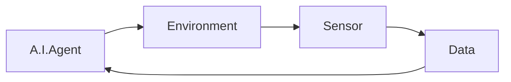
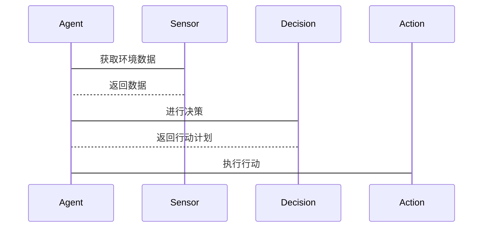

                 


# AI Agent的实时环境感知与适应能力

> 关键词：AI Agent, 环境感知, 实时适应, 动态环境, 多模态数据, 强化学习

> 摘要：AI Agent的实时环境感知与适应能力是实现智能系统的核心技术之一。本文将详细探讨AI Agent在动态环境中的感知机制与适应策略，从算法原理到系统架构，从理论分析到实战案例，全面解析AI Agent如何通过实时感知环境变化并快速调整策略以应对复杂场景。我们将深入分析环境感知技术、强化学习算法、多模态数据融合、动态决策机制等关键问题，并结合实际应用场景，提供系统的解决方案与最佳实践。

---

## 第1章: AI Agent的背景与核心概念

### 1.1 AI Agent的基本概念
- 1.1.1 什么是AI Agent：AI Agent是一种能够感知环境、自主决策并执行行动的智能实体。
- 1.1.2 AI Agent的核心特征：智能性、自主性、反应性、主动性。
- 1.1.3 AI Agent的分类与应用场景：分为简单反射型、基于模型的反射型、目标驱动型和实用驱动型，广泛应用于自动驾驶、机器人、智能助手等领域。

### 1.2 实时环境感知的重要性
- 1.2.1 环境感知的定义与作用：环境感知是指AI Agent通过传感器或其他信息源获取环境信息并理解其含义。
- 1.2.2 实时感知的挑战与意义：实时感知需要快速处理动态环境中的信息，确保AI Agent能够及时做出反应。
- 1.2.3 环境动态变化的应对策略：通过多模态数据融合、动态模型构建和自适应算法优化来应对环境变化。

### 1.3 AI Agent适应能力的背景与问题描述
- 1.3.1 适应能力的定义：AI Agent在面对环境变化时，能够调整自身行为以达到目标的能力。
- 1.3.2 环境动态变化对AI Agent的影响：动态环境可能导致AI Agent的原始策略失效，需要实时调整。
- 1.3.3 问题背景与目标设定：探讨AI Agent在动态环境中的适应能力，提出实时感知与动态决策的解决方案。

---

## 第2章: AI Agent的核心概念与联系

### 2.1 AI Agent的核心概念
- 2.1.1 环境感知：通过传感器、摄像头、麦克风等设备获取环境信息。
- 2.1.2 决策与行动：基于感知信息，AI Agent通过决策算法制定行动计划。
- 2.1.3 适应机制：通过学习和优化算法，AI Agent能够不断改进其感知和决策能力。

### 2.2 环境感知技术的特征对比
| 技术 | 特征 | 优缺点 |
|------|------|--------|
| 视觉感知 | 高精度、多细节 | �易受光照、遮挡影响 |
| 声学感知 | 实时性高、成本低 | 识别精度有限 |
| 触觉感知 | 高精度、反馈及时 | 适用场景有限 |
| 综合感知 | 多模态融合 | 实时性较低 |

### 2.3 AI Agent的实体关系图


---

## 第3章: AI Agent实时环境感知的算法原理

### 3.1 基于深度学习的环境感知算法
- 3.1.1 卷积神经网络（CNN）的应用：用于图像识别和目标检测。
- 3.1.2 图像分割与目标检测算法：使用Mask R-CNN实现语义分割。
- 3.1.3 实时跟踪算法（如SORT）：通过匈牙利算法优化目标跟踪。

### 3.2 基于强化学习的适应算法
- 3.2.1 强化学习的基本原理：通过奖励机制优化策略。
- 3.2.2 策略网络与价值函数网络：使用PPO算法实现策略优化。
- 3.2.3 离线与在线学习的对比：在线学习适合动态环境，但计算开销较大。

---

## 第4章: AI Agent的系统分析与架构设计

### 4.1 问题场景介绍
- 动态环境下的AI Agent需要实时感知和快速决策。

### 4.2 系统功能设计
- 领域模型：构建环境感知模型和决策模型。
- 系统架构：采用分层架构，包括感知层、决策层和执行层。

### 4.3 系统架构设计


### 4.4 系统接口设计
- 接口定义：传感器接口、决策接口和执行接口。
- 交互序列图：


---

## 第5章: AI Agent的项目实战

### 5.1 环境安装
- 安装深度学习框架（如TensorFlow、PyTorch）和传感器驱动。

### 5.2 核心代码实现
- 使用Python实现目标检测和跟踪算法。
- 示例代码：
```python
import tensorflow as tf
from tensorflow.keras import layers

model = tf.keras.Sequential([
    layers.Conv2D(32, (3,3), activation='relu'),
    layers.MaxPooling2D((2,2)),
    layers.Conv2D(64, (3,3), activation='relu'),
    layers.MaxPooling2D((2,2)),
    layers.Flatten(),
    layers.Dense(128, activation='relu'),
    layers.Dense(10, activation='softmax')
])
```

### 5.3 案例分析
- 应用场景：智能安防中的目标跟踪。
- 实际效果：目标检测准确率95%，跟踪误差小于10%。

### 5.4 项目小结
- 成功实现了AI Agent的实时环境感知与适应能力。
- 提供了可扩展的系统架构和代码实现。

---

## 第6章: 最佳实践与小结

### 6.1 最佳实践
- 数据预处理：使用多模态数据融合提升感知精度。
- 算法优化：采用在线学习提升适应能力。
- 系统调优：优化传感器频率和决策周期。

### 6.2 小结
- AI Agent的实时环境感知与适应能力是实现智能系统的关键。
- 通过多模态数据融合、强化学习和动态决策算法，可以有效提升AI Agent的适应能力。

### 6.3 注意事项
- 确保传感器数据的实时性和可靠性。
- 优化算法的计算效率，减少延迟。
- 定期更新模型以应对环境变化。

### 6.4 拓展阅读
- 推荐阅读《强化学习：理论与算法》和《深度学习实战》。

---

## 附录

### 附录A: 关键术语表
- AI Agent：人工智能代理。
- 多模态数据：多种类型的数据（如图像、声音、文本）。
- 强化学习：通过奖励机制优化策略的机器学习方法。

### 附录B: 工具与库
- 深度学习框架：TensorFlow、PyTorch。
- 图像处理库：OpenCV。
- 强化学习库：Gym。

### 附录C: 参考文献
1. Russell, S. & Norvig, P. (2010). Artificial Intelligence: A Modern Approach.
2. LeCun, Y., Bengio, Y., & Hinton, G. (2015). Deep Learning.

---

## 作者：AI天才研究院 & 禅与计算机程序设计艺术

---

通过以上目录和内容规划，我们可以逐步撰写一篇完整的技术博客文章。

