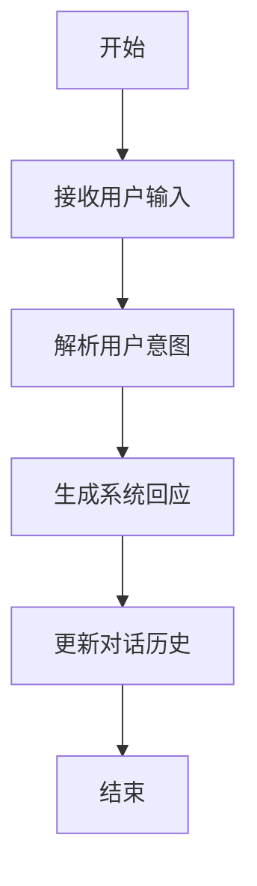
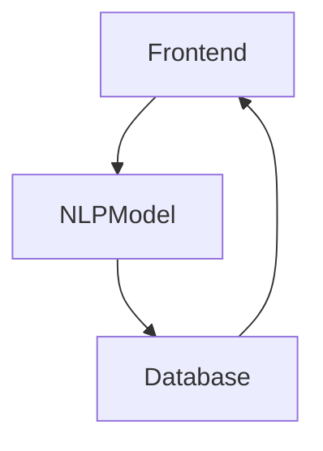

                 


# AI Agent的实时自适应对话管理系统

## 关键词：
AI Agent, 实时自适应, 对话管理, 自然语言处理, 系统架构, 算法原理, 项目实战

## 摘要：
本文系统地介绍AI Agent的实时自适应对话管理系统的背景、核心概念、算法原理、系统架构、项目实战和最佳实践。从背景介绍到系统设计，从算法实现到项目部署，层层深入，全面解析AI Agent的实时自适应对话管理系统的实现细节和应用价值。

---

# 第一部分: AI Agent的背景与核心概念

## 第1章: AI Agent的背景与问题背景

### 1.1 AI Agent的基本概念

#### 1.1.1 什么是AI Agent
AI Agent（人工智能代理）是指能够感知环境、自主决策并执行任务的智能体。它可以理解用户的意图、生成自然语言回复，并根据对话上下文动态调整行为。

#### 1.1.2 AI Agent的核心特点
- **自主性**：能够在没有外部干预的情况下独立执行任务。
- **反应性**：能够实时感知环境变化并做出反应。
- **学习能力**：能够通过数据和经验不断优化自身的对话策略。

#### 1.1.3 AI Agent的应用场景
- **智能客服**：提供24/7的在线支持，解决用户问题。
- **虚拟助手**：如Siri、Alexa等，帮助用户完成日常任务。
- **教育辅助**：为学生提供个性化的学习建议和答疑。

### 1.2 实时自适应对话管理系统的定义

#### 1.2.1 对话管理的基本概念
对话管理是指通过分析对话内容，理解用户意图，并生成合适的系统回复。实时自适应对话管理系统能够在对话过程中动态调整策略，以提高对话的准确性和流畅性。

#### 1.2.2 实时自适应的核心含义
- **实时性**：在对话进行中实时处理用户的输入，并生成回复。
- **自适应性**：根据对话上下文和用户反馈动态调整对话策略。

#### 1.2.3 问题背景与问题描述
随着AI技术的发展，对话系统逐渐从简单的规则驱动向更复杂的自适应驱动转变。然而，现有的许多对话系统在面对复杂对话场景时，仍然存在理解错误、回复不准确等问题。因此，如何构建一个实时自适应的对话管理系统，成为当前研究的热点。

### 1.3 问题解决与边界分析

#### 1.3.1 问题解决的基本思路
- **理解用户意图**：通过NLP技术解析用户的输入，确定用户的需求。
- **生成回复**：基于用户意图生成合适的回复内容。
- **动态调整**：根据对话历史和用户反馈，动态优化对话策略。

#### 1.3.2 边界与外延分析
- **边界**：实时自适应对话管理系统主要关注对话过程中的动态调整和优化，不涉及后端业务逻辑的实现。
- **外延**：可以与其他系统（如知识库、业务系统）进行集成，以提供更丰富的功能。

#### 1.3.3 核心要素与概念结构
- **对话历史**：记录对话的上下文信息。
- **用户意图**：解析用户的请求和需求。
- **系统回复**：生成符合用户意图的回复内容。
- **对话策略**：动态调整对话的逻辑和流程。

---

## 第2章: AI Agent的核心概念与联系

### 2.1 核心概念原理

#### 2.1.1 自然语言处理（NLP）原理
NLP技术用于理解用户输入的文本，并生成自然的回复内容。常用的技术包括分词、实体识别、意图识别等。

#### 2.1.2 对话管理的算法原理
对话管理算法负责根据对话历史和当前输入，生成下一步的回复内容。常用算法包括基于规则的策略、基于统计的策略和基于深度学习的策略。

#### 2.1.3 实时自适应的核心算法
实时自适应算法能够在对话过程中动态调整策略，通过反馈机制不断优化对话效果。

### 2.2 核心概念对比表

| 对比维度         | 基于规则的对话管理 | 基于统计的对话管理 | 基于深度学习的对话管理 |
|------------------|---------------------|---------------------|-------------------------|
| 实现方式         | 预定义规则         | 统计模型预测         | 神经网络预测           |
| 适应性           | 较低               | 中等                | 高                     |
| 可维护性         | 较高               | 较低                | 一般                   |
| 适用场景         | 简单对话           | 中等复杂对话         | 复杂对话               |

### 2.3 ER实体关系图
```mermaid
er
  actor(Agent, id, name)
  actor(User, id, name)
  relation(Message, Agent, content)
  relation(Message, User, content)
  relation(DialogueHistory, Agent, history)
```

---

# 第二部分: AI Agent的算法原理与数学模型

## 第3章: 对话管理算法原理

### 3.1 对话管理算法概述

#### 3.1.1 基于规则的对话管理
基于规则的对话管理通过预定义的规则来生成回复。优点是实现简单，缺点是灵活性差。

#### 3.1.2 基于统计的对话管理
基于统计的对话管理通过统计模型预测用户意图，并生成回复。优点是灵活性高，缺点是需要大量数据支持。

#### 3.1.3 基于深度学习的对话管理
基于深度学习的对话管理通过神经网络模型生成回复。优点是效果好，缺点是实现复杂。

### 3.2 实时自适应算法的流程


### 3.3 算法实现

#### 3.3.1 概率计算
$$ P(y|x) = \frac{P(x|y)P(y)}{P(x)} $$

#### 3.3.2 对话策略优化
$$ J(\theta) = \sum_{i=1}^{n} \log P(y_i|x_i;\theta) $$

#### 3.3.3 Python实现
```python
import numpy as np
from sklearn.metrics import accuracy_score

# 示例代码：基于机器学习的意图分类
def train_model(X, y):
    # 假设X是特征矩阵，y是标签
    # 这里使用简单的线性回归模型进行分类
    model = np.linalg.lstsq(X.T, y, rcond=None)[0]
    return model

def predict_model(model, X_test):
    # 预测标签
    y_pred = np.dot(X_test.T, model)
    return y_pred

# 示例数据
X = np.random.rand(100, 10)
y = np.random.randint(0, 5, 100)

model = train_model(X, y)
X_test = np.random.rand(20, 10)
y_pred = predict_model(model, X_test)

print("准确率:", accuracy_score(y, y_pred))
```

---

## 第4章: 系统架构与设计

### 4.1 系统架构设计

#### 4.1.1 系统组成
- **前端**：接收用户输入，展示系统回复。
- **后端**：处理对话逻辑，调用NLP模型。
- **数据库**：存储对话历史和相关数据。

#### 4.1.2 系统架构图


### 4.2 接口设计

#### 4.2.1 接收用户输入
```python
def receive_input(text):
    return text
```

#### 4.2.2 发送系统回复
```python
def send_response(text):
    return text
```

---

# 第三部分: 项目实战与案例分析

## 第5章: 项目实战

### 5.1 环境安装

#### 5.1.1 安装Python
```bash
python --version
```

#### 5.1.2 安装依赖
```bash
pip install numpy scikit-learn
```

### 5.2 核心实现

#### 5.2.1 对话管理实现
```python
def dialog_manage(history, input_text):
    # 处理逻辑
    return response
```

---

## 第6章: 最佳实践与小结

### 6.1 小结
实时自适应对话管理系统通过动态调整对话策略，能够提高对话的准确性和流畅性。

### 6.2 注意事项
- 定期更新模型，以提高准确率。
- 注意数据隐私和安全。

### 6.3 拓展阅读
- 《深度学习入门：基于Python和TensorFlow》
- 《自然语言处理实战：基于Python和机器学习》

---

# 作者
作者：AI天才研究院 & 禅与计算机程序设计艺术

