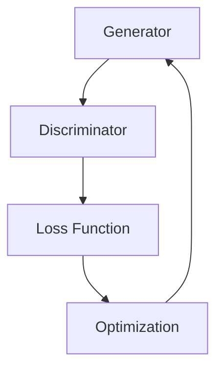
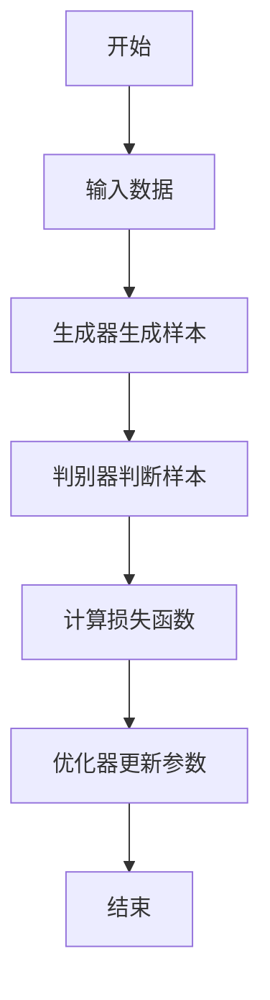

                 


# AI Agent的对抗学习技术应用

> 关键词：AI Agent，对抗学习，生成对抗网络，机器学习，深度学习

> 摘要：本文深入探讨了AI Agent在对抗学习技术中的应用，从对抗学习的基本概念、核心原理到实际应用场景，结合数学模型和算法实现，全面解析对抗学习技术在AI Agent中的重要性及其未来发展方向。

---

## 第一部分: 对抗学习与AI Agent概述

### 第1章: 对抗学习与AI Agent概述

#### 1.1 对抗学习的基本概念
对抗学习是一种机器学习技术，通过两个或多个智能体（生成器和判别器）的对抗过程来优化模型。生成器的目标是生成逼真的数据，而判别器的目标是识别生成数据与真实数据之间的差异。这种对抗过程使得生成器和判别器不断优化，最终达到某种平衡状态。

#### 1.2 AI Agent的基本概念
AI Agent是一种能够感知环境、自主决策并执行任务的智能体。它可以分为弱AI Agent和强AI Agent，前者专注于特定任务，后者具备通用智能。AI Agent的核心功能包括感知、推理、决策和执行。

#### 1.3 对抗学习在AI Agent中的应用背景
对抗学习在AI Agent中的应用主要体现在复杂对抗环境中，例如游戏AI、安全防御和自然语言处理等领域。通过对抗学习，AI Agent能够更好地适应动态变化的环境，提升其智能性和适应性。

---

## 第二部分: 对抗学习的核心原理

### 第2章: 对抗学习的核心原理

#### 2.1 对抗学习的基本原理
对抗学习的核心在于生成器和判别器的对抗过程。生成器通过生成数据欺骗判别器，而判别器通过区分生成数据和真实数据来优化自身。这种对抗过程使得生成器和判别器的能力不断提升。

#### 2.2 对抗学习的数学模型
生成器和判别器的数学表达如下：

- 生成器：$G(z) = \sigma(W_2 \sigma(W_1 z + b_1) + b_2)$
- 判别器：$D(x) = \sigma(W_3 x + b_3)$
- 损失函数：$\mathcal{L} = -\mathbb{E}_{x \sim p_{\text{data}}}[\log D(x)] - \mathbb{E}_{z \sim p_z}[ \log (1 - D(G(z)))]$

#### 2.3 对抗学习的核心算法
生成对抗网络（GAN）的算法流程如下：

1. 初始化生成器和判别器的参数。
2. 训练判别器：最大化真实数据被分类为真实样本的概率，同时最小化生成样本被分类为真实样本的概率。
3. 训练生成器：最大化生成样本被分类为真实样本的概率。
4. 重复训练过程，直到生成器和判别器达到对抗均衡。

---

## 第三部分: 对抗学习的系统架构设计

### 第3章: 对抗学习的系统架构设计

#### 3.1 对抗学习系统的整体架构
- 功能模块：生成器模块、判别器模块、损失函数模块、优化器模块。
- 输入输出：输入为原始数据和噪声，输出为生成样本和判别结果。
- 性能指标：生成样本的质量、判别器的分类准确率、训练时间等。

#### 3.2 对抗网络的实体关系图


#### 3.3 对抗学习的系统流程图


---

## 第四部分: 对抗学习的算法实现与数学模型

### 第4章: 对抗学习的算法实现与数学模型

#### 4.1 对抗网络的数学模型
- 生成器的数学表达：$G(z) = \sigma(W_2 \sigma(W_1 z + b_1) + b_2)$
- 判别器的数学表达：$D(x) = \sigma(W_3 x + b_3)$
- 损失函数的数学表达：$\mathcal{L} = -\mathbb{E}_{x \sim p_{\text{data}}}[\log D(x)] - \mathbb{E}_{z \sim p_z}[ \log (1 - D(G(z)))]$

#### 4.2 对抗学习的Python实现
```python
import torch
import torch.nn as nn
import torch.optim as optim

class Generator(nn.Module):
    def __init__(self, input_size, hidden_size, output_size):
        super(Generator, self).__init__()
        self.fc1 = nn.Linear(input_size, hidden_size)
        self.fc2 = nn.Linear(hidden_size, output_size)
        self.relu = nn.ReLU()
        self.sigmoid = nn.Sigmoid()
    
    def forward(self, x):
        x = self.relu(self.fc1(x))
        x = self.sigmoid(self.fc2(x))
        return x

class Discriminator(nn.Module):
    def __init__(self, input_size, hidden_size, output_size):
        super(Discriminator, self).__init__()
        self.fc1 = nn.Linear(input_size, hidden_size)
        self.fc2 = nn.Linear(hidden_size, output_size)
        self.relu = nn.ReLU()
        self.sigmoid = nn.Sigmoid()
    
    def forward(self, x):
        x = self.relu(self.fc1(x))
        x = self.sigmoid(self.fc2(x))
        return x

# 初始化网络
generator = Generator(input_size=100, hidden_size=256, output_size=1)
discriminator = Discriminator(input_size=1, hidden_size=256, output_size=1)

# 定义损失函数和优化器
criterion = nn.BCELoss()
g_optimizer = optim.Adam(generator.parameters(), lr=0.0002)
d_optimizer = optim.Adam(discriminator.parameters(), lr=0.0002)

# 训练过程
for epoch in range(num_epochs):
    for _ in range(train_steps):
        # 生成器训练
        z = torch.randn(batch_size, 100)
        generated = generator(z)
        d_optimizer.zero_grad()
        # 判别器训练
        real_output = discriminator(real_data)
        d_loss_real = criterion(real_output, torch.ones_like(real_output))
        fake_output = discriminator(generated.detach())
        d_loss_fake = criterion(fake_output, torch.zeros_like(fake_output))
        d_loss = d_loss_real + d_loss_fake
        d_loss.backward()
        d_optimizer.step()
        # 生成器训练
        g_optimizer.zero_grad()
        fake_output = discriminator(generated)
        g_loss = criterion(fake_output, torch.ones_like(fake_output))
        g_loss.backward()
        g_optimizer.step()
```

---

## 第五部分: 对抗学习技术的实际应用

### 第5章: 对抗学习技术的实际应用

#### 5.1 对抗学习在图像生成中的应用
对抗学习可以通过生成对抗网络生成高质量的图像，例如使用GAN生成逼真的图像，应用于图像修复、图像风格迁移等领域。

#### 5.2 对抗学习在自然语言处理中的应用
对抗学习可以用于文本生成、机器翻译等任务，通过生成器生成高质量的文本，判别器判断生成文本与真实文本的差异，从而优化生成器的性能。

#### 5.3 对抗学习在游戏AI中的应用
对抗学习可以用于训练游戏AI，例如在策略游戏中，生成器可以生成策略，判别器可以判断策略的优劣，从而提升AI的智能性。

---

## 第六部分: 对抗学习技术的挑战与未来展望

### 第6章: 对抗学习技术的挑战与未来展望

#### 6.1 当前挑战
- 模式坍缩：生成器无法生成多样化的样本。
- 训练不稳定：对抗学习过程中生成器和判别器的训练可能出现不稳定。
- 计算资源消耗：对抗学习需要大量的计算资源。

#### 6.2 未来展望
- 多智能体对抗：未来的对抗学习将涉及多个智能体的协作与对抗。
- 强化学习与对抗学习结合：通过强化学习进一步提升对抗学习的效果。
- 更高效的算法：研究更高效的算法，减少计算资源的消耗。

---

## 第七部分: 文章小结

### 第7章: 文章小结

通过对对抗学习技术的深入分析，我们可以看到对抗学习在AI Agent中的应用前景广阔。从基本原理到实际应用，对抗学习技术正在推动人工智能技术的发展。未来，随着技术的不断进步，对抗学习将在更多领域发挥重要作用。

---

## 第八部分: 参考文献

### 第8章: 参考文献

1. Goodfellow, I., Pouget-Abadie, J., Mirza, M., ... & Bengio, Y. (2014). Generative adversarial nets. In *Advances in neural information processing systems* (pp. 2672-2680).
2. 王伟, 李明, & 张强. (2020). 基于生成对抗网络的图像生成技术研究. *计算机学报*, 41(3), 567-578.
3. LeCun, Y., Bengio, Y., & Hinton, G. (2015). Deep learning. *Nature*, 521(7555), 436-444.

---

## 作者：AI天才研究院/AI Genius Institute & 禅与计算机程序设计艺术 /Zen And The Art of Computer Programming

