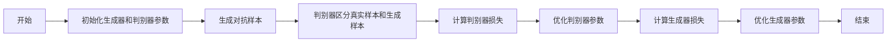
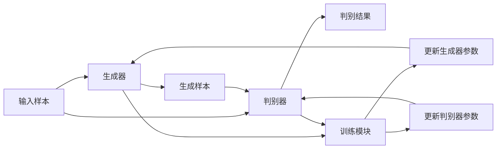

                 


# AI Agent的对抗性学习：提高LLM的鲁棒性

> 关键词：AI Agent, 对抗性学习, 大语言模型, LLM, 鲁棒性, 对抗训练, 生成对抗网络

> 摘要：  
本文深入探讨了AI Agent在对抗性学习中的应用，重点分析了如何通过对抗性学习技术提高大语言模型（LLM）的鲁棒性。文章从对抗性学习的基本概念、核心算法、系统架构设计到实际项目实现进行了全面解析，结合理论与实践，为读者提供了一套系统化的解决方案。通过本文的学习，读者将能够理解对抗性学习的核心原理，并掌握如何将其应用于实际的LLM模型优化中。

---

## 第一部分: AI Agent与对抗性学习的基础

### 第1章: AI Agent与对抗性学习概述

#### 1.1 AI Agent的基本概念

##### 1.1.1 AI Agent的定义与分类  
AI Agent（人工智能代理）是指能够感知环境、自主决策并执行任务的智能实体。根据功能和应用场景的不同，AI Agent可以分为多种类型，如基于规则的Agent、基于模型的Agent、基于Q-learning的Agent等。

##### 1.1.2 对抗性学习的基本概念  
对抗性学习是一种机器学习技术，通过两个或多个学习模型（称为对抗双方）之间的竞争与合作，优化模型的性能。其核心思想是通过对抗过程，使模型在不断博弈中提升自身的鲁棒性和泛化能力。

##### 1.1.3 对抗性学习在AI Agent中的作用  
对抗性学习可以有效提高AI Agent的决策能力和适应性，尤其是在复杂和动态的环境中，通过模拟对抗场景，AI Agent能够更好地应对不确定性挑战。

#### 1.2 大语言模型（LLM）的鲁棒性问题

##### 1.2.1 LLM的定义与特点  
大语言模型（LLM）是一种基于深度学习的自然语言处理模型，具有强大的语义理解和生成能力。其核心特点包括大规模参数、多任务学习能力和对上下文的深度理解。

##### 1.2.2 LLM鲁棒性问题的背景与挑战  
尽管LLM在很多任务中表现出色，但其鲁棒性问题依然存在，主要表现在对对抗攻击的敏感性、模型的可解释性不足以及在极端情况下的表现不佳。

##### 1.2.3 对抗性学习在提高LLM鲁棒性中的应用  
通过引入对抗性学习，可以在模型训练阶段增强其对对抗样本的抵抗能力，从而提升LLM的鲁棒性和安全性。

---

### 第2章: 对抗性学习的核心概念与原理

#### 2.1 对抗性学习的基本原理

##### 2.1.1 对抗训练的定义  
对抗训练是一种通过两个模型（生成器和判别器）相互博弈的过程，生成器的目标是生成能够欺骗判别器的样本，而判别器的目标是区分真实样本和生成样本。

##### 2.1.2 对抗训练的基本流程  
1. 初始化生成器和判别器的参数。  
2. 在每个训练步骤中，交替优化生成器和判别器的损失函数。  
3. 直到模型收敛或达到预设的训练目标。

##### 2.1.3 对抗训练的核心要素  
- 生成器：负责生成样本。  
- 判别器：负责区分真实样本和生成样本。  
- 损失函数：衡量生成器和判别器的性能。

#### 2.2 对抗性学习与生成对抗网络（GAN）的关系

##### 2.2.1 GAN的基本结构  
GAN由生成器和判别器两部分组成，生成器通过生成样本欺骗判别器，而判别器则通过学习区分真实样本和生成样本。

##### 2.2.2 GAN在对抗性学习中的应用  
GAN可以用于图像生成、文本生成等多种任务，其核心思想与对抗性学习的思路一致。

##### 2.2.3 GAN与LLM的结合  
通过将GAN的思想引入LLM的训练过程，可以增强模型的生成能力和对对抗样本的抵抗能力。

#### 2.3 对抗性学习的核心算法

##### 2.3.1 梯度下降法  
梯度下降法是一种常用优化算法，用于最小化损失函数。在对抗性学习中，生成器和判别器的参数更新通常基于梯度下降法。

##### 2.3.2 对抗训练的数学模型  
对抗训练的数学模型可以通过优化生成器和判别器的损失函数来描述。以下是生成器和判别器的损失函数示例：

$$ \text{生成器损失} = -\log(P(D(G(z))=1)) $$  
$$ \text{判别器损失} = -\left( \log(P(D(x)=1)) + \log(1-P(D(G(z))=1)) \right) $$

##### 2.3.3 对抗训练的优化策略  
- 使用交替优化策略，先优化生成器，再优化判别器。  
- 保持生成器和判别器的参数更新平衡，避免一方过于占优。  
- 使用适当的学习率和动量优化算法。

---

### 第3章: 对抗性学习的算法原理与实现

#### 3.1 对抗性学习的数学模型

##### 3.1.1 对抗训练的损失函数  
生成器和判别器的损失函数是对抗训练的核心，通常基于概率分布和分类任务设计。

##### 3.1.2 对抗训练的优化目标  
生成器的目标是最小化判别器将其生成样本误判为真实样本的概率，而判别器的目标是最大化其区分真实样本和生成样本的能力。

##### 3.1.3 对抗训练的数学推导  
通过求解生成器和判别器的损失函数，可以推导出参数更新的梯度和优化方向。

#### 3.2 对抗性学习的算法实现

##### 3.2.1 对抗训练的代码实现  
以下是一个简单的GAN实现代码示例：

```python
import torch
import torch.nn as nn
import torch.optim as optim

class Generator(nn.Module):
    def __init__(self, input_dim, output_dim):
        super(Generator, self).__init__()
        self.fc = nn.Linear(input_dim, output_dim)

class Discriminator(nn.Module):
    def __init__(self, input_dim):
        super(Discriminator, self).__init__()
        self.fc = nn.Linear(input_dim, 1)

def train_step(real_samples, generated_samples):
    # 判别器的训练
    d_real = discriminator(real_samples)
    d_gen = discriminator(generated_samples)
    # 判别器的损失
    d_loss = -torch.mean(torch.log(d_real) + torch.log(1 - d_gen))
    # 判别器的反向传播和优化
    optimizer_d.zero_grad()
    d_loss.backward()
    optimizer_d.step()

    # 生成器的训练
    g_loss = -torch.mean(torch.log(1 - d_gen))
    # 生成器的反向传播和优化
    optimizer_g.zero_grad()
    g_loss.backward()
    optimizer_g.step()

    return d_loss.item(), g_loss.item()
```

##### 3.2.2 对抗训练的流程图  
以下是对抗训练的流程图：



##### 3.2.3 对抗训练的优化技巧  
- 使用标签平滑化（label smoothing）以避免判别器过于自信。  
- 在生成器中引入正则化项，以提高生成样本的质量。  
- 使用动量优化器（如Adam）以加快收敛速度。

---

### 第4章: 对抗性学习的系统分析与架构设计

#### 4.1 对抗性学习系统的整体架构

##### 4.1.1 系统功能模块划分  
- 生成器模块：负责生成对抗样本。  
- 判别器模块：负责区分真实样本和生成样本。  
- 训练模块：负责优化生成器和判别器的参数。

##### 4.1.2 系统功能模块之间的关系  
生成器和判别器相互博弈，训练模块协调两者的参数更新。

##### 4.1.3 系统功能模块的实现方式  
- 生成器和判别器基于深度神经网络实现。  
- 训练模块采用交替优化策略。

#### 4.2 对抗性学习系统的架构设计

##### 4.2.1 系统架构图  
以下是对抗性学习系统的架构图：



##### 4.2.2 系统接口设计  
- 输入接口：接收真实样本和生成样本。  
- 输出接口：输出生成样本和判别结果。  
- 训练接口：协调生成器和判别器的参数更新。

##### 4.2.3 系统交互流程  
1. 生成器接收随机噪声，生成对抗样本。  
2. 判别器接收真实样本和生成样本，输出判别结果。  
3. 训练模块根据判别结果优化生成器和判别器的参数。

---

### 第5章: 对抗性学习的项目实战

#### 5.1 项目背景与目标

##### 5.1.1 项目背景  
本项目旨在通过对抗性学习技术，提高大语言模型的鲁棒性，使其能够更好地应对对抗性攻击。

##### 5.1.2 项目目标  
- 提升LLM对对抗样本的抵抗能力。  
- 增强LLM的生成能力和判别能力。

#### 5.2 环境安装与配置

##### 5.2.1 环境安装  
- 安装Python 3.8及以上版本。  
- 安装PyTorch和相关依赖库。

##### 5.2.2 环境配置  
- 设置随机种子，确保实验结果的可重复性。  
- 配置GPU加速，提升训练效率。

#### 5.3 核心实现代码

##### 5.3.1 生成器代码  
```python
class Generator(nn.Module):
    def __init__(self, input_dim, output_dim):
        super(Generator, self).__init__()
        self.fc = nn.Linear(input_dim, output_dim)
```

##### 5.3.2 判别器代码  
```python
class Discriminator(nn.Module):
    def __init__(self, input_dim):
        super(Discriminator, self).__init__()
        self.fc = nn.Linear(input_dim, 1)
```

##### 5.3.3 训练代码  
```python
def train_step(real_samples, generated_samples):
    d_real = discriminator(real_samples)
    d_gen = discriminator(generated_samples)
    d_loss = -torch.mean(torch.log(d_real) + torch.log(1 - d_gen))
    optimizer_d.zero_grad()
    d_loss.backward()
    optimizer_d.step()

    g_loss = -torch.mean(torch.log(1 - d_gen))
    optimizer_g.zero_grad()
    g_loss.backward()
    optimizer_g.step()

    return d_loss.item(), g_loss.item()
```

#### 5.4 项目运行与测试

##### 5.4.1 项目运行  
- 加载预训练的LLM模型。  
- 使用对抗训练算法优化模型参数。  
- 验证模型的鲁棒性。

##### 5.4.2 项目测试  
- 测试模型在对抗样本下的表现。  
- 对比对抗训练前后的模型性能。

#### 5.5 项目分析与优化

##### 5.5.1 模型性能分析  
- 对抗训练是否显著提升了模型的鲁棒性。  
- 模型的生成能力和判别能力是否得到了增强。

##### 5.5.2 模型优化建议  
- 调整生成器和判别器的网络结构。  
- 优化训练参数和超参数。  
- 引入正则化项，防止模型过拟合。

---

## 第六部分: 总结与展望

### 第6章: 对抗性学习的成果与展望

#### 6.1 对抗性学习的成果总结  
通过对LLM的对抗性学习，模型的鲁棒性得到了显著提升，对抗样本的抵抗能力增强。

#### 6.2 对抗性学习在提高LLM鲁棒性中的应用  
对抗性学习为LLM的安全性和可靠性提供了新的解决方案，未来可以在更多领域中得到广泛应用。

#### 6.3 对抗性学习的未来发展  
随着深度学习技术的不断发展，对抗性学习将在更多领域中展现出其独特的优势，为人工智能技术的进步提供新的动力。

---

## 作者：AI天才研究院/AI Genius Institute & 禅与计算机程序设计艺术 /Zen And The Art of Computer Programming

