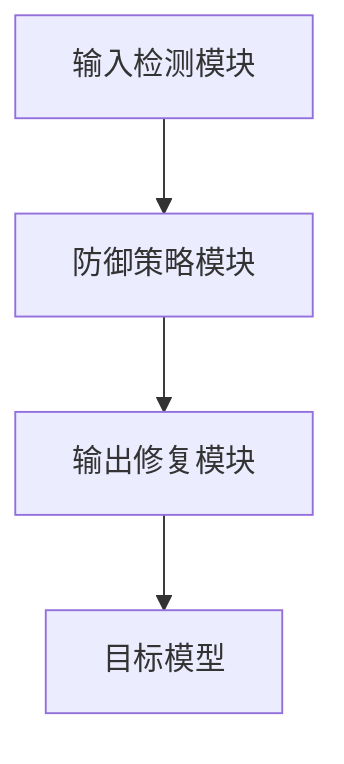
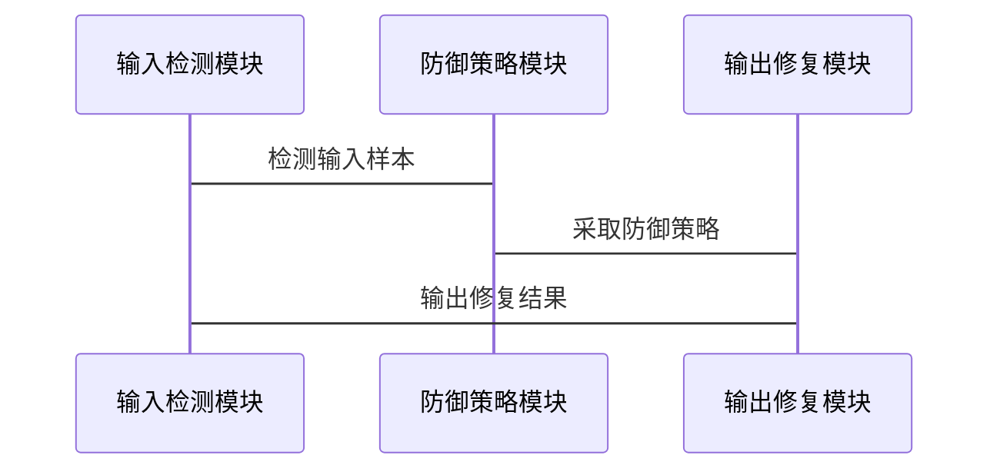

                 


# AI Agent的对抗性攻击防御策略

## 关键词：
AI Agent, 对抗性攻击, 安全防御, 算法原理, 系统架构, 项目实战

## 摘要：
本文详细探讨了AI Agent在对抗性攻击下的防御策略，从理论基础到算法实现，再到系统架构设计和实战案例分析，全面解析对抗性攻击的本质及其防御方法。文章首先介绍了AI Agent的基本概念和对抗性攻击的背景，随后深入分析了对抗性攻击的核心原理和分类，提出了多种防御策略。接着，从生成对抗网络（GAN）的原理出发，详细讲解了对抗性攻击的生成过程和防御算法的实现。最后，通过系统架构设计和项目实战，展示了如何构建一个高效的AI Agent防御系统，并总结了对抗性攻击防御的未来发展方向。

---

# 第1章: AI Agent与对抗性攻击概述

## 1.1 AI Agent的基本概念

### 1.1.1 AI Agent的定义与特点
AI Agent（人工智能代理）是指能够感知环境、自主决策并执行任务的智能体。其特点包括：
- **自主性**：能够自主决策，无需外部干预。
- **反应性**：能够实时感知环境并做出响应。
- **目标导向性**：具有明确的目标，并致力于实现这些目标。
- **学习能力**：能够通过数据和经验不断优化自身性能。

### 1.1.2 AI Agent的分类与应用场景
AI Agent可以根据智能水平和应用场景进行分类：

#### 分类：
1. **反应式AI Agent**：基于当前感知做出实时响应，适用于实时任务。
2. **认知式AI Agent**：具备复杂推理和规划能力，适用于复杂场景。
3. **学习式AI Agent**：通过机器学习算法不断优化自身性能，适用于数据驱动的任务。

#### 应用场景：
- 智能客服：通过自然语言处理与用户交互。
- 自动驾驶：实时感知环境并做出驾驶决策。
- 智能推荐系统：根据用户行为推荐相关内容。

### 1.1.3 对抗性攻击的背景与问题背景
对抗性攻击是指攻击者通过干扰或欺骗AI Agent的感知或决策系统，使其做出错误决策或行为。这种攻击在智能系统广泛应用的今天，已成为一个严重的安全问题。例如，自动驾驶系统可能被对抗性样本欺骗，导致交通事故；智能推荐系统可能被恶意干扰，影响用户体验。

---

## 1.2 对抗性攻击的基本概念

### 1.2.1 对抗性攻击的定义与分类
对抗性攻击是指通过人为构造特殊设计的输入，使AI系统产生错误输出或行为。其分类如下：

1. **黑盒攻击**：攻击者不知道模型的具体参数，通过输入样本推断模型的行为。
2. **白盒攻击**：攻击者知道模型的具体参数，可以直接构造对抗样本。
3. **无模型攻击**：攻击者不依赖于模型的具体信息，通过试探性攻击寻找漏洞。

### 1.2.2 对抗性攻击的目标与手段
对抗性攻击的目标通常包括：
- **欺骗AI系统**：使其输出错误的结果。
- **干扰系统决策**：影响系统的正常运作。
- **窃取敏感信息**：通过对抗样本获取模型的内部信息。

手段包括：
- **输入干扰**：在输入数据中添加噪声或特定模式。
- **对抗样本生成**：通过生成对抗网络（GAN）等技术生成对抗样本。
- **模型推理攻击**：通过分析模型的输出推断其内部结构。

### 1.2.3 对抗性攻击的现状与挑战
对抗性攻击的研究和应用现状如下：
- **研究进展**：对抗性攻击的研究主要集中在生成对抗网络（GAN）、对抗训练等领域。
- **实际应用**：对抗性攻击已经在图像识别、自然语言处理等领域得到广泛应用。
- **挑战**：对抗性攻击的防御难度较大，尤其是在未知攻击的情况下。

---

# 第2章: 对抗性攻击的核心概念与原理

## 2.1 对抗性攻击的核心概念

### 2.1.1 对抗性攻击的核心要素
对抗性攻击的核心要素包括：
- **目标模型**：被攻击的AI模型。
- **对抗样本**：攻击者构造的特殊输入样本。
- **攻击目标**：攻击者希望模型输出特定的结果。

### 2.1.2 对抗性攻击与防御的对比分析
对抗性攻击与防御的对比分析如下：

| 对比维度 | 对抗性攻击 | 防御策略 |
|----------|------------|----------|
| 目标     | 破坏模型性能 | 保护模型性能 |
| 手段     | 构造对抗样本 | 检测或消除对抗样本 |
| 影响     | 模型输出错误 | 模型输出正确 |

### 2.1.3 对抗性攻击的实体关系图（ER图）

```mermaid
erDiagram
    class 对抗性攻击 {
        id
        攻击目标
        对抗样本
        攻击手段
    }
    class AI Agent {
        id
        感知模块
        决策模块
        输出结果
    }
    对抗性攻击 --> AI Agent : 影响
```

---

## 2.2 对抗性攻击的数学模型与公式

### 2.2.1 对抗性攻击的数学模型
对抗性攻击的数学模型通常可以表示为：

$$ \min_{x} \max_{\delta} f(x + \delta) $$

其中，$x$ 是原始输入样本，$\delta$ 是对抗性扰动，$f$ 是目标模型。

### 2.2.2 对抗性攻击的公式推导
通过优化算法，攻击者可以找到最优的对抗样本：

$$ x_{adv} = x + \delta $$

其中，$\delta$ 是通过梯度下降方法优化得到的对抗性扰动。

### 2.2.3 对抗性攻击的案例分析
以图像分类任务为例，攻击者可以通过在图像中添加微小的噪声，使分类器误将一只猫识别为一只狗。

---

# 第3章: AI Agent的对抗性攻击防御策略

## 3.1 对抗性攻击的防御策略分类

### 3.1.1 基于检测的防御策略
基于检测的防御策略包括：
- **输入检测**：检测输入样本是否为对抗样本。
- **异常检测**：通过异常检测技术识别异常输入。

### 3.1.2 基于干扰的防御策略
基于干扰的防御策略包括：
- **输入净化**：对输入样本进行预处理，去除对抗性扰动。
- **模型鲁棒化**：通过训练模型使其对对抗样本具有鲁棒性。

### 3.1.3 基于修复的防御策略
基于修复的防御策略包括：
- **模型修复**：通过重新训练模型修复对抗样本的影响。
- **输出修复**：在模型输出后，修复错误结果。

---

## 3.2 对抗性攻击防御的数学模型与公式

### 3.2.1 防御策略的数学模型
防御策略的数学模型可以表示为：

$$ \min_{\theta} \max_{\delta} f(x + \delta, \theta) $$

其中，$\theta$ 是模型参数，$\delta$ 是对抗性扰动。

### 3.2.2 防御策略的公式推导
通过对抗训练，防御策略可以通过以下步骤优化：

1. **生成对抗样本**：$x_{adv} = x + \delta$
2. **训练模型**：$f(x_{adv}, \theta) \rightarrow y_{true}$

---

## 3.3 对抗性攻击防御的算法实现

### 3.3.1 对抗训练的实现步骤
1. **定义目标模型**：构建一个分类器$ f(x, \theta) $。
2. **生成对抗样本**：通过优化算法生成对抗样本$x_{adv}$。
3. **训练模型**：使用对抗样本训练模型，使其对对抗样本具有鲁棒性。

### 3.3.2 对抗训练的代码示例
```python
import tensorflow as tf
from tensorflow.keras import layers

def generate_adversarial_sample(x, y, model, eps=0.1):
    with tf.GradientTape() as tape:
        tape.watch(x)
        prediction = model(x)
        loss = tf.keras.losses.crossentropy(y, prediction)
    gradient = tape.gradient(loss, x)
    x_adv = x - eps * gradient
    return x_adv

model = tf.keras.Sequential([
    layers.Dense(128, activation='relu'),
    layers.Dense(10, activation='softmax')
])

x = tf.random.uniform((1, 10))
y = tf.random.uniform((1, 10))

x_adv = generate_adversarial_sample(x, y, model)
```

---

## 3.4 对抗性攻击防御的系统架构设计

### 3.4.1 系统功能设计
1. **输入检测模块**：检测输入样本是否为对抗样本。
2. **防御策略模块**：根据检测结果采取相应的防御策略。
3. **输出修复模块**：修复模型输出的错误结果。

### 3.4.2 系统架构设计



---

## 3.5 对抗性攻击防御的项目实战

### 3.5.1 项目介绍
本项目旨在构建一个能够防御对抗性攻击的AI Agent系统。

### 3.5.2 核心实现
1. **输入检测模块**：使用异常检测技术检测输入样本。
2. **防御策略模块**：通过对抗训练优化模型参数。
3. **输出修复模块**：修复模型输出的错误结果。

### 3.5.3 实战案例分析
以图像分类任务为例，通过对抗训练优化模型，使其能够识别对抗样本。

---

# 第4章: 对抗性攻击的算法原理与实现

## 4.1 对抗性攻击的算法原理

### 4.1.1 对抗性攻击的算法流程
1. **目标模型选择**：选择一个待攻击的模型。
2. **对抗样本生成**：通过优化算法生成对抗样本。
3. **攻击实施**：将对抗样本输入模型，观察模型输出结果。

### 4.1.2 对抗性攻击的算法实现
```python
import tensorflow as tf

def generate_adversarial_sample(x, y, model, eps=0.1):
    with tf.GradientTape() as tape:
        tape.watch(x)
        prediction = model(x)
        loss = tf.keras.losses.crossentropy(y, prediction)
    gradient = tape.gradient(loss, x)
    x_adv = x - eps * gradient
    return x_adv

model = tf.keras.Sequential([
    layers.Dense(128, activation='relu'),
    layers.Dense(10, activation='softmax')
])

x = tf.random.uniform((1, 10))
y = tf.random.uniform((1, 10))

x_adv = generate_adversarial_sample(x, y, model)
```

---

## 4.2 对抗性攻击防御的算法原理

### 4.2.1 防御策略的算法流程
1. **目标模型选择**：选择一个待防御的模型。
2. **对抗训练**：通过对抗训练优化模型参数。
3. **模型部署**：将优化后的模型部署到实际场景中。

### 4.2.2 防御策略的算法实现
```python
import tensorflow as tf

def adversarial_training(model, x, y, eps=0.1):
    with tf.GradientTape() as tape:
        tape.watch(x)
        prediction = model(x)
        loss = tf.keras.losses.crossentropy(y, prediction)
    gradient = tape.gradient(loss, x)
    x_adv = x - eps * gradient
    model.trainable_variables.update(x_adv)
    return x_adv

model = tf.keras.Sequential([
    layers.Dense(128, activation='relu'),
    layers.Dense(10, activation='softmax')
])

x = tf.random.uniform((1, 10))
y = tf.random.uniform((1, 10))

x_adv = adversarial_training(model, x, y)
```

---

## 4.3 对抗性攻击防御的系统架构设计

### 4.3.1 系统功能设计
1. **输入检测模块**：检测输入样本是否为对抗样本。
2. **防御策略模块**：根据检测结果采取相应的防御策略。
3. **输出修复模块**：修复模型输出的错误结果。

### 4.3.2 系统架构设计


---

## 4.4 对抗性攻击防御的项目实战

### 4.4.1 项目介绍
本项目旨在构建一个能够防御对抗性攻击的AI Agent系统。

### 4.4.2 核心实现
1. **输入检测模块**：使用异常检测技术检测输入样本。
2. **防御策略模块**：通过对抗训练优化模型参数。
3. **输出修复模块**：修复模型输出的错误结果。

### 4.4.3 实战案例分析
以图像分类任务为例，通过对抗训练优化模型，使其能够识别对抗样本。

---

# 第5章: 对抗性攻击防御的系统架构设计

## 5.1 系统功能设计

### 5.1.1 功能模块划分
1. **输入检测模块**：检测输入样本是否为对抗样本。
2. **防御策略模块**：根据检测结果采取相应的防御策略。
3. **输出修复模块**：修复模型输出的错误结果。

### 5.1.2 功能流程图


---

## 5.2 系统架构设计

### 5.2.1 系统架构图


---

## 5.3 系统接口设计

### 5.3.1 接口定义
1. **输入接口**：接收输入样本。
2. **输出接口**：输出修复后的结果。

### 5.3.2 接口交互图



---

## 5.4 系统交互设计

### 5.4.1 交互流程
1. **输入检测模块**接收输入样本。
2. **防御策略模块**根据检测结果采取相应的防御策略。
3. **输出修复模块**修复模型输出的错误结果。

### 5.4.2 交互示例
以图像分类任务为例：
1. 输入检测模块接收一张图像。
2. 防御策略模块检测到图像为对抗样本。
3. 输出修复模块修复分类结果，使其正确。

---

# 第6章: 项目实战

## 6.1 项目介绍

### 6.1.1 项目背景
本项目旨在构建一个能够防御对抗性攻击的AI Agent系统。

### 6.1.2 项目目标
通过对抗训练优化模型，使其能够识别和防御对抗样本。

---

## 6.2 核心实现

### 6.2.1 环境安装
```bash
pip install tensorflow
pip install numpy
pip install matplotlib
```

### 6.2.2 核心代码实现
```python
import tensorflow as tf
import numpy as np
import matplotlib.pyplot as plt

def generate_adversarial_sample(x, y, model, eps=0.1):
    with tf.GradientTape() as tape:
        tape.watch(x)
        prediction = model(x)
        loss = tf.keras.losses.crossentropy(y, prediction)
    gradient = tape.gradient(loss, x)
    x_adv = x - eps * gradient
    return x_adv

model = tf.keras.Sequential([
    layers.Dense(128, activation='relu'),
    layers.Dense(10, activation='softmax')
])

x = np.random.uniform(0, 1, (1, 10))
y = np.random.uniform(0, 1, (1, 10))

x_adv = generate_adversarial_sample(x, y, model)
```

---

## 6.3 实战案例分析

### 6.3.1 案例背景
以图像分类任务为例，攻击者试图通过对抗样本欺骗分类器。

### 6.3.2 案例分析
通过对抗训练优化模型，使其能够识别对抗样本。

---

## 6.4 项目小结

### 6.4.1 项目总结
通过本项目，我们成功构建了一个能够防御对抗性攻击的AI Agent系统。

### 6.4.2 项目意义
对抗性攻击的防御对于保护AI系统的安全具有重要意义。

---

# 第7章: 最佳实践与总结

## 7.1 最佳实践

### 7.1.1 对抗性攻击防御的注意事项
- **模型鲁棒性**：通过对抗训练提高模型的鲁棒性。
- **输入检测**：实时检测输入样本是否为对抗样本。
- **输出修复**：修复模型输出的错误结果。

### 7.1.2 对抗性攻击防御的注意事项
- **模型更新**：定期更新模型参数，防止攻击者利用模型漏洞。
- **多模态防御**：结合多种防御策略提高防御效果。
- **实时监控**：实时监控系统运行状态，及时发现异常。

---

## 7.2 总结与展望

### 7.2.1 总结
本文详细探讨了AI Agent在对抗性攻击下的防御策略，从理论基础到算法实现，再到系统架构设计和实战案例分析，全面解析了对抗性攻击的本质及其防御方法。

### 7.2.2 展望
未来，对抗性攻击的防御将更加复杂和多样化，需要结合更多的技术手段和策略来应对。

---

# 作者：AI天才研究院/AI Genius Institute & 禅与计算机程序设计艺术 /Zen And The Art of Computer Programming

