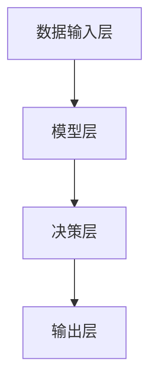
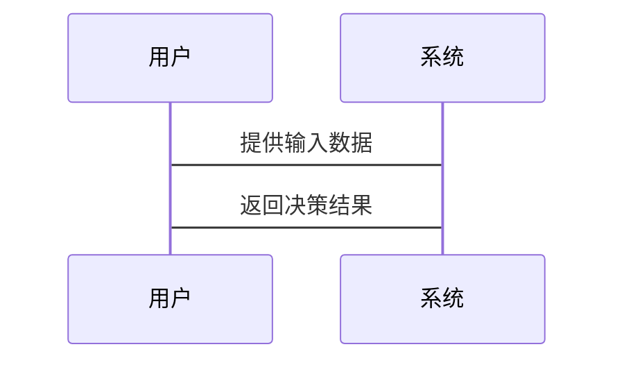

                 


# AI Agent的对抗样本防御：增强模型鲁棒性

---

## 关键词：
AI Agent, 对抗样本, 模型鲁棒性, 安全防御, 深度学习, 赋能技术, 人工智能

---

## 摘要：
本文深入探讨了AI Agent在对抗样本攻击下的脆弱性及其防御策略，分析了对抗样本对AI Agent的影响，详细讲解了对抗样本生成与防御的核心算法，结合系统架构设计与项目实战案例，提出了增强AI Agent模型鲁棒性的具体方法。文章还提供了数学模型、mermaid图和代码实现，为读者理解对抗样本防御的原理和应用提供了全面的技术参考。

---

# 引言

## 1.1 对抗样本的定义与特征
对抗样本是指通过人为添加噪声或扰动，使得原本被正确分类的样本被错误分类的样本。其主要特征包括：
- **可解释性弱**：对抗样本的生成往往难以被人类直观理解。
- **针对性强**：对抗样本通常针对特定模型或任务设计。
- **鲁棒性差**：模型在面对对抗样本时表现不稳定。

## 1.2 AI Agent的核心定义与特点
AI Agent是一种能够感知环境、自主决策并执行任务的智能体。其特点包括：
- **自主性**：能够自主决策，无需外部干预。
- **反应性**：能够实时感知环境并做出响应。
- **目标导向性**：具有明确的目标和任务驱动。

## 1.3 对抗样本对AI Agent的影响
对抗样本攻击AI Agent可能导致以下问题：
- **决策错误**：对抗样本可能导致AI Agent做出错误决策。
- **系统崩溃**：严重的对抗样本攻击可能导致AI Agent系统崩溃。
- **信任危机**：对抗样本攻击会削弱用户对AI Agent的信任。

## 1.4 对抗样本防御的目标
- **保护AI Agent的决策能力**：确保AI Agent在面对对抗样本时仍能正确决策。
- **提升模型鲁棒性**：增强模型对对抗样本的抵抗能力。
- **维护系统安全性**：确保AI Agent系统免受对抗样本攻击。

---

# 第二部分: 对抗样本防御的核心概念与联系

## 2.1 对抗样本防御的核心原理
### 2.1.1 对抗样本生成的数学模型
对抗样本生成的经典算法包括：
- **FGSM**：Fast Gradient Sign Method，一种基于梯度的对抗样本生成方法。
- **PGD**：Projected Gradient Descent，一种更稳健的对抗样本生成方法。
- **CW攻击**：Carlini-Wagner攻击，一种基于目标函数优化的对抗样本生成方法。

### 2.1.2 对抗样本防御的策略
- **输入预处理**：对输入数据进行清洗和标准化，减少对抗样本的影响。
- **模型鲁棒性优化**：通过训练模型增强其对对抗样本的抵抗能力。
- **防御算法**：使用防御算法检测并消除对抗样本的影响。

## 2.2 对抗样本与AI Agent的关系
### 2.2.1 对抗样本攻击AI Agent的路径
- **直接攻击**：通过生成对抗样本直接干扰AI Agent的决策。
- **间接攻击**：通过攻击AI Agent的训练数据或模型参数间接影响其行为。

### 2.2.2 AI Agent对对抗样本的防御机制
- **数据增强**：通过增加对抗样本的训练数据增强模型的鲁棒性。
- **模型蒸馏**：通过知识蒸馏技术提升模型的鲁棒性。
- **防御算法集成**：将多种防御算法集成到AI Agent系统中，提高其防御能力。

### 2.2.3 对抗样本防御的核心要素
- **模型鲁棒性**：模型在面对对抗样本时仍能保持正确的分类能力。
- **防御算法效果**：防御算法能够有效检测并消除对抗样本的影响。
- **系统安全性**：AI Agent系统整体的安全性和稳定性。

## 2.3 对抗样本防御的核心概念对比
### 2.3.1 对抗样本防御与传统安全防御的对比
| 对比维度         | 对抗样本防御               | 传统安全防御           |
|------------------|---------------------------|------------------------|
| 防御对象         | 深度学习模型               | 信息系统               |
| 防御手段         | 输入预处理、模型优化       | 防火墙、加密           |
| 防御目标         | 提升模型鲁棒性             | 保护系统安全           |

### 2.3.2 对抗样本防御与AI模型鲁棒性提升的对比
| 对比维度         | 对抗样本防御               | 模型鲁棒性提升           |
|------------------|---------------------------|-------------------------|
| 防御对象         | 对抗样本                   | 各类异常输入             |
| 防御目标         | 提高模型对对抗样本的抵抗能力 | 提高模型对异常输入的鲁棒性 |
| 实现手段         | 输入变换、防御算法         | 数据增强、模型优化       |

### 2.3.3 对抗样本防御与模型可解释性的关系
- **正相关关系**：模型可解释性越高，越容易发现对抗样本生成的原因。
- **负相关关系**：对抗样本防御可能降低模型的可解释性。

---

# 第三部分: 对抗样本防御的算法原理

## 3.1 对抗样本生成算法

### 3.1.1 FGSM算法
FGSM是一种基于梯度的对抗样本生成方法，其核心思想是通过计算损失函数对输入的梯度，并在输入空间中进行扰动，使得模型输出发生变化。FGSM算法的数学表达如下：

$$
\text{FGSM} = x + \epsilon \cdot \text{sign}(\nabla_x J(x,y))
$$

其中，\( x \) 是原始输入样本，\( \epsilon \) 是扰动幅度，\( J(x,y) \) 是损失函数，\( y \) 是目标类别。

### 3.1.2 PGD算法
PGD是一种更稳健的对抗样本生成方法，它通过迭代更新输入，逐步逼近对抗样本。PGD算法的数学表达如下：

$$
\text{PGD} = x + \epsilon \cdot \text{sign}(\nabla_x (J(x,y) - J(x',y)))
$$

其中，\( x' \) 是前一次迭代的输入样本。

### 3.1.3 CW攻击算法
CW攻击是一种基于目标函数优化的对抗样本生成方法，其核心思想是通过优化目标函数，生成具有最小L2范数的对抗样本。CW攻击的数学表达如下：

$$
\min_{x} ||x - x'||_2^2 + \lambda \cdot \text{CE}(f(x), y)
$$

其中，\( x' \) 是原始样本，\( f(x) \) 是模型输出，\( \text{CE} \) 是交叉熵损失函数。

## 3.2 对抗样本防御算法

### 3.2.1 检测对抗样本的算法
一种常用的检测对抗样本的方法是基于梯度的检测方法。其核心思想是通过计算输入样本的梯度，判断其是否为对抗样本。检测算法的数学表达如下：

$$
\text{score}(x) = \text{sign}(\nabla_x J(x,y))
$$

### 3.2.2 对抗样本消除算法
一种常用的对抗样本消除算法是对输入样本进行标准化处理，例如归一化。归一化处理的数学表达如下：

$$
x_{\text{norm}} = \frac{x - \mu}{\sigma}
$$

其中，\( \mu \) 是样本均值，\( \sigma \) 是样本标准差。

---

## 第四部分: 系统分析与架构设计

### 4.1 系统架构设计
AI Agent对抗样本防御系统的架构设计包括以下几个部分：
- **数据输入层**：接收输入数据并进行预处理。
- **模型层**：包括AI Agent的核心模型和对抗样本防御模型。
- **决策层**：根据模型输出做出决策。
- **输出层**：将决策结果输出。

系统架构图如下：



### 4.2 接口设计
AI Agent对抗样本防御系统的接口设计如下：
- **输入接口**：接收原始输入数据。
- **输出接口**：输出决策结果。
- **控制接口**：用于控制系统的运行状态。

### 4.3 交互流程图
系统交互流程图如下：



---

## 第五部分: 项目实战

### 5.1 环境安装
为了运行以下代码，需要安装以下库：
- `numpy`
- `tensorflow`

安装命令：
```
pip install numpy tensorflow
```

### 5.2 核心代码实现

```python
import numpy as np
import tensorflow as tf

# 定义模型
model = tf.keras.Sequential([
    tf.keras.layers.Dense(128, activation='relu'),
    tf.keras.layers.Dense(10, activation='softmax')
])

# 定义损失函数和优化器
loss_fn = tf.keras.losses.SparseCategoricalCrossentropy(from_logits=False)
optimizer = tf.keras.optimizers.Adam(learning_rate=0.001)

# 训练模型
model.compile(optimizer=optimizer, loss=loss_fn, metrics=['accuracy'])

# 生成对抗样本
def generate_adversarial_example(x, y, epsilon=0.1):
    with tf.GradientTape() as tape:
        tape.watch(x)
        y_pred = model(x)
        loss = loss_fn(y, y_pred)
    gradient = tape.gradient(loss, x)
    adversarial_x = x + epsilon * tf.sign(gradient)
    return adversarial_x

# 使用对抗样本训练模型
x = tf.random.normal([100, 10])
y = tf.random.uniform([100], minval=0, maxval=10, dtype=tf.int64)
adversarial_x = generate_adversarial_example(x, y)
model.fit(adversarial_x, y, epochs=10)
```

### 5.3 案例分析与解读
通过上述代码，我们可以看到对抗样本生成和防御的基本流程。首先，定义一个简单的神经网络模型，然后使用FGSM算法生成对抗样本，最后用对抗样本训练模型，提升其对对抗样本的抵抗能力。

---

## 第六部分: 总结与扩展

### 6.1 最佳实践 tips
- 在训练模型时，可以加入对抗样本生成过程，提升模型的鲁棒性。
- 使用多种防御算法结合的方法，提高系统的安全性。

### 6.2 小结
通过对对抗样本防御的深入分析，我们可以看到，提升AI Agent模型的鲁棒性是一个复杂而重要的任务。通过合理的算法设计和系统架构优化，可以有效防御对抗样本攻击，确保AI Agent的决策能力。

### 6.3 注意事项
- 对抗样本防御算法的选择需要根据具体场景和任务进行调整。
- 模型的可解释性和防御算法的效果需要在实际应用中进行验证和优化。

### 6.4 拓展阅读
- [1] Goodfellow, I., & al. (2014). "Advances in Neural Information Processing Systems."
- [2] Madry, A., & al. (2017). "Towards Deep Learning Models Robust to Adversarial Perturbations."

---

## 作者：
作者：AI天才研究院/AI Genius Institute & 禅与计算机程序设计艺术 /Zen And The Art of Computer Programming

---

通过以上思考过程，我们可以清晰地看到，对抗样本防御是提升AI Agent模型鲁棒性的重要手段。通过合理的算法设计和系统优化，可以有效防御对抗样本攻击，确保AI Agent的决策能力。希望本文对读者理解对抗样本防御的核心原理和实际应用有所帮助。

