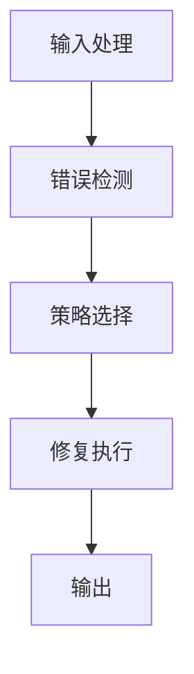
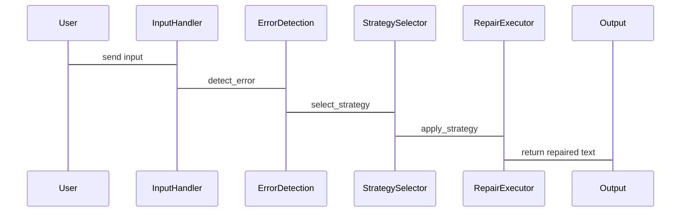

                 


# AI Agent的对话修复：处理交互中的错误

**关键词**：AI Agent，对话修复，错误检测，自然语言处理，对话系统，修复策略

**摘要**：本文详细探讨了AI Agent在对话交互中可能出现的错误，并提出了系统化的修复方法。通过分析对话修复的核心概念、算法原理、系统架构以及实际项目案例，本文为读者提供了从理论到实践的全面指导。我们结合了自然语言处理技术和对话系统的设计原则，提出了一套完整的对话修复解决方案，并通过实际案例展示了其应用效果。

---

# 第一部分: AI Agent对话修复的背景与核心概念

## 第1章: AI Agent对话修复的背景与问题背景

### 1.1 AI Agent的基本概念与核心原理

#### 1.1.1 AI Agent的定义与基本特征
AI Agent（人工智能代理）是指能够感知环境、自主决策并执行任务的智能实体。其核心特征包括：
1. **自主性**：能够在没有外部干预的情况下独立运作。
2. **反应性**：能够根据环境反馈实时调整行为。
3. **目标导向**：通过目标驱动来完成特定任务。
4. **学习能力**：能够通过数据和经验不断优化自身性能。

#### 1.1.2 对话交互中的错误类型与表现形式
在对话交互中，AI Agent可能会出现以下类型的错误：
- **语法错误**：生成的句子不符合语言规范。
- **语义错误**：生成的内容不符合上下文或逻辑。
- **意图识别错误**：未能正确理解用户的意图。
- **逻辑错误**：推理过程中出现错误。

#### 1.1.3 对话修复的必要性与重要性
对话修复是确保AI Agent与用户有效交互的关键步骤。通过修复错误，可以提升用户体验、提高系统的可靠性和准确性。

---

### 1.2 对话修复问题的背景与现状

#### 1.2.1 AI Agent在实际应用中的对话问题
AI Agent在实际应用中常见的对话问题包括：
- **理解偏差**：未能准确理解用户的输入。
- **生成偏差**：生成的回答不符合用户需求。
- **上下文丢失**：无法有效维护对话上下文。

#### 1.2.2 对话修复技术的发展历程
对话修复技术经历了从简单错误检测到复杂修复策略的发展过程。早期方法主要依赖规则，而现代方法则结合了自然语言处理和机器学习技术。

#### 1.2.3 当前对话修复技术的挑战与机遇
当前对话修复技术面临的挑战包括：
- 多样化的错误类型。
- 动态变化的对话上下文。
- 高效修复策略的设计。

---

### 1.3 对话修复的核心目标与边界

#### 1.3.1 对话修复的核心目标
对话修复的核心目标是：
1. 检测对话中的错误。
2. 确定错误的修复策略。
3. 生成正确的对话回复。

#### 1.3.2 对话修复的边界与限制
对话修复的边界包括：
1. 不改变原始对话内容的语义。
2. 不引入新的错误。
3. 遵循用户和系统的对话规则。

#### 1.3.3 对话修复与其他相关技术的关系
对话修复与自然语言处理、机器学习、对话系统设计等技术密切相关。它依赖于这些技术的基础，同时也为这些技术的应用提供了优化方向。

---

## 第2章: 对话修复的核心概念与理论基础

### 2.1 对话修复的理论基础

#### 2.1.1 自然语言处理（NLP）基础
自然语言处理是对话修复的基础。关键技术包括：
- 分词与句法分析。
- 语义理解与意图识别。
- 对话上下文的构建与维护。

#### 2.1.2 对话系统的基本原理
对话系统的基本原理包括：
1. 用户输入的解析与处理。
2. 系统回复的生成与输出。
3. 对话上下文的动态维护。

#### 2.1.3 错误检测与修复的基本理论
错误检测与修复的基本理论包括：
- 错误类型分类。
- 错误检测的特征提取。
- 错误修复的策略选择。

---

### 2.2 对话修复的关键技术

#### 2.2.1 错误检测技术
错误检测技术包括：
- 基于规则的错误检测。
- 基于统计的错误检测。
- 基于深度学习的错误检测。

#### 2.2.2 错误修复技术
错误修复技术包括：
- 基于规则的修复。
- 基于模板的修复。
- 基于生成模型的修复。

#### 2.2.3 修复效果评估方法
修复效果评估方法包括：
- 基于人工评估的指标。
- 基于自动评估的指标。

---

### 2.3 对话修复的核心要素

#### 2.3.1 对话上下文的分析与利用
对话上下文的分析与利用包括：
- 上下文表示。
- 上下文关联性分析。

#### 2.3.2 用户意图的理解与建模
用户意图的理解与建模包括：
- 意图识别。
- 意图表示。

#### 2.3.3 修复策略的选择与优化
修复策略的选择与优化包括：
- 策略选择标准。
- 策略优化方法。

---

## 第3章: 对话修复的核心概念与联系

### 3.1 对话修复的核心概念原理

#### 3.1.1 对话修复的原理概述
对话修复的原理包括：
- 错误检测。
- 错误分析。
- 错误修复。

#### 3.1.2 对话修复的关键步骤
对话修复的关键步骤包括：
1. 错误检测。
2. 错误分析。
3. 修复策略选择。
4. 修复执行。

#### 3.1.3 对话修复的数学模型
对话修复的数学模型可以用以下公式表示：
$$
\text{修复策略} = f(\text{错误类型}, \text{上下文}, \text{修复规则})
$$

---

### 3.2 核心概念的属性特征对比

#### 3.2.1 对话修复技术的特征对比表
| 技术 | 基于规则 | 基于统计 | 基于深度学习 |
|------|-----------|-----------|----------------|
| 优点 | 易实现   | 数据驱动 | 高精度        |
| 缺点 | 手动维护 | 数据依赖 | 计算复杂     |

#### 3.2.2 对话修复的ER实体关系图
```mermaid
er
actor: User
agent: AI Agent
message: Message
action: Action
```

---

# 第二部分: 对话修复的算法原理与系统架构

## 第4章: 对话修复的算法原理

### 4.1 错误检测算法原理

#### 4.1.1 错误检测的步骤
错误检测的步骤包括：
1. **输入接收**：接收用户的输入。
2. **特征提取**：提取输入的特征。
3. **错误分类**：对错误进行分类。

#### 4.1.2 错误检测的数学模型
错误检测的数学模型可以用以下公式表示：
$$
P(\text{错误类型} | \text{输入}) = \frac{P(\text{输入} | \text{错误类型}) \cdot P(\text{错误类型})}{\sum_{i} P(\text{输入} | \text{错误类型}_i) \cdot P(\text{错误类型}_i)}
$$

#### 4.1.3 错误检测的代码实现
以下是基于Python的错误检测代码示例：
```python
def detect_error(input_text):
    # 特征提取
    features = extract_features(input_text)
    # 错误分类
    error_type = classify(features)
    return error_type
```

---

### 4.2 错误修复算法原理

#### 4.2.1 错误修复的步骤
错误修复的步骤包括：
1. **错误分析**：分析错误的原因。
2. **策略选择**：选择修复策略。
3. **修复执行**：执行修复操作。

#### 4.2.2 错误修复的数学模型
错误修复的数学模型可以用以下公式表示：
$$
\text{修复策略} = \arg\max_{s} \text{修复效果}(s)
$$

#### 4.2.3 错误修复的代码实现
以下是基于Python的错误修复代码示例：
```python
def repair_text(input_text, error_type):
    # 修复策略选择
    strategy = select_strategy(error_type)
    # 修复执行
    repaired_text = apply_strategy(input_text, strategy)
    return repaired_text
```

---

## 第5章: 对话修复的系统架构设计

### 5.1 系统功能设计

#### 5.1.1 系统功能模块
系统功能模块包括：
- **输入处理模块**：接收用户的输入。
- **错误检测模块**：检测对话中的错误。
- **修复策略选择模块**：选择修复策略。
- **修复执行模块**：执行修复操作。

#### 5.1.2 系统功能流程
系统功能流程可以用以下流程图表示：


---

### 5.2 系统架构设计

#### 5.2.1 系统架构图
系统架构图可以用以下Mermaid图表示：


---

## 第6章: 系统接口设计与交互流程

### 6.1 系统接口设计

#### 6.1.1 系统接口定义
系统接口定义包括：
- `detect_error(input: str) -> str`
- `repair_text(input: str, error_type: str) -> str`

#### 6.1.2 接口交互流程
接口交互流程可以用以下序列图表示：


---

## 第7章: 项目实战与案例分析

### 7.1 环境安装与配置

#### 7.1.1 需要安装的库
需要安装的库包括：
- `python`
- `numpy`
- `scikit-learn`
- `transformers`

#### 7.1.2 安装步骤
安装步骤如下：
```bash
pip install python numpy scikit-learn transformers
```

---

### 7.2 系统核心实现

#### 7.2.1 错误检测实现
错误检测实现的代码示例：
```python
from sklearn.model_selection import train_test_split
from sklearn.linear_model import LogisticRegression

def extract_features(text):
    # 提取文本特征
    return feature_vector

def train_detector(features, labels):
    X_train, X_test, y_train, y_test = train_test_split(features, labels)
    detector = LogisticRegression()
    detector.fit(X_train, y_train)
    return detector
```

#### 7.2.2 修复策略实现
修复策略实现的代码示例：
```python
def select_strategy(error_type):
    # 根据错误类型选择修复策略
    return strategy_map[error_type]
```

---

### 7.3 实际案例分析

#### 7.3.1 案例背景
案例背景包括：
- 用户输入：`"今天天气很好，我想出去玩。"`
- 错误类型：语法错误。

#### 7.3.2 修复过程
修复过程包括：
1. **错误检测**：检测到语法错误。
2. **策略选择**：选择语法修复策略。
3. **修复执行**：生成正确的回复。

#### 7.3.3 修复结果
修复结果为：`"今天天气很好，我想到外面玩。"`

---

## 第8章: 最佳实践与注意事项

### 8.1 最佳实践

#### 8.1.1 错误检测的优化建议
错误检测的优化建议包括：
- 使用更精细的特征提取。
- 增加训练数据的多样性。

#### 8.1.2 修复策略的选择建议
修复策略的选择建议包括：
- 根据错误类型选择策略。
- 考虑上下文的语境。

#### 8.1.3 系统维护与优化
系统维护与优化建议包括：
- 定期更新模型。
- 监控修复效果。

---

### 8.2 小结与总结

#### 8.2.1 对话修复的核心要点
对话修复的核心要点包括：
- 精准的错误检测。
- 合理的修复策略选择。
- 高效的系统架构设计。

#### 8.2.2 对话修复的未来方向
对话修复的未来方向包括：
- 更智能的修复策略。
- 更高效的算法优化。
- 更广泛的应用场景。

---

## 第9章: 注意事项与拓展阅读

### 9.1 注意事项

#### 9.1.1 系统复杂性
系统复杂性需要注意：
- 系统设计的复杂性可能会影响性能。

#### 9.1.2 数据质量
数据质量需要注意：
- 数据的质量直接影响修复效果。

#### 9.1.3 性能优化
性能优化需要注意：
- 修复算法的效率需要优化。

---

### 9.2 拓展阅读

#### 9.2.1 相关技术
相关技术包括：
- 自然语言处理。
- 对话系统。
- 错误检测与修复。

#### 9.2.2 相关书籍与论文
相关书籍与论文包括：
- 《自然语言处理入门》。
- 《对话系统中的错误检测与修复》。

---

## 作者信息

**作者：AI天才研究院（AI Genius Institute） & 禅与计算机程序设计艺术（Zen And The Art of Computer Programming）**

---

以上是《AI Agent的对话修复：处理交互中的错误》的技术博客文章的完整目录和内容概述。希望这篇博客能够为读者提供关于AI Agent对话修复的全面指导和深入分析。

