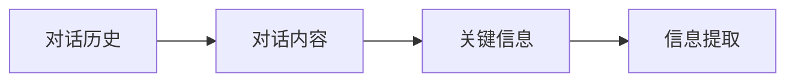
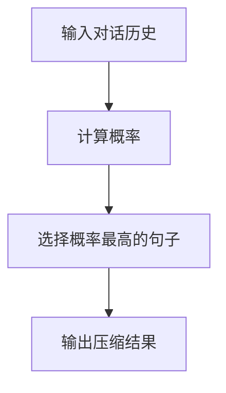
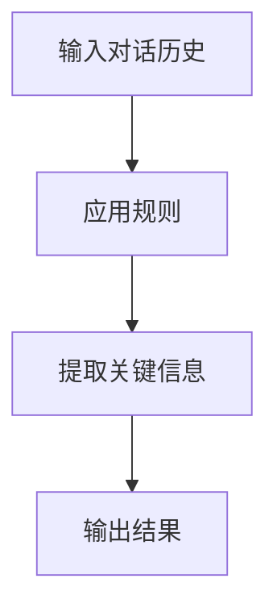
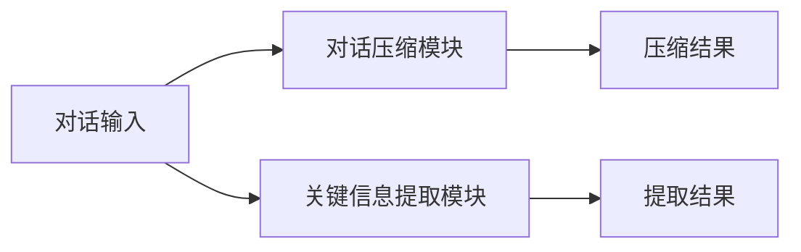

                 


# AI Agent的对话历史压缩与关键信息提取

## 关键词：AI Agent, 对话历史压缩, 关键信息提取, 自然语言处理, 机器学习, 系统架构

## 摘要：本文探讨了AI Agent在对话系统中对话历史压缩与关键信息提取的关键技术。首先介绍了对话历史压缩的必要性及其实现方法，然后详细讲解了关键信息提取的核心算法，接着分析了系统的架构设计与实现。最后结合实际项目案例，详细介绍了对话历史压缩与关键信息提取的实战应用。

---

## 第一章: 对话历史压缩与关键信息提取的背景与意义

### 1.1 问题背景
#### 1.1.1 对话历史压缩的必要性
在实际对话系统中，对话历史可能非常冗长，这使得AI Agent难以高效处理。通过压缩对话历史，可以减少计算负担，同时保留关键信息。

#### 1.1.2 关键信息提取的重要性
对话中包含大量信息，AI Agent需要快速提取关键信息，以便准确理解和执行任务。

#### 1.1.3 AI Agent在对话系统中的角色
AI Agent需要能够理解和处理对话内容，压缩对话历史并提取关键信息，以支持后续的任务执行。

### 1.2 问题描述
#### 1.2.1 对话历史压缩的目标
将长对话简化为更短的总结，保留关键信息。

#### 1.2.2 关键信息提取的挑战
从对话中准确识别关键实体、时间、地点等信息。

#### 1.2.3 AI Agent对话系统的边界与外延
AI Agent对话系统不仅需要处理对话内容，还需要与其他模块（如知识库、执行模块）进行交互。

### 1.3 核心概念与联系
#### 1.3.1 对话历史压缩的核心要素
- 对话内容
- 关键信息
- 压缩算法

#### 1.3.2 关键信息提取的关键特征
- 实体识别
- 时间/地点识别
- 情感分析

#### 1.3.3 AI Agent对话系统的实体关系图


## 第二章: 对话历史压缩算法原理

### 2.1 压缩算法概述
#### 2.1.1 基于概率的压缩算法
通过计算每个句子的概率，选择概率最高的句子进行压缩。

#### 2.1.2 基于聚类的压缩算法
将对话内容聚类，选择每个聚类的代表句子。

#### 2.1.3 基于摘要的压缩算法
使用文本摘要技术，生成对话的总结。

### 2.2 压缩算法实现
#### 2.2.1 基于概率的压缩算法流程图


### 2.3 算法数学模型
#### 2.3.1 概率计算公式
$$P(word\_i | context) = \frac{count(word\_i, context)}{\sum_{j} count(word\_j, context)}$$

## 第三章: 关键信息提取算法原理

### 3.1 提取算法概述
#### 3.1.1 基于规则的提取算法
使用预定义规则提取关键信息。

#### 3.1.2 基于统计的提取算法
通过统计方法识别关键信息。

#### 3.1.3 基于深度学习的提取算法
使用神经网络模型提取关键信息。

### 3.2 提取算法实现
#### 3.2.1 基于规则的提取流程图


### 3.3 算法数学模型
#### 3.3.1 规则匹配公式
$$if\ condition\ met:\ extract\ key\ info$$

## 第四章: 系统架构与实现

### 4.1 系统功能设计
#### 4.1.1 对话压缩模块
实现对话历史的压缩功能。

#### 4.1.2 关键信息提取模块
提取对话中的关键信息。

### 4.2 系统架构设计


## 第五章: 项目实战

### 5.1 环境安装
安装必要的Python库，如numpy、pandas、spacy等。

### 5.2 核心代码实现
```python
import spacy

nlp = spacy.load("en_core_web_sm")
doc = nlp("This is a sample text for key information extraction.")
```

### 5.3 案例分析
详细分析一个对话案例，展示压缩和提取过程。

## 第六章: 总结与展望

### 6.1 本章小结
总结对话历史压缩与关键信息提取的核心技术和方法。

### 6.2 最佳实践 Tips
提供一些实际应用中的注意事项和最佳实践。

### 6.3 未来研究方向
探讨未来可能的研究方向和技术发展。

## 作者：AI天才研究院/AI Genius Institute & 禅与计算机程序设计艺术 /Zen And The Art of Computer Programming

---

以上是一个详细的目录结构和文章内容的大纲，具体内容可以根据需要进一步扩展和详细撰写。

