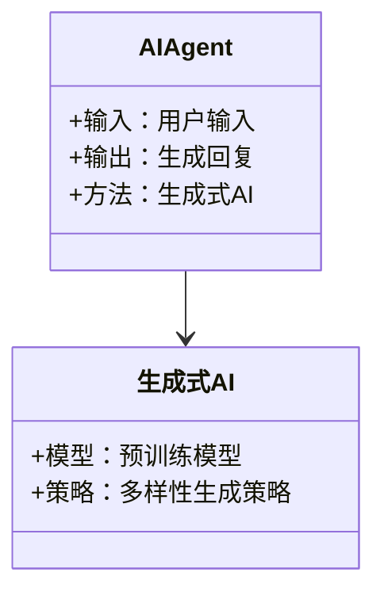

                 


# AI Agent的对话生成多样性：避免单调回复

> 关键词：AI Agent、对话生成、多样性生成、自然语言处理、生成式AI

> 摘要：本文探讨AI Agent在对话生成中的多样性问题，分析生成式AI与检索式AI的区别，提出优化算法和系统设计，通过项目实战提供解决方案，并总结最佳实践。

---

## 第一部分: AI Agent与对话生成多样性概述

### 第1章: AI Agent的基本概念与背景

#### 1.1 AI Agent的定义与核心特征
AI Agent是具备自主决策能力的智能体，核心特征包括：
- **自主性**：无需外部干预，自主执行任务。
- **反应性**：能实时感知环境并作出反应。
- **目标导向性**：以目标为导向，优化决策过程。

#### 1.2 对话生成的背景与挑战
- **问题背景**：AI Agent的对话生成能力直接影响用户体验，单调回复导致用户满意度下降。
- **问题描述**：传统生成方法易产生重复性回复，缺乏灵活性。
- **解决方法**：引入多样性生成策略，优化生成模型。

#### 1.3 AI Agent在对话生成中的应用
AI Agent广泛应用于客服、教育、娱乐等领域，其多样性生成能力直接影响用户体验和商业价值。

---

## 第二部分: 对话生成的核心概念与技术原理

### 第2章: 对话生成的多样性原理

#### 2.1 生成式AI与检索式AI的对比
| 特性             | 生成式AI         | 检索式AI         |
|------------------|------------------|------------------|
| 工作原理         | 基于生成模型     | 基于检索数据库     |
| 优势             | 高度灵活，支持多样化生成 | 稳定性高，准确性高 |
| 缺点             | 训练成本高，生成内容可控性较低 | 创新性不足，多样性受限 |

#### 2.2 对话生成的系统架构


---

## 第三部分: 对话生成的算法原理与实现

### 第3章: 基于预训练模型的对话生成

#### 3.1 预训练模型的原理与特点
- 预训练模型通过大规模数据训练，具备强大的语义理解能力。
- 采用生成对抗网络（GAN）优化生成质量。

#### 3.2 对话生成的策略优化
- **策略梯度优化**：使用REINFORCE算法优化生成策略。
- **数学公式**：
  - 政策梯度公式：
    $$ \nabla_{\theta} J(\theta) = \mathbb{E}_{\tau}[\nabla_{\theta} \log \pi_\theta(a|s)]Q(s,a) $$
  - 基于策略梯度的优化步骤：
    ```mermaid
    graph TD
        A[输入状态s] --> B[生成动作a]
        B --> C[计算Q值]
        C --> D[更新策略参数θ]
    ```

---

## 第四部分: 系统设计与实现

### 第4章: 对话生成系统的架构设计

#### 4.1 系统功能模块划分
- 用户输入处理模块
- 对话生成模块
- 多样性控制模块
- 反馈优化模块

#### 4.2 系统架构设计图


---

## 第五部分: 项目实战与案例分析

### 第5章: 项目实战

#### 5.1 环境搭建与工具安装
- 安装Python 3.8及以上版本
- 安装TensorFlow和Keras库
- 下载预训练模型

#### 5.2 核心代码实现
- 对话生成模块代码示例：
  ```python
  def generate_response(input_text):
      # 使用预训练模型生成回复
      model = load_model()
      response = model.generate(input_text)
      return response
  ```

#### 5.3 实际案例分析
- 案例：客服对话生成
  - 用户输入：解决问题
  - 生成回复：提供多种解决方案，避免重复。

---

## 第六部分: 最佳实践与总结

### 6.1 小结
- AI Agent的对话生成需要结合生成式AI和多样性生成策略。
- 预训练模型和策略优化是关键。

### 6.2 注意事项
- 定期更新模型，保持生成内容的准确性。
- 注意生成内容的合规性，避免敏感信息。

### 6.3 拓展阅读
- 推荐阅读相关领域的最新论文和技术博客。

---

作者：AI天才研究院 & 禅与计算机程序设计艺术

