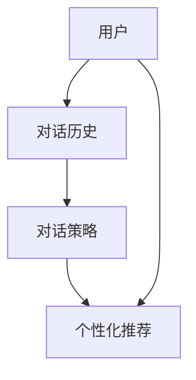
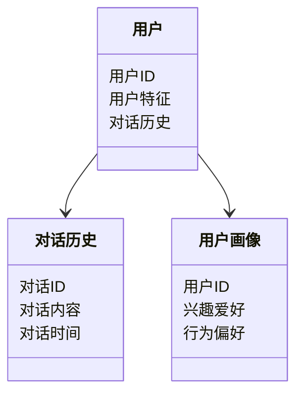
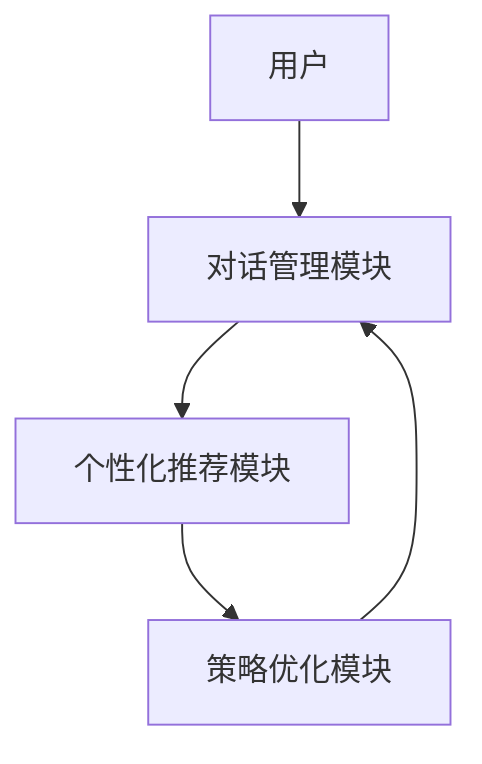
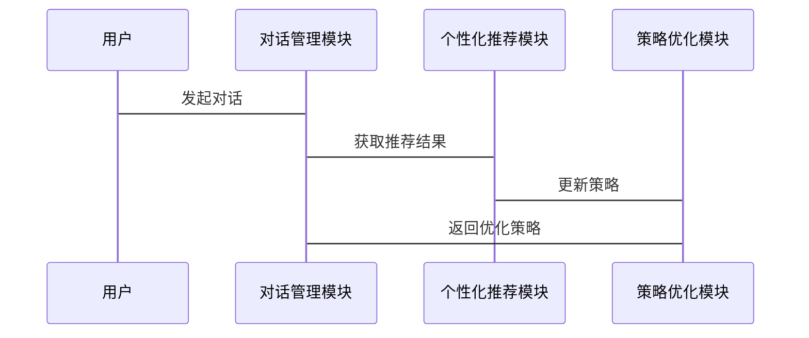

                 


# AI Agent的对话策略优化与个性化

> 关键词：AI Agent, 对话策略优化, 个性化推荐, 强化学习, 对话系统, 人机交互

> 摘要：本文深入探讨了AI Agent对话策略优化与个性化的关键问题，分析了对话策略优化的核心原理、个性化推荐的实现方法以及两者的协同优化机制。通过理论分析和实际案例，详细阐述了基于强化学习的对话策略优化算法、个性化推荐系统的构建，以及两者的结合实现。最后，本文还给出了系统架构设计、项目实战和最佳实践，为读者提供了全面的技术参考。

---

## 第1章: 背景介绍

### 1.1 问题背景

#### 1.1.1 对话系统的发展历程
对话系统经历了从规则驱动到数据驱动的转变。早期的对话系统基于预定义的规则，而现在，随着自然语言处理（NLP）和机器学习技术的发展，对话系统逐渐依赖于深度学习模型，如transformer和BERT。

#### 1.1.2 当前对话系统面临的挑战
- 对话策略不够灵活，难以应对复杂场景。
- 个性化推荐能力不足，无法满足用户多样化需求。
- 对话系统在处理长对话时存在记忆丢失问题。

#### 1.1.3 对话策略优化的重要性
对话策略优化是提升对话系统性能的核心，能够使系统更自然地与用户互动。

### 1.2 问题描述

#### 1.2.1 对话策略的定义与作用
对话策略是指导对话系统如何选择下一步动作的规则或模型。其作用在于确保对话流畅、高效。

#### 1.2.2 个性化对话的需求分析
用户对个性化对话的需求日益增长，不同用户可能有不同的偏好和语言风格。

#### 1.2.3 当前对话系统的性能瓶颈
- 对话策略的通用性与个性化之间的矛盾。
- 对话系统难以处理上下文关联性较强的问题。

### 1.3 问题解决

#### 1.3.1 对话策略优化的目标
通过优化算法和模型，提升对话系统的适应性和个性化能力。

#### 1.3.2 个性化对话的核心要素
- 用户画像：基于用户历史行为和偏好构建用户模型。
- 对话历史：记录对话内容，用于后续策略选择。

#### 1.3.3 优化策略的实现路径
- 数据驱动：利用用户数据训练个性化模型。
- 知识图谱：构建领域知识图谱，辅助对话策略选择。

### 1.4 边界与外延

#### 1.4.1 对话策略优化的适用范围
适用于需要个性化交互的场景，如智能客服、虚拟助手。

#### 1.4.2 个性化对话的边界条件
- 用户隐私保护。
- 对话内容的合规性。

#### 1.4.3 对话系统与其他技术的关联
- 与自然语言处理（NLP）技术密切相关。
- 依赖于机器学习算法和数据处理技术。

### 1.5 概念结构与核心要素组成

#### 1.5.1 对话策略优化的层次结构
- **微观层面**：单次对话的策略选择。
- **宏观层面**：长期对话的策略优化。

#### 1.5.2 个性化对话的核心要素
- 用户特征：年龄、性别、兴趣爱好等。
- 对话上下文：对话历史、情感倾向。

#### 1.5.3 对话系统与用户需求的关系
对话系统通过不断学习用户的偏好和行为模式，优化对话策略，以更好地满足用户需求。

### 1.6 本章小结
本章从背景、问题、解决方案等多个方面分析了对话策略优化与个性化推荐的重要性和必要性，为后续章节奠定了基础。

---

## 第2章: 核心概念与联系

### 2.1 对话策略优化的核心原理

#### 2.1.1 对话策略的定义与分类
- **基于规则的策略**：通过预定义规则选择动作。
- **基于模型的策略**：利用机器学习模型生成策略。

#### 2.1.2 对话策略优化的数学模型
对话策略优化可以通过强化学习框架来建模，其核心是最大化累积奖励。

#### 2.1.3 对话策略优化的算法框架
常用的算法包括Q-Learning、Deep Q-Network（DQN）等。

### 2.2 个性化对话推荐的原理

#### 2.2.1 个性化推荐的定义与分类
- **基于协同过滤的推荐**：利用用户相似性进行推荐。
- **基于内容的推荐**：基于物品属性进行推荐。

#### 2.2.2 个性化推荐的特征分析
- 用户特征：用户的兴趣、行为。
- 项目特征：对话内容、上下文信息。

#### 2.2.3 个性化推荐与对话策略的关系
个性化推荐为对话策略优化提供数据支持，而对话策略优化则指导推荐系统的改进。

### 2.3 对话策略优化与个性化推荐的联系

#### 2.3.1 对话策略优化如何影响个性化推荐
通过优化对话策略，系统可以更准确地理解用户需求，从而提高推荐的精准度。

#### 2.3.2 个性化推荐如何反哺对话策略优化
推荐结果可以作为反馈，用于改进对话策略，形成闭环优化。

#### 2.3.3 两者的协同优化机制
通过共享用户特征和对话历史，实现对话策略和推荐系统的协同优化。

### 2.4 核心概念的对比分析

#### 2.4.1 对话策略优化与个性化推荐的特征对比

| 特征                | 对话策略优化                     | 个性化推荐                     |
|---------------------|----------------------------------|-------------------------------|
| 核心目标            | 提高对话效果                     | 提高推荐准确性                 |
| 依赖因素            | 对话历史、用户特征               | 用户特征、项目特征             |
| 实现方式            | 强化学习、模型训练               | 协同过滤、内容分析             |

#### 2.4.2 对话策略优化与个性化推荐的优劣势分析
- 对话策略优化的优势：能够实时调整策略，适应对话场景。
- 个性化推荐的优势：能够提供多样化的推荐结果。
- 两者的劣势：计算资源消耗较大，训练时间较长。

#### 2.4.3 对话策略优化与个性化推荐的协同关系
通过协同优化，可以实现对话系统与推荐系统的双向提升。

### 2.5 ER实体关系图架构



### 2.6 本章小结
本章通过对比分析，揭示了对话策略优化与个性化推荐的内在联系，为后续的算法实现提供了理论基础。

---

## 第3章: 对话策略优化的算法原理

### 3.1 对话策略优化的核心算法

#### 3.1.1 基于强化学习的对话策略优化
- **Q-Learning算法**：通过状态、动作、奖励进行策略更新。
- **Deep Q-Network（DQN）**：利用深度神经网络近似Q值函数。

#### 3.1.2 基于监督学习的对话策略优化
- **基于生成对抗网络（GAN）**：通过对抗训练优化对话生成策略。

#### 3.1.3 基于生成模型的对话策略优化
- **Transformer模型**：用于生成自然流畅的对话回复。

### 3.2 强化学习算法的实现流程

#### 3.2.1 状态空间的定义
状态包括当前对话轮次、用户输入、系统回复等。

#### 3.2.2 动作空间的定义
动作包括生成回复、确认信息、请求澄清等。

#### 3.2.3 奖励函数的设计
常用的奖励函数包括立即奖励和延迟奖励。

#### 3.2.4 策略更新的步骤
1. 选择动作。
2. 执行动作，观察奖励。
3. 更新Q值或策略网络。

### 3.3 基于模型的对话策略优化

#### 3.3.1 状态-动作价值函数的定义
$$ Q(s, a) = \max_a Q(s, a) $$

#### 3.3.2 策略网络的构建
使用深度神经网络近似Q值函数。

#### 3.3.3 动作选择的机制
基于ε-greedy策略选择动作。

#### 3.3.4 模型训练的流程
1. 数据预处理。
2. 模型训练。
3. 策略更新。

### 3.4 对话策略优化的数学模型

$$ V(s) = \max_a Q(s, a) $$

---

## 第4章: 个性化推荐系统的实现

### 4.1 个性化推荐的核心算法

#### 4.1.1 基于协同过滤的推荐算法
- **基于用户的协同过滤（UBCF）**：找到相似用户，推荐其喜欢的项目。
- **基于项目的协同过滤（ItemCF）**：找到相似项目，推荐给用户。

#### 4.1.2 基于深度学习的推荐算法
- **神经网络协同过滤（Neural Collaborative Filtering, NCF）**：利用深度神经网络建模用户-物品交互。
- **自动编码器（Autoencoder）**：用于生成用户和物品的隐表示。

### 4.2 个性化推荐的实现流程

#### 4.2.1 用户特征提取
- 使用Word2Vec对用户行为序列进行编码。

#### 4.2.2 项目特征提取
- 使用TF-IDF对对话内容进行关键词提取。

#### 4.2.3 推荐结果生成
- 基于相似度计算，生成推荐列表。

### 4.3 个性化推荐的数学模型

$$ sim(u, i) = \frac{\sum_{k} w_k u_k i_k}{\sqrt{\sum w_k u_k^2} \sqrt{\sum w_k i_k^2}} $$

---

## 第5章: 对话策略优化与个性化推荐的结合

### 5.1 对话策略优化与个性化推荐的协同优化

#### 5.1.1 协同优化的目标
- 提高对话系统的个性化推荐能力。
- 优化对话策略的灵活性和适应性。

#### 5.1.2 协同优化的实现
- 结合对话历史和用户画像，优化推荐策略。

### 5.2 对话策略优化与个性化推荐的联合训练

#### 5.2.1 联合训练的必要性
- 对话策略优化需要个性化推荐的支持。
- 个性化推荐需要对话策略的指导。

#### 5.2.2 联合训练的实现
- 使用端到端的深度学习模型，联合优化对话策略和推荐系统。

### 5.3 对话策略优化与个性化推荐的联合优化算法

$$ \argmax_{\theta} \mathbb{E}_{s,a} [R(s,a)] $$

---

## 第6章: 系统架构与实现

### 6.1 问题场景介绍

#### 6.1.1 系统目标
- 构建一个支持个性化对话的AI Agent系统。

#### 6.1.2 系统功能
- 对话历史记录。
- 用户画像构建。
- 个性化推荐生成。

### 6.2 项目介绍

#### 6.2.1 项目目标
- 实现对话策略优化与个性化推荐的结合。

#### 6.2.2 项目功能模块
- 对话管理模块。
- 个性化推荐模块。
- 策略优化模块。

### 6.3 系统功能设计

#### 6.3.1 领域模型设计


#### 6.3.2 系统架构设计


#### 6.3.3 系统接口设计
- 用户输入接口。
- 对话历史存储接口。
- 推荐结果返回接口。

#### 6.3.4 系统交互设计


---

## 第7章: 项目实战

### 7.1 环境安装

#### 7.1.1 安装Python
- 安装Anaconda或miniconda。

#### 7.1.2 安装依赖库
```bash
pip install numpy
pip install scikit-learn
pip install transformers
```

### 7.2 系统核心实现源代码

#### 7.2.1 对话策略优化代码
```python
import numpy as np
from sklearn.metrics.pairwise import cosine_similarity

class DialogueStrategy:
    def __init__(self):
        self.states = []
        self.actions = []
        self.rewards = []
    
    def choose_action(self, state):
        # ε-greedy策略
        epsilon = 0.1
        if np.random.random() < epsilon:
            return np.random.choice(self.actions)
        else:
            return np.argmax(self.Q(state))
    
    def update_Q(self, state, action, reward):
        self.Q(state)[action] = self.Q(state)[action] * 0.9 + reward
```

#### 7.2.2 个性化推荐代码
```python
from sklearn.feature_extraction.text import TfidfVectorizer

class RecommenderSystem:
    def __init__(self):
        self.vectorizer = TfidfVectorizer()
    
    def fit(self, texts):
        self.vectorizer.fit(texts)
    
    def transform(self, texts):
        return self.vectorizer.transform(texts)
```

### 7.3 代码应用解读与分析
- 对话策略优化代码实现了基于Q-learning的策略选择。
- 个性化推荐代码基于TF-IDF进行特征提取。

### 7.4 实际案例分析
- 对话历史：用户与AI Agent的多轮对话。
- 个性化推荐：基于对话内容生成推荐结果。

### 7.5 项目小结
本章通过实际案例，展示了对话策略优化与个性化推荐的实现过程，帮助读者更好地理解理论知识。

---

## 第8章: 最佳实践与注意事项

### 8.1 最佳实践 tips

#### 8.1.1 数据处理
- 数据清洗：去除噪声数据。
- 数据增强：增加数据多样性。

#### 8.1.2 模型选择
- 根据任务需求选择合适的算法。
- 避免过拟合，使用交叉验证。

#### 8.1.3 系统优化
- 使用分布式计算优化训练速度。
- 采用增量学习提升系统性能。

### 8.2 小结
对话策略优化与个性化推荐是提升对话系统性能的关键，通过不断优化算法和模型，可以实现更高效的对话交互。

### 8.3 注意事项

#### 8.3.1 数据隐私
- 确保用户数据的安全性和隐私性。

#### 8.3.2 系统性能
- 优化算法复杂度，提升系统运行效率。

#### 8.3.3 反馈机制
- 建立有效的用户反馈机制，持续优化对话策略。

### 8.4 拓展阅读
- 《Deep Learning for Dialog Generation》
- 《Personalized Recommendation Systems》

---

## 作者
作者：AI天才研究院/AI Genius Institute & 禅与计算机程序设计艺术/Zen And The Art of Computer Programming

