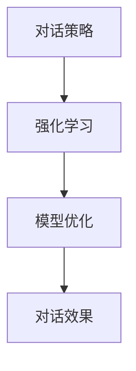
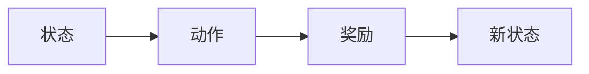
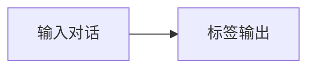
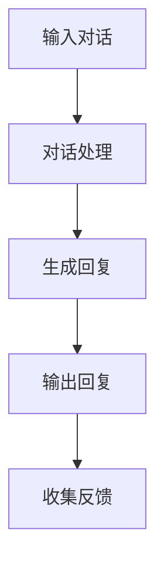
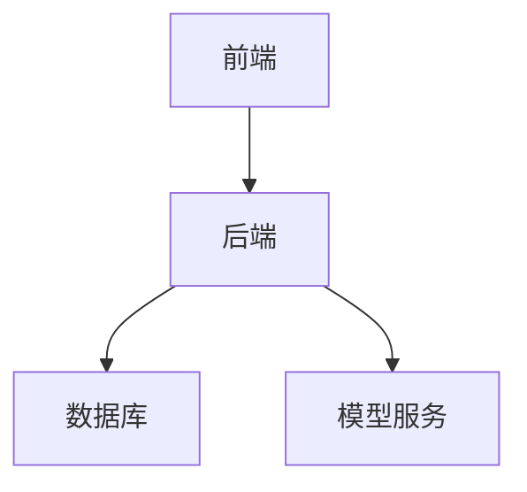
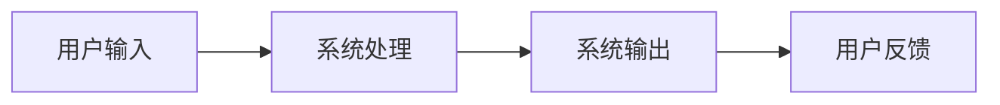

                 


# AI Agent的对话策略优化：提升交互质量和效率

> 关键词：AI Agent，对话策略优化，交互质量，交互效率，对话系统，强化学习

> 摘要：本文深入探讨了AI Agent对话策略优化的核心概念、算法原理、系统设计与实际应用。通过分析对话策略优化的背景、核心概念、算法原理、系统架构设计、项目实战和最佳实践，为读者提供了从理论到实践的全面指导。文章旨在帮助读者理解如何通过优化对话策略，显著提升AI Agent的交互质量和效率。

---

# 第一部分: AI Agent对话策略优化的背景与核心概念

## 第1章: AI Agent与对话交互的背景

### 1.1 AI Agent的基本概念
#### 1.1.1 什么是AI Agent
AI Agent（人工智能代理）是一种能够感知环境、自主决策并执行任务的智能体。它通过接收输入信息，分析理解需求，生成相应的输出，以实现特定目标。

#### 1.1.2 AI Agent的核心特征
- **自主性**：能够在没有外部干预的情况下独立运行。
- **反应性**：能够实时感知环境变化并做出响应。
- **目标导向性**：基于目标驱动行为，优化决策。
- **学习能力**：通过数据和反馈不断优化自身性能。

#### 1.1.3 AI Agent的应用场景
- 智能客服：为用户提供实时咨询和问题解决。
- 智能助手：帮助用户完成日程安排、信息查询等任务。
- 游戏AI：在电子游戏中实现智能行为。
- 智慧教育：提供个性化的学习指导。

### 1.2 对话交互的背景与挑战
#### 1.2.1 对话交互的基本概念
对话交互是AI Agent与用户之间通过语言进行信息交换的过程。它不仅包括文本交互，还涉及语音、手势等多种形式。

#### 1.2.2 对话交互中的常见问题
- **理解偏差**：AI Agent无法准确理解用户意图。
- **响应不准确**：生成的回答不符合用户需求。
- **对话逻辑不连贯**：对话过程缺乏逻辑性，用户体验较差。
- **效率低下**：对话过程冗长，无法快速解决问题。

#### 1.2.3 对话交互的优化目标
- 提高对话的准确性和相关性。
- 提升对话的效率和用户体验。
- 增强对话的自然流畅性。

### 1.3 对话策略优化的必要性
#### 1.3.1 对话质量与效率的重要性
高质量的对话能够提高用户满意度，增强品牌形象。高效的对话能够快速解决问题，提升用户体验。

#### 1.3.2 优化对话策略的意义
- 提升用户满意度：通过优化对话策略，确保每次对话都能满足用户需求。
- 提高任务完成效率：减少不必要的对话轮次，提升整体效率。
- 增强系统可解释性：优化后的对话策略更容易被用户理解和接受。

#### 1.3.3 对话策略优化的边界与外延
- **边界**：对话策略优化主要关注对话内容和流程的优化，不涉及底层算法的改进。
- **外延**：优化策略可以应用于多种对话场景，包括文本、语音和多模态交互。

---

## 第2章: 对话策略优化的核心概念与联系

### 2.1 对话策略优化的核心原理
#### 2.1.1 对话策略的定义
对话策略是AI Agent在对话过程中选择下一步行动的规则或策略。它决定了AI Agent如何根据当前对话状态生成合适的回复。

#### 2.1.2 对话策略的分类
- **基于规则的策略**：通过预定义的规则生成回复。
- **基于模型的策略**：利用机器学习模型生成回复。
- **混合策略**：结合规则和模型的优势，生成更优的回复。

#### 2.1.3 对话策略优化的数学模型
对话策略优化可以通过强化学习模型来实现。模型通过不断尝试不同的策略，根据反馈调整参数，最终找到最优策略。

### 2.2 核心概念的属性特征对比
#### 2.2.1 对比表格展示
| 概念      | 特性                     |
|-----------|--------------------------|
| 对话策略   | 基于当前状态生成回复     |
| 强化学习   | 通过试错优化策略         |
| 模型优化   | 通过训练数据改进性能     |

#### 2.2.2 通过Mermaid图展示核心概念之间的关系


---

# 第二部分: 对话策略优化的算法原理与数学模型

## 第3章: 对话策略优化的算法原理

### 3.1 强化学习在对话策略优化中的应用
#### 3.1.1 强化学习的基本原理
强化学习是一种通过试错方法找到最优策略的算法。智能体通过与环境交互，根据获得的奖励调整行为，最终达到最大化累计奖励的目标。

#### 3.1.2 在对话策略优化中的具体应用
强化学习可以应用于对话生成、对话管理等任务。例如，在对话生成中，智能体根据当前对话状态生成回复，并根据用户反馈调整策略。

#### 3.1.3 通过Mermaid图展示强化学习的流程


### 3.2 监督学习与对话策略优化
#### 3.2.1 监督学习的基本原理
监督学习是一种通过标注数据训练模型的算法。模型通过输入数据和对应的标签，学习输入与输出之间的映射关系。

#### 3.2.2 在对话策略优化中的应用
监督学习可以应用于对话分类、文本生成等任务。例如，在对话分类任务中，模型通过标注数据学习如何分类不同的对话内容。

#### 3.2.3 通过Mermaid图展示监督学习的流程


### 3.3 数学模型与公式
#### 3.3.1 强化学习的数学模型
在强化学习中，策略函数可以表示为：
$$ \pi(a|s) = P(\text{选择动作 }a \text{ 在状态 }s) $$
其中，$a$ 表示动作，$s$ 表示状态。

#### 3.3.2 模型优化的目标函数
目标函数通常表示为：
$$ J(\pi) = \mathbb{E}[R] $$
其中，$R$ 表示获得的奖励，$\mathbb{E}$ 表示期望值。

---

## 第4章: 对话策略优化的数学模型

### 4.1 对话生成的数学模型
对话生成可以通过生成模型来实现。生成模型通常采用概率分布的形式，例如：
$$ P(y|x) $$
其中，$x$ 表示输入，$y$ 表示输出。

### 4.2 对话管理的数学模型
对话管理可以通过状态转移模型来实现。状态转移模型可以表示为：
$$ P(s'|s, a) $$
其中，$s$ 表示当前状态，$a$ 表示动作，$s'$ 表示新状态。

---

## 第5章: 对话策略优化的系统设计与实现

### 5.1 系统功能设计
#### 5.1.1 系统模块划分
- 对话输入模块
- 对话处理模块
- 对话输出模块
- 反馈收集模块

#### 5.1.2 功能流程图


### 5.2 系统架构设计
#### 5.2.1 系统架构图


#### 5.2.2 接口设计
- API接口：用于前端与后端的数据交互。
- 模型接口：用于调用预训练模型。

### 5.3 交互流程图


---

## 第6章: 项目实战

### 6.1 环境安装与配置
- 安装Python和相关库（如TensorFlow、Keras）。
- 配置开发环境（如Jupyter Notebook）。

### 6.2 核心代码实现
#### 6.2.1 对话生成代码
```python
def generate_response(user_input):
    # 生成回复的逻辑
    pass
```

#### 6.2.2 对话管理代码
```python
def manage_dialogue(current_state):
    # 对话管理的逻辑
    pass
```

### 6.3 案例分析与效果评估
- 通过具体案例分析优化效果。
- 评估指标包括准确率、响应时间等。

---

## 第7章: 最佳实践与注意事项

### 7.1 最佳实践
- 制定合理的优化目标。
- 选择合适的优化方法。
- 定期监控和调整优化策略。

### 7.2 小结
通过本文的分析，读者可以系统地了解AI Agent对话策略优化的核心概念、算法原理和实际应用。优化对话策略不仅能够提升交互质量，还能够显著提高交互效率。

### 7.3 注意事项
- 避免过度优化，确保用户体验。
- 定期收集用户反馈，持续改进系统。
- 注意数据隐私和安全问题。

### 7.4 拓展阅读
- 推荐阅读相关领域的学术论文和书籍。
- 关注最新的技术动态和研究成果。

---

# 作者：AI天才研究院 & 禅与计算机程序设计艺术

