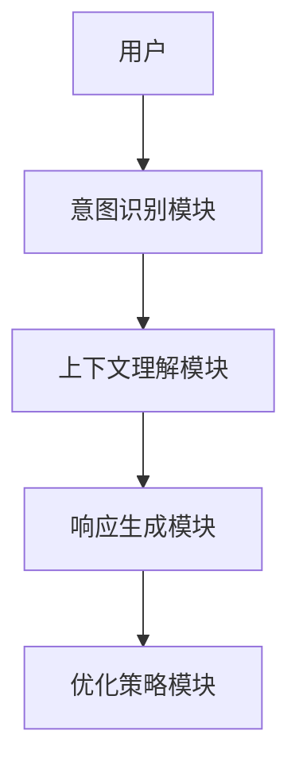
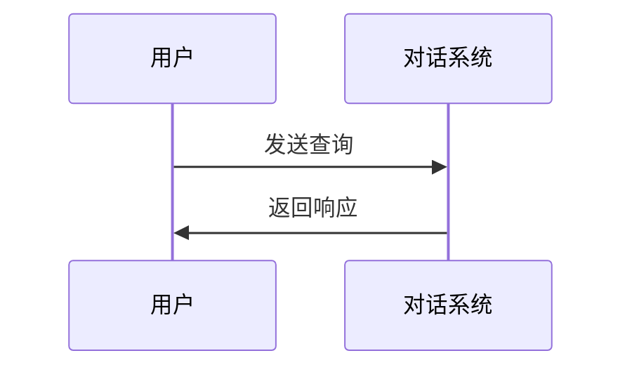

                 


# AI Agent的对话策略优化：提升用户体验

## 关键词：AI Agent，对话策略优化，用户体验，自然语言处理，强化学习，对话系统，用户意图识别

## 摘要：  
本文深入探讨了AI Agent对话策略优化的核心原理、算法实现及系统架构设计。从背景介绍到核心概念，从算法原理到系统架构，从项目实战到最佳实践，全面解析了如何通过优化对话策略提升用户体验。文章结合理论与实践，通过丰富的案例分析和详细的技术解读，为读者提供了一套系统化的优化方案，帮助读者在实际应用中更好地设计和优化AI Agent的对话系统。

---

## 正文

### 第一部分: AI Agent对话策略优化的背景与概念

#### 第1章: AI Agent与对话策略优化概述

##### 1.1 AI Agent的基本概念
###### 1.1.1 什么是AI Agent
AI Agent（人工智能代理）是指能够感知环境并采取行动以实现目标的智能实体。它可以是一个软件程序，也可以是一个硬件设备，通过与用户或系统的交互，完成特定任务。

###### 1.1.2 AI Agent的核心特征
- **自主性**：能够在没有外部干预的情况下独立运行。
- **反应性**：能够实时感知环境并做出反应。
- **目标导向**：所有行为都围绕实现特定目标展开。
- **学习能力**：能够通过数据和反馈不断优化自身行为。

###### 1.1.3 AI Agent的应用场景
- 智能客服：通过对话系统帮助用户解决问题。
- 智能助手：如Siri、Alexa等，提供信息查询和任务执行服务。
- 游戏AI：在游戏场景中模拟人类行为，提升游戏体验。

##### 1.2 对话策略优化的背景与意义
###### 1.2.1 对话系统的发展历程
- 基于规则的对话系统：通过预设规则生成响应，适用于简单场景。
- 基于机器学习的对话系统：利用数据训练模型，生成更自然的对话。
- 基于大模型的对话系统：如GPT-3、GPT-4，能够生成高度自然的对话，但成本较高。

###### 1.2.2 对话策略优化的重要性
对话策略优化直接影响用户体验，是提升AI Agent性能的核心环节。优化策略可以使对话更加流畅、自然，同时提高任务完成的准确性和效率。

###### 1.2.3 用户体验提升的目标
- 提高对话的连贯性：确保对话逻辑清晰，上下文衔接自然。
- 增强对话的自然性：使对话更接近人类对话的风格。
- 提升用户满意度：通过更精准的响应满足用户需求。

##### 1.3 当前AI Agent对话优化的研究进展
###### 1.3.1 基于规则的对话系统
基于规则的对话系统通过预设规则生成响应，适用于简单场景，但灵活性较差。

###### 1.3.2 基于机器学习的对话系统
利用数据训练模型，生成更自然的对话，但需要大量数据支持。

###### 1.3.3 基于大模型的对话优化
通过大规模预训练模型提升对话的自然性和流畅性，但计算资源需求较高。

---

#### 第2章: 对话策略优化的核心概念与原理

##### 2.1 对话策略优化的定义
###### 2.1.1 对话策略的内涵
对话策略是指在特定对话场景下，AI Agent选择合适响应的规则或模型。

###### 2.1.2 策略优化的目标
通过优化策略，使AI Agent在对话中表现更佳，提升用户体验。

##### 2.2 对话策略优化的关键要素
###### 2.2.1 用户意图识别
准确识别用户意图是对话策略优化的基础。

###### 2.2.2 上下文理解
理解对话的上下文是生成连贯响应的关键。

###### 2.2.3 响应生成
根据用户意图和上下文生成合适的响应。

##### 2.3 对话策略优化的分类
###### 2.3.1 基于规则的策略
通过预设规则生成响应，适用于简单场景。

###### 2.3.2 基于模型的策略
利用机器学习模型生成响应，适用于复杂场景。

###### 2.3.3 混合策略
结合规则和模型的优势，提升策略的灵活性和准确性。

---

#### 第3章: 对话策略优化的核心原理与算法

##### 3.1 基于强化学习的对话策略优化
###### 3.1.1 强化学习的基本原理
强化学习通过试错机制，逐步优化策略。

###### 3.1.2 在对话优化中的应用
通过强化学习优化对话策略，提升用户体验。

###### 3.1.3 算法实现步骤
1. 初始化策略参数。
2. 与用户进行对话，记录对话历史。
3. 根据对话历史生成响应。
4. 根据用户反馈更新策略参数。

##### 3.2 基于生成对抗网络的对话优化
###### 3.2.1 生成对抗网络的基本原理
通过生成器和判别器的对抗训练，提升生成样本的质量。

###### 3.2.2 在对话优化中的应用
通过GAN优化对话生成，提升对话的自然性和流畅性。

---

### 第二部分: 对话策略优化的算法实现

#### 第4章: 基于强化学习的对话策略优化算法

##### 4.1 算法原理
通过强化学习优化对话策略，提升用户体验。

##### 4.2 算法实现步骤
1. 初始化策略参数。
2. 与用户进行对话，记录对话历史。
3. 根据对话历史生成响应。
4. 根据用户反馈更新策略参数。

##### 4.3 算法的数学模型
损失函数：$$ L = -\sum_{t} \log p(a_t|s_t) $$  
优化目标：$$ \theta \leftarrow \theta + \eta \nabla_\theta L $$

##### 4.4 Python代码实现
```python
import numpy as np
import tensorflow as tf

# 初始化策略参数
theta = tf.Variable(np.random.randn(100, 1), dtype=tf.float32)

# 与用户对话
def get_response(theta, state):
    with tf.GradientTape() as tape:
        # 生成响应
        response = tf.nn.softmax(tf.matmul(state, theta))
        # 计算损失
        loss = -tf.reduce_mean(tf.log(response))
    # 更新策略参数
    gradients = tape.gradient(loss, theta)
    theta.optimizer.apply_gradients(zip([gradients], [theta]))
    return response
```

---

#### 第5章: 系统分析与架构设计

##### 5.1 系统场景介绍
设计一个基于强化学习的对话系统，用于优化用户体验。

##### 5.2 系统功能设计
- 用户意图识别：识别用户的意图。
- 上下文理解：理解对话的上下文。
- 响应生成：根据意图和上下文生成响应。

##### 5.3 系统架构设计


##### 5.4 系统接口设计
- 输入接口：用户输入的文本。
- 输出接口：生成的响应文本。

##### 5.5 系统交互设计


---

### 第三部分: 项目实战与优化

#### 第6章: 项目实战

##### 6.1 环境安装
安装必要的依赖库，如TensorFlow、Keras等。

##### 6.2 系统核心实现
实现对话系统的各个模块，包括意图识别、上下文理解、响应生成等。

##### 6.3 案例分析
通过实际案例分析，展示对话系统的优化效果。

##### 6.4 项目小结
总结项目实现过程中的经验和教训，提出改进建议。

---

### 第四部分: 最佳实践与扩展

#### 第7章: 最佳实践

##### 7.1 实际应用中的注意事项
- 数据质量：确保训练数据的多样性和代表性。
- 算法选择：根据具体场景选择合适的算法。
- 系统优化：通过A/B测试优化策略。

##### 7.2 小结
总结全文内容，强调对话策略优化的重要性。

##### 7.3 注意事项
- 避免过度优化：确保优化过程不会影响用户体验。
- 定期更新策略：根据用户反馈和数据变化更新策略。

##### 7.4 拓展阅读
推荐相关书籍和论文，供读者深入学习。

---

### 作者：AI天才研究院/AI Genius Institute & 禅与计算机程序设计艺术 /Zen And The Art of Computer Programming

