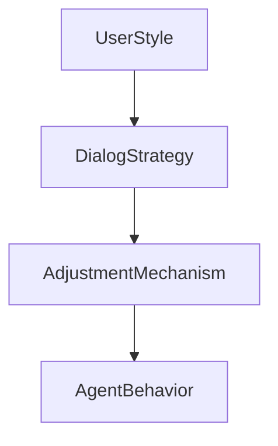
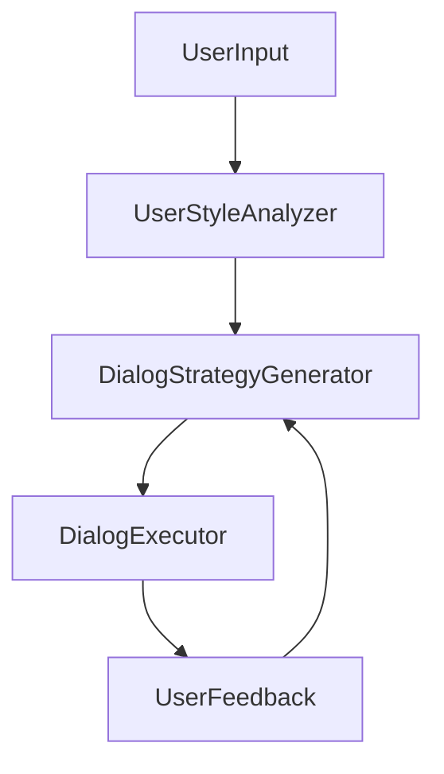
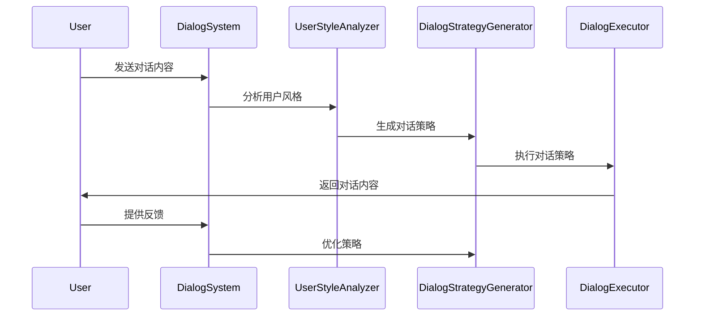

                 


# AI Agent的对话策略动态调整：适应用户风格

## 关键词：AI Agent, 对话策略, 动态调整, 用户风格, 自然语言处理, 机器学习, 对话系统

## 摘要：本文详细探讨了AI Agent在对话过程中如何根据用户的风格动态调整对话策略，以提高用户体验和系统性能。通过分析用户风格特征，结合先进的自然语言处理和机器学习算法，构建了一个自适应的对话系统架构，并通过实际案例展示了其应用场景和实现方法。本文为AI对话系统的设计和优化提供了理论依据和实践指导。

---

# 第一部分: AI Agent的对话策略动态调整概述

## 第1章: 问题背景与价值

### 1.1 问题背景
#### 1.1.1 对话系统的发展历程
对话系统经历了从简单的关键词匹配到复杂的深度学习模型的发展。早期的对话系统基于规则和关键词匹配，随着自然语言处理技术的进步，逐渐引入了上下文理解和情感分析等高级功能。

#### 1.1.2 当前对话系统的局限性
当前的对话系统在处理复杂对话时仍存在不足，例如：
- 对话策略过于静态，难以适应用户的个性化风格。
- 缺乏对用户情绪和意图的深度理解。
- 在复杂场景下，对话系统可能出现逻辑混乱或语义理解错误。

#### 1.1.3 动态调整对话策略的必要性
为了提高对话系统的智能化水平，动态调整对话策略是必要的。通过实时分析用户的行为和反馈，系统可以快速调整对话策略，以满足用户的个性化需求。

### 1.2 问题描述
#### 1.2.1 用户风格的多样性
用户风格包括语言风格、表达习惯、情感倾向等多个维度。例如，一些用户偏好直接明确的表达，而另一些用户则喜欢委婉含蓄的表达。

#### 1.2.2 对话策略的静态化问题
当前的对话系统往往采用固定的策略，无法根据用户的风格动态调整对话内容和语气。

#### 1.2.3 动态调整的挑战与目标
动态调整对话策略的挑战在于如何实时分析用户风格并快速生成适应性内容。目标是通过动态调整策略，提高对话系统的灵活性和用户体验。

### 1.3 动态调整对话策略的价值
#### 1.3.1 提高用户体验的核心要素
动态调整对话策略能够使对话更加自然流畅，满足用户的个性化需求。

#### 1.3.2 适应不同场景的实际需求
在不同场景下，用户的需求和期望可能有所不同。动态调整策略能够帮助系统更好地适应这些变化。

#### 1.3.3 企业级应用的潜在价值
在企业级应用中，动态调整对话策略可以帮助客服系统更好地处理复杂问题，提升客户满意度。

---

## 第2章: 核心概念与联系

### 2.1 AI Agent的基本概念
#### 2.1.1 AI Agent的定义与分类
AI Agent是一种能够感知环境并采取行动以实现目标的智能实体。根据功能和应用场景，AI Agent可以分为任务型Agent和交互型Agent两类。

#### 2.1.2 对话系统的组成要素
对话系统通常包括语言理解模块、对话管理模块和语言生成模块。这些模块协同工作，实现自然的对话交互。

#### 2.1.3 动态调整的机制解析
动态调整机制包括用户风格分析、对话策略生成和策略执行三个环节。系统通过实时分析用户反馈，动态调整对话策略。

### 2.2 对话策略动态调整的核心要素
#### 2.2.1 用户风格的特征分析
用户风格特征包括语言风格、情感倾向、表达习惯等。通过分析这些特征，系统可以生成适应性对话内容。

#### 2.2.2 对话策略的调整维度
对话策略的调整维度包括内容生成、语气调整和表达方式优化。系统可以根据用户风格动态选择合适的策略。

#### 2.2.3 动态调整的触发条件
动态调整的触发条件包括用户反馈、对话上下文变化和系统目标变化。系统通过实时监测这些条件，触发策略调整。

### 2.3 核心概念之间的关系
#### 2.3.1 用户风格与对话策略的关联
用户风格直接影响对话策略的选择。例如，用户偏好正式语言风格时，系统应生成正式的对话内容。

#### 2.3.2 动态调整的系统架构
动态调整的系统架构包括用户风格分析模块、对话策略生成模块和策略执行模块。这些模块协同工作，实现动态调整。

#### 2.3.3 关键实体关系的Mermaid图


---

## 第3章: 算法原理与实现

### 3.1 用户风格分析算法
#### 3.1.1 基于NLP的风格特征提取
通过自然语言处理技术，提取用户的语言风格特征，例如词汇选择、句式复杂度等。

#### 3.1.2 用户风格的分类模型
使用机器学习算法，如支持向量机（SVM）或随机森林（Random Forest），对用户风格进行分类。

#### 3.1.3 示例代码
```python
from sklearn.feature_extraction.text import TfidfVectorizer
from sklearn.svm import SVC

# 数据预处理
X = [...]  # 用户对话文本
y = [...]  # 用户风格标签

# 特征提取
vectorizer = TfidfVectorizer()
X_vec = vectorizer.fit_transform(X)

# 训练分类模型
model = SVC()
model.fit(X_vec, y)
```

### 3.2 对话策略生成算法
#### 3.2.1 基于规则的策略生成
根据用户风格特征，生成适应性对话内容。例如，针对正式风格的用户，生成正式的语言表达。

#### 3.2.2 基于模型的策略生成
使用预训练的语言模型（如GPT-3），生成适应性对话内容。

#### 3.2.3 动态优化算法
通过强化学习，优化对话策略，提高用户体验。系统根据用户反馈，动态调整策略参数。

---

## 第4章: 系统分析与架构设计

### 4.1 系统架构设计
#### 4.1.1 模块划分
系统主要包括用户风格分析模块、对话策略生成模块和策略执行模块。各模块协同工作，实现动态调整。

#### 4.1.2 系统架构图


### 4.2 接口设计
#### 4.2.1 用户输入接口
系统通过文本输入接口接收用户对话内容。

#### 4.2.2 用户反馈接口
系统通过用户反馈接口获取用户对对话内容的评价和建议。

### 4.3 交互设计
#### 4.3.1 对话流程
系统根据用户输入，实时分析用户风格，生成适应性对话内容，并通过反馈不断优化策略。

#### 4.3.2 交互流程图


---

## 第5章: 项目实战

### 5.1 环境安装
#### 5.1.1 安装依赖
安装必要的Python库，如`scikit-learn`、`transformers`等。

#### 5.1.2 代码实现
实现用户风格分析和对话策略生成的核心功能。

### 5.2 核心代码实现
#### 5.2.1 用户风格分析
```python
from sklearn.model_selection import train_test_split
from sklearn.metrics import accuracy_score

# 数据集划分
X_train, X_test, y_train, y_test = train_test_split(X, y)

# 模型训练
model.fit(X_train, y_train)

# 模型评估
accuracy = accuracy_score(y_test, model.predict(X_test))
print(f"模型准确率：{accuracy}")
```

#### 5.2.2 对话策略生成
```python
from transformers import GPT2Tokenizer, GPT2LMHeadModel

# 初始化模型和分词器
tokenizer = GPT2Tokenizer.from_pretrained("gpt2")
model = GPT2LMHeadModel.from_pretrained("gpt2")

# 生成对话内容
inputs = tokenizer("用户偏好正式风格，请生成相应的对话内容。", return_tensors="pt")
outputs = model.generate(inputs.input_ids, max_length=50)
print(tokenizer.decode(outputs[0], skip_special_tokens=True))
```

### 5.3 实际案例分析
#### 5.3.1 案例背景
在电商客服场景中，用户风格分析和对话策略生成可以帮助系统更好地与客户沟通。

#### 5.3.2 案例实现
通过分析用户风格，生成适应性对话内容，提高客户满意度。

#### 5.3.3 案例总结
通过动态调整对话策略，系统能够更高效地处理用户请求，提升用户体验。

---

## 第6章: 最佳实践与小结

### 6.1 最佳实践
#### 6.1.1 系统优化建议
定期更新模型参数，优化算法性能。

#### 6.1.2 代码实现注意事项
确保代码的可扩展性和可维护性，便于后续优化和升级。

### 6.2 小结
本文详细探讨了AI Agent对话策略动态调整的实现方法，通过分析用户风格，结合自然语言处理和机器学习技术，构建了一个自适应的对话系统架构。通过实际案例展示了其应用场景和实现效果。

### 6.3 注意事项
在实际应用中，需要注意用户隐私保护和数据安全问题。

### 6.4 拓展阅读
建议读者进一步阅读相关领域的最新研究成果，如动态对话策略优化、多模态对话系统等。

---

## 作者：AI天才研究院/AI Genius Institute & 禅与计算机程序设计艺术 /Zen And The Art of Computer Programming

---

这篇文章通过系统性的分析和实践，深入探讨了AI Agent对话策略动态调整的实现方法，为相关领域的研究和应用提供了有价值的参考。

