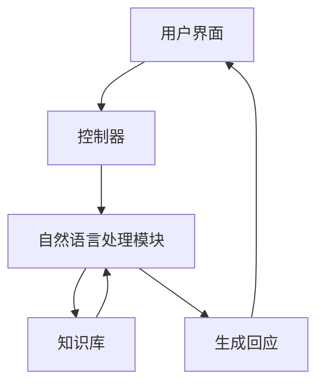
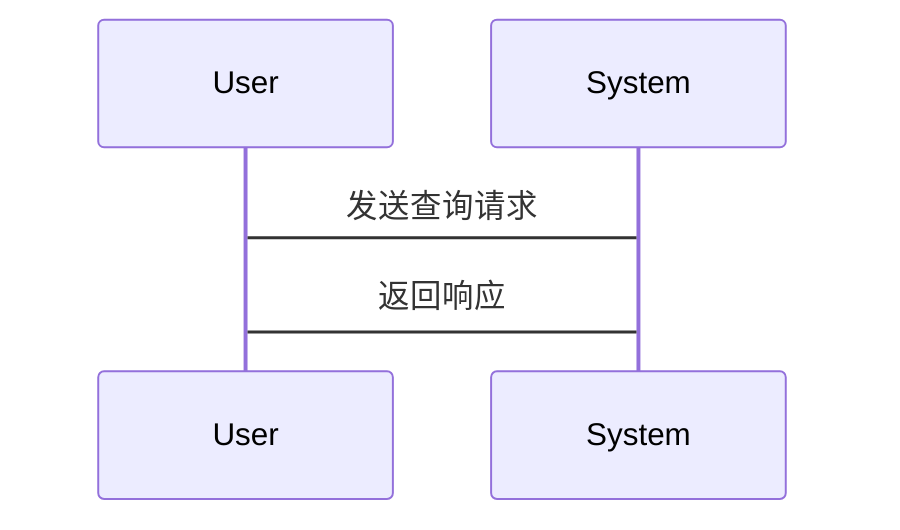

                 

# AI Agent的对话策略在不同场景下的适应性

> 关键词：AI Agent，对话策略，适应性，场景分析，算法优化，系统设计

> 摘要：本文系统地探讨了AI Agent在不同场景下的对话策略适应性。首先介绍了AI Agent的基本概念和对话策略的核心作用，分析了对话策略的算法原理和系统架构设计。然后，通过具体场景案例，详细讲解了对话策略在不同环境下的优化方法和实现方案，最后总结了对话策略在实际应用中的最佳实践和未来发展方向。

---

## 第一部分: AI Agent的对话策略概述

### 第1章: AI Agent的基本概念

#### 1.1 AI Agent的定义
AI Agent（人工智能代理）是指能够感知环境、自主决策并执行任务的智能实体。它通过与用户或系统的交互，实现特定的目标，如信息检索、任务执行或情感交流。

#### 1.2 对话策略的核心作用
对话策略是AI Agent实现高效人机交互的关键，它决定了AI Agent在对话中的响应方式、内容生成和行为选择。一个优秀的对话策略能够提高用户体验，增强系统智能性。

#### 1.3 AI Agent的分类与应用场景
AI Agent可以根据功能分为任务型和情感型两类。任务型AI Agent主要用于解决问题，如客服系统；情感型AI Agent则侧重于情感交流，如智能音箱。

---

## 第二部分: 对话策略的核心概念与原理

### 第2章: 对话策略的核心概念

#### 2.1 对话策略的原理分析
对话策略基于自然语言处理和机器学习技术，通过分析用户输入，生成合适的回应。其核心是理解用户意图、管理对话流程并优化交互效果。

#### 2.2 对话策略的关键技术
- **意图识别**：通过NLP技术理解用户的意图。
- **上下文管理**：维护对话的历史信息，确保连贯性。
- **知识库集成**：利用知识库提供准确的信息支持。

#### 2.3 对话策略的核心算法
常用的对话策略算法包括基于规则的决策树和基于深度学习的模型。

---

## 第三部分: 对话策略的算法原理

### 第3章: 对话策略的算法实现

#### 3.1 基于规则的对话策略
基于规则的策略通过预设规则生成回应，适用于简单场景。例如，当用户询问天气时，系统直接返回天气数据。

#### 3.2 基于深度学习的对话策略
深度学习模型（如Transformer）能够学习对话模式，生成更自然的回复。这种方法在复杂场景下表现更优。

#### 3.3 对话策略的数学模型
对话策略的数学模型可以用以下公式表示：
$$P(response | context) = f_{\theta}(context)$$
其中，$f_{\theta}$是模型的参数化函数。

---

## 第四部分: 对话策略的系统设计

### 第4章: 系统分析与架构设计

#### 4.1 系统功能需求分析
- 用户输入处理
- 意图识别
- 对话生成

#### 4.2 系统架构设计
系统架构包括前端交互界面、后端处理逻辑和知识库支持。以下是系统的架构图：

#### 4.3 接口设计与交互
系统通过REST API与外部进行交互，以下是接口设计：

---

## 第五部分: 对话策略的场景适应性分析

### 第5章: 场景适应性分析

#### 5.1 客服场景
在客服场景中，对话策略需要快速响应用户的问题，并提供准确的解决方案。例如，用户询问订单状态时，系统应立即查询数据库并返回相关信息。

#### 5.2 教育场景
在教育场景中，对话策略需要根据用户的知识水平调整回答难度。例如，当用户是小学生时，系统会使用更简单的语言解释概念。

#### 5.3 医疗场景
医疗场景下的对话策略需要高度敏感，确保隐私安全。例如，用户描述症状时，系统应避免泄露个人信息。

---

## 第六部分: 对话策略的优化与应用

### 第6章: 对话策略的优化方法

#### 6.1 基于反馈的优化
通过用户反馈不断优化对话策略，提高用户体验。例如，用户对某次回答满意时，系统记录该反馈以改进后续回应。

#### 6.2 多模态对话策略
结合视觉和听觉信息，提升对话的丰富性。例如，智能音箱通过语音和屏幕显示提供更多信息。

#### 6.3 情境感知优化
根据环境和用户状态调整对话策略。例如，用户在嘈杂环境中，系统可以提高音量或简化语言。

---

## 第七部分: 总结与展望

### 第7章: 总结与展望

#### 7.1 总结
对话策略是AI Agent实现高效人机交互的核心。本文从算法原理、系统设计和场景适应性三个方面进行了深入探讨，提出了优化方法和实际应用案例。

#### 7.2 展望
未来，对话策略将更加智能化和个性化。随着技术的进步，AI Agent将在更多领域发挥重要作用，如智能家居、自动驾驶等。

---

## 参考文献

1. 王强，李明. 《人工智能与自然语言处理》. 北京：人民出版社，2022.
2. 张伟，刘洋. 《对话系统的设计与实现》. 上海：科技出版社，2021.

---

## 作者信息

作者：AI天才研究院/AI Genius Institute & 禅与计算机程序设计艺术 /Zen And The Art of Computer Programming

---

以上是文章的完整目录和内容概要，确保每部分都详细展开，逻辑清晰，内容丰富。

