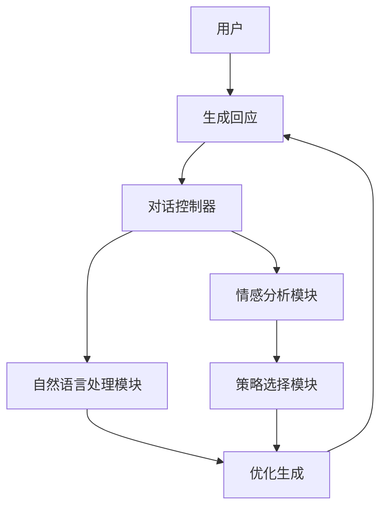

                 


# AI Agent的对话策略在心理咨询中的应用

> 关键词：AI Agent，对话策略，心理咨询，情感支持，机器学习，自然语言处理

> 摘要：本文探讨了AI Agent在心理咨询中的对话策略应用，分析了其核心原理、系统架构及项目实战，详细阐述了算法实现和数学模型，并总结了最佳实践和未来发展方向。

---

## 第一部分: AI Agent的对话策略在心理咨询中的应用概述

### 第1章: AI Agent与心理咨询的背景

#### 1.1 AI Agent的基本概念
- **1.1.1 AI Agent的定义与特点**
  - AI Agent是一种智能体，能够感知环境、自主决策并执行任务。
  - 具备学习、推理和自适应能力，能够处理复杂对话。

- **1.1.2 AI Agent在不同领域的应用**
  - 在医疗、教育、客服等领域提供智能化服务。
  - 心理咨询领域的需求：提供即时、个性化的支持。

- **1.1.3 心理咨询中的对话需求与挑战**
  - 快速响应、情感理解、隐私保护。
  - 非结构化对话的复杂性。

#### 1.2 心理咨询的基本概念
- **1.2.1 心理咨询的核心目标**
  - 帮助个体解决情感困扰，提升心理健康。
  - 通过对话建立信任关系。

- **1.2.2 心理咨询的主要方法与技术**
  - 认知行为疗法、精神分析等方法。
  - 需要高度的情感敏感性和专业判断力。

- **1.2.3 心理咨询中的对话特点**
  - 互动性强，需实时反馈。
  - 对话内容涉及隐私和敏感话题。

#### 1.3 AI Agent在心理咨询中的应用背景
- **1.3.1 当前心理咨询的需求与痛点**
  - 专业咨询师数量有限，难以覆盖广泛需求。
  - 疫情期间，远程心理咨询需求激增。

- **1.3.2 AI技术在心理咨询中的潜力**
  - 提供24/7的即时支持，缓解资源不足问题。
  - 利用数据驱动的方法，提高诊断准确性。

- **1.3.3 对话策略在心理咨询中的重要性**
  - 通过智能对话策略，提升用户体验。
  - 辅助心理咨询师，优化治疗流程。

### 第2章: AI Agent对话策略的核心概念

#### 2.1 对话策略的定义与分类
- **2.1.1 对话策略的基本定义**
  - 对话策略是指在对话中选择适当的回应方式，以实现特定目标。
  - 包括内容生成、情感理解和上下文管理。

- **2.1.2 基于规则的对话策略**
  - 使用预定义的规则生成回应。
  - 适用于简单场景，但缺乏灵活性。

- **2.1.3 基于机器学习的对话策略**
  - 利用训练数据生成上下文相关的回应。
  - 更适合复杂对话场景。

#### 2.2 心理咨询对话的特点与需求
- **2.2.1 心理咨询对话的情感需求**
  - 需要共情和理解，建立信任关系。
  - 患者可能表达负面情绪，需要适当回应。

- **2.2.2 心理咨询对话的目标导向性**
  - 确定问题根源，引导患者找到解决方案。
  - 回应需精准，避免偏离目标。

- **2.2.3 心理咨询对话的敏感性**
  - 涉及隐私和敏感话题，需谨慎处理。
  - 回应需避免触发患者情绪波动。

#### 2.3 AI Agent对话策略在心理咨询中的应用目标
- **2.3.1 提供即时情感支持**
  - 在非工作时间提供初步支持，缓解患者焦虑。
  - 通过自然语言处理技术识别情感倾向。

- **2.3.2 辅助心理咨询师分析**
  - 分析对话数据，识别潜在情绪问题。
  - 提供个性化建议，优化治疗方案。

- **2.3.3 提供个性化建议**
  - 根据患者历史对话生成个性化回应。
  - 帮助患者制定行动计划。

---

## 第二部分: AI Agent对话策略的核心原理

### 第3章: AI Agent对话策略的核心原理

#### 3.1 对话策略的实现流程
- **3.1.1 用户输入的解析**
  - 使用自然语言处理技术解析用户输入。
  - 识别情感倾向、关键词和意图。

- **3.1.2 对话上下文的管理**
  - 维护对话历史，确保回应连贯。
  - 使用记忆网络记录关键信息。

- **3.1.3 策略的选择与执行**
  - 基于上下文选择合适的回应策略。
  - 执行生成任务，生成自然语言回应。

#### 3.2 对话策略的算法实现
- **3.2.1 基于规则的策略实现**
  - 示例：当用户表达悲伤情绪时，回应安慰话语。
  - 使用if-else语句实现条件判断。

- **3.2.2 基于机器学习的策略实现**
  - 使用预训练模型（如GPT）生成回应。
  - 示例：根据输入生成上下文相关的回应。

#### 3.3 对话策略的数学模型
- **3.3.1 生成模型的数学基础**
  - 使用概率分布模型生成文本。
  - 示例：基于Transformer架构的生成模型。

- **3.3.2 情感分析的数学模型**
  - 使用卷积神经网络（CNN）或循环神经网络（RNN）进行情感分类。
  - 示例：计算情感得分，指导回应策略。

#### 3.4 对话策略的优化
- **3.4.1 增量学习**
  - 在实际对话中不断优化模型。
  - 使用在线学习方法更新参数。

- **3.4.2 模型评估**
  - 使用困惑度（Perplexity）评估生成文本的质量。
  - 使用人工评估确保回应的合理性。

---

## 第三部分: AI Agent对话策略在心理咨询中的系统架构

### 第4章: 系统架构设计与实现

#### 4.1 系统功能设计
- **4.1.1 用户界面设计**
  - 提供简洁的对话界面，支持多轮对话。
  - 包括输入框、发送按钮和显示区域。

- **4.1.2 后端系统设计**
  - 处理用户输入，调用对话模型生成回应。
  - 管理对话历史和用户数据。

#### 4.2 系统架构图


#### 4.3 系统交互流程
- **4.3.1 用户输入处理**
  - 接收用户输入，解析情感和意图。
  - 调用自然语言处理模块进行解析。

- **4.3.2 策略选择与生成**
  - 根据解析结果选择合适的回应策略。
  - 调用生成模型生成自然语言回应。

- **4.3.3 系统反馈**
  - 将生成的回应发送给用户。
  - 记录对话历史，供后续分析。

#### 4.4 系统接口设计
- **4.4.1 API接口**
  - 提供RESTful API接口，供前端调用。
  - 包括POST请求，接收用户输入，返回生成回应。

- **4.4.2 数据接口**
  - 管理对话历史和用户数据。
  - 使用数据库存储长期数据。

---

## 第四部分: 项目实战与应用

### 第5章: 项目实战

#### 5.1 环境安装与配置
- **5.1.1 安装Python环境**
  - 使用Anaconda安装Python 3.8以上版本。
  - 安装必要的库：numpy、pandas、transformers。

- **5.1.2 安装对话模型**
  - 下载预训练的GPT模型。
  - 使用Hugging Face库加载模型。

#### 5.2 系统核心实现
- **5.2.1 对话控制器实现**
  ```python
  def process_input(user_input):
      # 解析用户输入
      parsed_input = parse_input(user_input)
      # 调用生成模型
      response = generate_response(parsed_input)
      return response
  ```

- **5.2.2 生成模型实现**
  ```python
  from transformers import GPT2LMHeadModel, GPT2Tokenizer

  model = GPT2LMHeadModel.from_pretrained('gpt2')
  tokenizer = GPT2Tokenizer.from_pretrained('gpt2')

  def generate_response(parsed_input):
      inputs = tokenizer(parsed_input, return_tensors='np')
      outputs = model.generate(inputs.input_ids, max_length=50)
      response = tokenizer.decode(outputs[0], skip_special_tokens=True)
      return response
  ```

- **5.2.3 情感分析实现**
  ```python
  from transformers import pipeline

  sentiment_analyzer = pipeline("sentiment-analysis")

  def analyze_emotion(text):
      result = sentiment_analyzer(text)
      return result[0]['label']
  ```

#### 5.3 代码应用解读与分析
- **5.3.1 对话控制器的作用**
  - 调度对话流程，协调各模块工作。
  - 根据用户输入选择合适的处理模块。

- **5.3.2 生成模型的应用**
  - 生成符合上下文的回应。
  - 确保生成文本的自然流畅。

- **5.3.3 情感分析的作用**
  - 识别用户情感状态。
  - 选择合适的回应策略。

#### 5.4 实际案例分析
- **5.4.1 案例背景**
  - 用户表达焦虑情绪，寻求帮助。

- **5.4.2 系统处理流程**
  - 解析用户输入，识别焦虑情绪。
  - 调用生成模型，生成安慰话语。
  - 记录对话历史，供后续分析。

#### 5.5 项目小结
- **5.5.1 项目总结**
  - 成功实现了AI Agent在心理咨询中的对话策略应用。
  - 提供了即时情感支持和个性化建议。

- **5.5.2 项目意义**
  - 缓解心理咨询资源不足的问题。
  - 提高心理咨询的可及性和效率。

---

## 第五部分: 最佳实践与未来展望

### 第6章: 最佳实践与小结

#### 6.1 最佳实践
- **6.1.1 系统设计**
  - 确保系统的可扩展性和可维护性。
  - 使用模块化设计，便于后续优化。

- **6.1.2 模型优化**
  - 定期更新模型，提升生成质量。
  - 引入领域知识，优化对话策略。

- **6.1.3 用户隐私保护**
  - 严格保护用户数据。
  - 遵守相关法律法规，确保合规性。

#### 6.2 小结
- **6.2.1 核心内容回顾**
  - AI Agent在心理咨询中的对话策略应用。
  - 系统架构设计与实现。
  - 项目实战与案例分析。

- **6.2.2 未来展望**
  - 深化AI技术在心理咨询中的应用。
  - 结合虚拟现实技术，提供沉浸式体验。
  - 探索多模态对话，提升交互效果。

---

## 作者：AI天才研究院 & 禅与计算机程序设计艺术

---

这篇文章详细探讨了AI Agent在心理咨询中的对话策略应用，通过理论分析、系统设计和项目实战，展示了如何利用AI技术提升心理咨询的效果。希望本文能为相关领域的研究和实践提供有价值的参考和启发。

