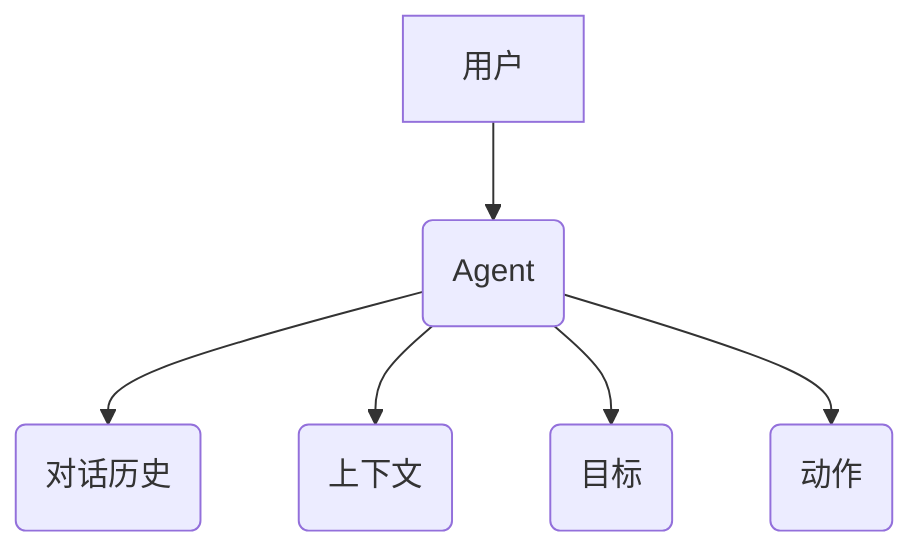
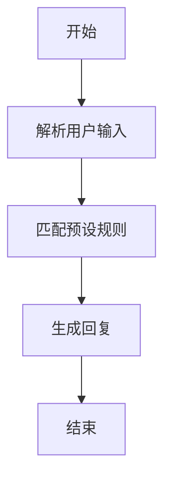
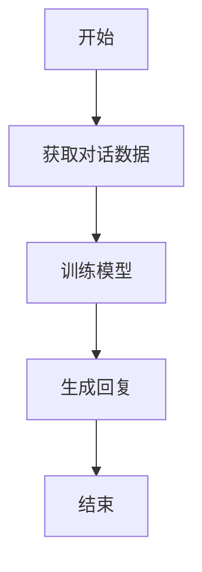
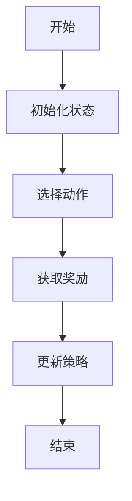
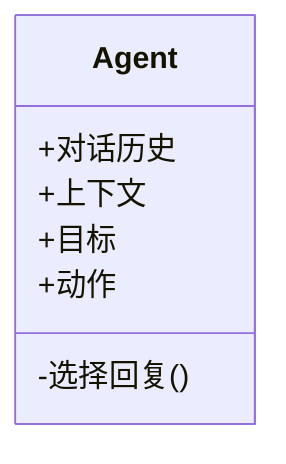
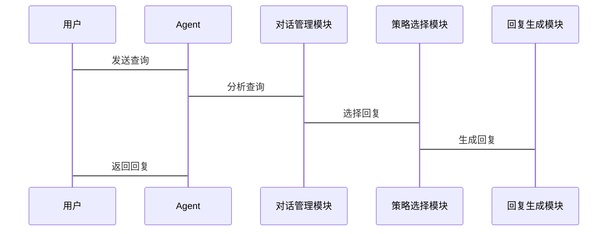

                 


# AI Agent的对话策略：提高交互质量

## 关键词：AI Agent，对话策略，人机交互，自然语言处理，强化学习，数学模型

## 摘要：本文深入探讨AI Agent的对话策略，从背景介绍到算法原理，再到系统架构和项目实战，详细分析如何提高交互质量。通过结合数学模型、Mermaid图表和代码示例，全面解析对话策略的核心概念、实现方法和优化技巧。

---

## 第一部分: AI Agent对话策略的背景与核心概念

### 第1章: AI Agent与对话策略概述

#### 1.1 AI Agent的基本概念
- **1.1.1 AI Agent的定义与特点**
  - AI Agent（智能体）是能够感知环境并采取行动以实现目标的实体。
  - 特点：自主性、反应性、目标导向、社交能力。
- **1.1.2 对话策略的定义与作用**
  - 对话策略是AI Agent在与用户交互时选择合适回复的规则或模型。
  - 作用：提升用户体验、提高任务完成效率、增强交互的自然性。
- **1.1.3 AI Agent在人机交互中的重要性**
  - AI Agent通过对话策略实现与用户的有效沟通，是人机交互的核心技术。

#### 1.2 对话策略的核心问题
- **1.2.1 对话中的语境理解问题**
  - 对话需要理解上下文、用户意图和情感。
- **1.2.2 对话目标的多样性**
  - 对话目标可能是信息传递、情感交流或任务完成。
- **1.2.3 对话策略的动态调整**
  - 根据用户反馈实时调整对话策略。

#### 1.3 当前对话策略的研究进展
- **1.3.1 基于规则的对话策略**
  - 优点：简单易懂，适合特定场景。
  - 缺点：缺乏灵活性，难以应对复杂场景。
- **1.3.2 基于统计的对话策略**
  - 优点：数据驱动，可以处理大量数据。
  - 缺点：依赖数据质量，可能缺乏可解释性。
- **1.3.3 基于强化学习的对话策略**
  - 优点：可以通过试错优化策略。
  - 缺点：训练时间长，需要大量数据。

#### 1.4 本章小结
- 本章介绍了AI Agent的基本概念、对话策略的核心问题以及当前的研究进展，为后续内容奠定了基础。

---

## 第二部分: 对话策略的核心概念与联系

### 第2章: 对话策略的核心概念与原理

#### 2.1 对话策略的分类与对比
- **2.1.1 基于规则的策略**
  - 通过预定义的规则选择回复。
- **2.1.2 基于统计的策略**
  - 通过概率模型生成回复。
- **2.1.3 基于强化学习的策略**
  - 通过奖励机制优化回复。

#### 2.2 对话策略的关键属性
- **2.2.1 策略的可解释性**
  - 策略是否容易被人类理解。
- **2.2.2 策略的灵活性**
  - 策略是否能适应不同的对话场景。
- **2.2.3 策略的鲁棒性**
  - 策略在面对不确定性时的表现。

#### 2.3 对话策略的实体关系图


#### 2.4 本章小结
- 本章详细分析了对话策略的核心概念与联系，帮助读者理解策略的分类和关键属性。

---

## 第三部分: 对话策略的算法原理与数学模型

### 第3章: 对话策略的算法原理

#### 3.1 基于规则的对话策略
- **3.1.1 算法流程图**

- **3.1.2 优缺点分析**
  - 优点：简单易实现。
  - 缺点：缺乏灵活性。

#### 3.2 基于统计的对话策略
- **3.2.1 算法流程图**

- **3.2.2 数学模型**
  - 使用概率模型计算回复的概率。

#### 3.3 基于强化学习的对话策略
- **3.3.1 算法流程图**

- **3.3.2 数学模型**
  - 使用Q-learning算法：$$ Q(s, a) = Q(s, a) + \alpha (r + \max Q(s', a') - Q(s, a)) $$

---

## 第四部分: 对话策略的系统分析与架构设计

### 第4章: 对话策略的系统架构

#### 4.1 系统功能设计
- **4.1.1 领域模型**


#### 4.2 系统架构设计


#### 4.3 系统接口设计
- 接口1：用户输入接口。
- 接口2：回复输出接口。

#### 4.4 系统交互设计


---

## 第五部分: 对话策略的项目实战

### 第5章: 对话策略的项目实战

#### 5.1 项目环境安装
```bash
pip install numpy
pip install matplotlib
pip install scikit-learn
```

#### 5.2 系统核心实现源代码
```python
import numpy as np

class Agent:
    def __init__(self):
        self.dialogue_history = []
        self.context = {}

    def receive_input(self, input_text):
        self.dialogue_history.append(input_text)
        return self.generate_reply()

    def generate_reply(self):
        # 示例：基于规则的回复生成
        if "你好" in self.dialogue_history[-1]:
            return "你好！有什么可以帮助你的吗？"
        else:
            return "抱歉，我还不太明白你的意思。"
```

#### 5.3 代码应用解读与分析
- 代码实现了基于规则的对话策略，根据用户输入生成回复。

#### 5.4 实际案例分析
- 案例：用户输入“你好”，系统回复“你好！有什么可以帮助你的吗？”

#### 5.5 项目小结
- 本章通过实际项目展示了对话策略的实现过程，帮助读者理解理论与实践的结合。

---

## 第六部分: 对话策略的最佳实践

### 第6章: 最佳实践

#### 6.1 小结
- 对话策略是提升AI Agent交互质量的关键技术。

#### 6.2 注意事项
- 确保数据质量，选择合适的算法，注重模型的可解释性。

#### 6.3 拓展阅读
- 推荐阅读《深度学习入门》和《强化学习实战》。

---

## 总结

本文系统地介绍了AI Agent的对话策略，从背景到算法，从系统架构到项目实战，全面分析了如何提高交互质量。通过理论与实践的结合，帮助读者深入理解对话策略的核心概念和实现方法。

---

## 作者：AI天才研究院/AI Genius Institute & 禅与计算机程序设计艺术 /Zen And The Art of Computer Programming

