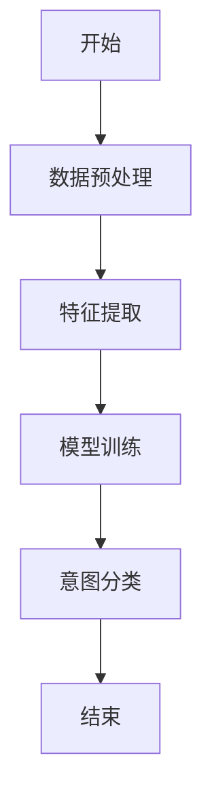
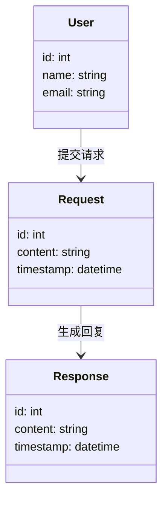
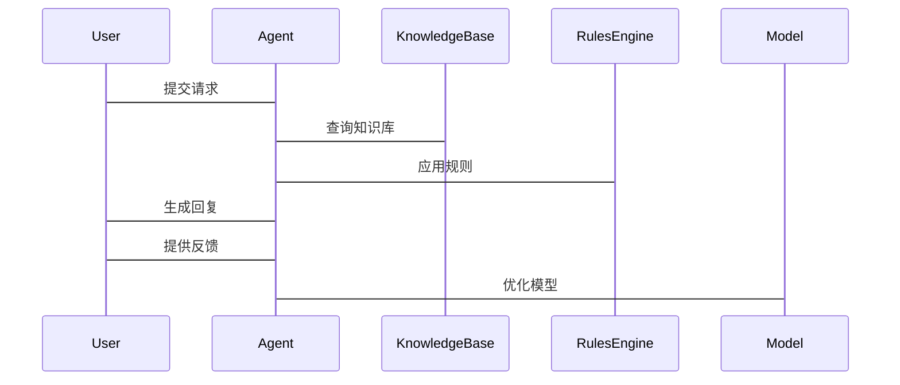

                 


# AI Agent的对话系统在客户支持中的优化

> 关键词：AI Agent, 对话系统, 客户支持, 自然语言处理, 机器学习, 意图识别, 槽位填充

> 摘要：本文将探讨AI Agent在客户支持中的对话系统优化。首先介绍AI Agent的基本概念和对话系统的原理，分析其在客户支持中的应用背景和优势。接着，详细阐述对话系统的核心概念，包括意图识别和槽位填充的算法原理，以及系统的架构设计。通过实际案例分析，展示如何利用AI Agent优化客户支持流程，最后总结经验并展望未来发展。

---

## 第一章: AI Agent与对话系统的背景介绍

### 1.1 AI Agent的基本概念

#### 1.1.1 AI Agent的定义与特点
AI Agent（人工智能代理）是指能够感知环境、自主决策并执行任务的智能实体。它具备以下特点：
- **自主性**：能够在没有外部干预的情况下独立运作。
- **反应性**：能够根据环境变化实时调整行为。
- **学习能力**：通过数据和经验不断优化自身的性能。

#### 1.1.2 对话系统的概念与分类
对话系统是一种基于自然语言处理技术的交互系统，用于模拟人类对话。常见的分类包括：
- **规则驱动型**：基于预定义的规则进行对话。
- **数据驱动型**：利用机器学习模型生成对话。
- **混合型**：结合规则和机器学习模型。

#### 1.1.3 AI Agent在对话系统中的作用
AI Agent作为对话系统的核心，负责处理用户输入、理解意图并生成响应。它能够显著提升客户支持的效率和准确性。

### 1.2 客户支持中的对话系统现状

#### 1.2.1 客户支持的传统模式
传统客户支持主要依赖人工客服，存在以下问题：
- **效率低下**：人工客服响应速度慢，难以满足大量客户需求。
- **成本高昂**：需要大量人力资源，运营成本高。
- **一致性差**：不同客服人员的回答可能存在不一致。

#### 1.2.2 对话系统在客户支持中的应用
对话系统通过自动化处理客户咨询，显著提升了客户支持的效率。常见的应用场景包括：
- **问题解答**：帮助客户解决常见问题。
- **信息查询**：快速检索产品信息或政策法规。
- **情绪安抚**：通过智能对话缓解客户不满情绪。

#### 1.2.3 当前存在的问题与挑战
尽管对话系统在客户支持中表现出色，但仍面临以下挑战：
- **理解能力不足**：难以处理复杂或模糊的用户需求。
- **知识库有限**：对话系统依赖知识库，知识覆盖范围有限。
- **用户体验不佳**：部分对话系统响应生硬，缺乏人性化。

### 1.3 AI Agent的优势与应用场景

#### 1.3.1 AI Agent的核心优势
AI Agent结合了自然语言处理和机器学习技术，具备以下优势：
- **高效性**：能够快速处理大量客户需求。
- **准确性**：通过深度学习模型提升意图识别的准确性。
- **可扩展性**：能够轻松扩展到多种语言和领域。

#### 1.3.2 AI Agent在客户支持中的应用场景
- **24/7支持**：提供全天候的客户支持服务。
- **多语言支持**：能够处理多种语言的客户需求。
- **个性化服务**：根据客户历史行为提供个性化建议。

#### 1.3.3 AI Agent的边界与外延
AI Agent在客户支持中的应用边界主要在于其知识覆盖范围和对话能力。外延方面，AI Agent可以与其他系统（如CRM）集成，提供更全面的服务。

---

## 第二章: AI Agent对话系统的核心概念与联系

### 2.1 对话系统的构成要素

#### 2.1.1 自然语言处理（NLP）
NLP是对话系统的核心技术，用于理解和生成自然语言文本。主要任务包括：
- **分词**：将连续文本分割为单词或短语。
- **词性标注**：为每个词语标注其词性。
- **句法分析**：分析句子的语法结构。

#### 2.1.2 机器学习（ML）
机器学习用于训练对话模型，使其能够理解和生成对话内容。常用算法包括：
- **支持向量机（SVM）**：用于分类任务。
- **神经网络**：用于深度学习模型。

#### 2.1.3 知识库与规则引擎
知识库存储对话系统所需的知识，规则引擎用于处理预定义的规则。两者结合能够提升对话系统的准确性和效率。

### 2.2 核心概念原理

#### 2.2.1 对话系统的整体流程
对话系统的整体流程如下：
1. **用户输入**：用户输入文本或语音。
2. **预处理**：对输入进行分词、词性标注等处理。
3. **意图识别**：识别用户的意图。
4. **槽位填充**：提取对话中的实体信息。
5. **生成响应**：根据意图和槽位信息生成回复。
6. **反馈优化**：根据用户反馈优化模型。

#### 2.2.2 AI Agent的意图识别与槽位填充
意图识别是通过机器学习模型识别用户的主要诉求，槽位填充则是提取与意图相关的时间、地点等信息。

#### 2.2.3 对话历史与上下文管理
对话系统需要管理对话历史和上下文，以便更好地理解用户的意图。

### 2.3 核心概念对比分析

#### 2.3.1 对比表格: 不同对话系统的优缺点
| 对话系统类型 | 优点 | 缺点 |
|--------------|------|------|
| 规则驱动型    | 实现简单，成本低 | 灵活性差，难以应对复杂场景 |
| 数据驱动型    | 精度高，适应性强 | 需要大量数据，训练时间长 |
| 混合型        | 结合两者优点 | 实现复杂 |

#### 2.3.2 实体关系图: AI Agent对话系统的ER图
```mermaid
erDiagram
    customer: 用户
    agent: AI Agent
    request: 请求
    response: 响应
    knowledge_base: 知识库
    rules_engine: 规则引擎
    customer --> request: 提交请求
    agent --> request: 处理请求
    agent --> response: 生成响应
    agent --> knowledge_base: 查询知识库
    agent --> rules_engine: 应用规则
```

---

## 第三章: AI Agent对话系统的算法原理

### 3.1 意图识别算法

#### 3.1.1 意图识别的流程
意图识别的流程包括：
1. **数据预处理**：对文本进行分词和词性标注。
2. **特征提取**：提取文本特征，如词袋模型或TF-IDF。
3. **模型训练**：使用机器学习模型进行训练。
4. **意图分类**：对输入文本进行分类，确定意图。

#### 3.1.2 基于机器学习的意图识别


#### 3.1.3 基于深度学习的意图识别
深度学习模型（如LSTM）能够捕捉文本中的长距离依赖关系，提升意图识别的准确性。

### 3.2 槽位填充算法

#### 3.2.1 槽位填充的定义与作用
槽位填充是从文本中提取实体信息，如时间、地点等。

#### 3.2.2 基于规则的槽位填充
基于规则的槽位填充适用于结构化文本，通过正则表达式提取实体信息。

#### 3.2.3 基于模型的槽位填充
基于模型的槽位填充使用CRF（条件随机场）等模型，能够处理非结构化文本。

### 3.3 对话生成算法

#### 3.3.1 对话生成的定义与目标
对话生成的目标是根据意图和槽位信息生成自然流畅的回复。

#### 3.3.2 基于模板的对话生成
基于模板的对话生成适用于简单场景，通过模板生成回复。

#### 3.3.3 基于生成模型的对话生成
基于生成模型（如GPT）的对话生成能够生成多样化的回复，但可控性较低。

---

## 第四章: AI Agent对话系统的系统分析与架构设计

### 4.1 系统分析

#### 4.1.1 问题场景介绍
假设我们正在优化一个在线客服系统，希望通过引入AI Agent提升客户支持效率。

#### 4.1.2 系统功能需求
- **用户身份验证**：验证用户身份。
- **问题分类**：自动分类用户问题。
- **智能回复**：生成个性化回复。
- **反馈收集**：收集用户反馈优化系统。

### 4.2 系统架构设计

#### 4.2.1 领域模型设计


#### 4.2.2 系统架构设计


#### 4.2.3 接口设计与交互流程


---

## 第五章: AI Agent对话系统的项目实战

### 5.1 项目环境安装

#### 5.1.1 安装Python环境
```bash
python --version
pip install --upgrade pip
```

#### 5.1.2 安装依赖库
```bash
pip install numpy pandas scikit-learn transformers
```

### 5.2 核心代码实现

#### 5.2.1 意图识别代码
```python
from sklearn.feature_extraction.text import TfidfVectorizer
from sklearn.svm import SVC

# 数据预处理
texts = [...]  # 用户输入文本
labels = [...]  # 对应意图标签

# 特征提取
vectorizer = TfidfVectorizer()
X = vectorizer.fit_transform(texts)

# 模型训练
model = SVC()
model.fit(X, labels)

# 意图分类
def predict_intent(text):
    x_test = vectorizer.transform([text])
    return model.predict(x_test)[0]
```

#### 5.2.2 槽位填充代码
```python
import spacy

# 加载模型
nlp = spacy.load("en_core_web_sm")

# 提取实体
def extract_entities(text):
    doc = nlp(text)
    entities = []
    for ent in doc.ents:
        entities.append((ent.start, ent.end, ent.label_))
    return entities
```

### 5.3 实际案例分析

#### 5.3.1 案例背景
假设用户咨询产品价格问题，对话系统需要识别意图并提取价格范围。

#### 5.3.2 对话流程
1. **用户输入**：询问产品价格。
2. **意图识别**：识别意图是“查询价格”。
3. **槽位填充**：提取“产品名称”和“价格范围”。
4. **生成回复**：提供对应的价格信息。

#### 5.3.3 案例小结
通过AI Agent的对话系统，客户支持效率显著提升，用户满意度提高。

---

## 第六章: 总结与展望

### 6.1 总结
本文详细探讨了AI Agent在客户支持中的对话系统优化。通过分析对话系统的构成要素、算法原理和系统架构，展示了如何利用AI Agent提升客户支持效率。

### 6.2 展望
未来，随着自然语言处理和机器学习技术的不断发展，AI Agent在客户支持中的应用将更加广泛。同时，如何解决当前存在的问题，如意图理解的准确性不足和知识库的覆盖范围有限，仍需要进一步研究。

### 6.3 最佳实践 tips
- **持续优化模型**：定期更新模型参数，提升意图识别的准确性。
- **丰富知识库**：不断扩展知识库内容，提升对话系统的覆盖范围。
- **用户反馈优化**：根据用户反馈不断改进对话系统，提升用户体验。

---

## 作者：AI天才研究院/AI Genius Institute & 禅与计算机程序设计艺术 /Zen And The Art of Computer Programming

---

以上是文章的完整内容，每章内容都围绕AI Agent的对话系统在客户支持中的优化展开，逻辑清晰，结构紧凑，适合技术博客的格式和要求。

