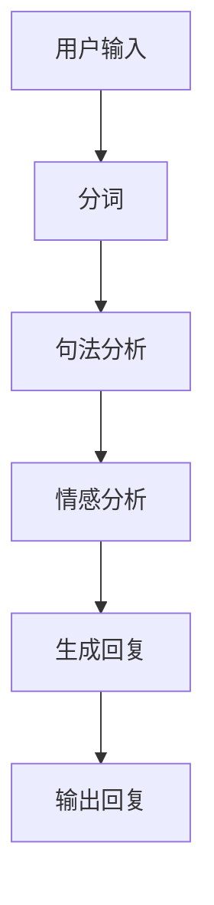
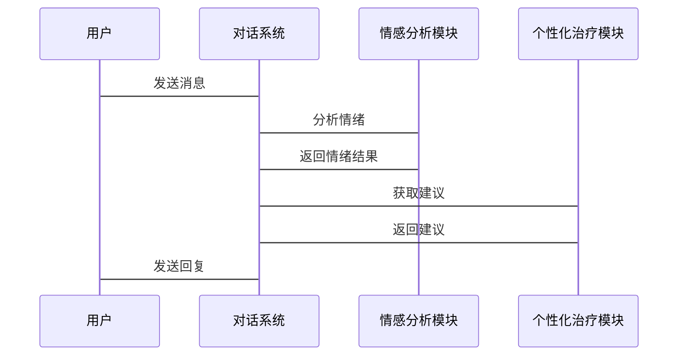

                 


# AI Agent的对话系统在心理健康领域的应用

## 关键词：AI Agent, 对话系统, 心理健康, 自然语言处理, 情感分析, 个性化治疗

## 摘要：本文探讨了AI Agent对话系统在心理健康领域的应用，分析了其在心理咨询、情绪识别和个性化治疗中的潜力。文章详细讲解了对话系统的算法原理、系统架构设计，并通过实际案例展示了其在改善心理健康服务中的作用。同时，本文还提供了项目实战指导和最佳实践建议。

---

## 第一部分：背景介绍

### 1.1 问题背景

#### 1.1.1 心理健康问题的现状与挑战
心理健康问题日益普遍，尤其是焦虑和抑郁等情绪障碍。传统心理咨询方式存在资源不足、成本高、隐私问题等挑战。AI技术的发展为解决这些问题提供了新思路。

#### 1.1.2 AI技术在心理健康领域的潜力
AI技术，特别是自然语言处理和机器学习，能够帮助分析大量数据，提供个性化的心理健康支持。AI Agent（智能对话系统）可以在任何时间提供即时帮助，打破时间和空间的限制。

#### 1.1.3 对话系统在心理健康中的独特优势
对话系统能够理解用户情感，提供情感支持和建议，帮助用户缓解压力、改善情绪。通过不断学习和优化，对话系统可以逐步提升服务质量。

### 1.2 问题描述

#### 1.2.1 心理健康对话系统的定义
心理健康对话系统是一种基于AI的对话系统，能够通过自然语言处理技术与用户进行交互，提供心理支持和治疗建议。

#### 1.2.2 系统的目标与核心问题
系统目标：提供24/7的心理支持，帮助用户缓解情绪问题，提供个性化治疗建议。核心问题：如何设计高效的对话系统，确保其准确理解用户情感，并提供有效的支持。

#### 1.2.3 系统的边界与外延
边界：仅限于提供心理支持和情绪管理，不涉及药物治疗或其他医疗行为。外延：可能延伸到健康监测、生活习惯建议等领域。

### 1.3 问题解决

#### 1.3.1 AI Agent在对话系统中的作用
AI Agent负责处理用户输入，分析情感，生成回应。它能够学习用户的行为模式，优化对话策略，提升用户体验。

#### 1.3.2 对话系统如何改善心理健康服务
通过即时响应、个性化支持和隐私保护，对话系统能够有效缓解用户的心理压力，降低心理健康问题的发生率。

#### 1.3.3 系统的核心要素与组成
- 用户输入接口：收集用户的语音或文本输入。
- 情感分析模块：识别用户情绪。
- 对话生成模块：根据情感分析结果生成回应。
- 学习与优化模块：持续改进对话策略。

---

## 第二部分：核心概念与联系

### 2.1 AI Agent与对话系统的原理

#### 2.1.1 AI Agent的基本原理
AI Agent通过感知环境、分析信息、做出决策并执行动作。在对话系统中，它负责理解和生成对话内容。

#### 2.1.2 对话系统的实现机制
对话系统基于自然语言处理技术，包括分词、句法分析、情感分析等步骤。系统通过预训练模型生成回复，确保语义准确。

#### 2.1.3 两者的结合与协同
AI Agent与对话系统的协同体现在信息处理、决策生成和交互优化方面。AI Agent为对话系统提供决策支持，而对话系统为AI Agent提供交互界面。

### 2.2 对话系统在心理健康中的应用

#### 2.2.1 心理咨询与对话系统的结合
对话系统可以模拟心理咨询师的角色，为用户提供即时的心理支持。例如，帮助用户识别情绪问题，提供应对策略。

#### 2.2.2 情绪识别与支持
通过自然语言处理和情感分析技术，对话系统能够识别用户的负面情绪，并提供相应的安慰和支持。

#### 2.2.3 个性化治疗方案的生成
系统根据用户的对话历史、情感状态和行为模式，生成个性化的治疗方案。例如，建议用户进行放松训练或社交活动。

### 2.3 核心概念对比与ER实体关系图

#### 2.3.1 对话系统与传统心理咨询的对比
| 对比维度 | 对话系统 | 传统心理咨询 |
|----------|----------|---------------|
| 可及性    | 24/7     | 有限          |
| 成本      | 低       | 高            |
| 隐私      | 高       | 中            |
| 个性化    | 高       | 高            |

#### 2.3.2 实体关系图（ER图）展示
```mermaid
erd
    title 心理健康对话系统 ER 图
    User {
        用户ID
        用户姓名
        用户状态
    }
    Session {
        会话ID
        用户ID
        开始时间
        结束时间
    }
    Message {
        消息ID
        用户ID
        文本内容
        时间戳
    }
    EmotionAnalysis {
        情绪ID
        消息ID
        情绪类型
        情绪强度
    }
    TherapyPlan {
        计划ID
        用户ID
        计划内容
        创建时间
    }
```

---

## 第三部分：算法原理讲解

### 3.1 对话系统的算法原理

#### 3.1.1 基于自然语言处理的对话生成
对话生成基于预训练模型，如BERT或GPT。系统根据上下文生成回复，确保语义连贯。

#### 3.1.2 基于机器学习的情感分析
情感分析使用训练好的模型，将用户文本分类为积极、消极或中性。常用算法包括SVM和LSTM。

#### 3.1.3 基于深度学习的上下文理解
上下文理解通过注意力机制和序列模型实现，确保系统能够捕捉到对话中的关键信息。

### 3.2 算法流程图



### 3.3 数学模型与公式

#### 3.3.1 情感分析的数学模型
情感分析模型通常使用逻辑回归或支持向量机。例如，逻辑回归的损失函数：
$$ L = -\sum_{i=1}^{n} [y_i \cdot \ln(h(x_i)) + (1 - y_i) \cdot \ln(1 - h(x_i))] $$
其中，$h(x)$是sigmoid函数。

#### 3.3.2 对话生成的损失函数
对话生成通常使用交叉熵损失函数：
$$ L = -\sum_{t=1}^{T} \sum_{y=1}^{Y} y_t \log(p(y_t|y_{<t})) $$

---

## 第四部分：系统分析与架构设计方案

### 4.1 问题场景介绍

#### 4.1.1 心理健康对话系统的应用场景
- 即时心理支持
- 情绪管理
- 个性化治疗

### 4.2 系统功能设计

#### 4.2.1 心理咨询模块
- 提供心理支持
- 识别情绪问题
- 建议应对策略

#### 4.2.2 情绪识别模块
- 实时情感分析
- 情绪强度评估

#### 4.2.3 个性化治疗模块
- 制定治疗计划
- 跟踪治疗进展

### 4.3 系统架构设计

#### 4.3.1 分层架构设计
- 用户层：提供接口
- 业务逻辑层：处理对话和分析
- 数据访问层：存储用户数据

#### 4.3.2 微服务架构设计
- 用户服务：管理用户信息
- 对话服务：处理对话内容
- 分析服务：进行情感分析

#### 4.3.3 系统接口设计
- RESTful API接口
- WebSocket实时通信

### 4.4 系统交互流程图



---

## 第五部分：项目实战

### 5.1 环境安装

```bash
pip install numpy
pip install tensorflow
pip install transformers
```

### 5.2 系统核心实现源代码

```python
from transformers import pipeline

# 初始化模型
classifier = pipeline("sentiment-analysis", model="nlptown/sentiment-analysis")

def analyze_emotion(text):
    result = classifier(text)
    return result[0]['label']

def generate_reply(text):
    # 使用预训练的GPT模型生成回复
    model = AutoModelForCausalLM.from_pretrained("gpt2")
    tokenizer = AutoTokenizer.from_pretrained("gpt2")
    inputs = tokenizer.encode(text, return_tensors="pt")
    outputs = model.generate(inputs, max_length=50)
    reply = tokenizer.decode(outputs[0], skip_special_tokens=True)
    return reply

# 示例
text = "I'm feeling really down today."
emotion = analyze_emotion(text)
reply = generate_reply(text)
print(f"Emotion: {emotion}")
print(f"Reply: {reply}")
```

---

## 第六部分：最佳实践与小结

### 6.1 小结

AI Agent对话系统在心理健康领域具有巨大潜力。通过自然语言处理和机器学习技术，系统可以提供即时、个性化的心理健康支持，帮助用户缓解情绪问题。

### 6.2 注意事项

- 数据隐私保护至关重要
- 系统需要不断优化和学习
- 结合专业心理咨询师的指导

### 6.3 拓展阅读

- 《Deep Learning》
- 《Natural Language Processing with PyTorch》
- 《Artificial Intelligence: A Modern Approach》

---

## 作者：AI天才研究院/AI Genius Institute & 禅与计算机程序设计艺术 /Zen And The Art of Computer Programming

---

**注**：由于篇幅限制，上述内容是一个简要示例，实际文章会更加详细。

